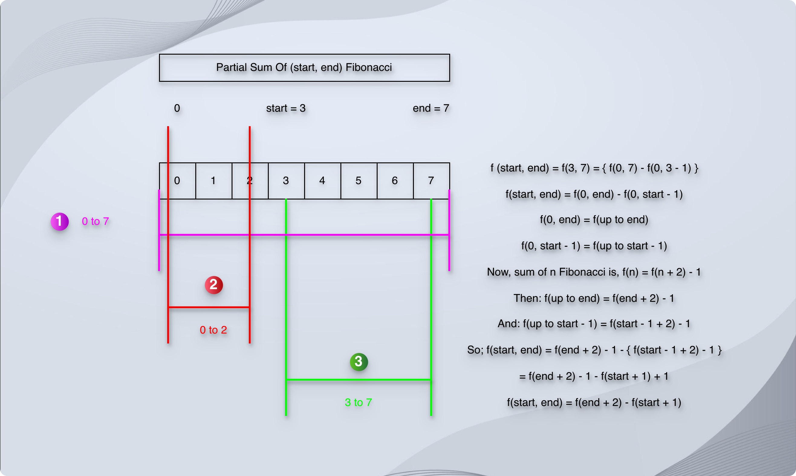
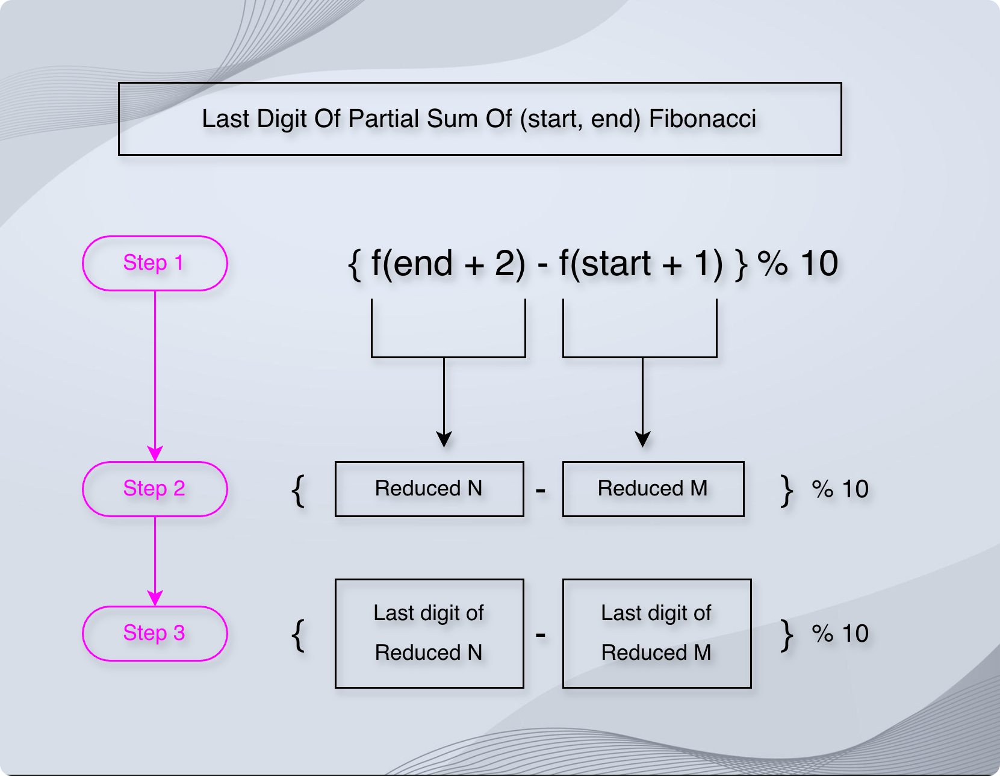
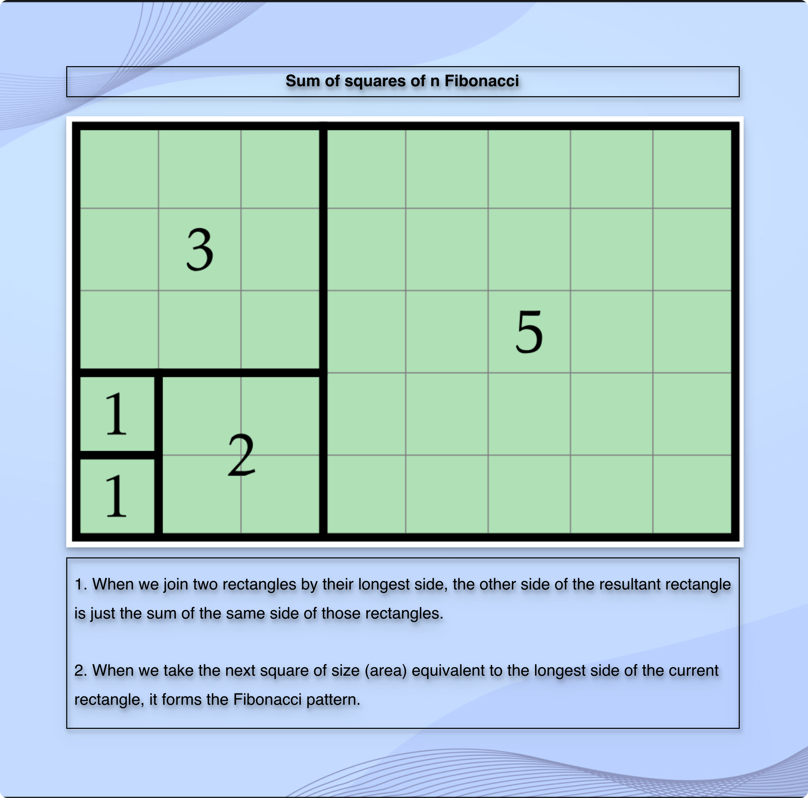

# Last digit of sum of Nth Fibonacci

* Sum of nth Fibonacci means:

F(0) + F(1) + F(2) + .. + F(n)

* But in reality, we don't have to sum up each Fibonacci.
* We have a formula:

F(n + 2) - 1

* So, instead of doing `{ F(0) + F(1) + F(2) + .. + F(n) } % 10`, we do `{ F(n + 2) - 1 } % 10`.
* Here, we can take `F(n + 2) = a` and `1 = b`.
* Now, according to the modulo arithmetic, `(a - b) % 10 = { (a % 10) - (b % 10) } % 10`.
* And instead of `F(n + 2) % 10`, we can take `F(reducedN) % 10` using the Pisano Period.

---

* So first, we find the last digit of `a = n + 2` using the Pisano period.
* For the Pisano period, we use `mod = 10`.
* Once we get the Pisano period `p`, we find `b = a % p`.
* Then, we find the last digit of `b`.

---

* Similarly, Partial sum of (n, m) Fibonacci:

$$F(n_0) + F(n_1) + F(n_2) + .. + F(m)$$

* But in reality, we don't have to sum up each Fibonacci from n to m.
* We have a formula:

F(n + 2) - F(m + 1)

---

**How?**





---

**How to remember?**

* When the game `starts`, I get `1` additional perk.
* And in the `end`, I get `2` additional perks.
* Then, I need to `return` the `difference`.
* We subtract from a bigger number.
* Being in the game till the `end` is a `big` thing.
* So, it becomes: `(end + 2) - (start + 1)`.

**End** gets two (`2` additional perks for being in the game till the `end`),  
**Start** gets one (`1` additional perk for showing the courage to `start` the game),  
**Subtract** the pair and the math is done!  
Divide by ten to keep it small,  
The last digit is the only call!


* A hotel manager gives us a discount of `+ 1` when we start the booking (start + 1), but charges us `+ 2` when we end the booking (end + 2)!
* We realize the whole scene when we end the booking.
* So, the total becomes: `(end + 2) - (start + 1)`
* A love story that `starts with 1` and `ends 2`.
* To get `+2` things, we need to remove `+1` thing.

---

* Similarly, Sum of square of nth Fibonacci:

* Suppose that we have a single square of size `1`.

```markdown

+---+
| 1 |
+---+
                                 
n = 1

```

> At this moment, area is `1 * 1`.

* Now, we take another square of the longest side of the previous block.
* The previous block was `1 * 1`.
* The longest side is `1`.
* So, we take another block of size `1 * 1`.

```markdown

+---+                       +---+
| 1 |                       | 1 |
+---+                       +---+
                                 
n = 1                       n = 2

```


* So, we have these two squares. 
* Square n = 1 of size (area) 1 and square n = 2 of size (area) 1.
* We joint them with the longest side (height or width).
* Currently, before we join them, there is no long side.
* They both have equal size of sides.
* So, we can join them at any side.
* Suppose that we join them vertically.
* So, it becomes:

```markdown

+---+       
| 1 |       
+---+  h = 2
| 1 |       
+---+       
            
w = 1

```

* Now, we can think of this result in this way, too.
* The previous square was `1`, and we joined it with `1`.
* We can denote the longest common side of them as $f(n)$ and it is `1`.
* At this moment, both the blocks have common height and width.
* For both blocks, `height = 1`, and `width = 1`.
* So, we can consider any of them as the longest common side.
* Suppose we take `width` as the longest common side.
* And we can sum up the remaining side of them.
* Which means, we sum up their heights: `1 + 1`.
* We represent this sum as $f(n + 1)$.
* So, the area of the resultant rectangle becomes `width * height` = $f(n) * f(n + 1) = 1 * 2$.

> At this moment, area is `1 * 2`.

* The history of area is:

```markdown

| 1 * 1 |
|-------|
| 1 * 2 |

```

* Now, the longest side of the resultant rectangle is `height = 2`.
* Another point is that we have a pattern for the area of the resultant rectangle.
* We can know it in advance when we attach (joint) two rectangles in this way by their longest side.
* When we attach two rectangles by their longest side, the remaining side is just an addition.
* For example, the next square we need to take should have the size of the longest side of the previous rectangle.
* The longest side of the current rectangle is `height = 2`.
* So, the size of the next square is `2 * 2`.
* So, we take another square, n = 3 of size (area) 2 next to the previous resultant rectangle.

```markdown

   +---+                    +---+---+       
   | 1 |                    | 2 | 2 |       
   +---+  h = 2             +---+---+  h = 2
   | 1 |                    | 2 | 2 |       
   +---+                    +---+---+       
                                            
   w = 1                      w = 2         
                                            
                                            
Rectangle n               Rectangle n + 1   


```

* Now, we join these two rectangles by their longest sides.
* The longest side of the previous rectangle n is `height = 2`.
* So, when we join them by their height, the width of the resultant rectangle is just an addition of their widths, which becomes `1 + 2 = 3`.
* And `area = height * width = 2 * 3 = 6`.

```markdown

+---+---+---+       
| 1 | 2 | 2 |       
+---+---+---+  h = 2
| 1 | 2 | 2 |       
+---+---+---+       
                    
    w = 3           

```

* Now, we can think of this resultant rectangle in this way.
* We joined `1 * 1` with `2 * 2` by their longest common side.
* Their longest common side was `height = 2`.
* We represent this longest common side as $f(n)$.
* Now, the remaining side of the resultant rectangle is `width`.
* It will be sum up of the widths of these two rectangles.
* So, it is `width = 1 + 2 = 3`.
* We represent it as $f(n + 1)$.
* Then, the resultant rectangle we get is `height * width = 2 * 3` = $f(n) * f(n + 1)$.

> At this point, area is `2 * 3`.

* History of area

```markdown

| 1 * 1 |
|-------|
| 1 * 2 |
| 2 * 3 |

```

* Similarly, if we take the next square of size (area) 3 to join it with the previous resultant rectangle.


```markdown

                                 +---+---+---+       
+---+---+---+                    | 3 | 3 | 3 |       
| 1 | 2 | 2 |                    +---+---+---+       
+---+---+---+  h = 2             | 3 | 3 | 3 |  h = 3
| 1 | 2 | 2 |                    +---+---+---+       
+---+---+---+                    | 3 | 3 | 3 |       
                                 +---+---+---+       
    w = 3                                            
                                     w = 3

```

* The longest common side of these two rectangles is `width = 3`.
* So, if we join these two rectangles by their width, the height of the resultant rectangle is simply an addition.
* So, the height of the resultant rectangle will be `2 + 3 = 5`.
* And hence, the area of the resultant rectangle will be `width * height = 3 * 5 = 15`.

```markdown

+---+---+---+       
| 3 | 3 | 3 |       
+---+---+---+       
| 3 | 3 | 3 |       
+---+---+---+       
| 3 | 3 | 3 |  h = 5
+---+---+---+       
| 1 | 2 | 2 |       
+---+---+---+       
| 1 | 2 | 2 |       
+---+---+---+       
                    
    w = 3

```

* Again, we can analyze the resultant rectangle in this way.
* We joined `2 * 3` with `3 * 3`.
* Their longest common side was, `width = 3`.
* We represent it as $f(n)$.
* The summation of the remaining side, which is `height` is `2 + 3 = 5`.
* We represent it as $f(n + 1)$.
* So, the size of the resultant rectangle is `width * height = 3 * 5` = $f(n) * f(n + 1)$.

> At this moment, area is `3 * 5`

* History of area:

```markdown

| 1 * 1 |
|-------|
| 1 * 2 |
| 2 * 3 |
| 3 * 5 |

```

* Did you notice the pattern?
* It is Fibonacci!
* The area of the next rectangle will be `5 * 8` 🤯!

```markdown

| 1 * 1 |
|-------|
| 1 * 2 |
| 2 * 3 |
| 3 * 5 |
| 5 * 8 |

```

* And the area of the next rectangle will be `8 * 13`!

```markdown

| 1 * 1  |
|--------|
| 1 * 2  |
| 2 * 3  |
| 3 * 5  |
| 5 * 8  |
| 8 * 13 |

```




$$F_0^2 +F_1^2 +···+F_n^2$$

* But in reality, we don't have to square and sum up each Fibonacci.
* We have a formula:

F(n) * F(n + 1)

