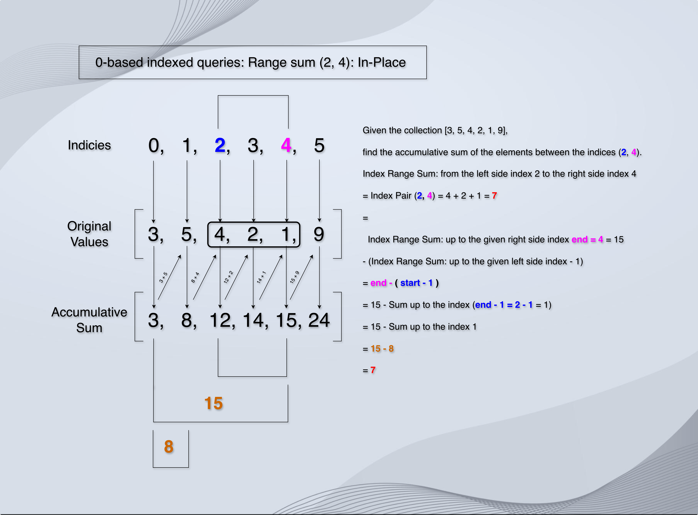
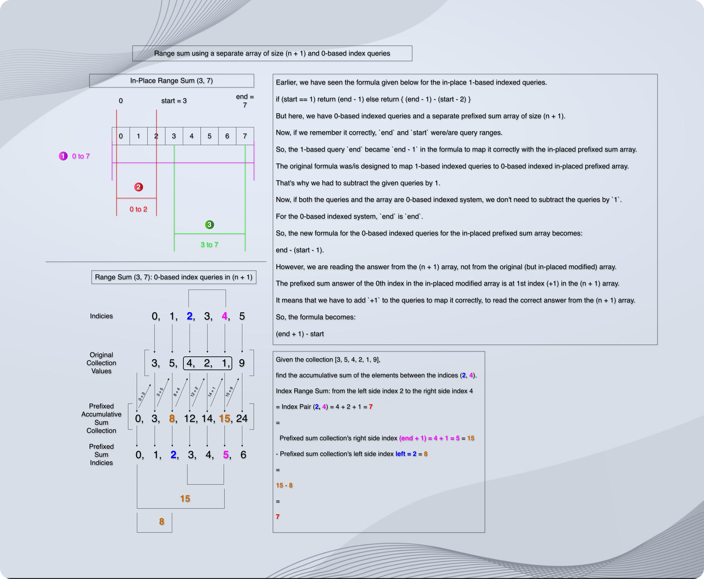

# Range Sum

## Explanation

* 
* [Range Sum: A separate (n + 1) sized prefixed array and 1-indexed queries]()
* 

## Implementation

* [Range Sum With A Separate (n + 1) sized prefixed array](https://github.com/sagarpatel288/kotlinDSAWithIntellijIdea/blob/db90bea6551619a0026dbd89939c13207c1fc158/src/courses/uc/course01algorithmicToolbox/module02AlgorithmicWarmUp/100RangeSumQueryImmutable.kt)
* [In-Place Range Sum 1-based indexed queries](https://github.com/sagarpatel288/kotlinDSAWithIntellijIdea/blob/db90bea6551619a0026dbd89939c13207c1fc158/src/courses/uc/course01algorithmicToolbox/module02AlgorithmicWarmUp/102rangeSumQueryAnotherWay.kt)