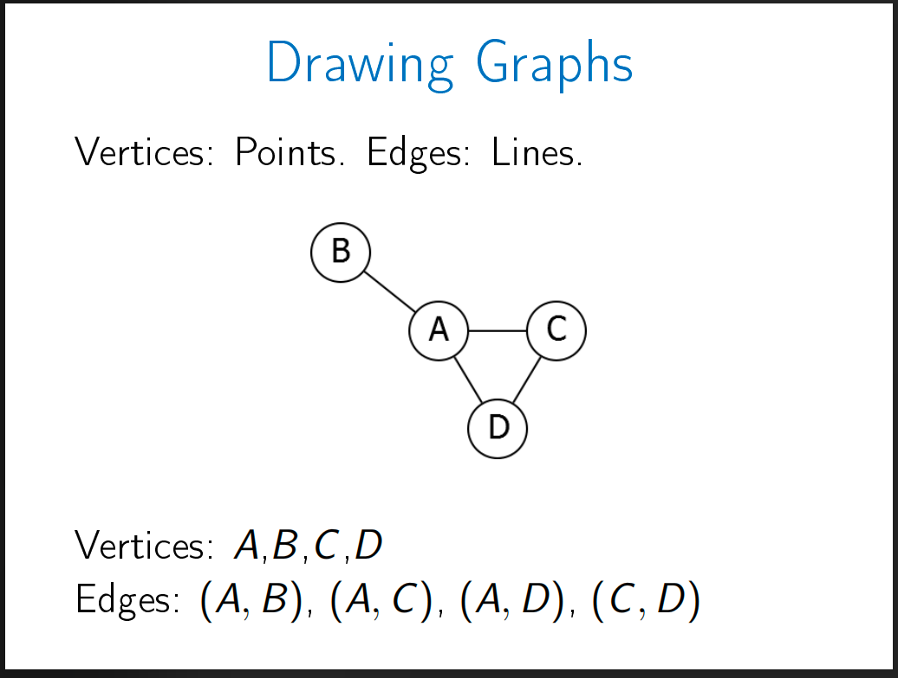
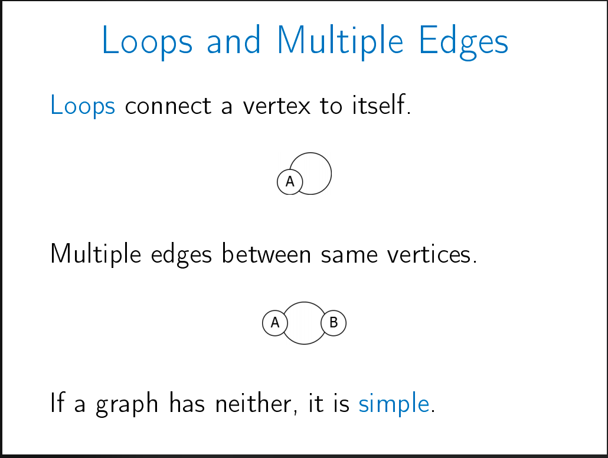
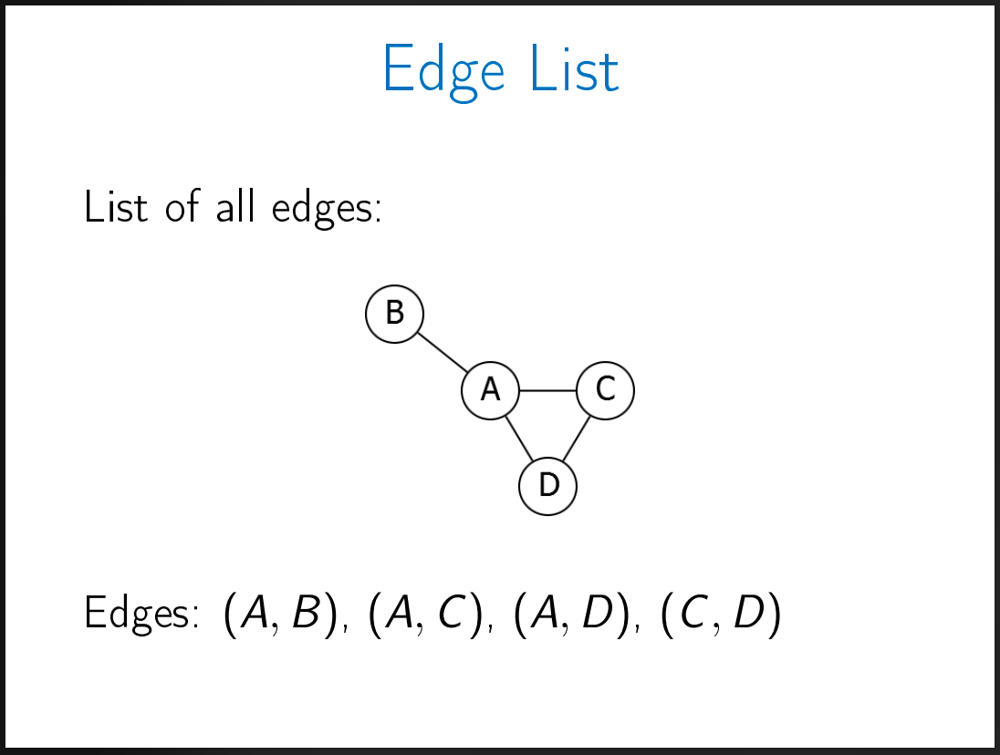
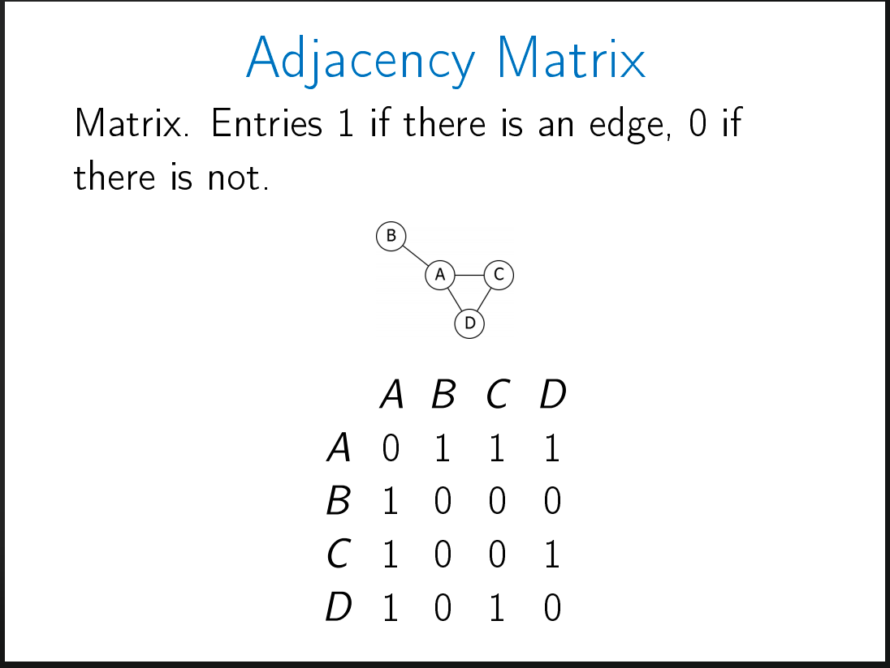
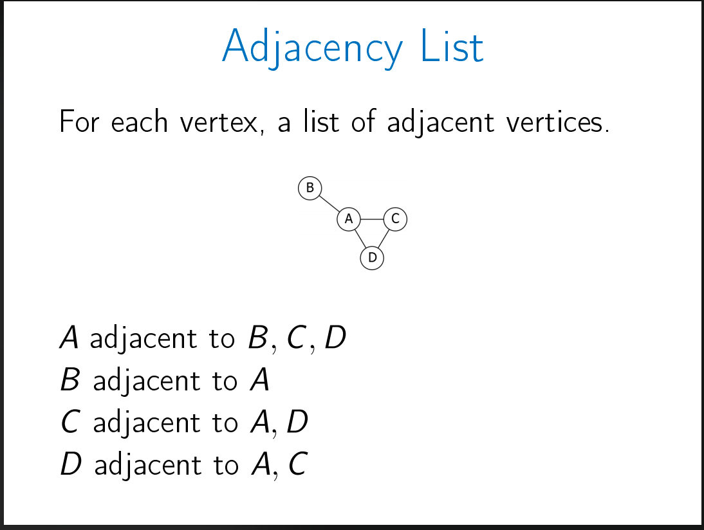

# Graph: Basic introduction

## Definition

* An undirected graph has a collection of V for vertices and a collection of E for edges.
* An edge connects a pair of vertices.
* A vertex is a node.

---

* A graph can have a loop or/and multiple edges.

---

## Runtime measurement

* Normally, we measure the efficiency of an algorithm based on the pattern of the time it takes when we change, increase, or decrease the input size.
* For graph, we have two parameters: Edges and Vertices.
* Think of it as one approach might be more friendly with the Edges, whereas inefficient for the vertices.
* Similarly, another approach might be more friendly with the Vertices, but inefficient for the Edges.
* Which approach we should use depends upon our requirements: Whether we need efficient Edges or efficient Vertices.  

## Representation

* There are at least 3 different ways to represent a graph.

**Edge List**

**Adjacency Matrix**

**Adjacency List**

---
* Each representation has its efficient vs. inefficient use case.
* So, we use a particular representation depending upon our requirements.

**Are these two vertices connected?**

* For example, if we want to determine whether two vertices are connected or not, the adjacency matrix is very fast.
* It will be a simple straightforward look up and a constant runtime.
* However, the same operation would take linear time if we use the edge list representation.
* Because we will have to scan through the entire list to find if the two vertices are connected.
* And if we use the adjacency list for the same problem, it will be a little bit faster than the edge list, but a little bit slower than the adjacency matrix.
* Because in the adjacency list, we get the list of all the neighbors for each vertex.
* So, we pick up a vertex and check its neighbors.
* And we repeat this until we find the pair or when we find that the neighbor list of one vertex does not include the other vertex we are looking for.
* So, the runtime of adjacency list depends on the number of neighbors a particular vertex has or in other words, the connectivity (distribution, range, reach, network) of the vertex.
* We call it "the degree of the vertex".
* **Degree** means **Number of neighbors**.
* **Degree of a vertex** reveals **the number of neighbors (connections)** of the vertex.

* For example, in the given image of the adjacency list, the degree of the vertex A is 3.

**List all the edges**

* Now, if we want to list all the edges, we already have the edge list representation.
* It will take linear time.
* But if we use the adjacency matrix for the same problem, it will be polynomial (quadratic, squared).
* Because we will have to check each cell.
* And if we take the adjacency list, it will also take linear time, but maybe with slightly more complexity than the edge list representation. 
* We might count the same edges twice.
* For example from A to B and then B to A.
* But it is just a constant factor.
* So, it is better than the adjacency matrix, but maybe slightly slow than the edge list.

**Find all the neighbors**

* That's what the adjacency list do!
* So, it depends on the degree.
* And if we do it using the adjacency matrix, we will have to go through each cell.
* And if we do it using the edge list, it is better than the adjacency matrix, but slightly slower than the adjacency list.
* Because we have to inspect each edge pair.