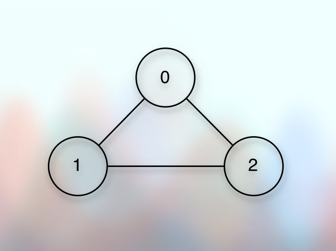
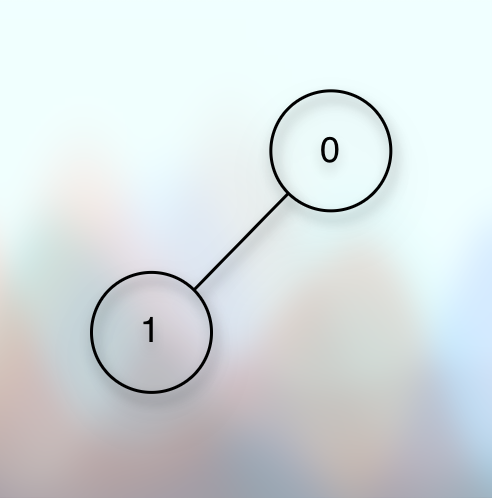
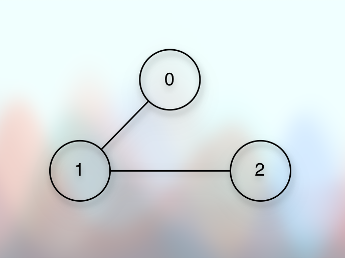

# Cycle detection in a graph (Undirected, bidirectional) using DFS

## Prerequisite

* [Basic Introduction.md](010basicIntroduction.md)
* [Simple Graph Ops.md](012simpleGraphOps.md)
* [Exploring Graph Traversal.md](020exploringGraphTraversal.md)
* [Bfs Graph Traversal.md](023bfsGraphTraversal.md)
* [Dfs Graph Traversal.md](026dfsGraphTraversal.md)

## References

* [Shradha Madam](https://youtu.be/OZClCpPQDR4?si=hhkQFRSrQIriofYg)

## Concept

**Cycle in a graph**

* 

* We can see that if we start traveling the given graph without any exit condition, hoping that we will get a dead-end where there will be no next vertex to visit, we keep running in a loop.
* For example, if we start from `0`, it will be an infinite loop like `0, 1, 2, 0, 1, 2, 0, 1, 2, 0...` and so on.
* So, there is a cycle.
* And we want to determine whether there is a cycle or not.
* So, how do we detect that?

**DFS Logic**

* [Dfs Graph Traversal.md](026dfsGraphTraversal.md)

* We use almost the same `DFS` concept to detect the cycle.
* Now, we might eagerly assume that if the `visited` condition is true, it indicates the cycle.
* For example, the `if (!visited[it]).... else -> there is a cycle`.
* But that's not true.
* For example, suppose we have the following simple graph:

* 

* And suppose we start the traversal from the vertex `0`.
* We mark it as visited.
* We get the neighbor list and we get `1`.
* We pass it to the recursive function.
* We mark it as visited.
* We get the neighbor list and we get `0`.
* We find that it is already visited.
* But that doesn't imply that there is a cycle!

---

**Perspective/Intuition**

* There is no parent concept in graphs.
* But if we are going from `0 to 1` and if we are at `1`, we can say that `0` is the parent of `1`.
* And in that case, because we have moved from `0 to 1`, it is obvious that `0` is already visited.
* It means that if `1` has a parent, it is already visited.

---

* Now, the cycle detection theory (for an undirected graph) says that:
* If a vertex has a neighbor which is already visited, but it is not the parent of the vertex, it is the back edge.
* In other words, there is a cycle.

---

* Let us understand this with an example.

* 

* We start from `0`.
* We move to `1`.
* The vertex `1` has two neighbors: `0, 2`.
* The vertex `0` is the parent, and it is already visited.
* The vertex `2` is the neighbor, and we have not visited it, yet.
* So, we move from `1` to `2`.
* The parent of the vertex `2` is `1`.
* We mark `2` as visited.
* We get the neighbors of `2`, which gives us `0, 1`.
* `1` is the parent and it is already visited.
* Now, there is an interesting perspective/intuition.
* The vertex `2` has a neighbor `0`, it is already visited, but it is not the parent.
* That's the back edge.
* That's the cycle.
* So, the rule is:

> If the vertex has a neighbor which is not the parent, but still visited, that's the cycle.

---

* We can check the logic for an undirected graph that has no cycle.

* 

* We start from `0`.
* We mark it as visited.
* We get the neighbors: `1`.
* It is not the parent.
* It is a neighbor, but we have not visited it, yet.
* So, we move to `1`.
* We mark it as visited.
* We get the neighbors: `0, 2`
* `0` is already visited, but it is the parent.
* `2` is a neighbor, but we have not visited it, yet.
* So, we move to `2`.
* We mark it as visited.
* We get the neighbors: `1`.
* `1` is already visited, but it is the parent.
* And there is no other neighbor.
* So, there is no cycle.

---

* The additional things than the `DFS Traversal of an undirected graph` are: 
* The `parent` argument, and the condition that determines the cycle: 
* And the condition is: `if the neighbor is already visited, but it is not the parent`.
* So, the code becomes:

```kotlin

fun hasCycle(): Boolean {
    val visited = BooleanArray(size) { false }
    var hasCycle = false
    for (vertex in adjacencyList.indices) {
        if (!visited[vertex]) {
            // When we start traveling from the `vertex`, there is no parent of it.
            // It is like we are going to start exploring an independent component of the graph.
            // And we have chosen to start with the `vertex`.
            // So, it is the starting point.
            // So, there is no parent.
            // So, we pass `-1` as a parent.
            hasCycle = hasCycleUsingDfs(vertex, -1, visited)
            if (hasCycle) return true
        }
    }
    return hasCycle
}

fun hasCycleUsingDfs(vertex: Int, parent: Int, visited: BooleanArray): Boolean {
    println(vertex) // Optional
    visited[vertex] = true
    val neighbors = adjacencyList[vertex]
    neighbors.forEach {
        if (!visited[it]) {
            // For this neighbor `it`, the `vertex` is the parent.
            // Because we are moving from the `vertex` to `it`.
            // So, we pass `vertex` as the parent.
            if (hasCycleUsingDfs(it, vertex, visited)) return true
        } else if (it != parent) {
            // This neighbor is already visited, but it is not the parent
            println(it) // Optional
            return true
        }
    }
    return false
}

```

## Implementation

* [Cycle detection in a graph](https://github.com/sagarpatel288/kotlinDSAWithIntellijIdea/blob/9ebecde9affadc011bd586c35c0d7c1801181472/src/courses/uc/course03algorithmsOngraph/courses/uc/module01decompositionOfGraph01/030cycleInUndirectedGraph.kt)

## Next

* [Cycle Detection In Graph Using Bfs.md](030cycleDetectionInGraphUsingBfs.md)
