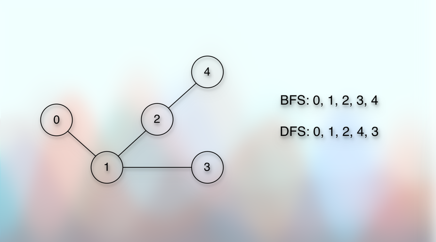
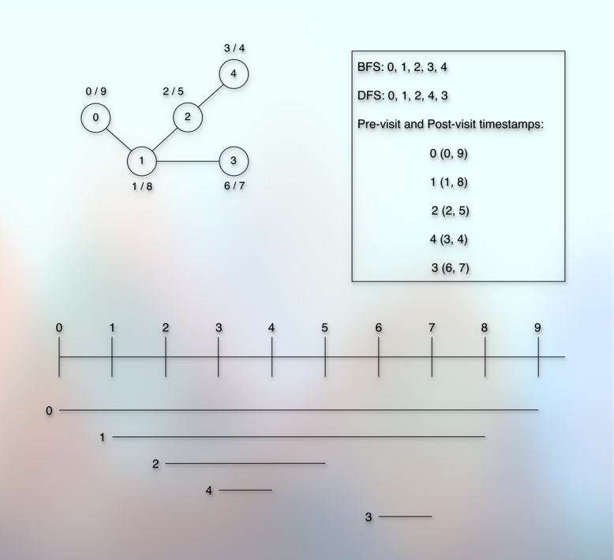

# Pre-visit and Post-visit Time

## Prerequisites

* [Basic Introduction.md](010basicIntroduction.md)
* [Simple Graph Ops.md](012simpleGraphOps.md)
* [Exploring Graph Traversal.md](020exploringGraphTraversal.md)
* [Bfs Graph Traversal.md](023bfsGraphTraversal.md)
* [Dfs Graph Traversal.md](026dfsGraphTraversal.md)
* [Cycle Detection In Graph Using Dfs.md](028cycleDetectionInGraphUsingDfs.md)
* [Cycle Detection In Graph Using Bfs.md](030cycleDetectionInGraphUsingBfs.md)
* [Number Of Islands.md](032numberOfIslands.md)

## References

* [Shradha Madam](https://youtu.be/0WIINUY12Yg?si=F-Tv5JRwiojotDKH)
* [Knowledge Center - Abhishek Sir](https://youtu.be/2UvzjtJb-WQ?si=tCvVT8h6YqxbMOj_)

## Concept

* BFS and DFS traversal give us a certain order.



* But can the order alone give us the following answers?
---
* Can we determine direct vs. indirect (branched) children in that order?
* Can we determine how much time a particular vertex took for the complete exploration?
* Can we determine which vertex took longer than the other?
---
* To get the answers of those questions, we use **Pre-visit and Post-visit timestamps**.
* The idea is very simple.
* We take a time variable.
* Every time we visit the vertex, where we mark the vertex visited, we attach the start time with it.
* And every time we finish exploring the vertex, we attach the end time with it.
* So, we have only two lines to add in our existing BFS and DFS traversal.
* For example:
 
```kotlin

fun dfsTraversal(vertex: Int, visited: BooleanArray) {
    preVisitTime(vertex)
    println(vertex)
    val neighbors = adjacencyList[vertex]
    neighbors.forEach {
        if (!visited[it]) {
            dfsTraversal(vertex, visited)
        }
    }
    postVisitTime(vertex)
}

```

* Once we set (attach) the time, we increment the time value by 1.
* So, we end up with the result something like below:

* 

* We have a total of `5` vertices.
* For each vertex, we set `Pre-Visit` and `Post-Visit` time.
* Every time we set (attach) the time, we increment the time value by 1.
* So, after we are done with exploring all the vertices, we get a total of `10` timestamps.
* And if we start the time from `0`, then it ranges from `0 to 9`.
---
* These timestamps help us determine many things.
* For example, we can see that the timeline of `0` is `(0, 9)`.
* It says that the exploration of vertex `0` starts at `0` and finishes at `9`.
* And the timelines of all the other vertices are within it.
* They start after the time value `0` and get finished before the time value `9`.
* It indicates that they are all nested within the vertex `0`.
---
* We can determine the dependencies and relationships. 
* For example, while using DFS for this graph and when we start the traversal from `0`:
  * We need to visit `2` before we can visit `4`.
  * The vertex `2` starts before `4` and `4` finishes before `2`.
  * So, `4` is a nested vertex of `2`.
  * We can say that `4` is a descendent of `2`.
---
* We can think about this concept the other way around also.
* For example, suppose that we are given timestamps only, and no adjacency list, adjacency matrix, or edge list.
* Using the timestamps, we can determine ancestors and descendents.
* Using the timestamps, we can determine direct children vs. indirect (branched) children.
* For example, the next larger timeline of `1` is `0` and `1` fits entirely into `0`.
* So, `1` is a direct child of `0`.
* Similarly, the next larger timeline of `2` is `1` and `2` fits entirely into `1`.
* So, `2` is a direct child of `1`.
* The next larger timeline of `4` is `2` and `4` fits entirely into `2`.
* So, `4` is a direct child of `2`.
* The next larger timeline of `3` is `2` but `2` does not cover `3`.
* `3` starts after `2` finishes.
* So, there is no connection between `2` and `3`.
* `3` starts after `4` finishes.
* So, there is no connection between `3` and `4`.
* The **smallest containing timeline** (but larger than the subject vertex, `3`) comes from `1`.
* `1` covers `3` entirely.
* So, `3` is a direct child of `1`.
---
* Based on the timestamps and timelines, we can also determine islands (isolated/independent connected components of a disconnected graph).
---
* In fact, timestamps has more significance when we use it for a directed graph.
---
* Note that we can have multiple, unique, and still valid DFS orders based on which neighbor we select first.
* Similarly, we cannot have a complete graph reconstruction from the timestamps alone.
* In other words, a graph reconstructed from timestamps alone, might not have all the edges.
* For example, we might miss the edge that causes a cycle.
* However, we still cover the minimum required edges of the graph.
---
* Another observation is that the vertex that we finish exploring the first (post-time), will be the last vertex in our linear order.

## Next

* 