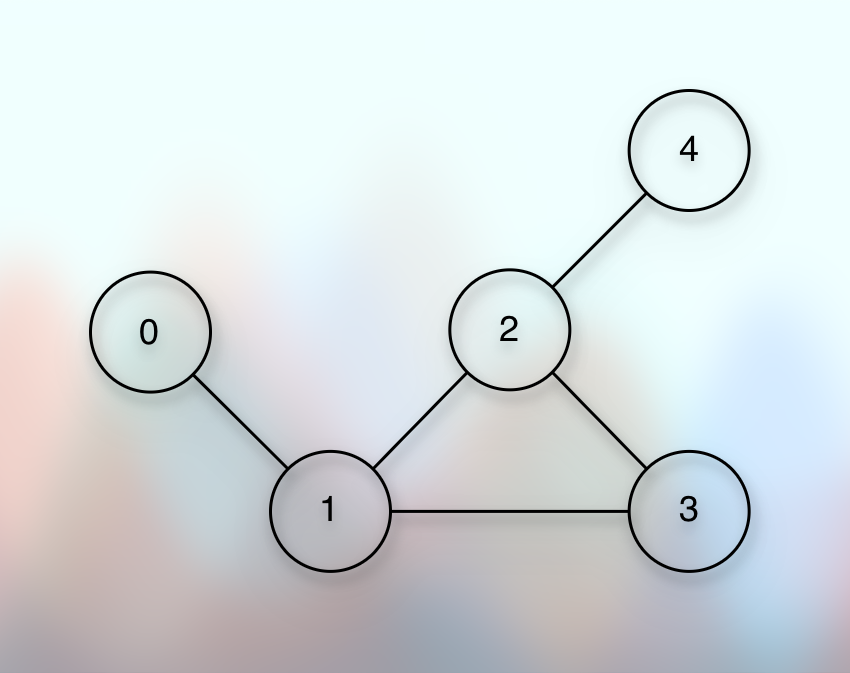

# Simple Graph Operations

## Prerequisites

* [Basic Introduction.md](010basicIntroduction.md)

## References

* [Shradha Madam](https://youtu.be/RpgyCJBbl5E?si=iatSEyZ_AKuL1qLT)

## Creating a graph

* Suppose that we have the following graph:

* 

* We will treat the vertex value as indices.
* The graph will have a fixed size.
* We will provide the graph size externally and explicitly.

**The graph class**

```kotlin

class Graph(val size: Int) {
    
}

```

**The adjacency list**

```markdown

| Vertex | Neighbors |
|--------|-----------|
| 0      | 1         |
| 1      | 0, 2, 3   |
| 2      | 1, 3, 4   |
| 3      | 1, 2      |
| 4      | 2         |

```

* To understand the adjacency list for each vertex, focus on the edges that leave the vertex.
* The adjacency list shows the immediate neighbors of the vertex.
* Now, it is clear that we will have a list of vertices and each element of this list will have a list of neighbors.
* It means that we will have a list of list.
* So, we will create the adjacency list of the given size.

```kotlin

class Graph {

    val adjacencyList = List(size) { mutableListOf<Int>() }
}

```

**addEdge**

* Now, to add vertices and to connect those vertices, we can have a function called `addEdges`.
* It expects two arguments (parameters): Vertex A and vertex B.
* It implies that vertex A and vertex B are connected through an edge.
* Now, the type of these arguments will be `Integer`.
* And we treat these argument values as indices for the adjacency list, something that we do in a direct addressing.
* It means that we have got index A and index B.
* Each index represents a mutable list.
* Each index has a mutable list of their neighbors.
* And at these indices, we will add each other as their neighbors.
* So, at index A, we get a mutable list, and we add B.
* So, index A gets the neighbor B.
* Similarly, at index B, we have a mutable list, where we add A.
* So, index B gets the neighbor A.

```kotlin

fun addEdges(a: Int, b: Int) {
    adjacencyList[a].add(b)
    adjacencyList[b].add(a)
}

```

## Next

* [Exploring Graph Traversal.md](020exploringGraphTraversal.md)
* 