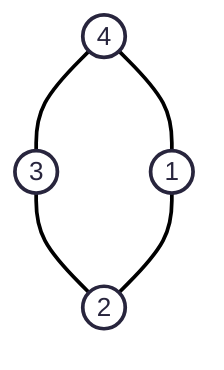
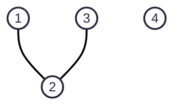
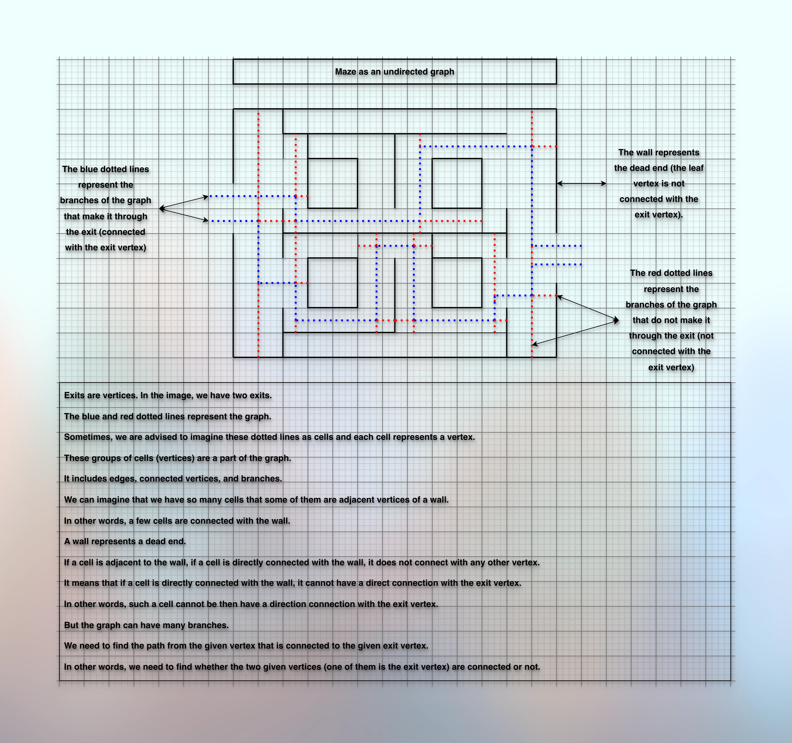

# Maze as a graph

## Prerequisites

* [Basic Introduction.md](010basicIntroduction.md)
* [Simple Graph Ops.md](012simpleGraphOps.md)
* [Exploring Graph Traversal.md](020exploringGraphTraversal.md)
* [Bfs Graph Traversal.md](023bfsGraphTraversal.md)
* [Dfs Graph Traversal.md](026dfsGraphTraversal.md)
* [Cycle Detection In Graph Using Dfs.md](028cycleDetectionInGraphUsingDfs.md)
* [Cycle Detection In Graph Using Bfs.md](030cycleDetectionInGraphUsingBfs.md)
* [Number Of Islands.md](032numberOfIslands.md)

## References

* [Gray Utopia](https://youtu.be/DDPdnywfxuM?si=GBxUbR9f7OEVP9ye)

## Problem

**Finding an Exit from a Maze**

**Problem Introduction**

* A maze is a rectangular grid of cells with walls between some of adjacent cells.
* You would like to check whether there is a path from a given cell to a given exit from a maze,
* where an exit is also a cell that lies on the border of the maze
* (in the example shown to the right there are two exits: one on the left border
and one on the right border). 
* For this, you represent the maze as an undirected graph: 
* vertices of the graph are cells of the maze, two vertices are connected by
an undirected edge if they are adjacent and there is no wall between them. 
* Then, to check whether there is a path between two given cells in the maze, 
* it suffices to check that there is a path between the corresponding two vertices in the graph.

**Problem Description**

**Task** 

* Given an undirected graph and two distinct vertices 𝑢 and 𝑣, check if there is a path between 𝑢 and 𝑣.

**Input Format** 

* An undirected graph with 𝑛 vertices and 𝑚 edges. 
* The next line contains two vertices 𝑢 and 𝑣 of the graph.

**Constraints** 

$$
2 ≤ 𝑛 ≤ 10^3; 
1 ≤ 𝑚 ≤ 10^3; 
1 ≤ 𝑢, 𝑣 ≤ 𝑛; 𝑢 != 𝑣.
$$

**Output Format** 

* Output 1 if there is a path between 𝑢 and 𝑣 and 0 otherwise.

**Time Limit**

```markdown

| language  | C | C++ | Java | Python | C#  | Haskell | JavaScript | Ruby | Scale |
|-----------|---|-----|------|--------|-----|---------|------------|------|-------|
| time(sec) | 1 | 1   | 1.5  | 5      | 1.5 | 2       | 5          | 5    | 3     |

```

**Memory Limit**

* 512MB

**Sample 1**

**Input**

```markdown

4 4 (n, m)
1 2 
3 2
4 3
1 4
1 4 (find if there is a connection between these two vertices)

```

**Output**

* 1

**Explanation**



* In this graph, there are two paths between vertices 1 and 4: 1-4 and 1-2-3-4.

**Sample 2**

**Input**

```markdown
4 2
1 2
3 2
1 4
```

**Output**

* 0

**Explanation**



* In this case, there is no path from 1 to 4.

## Perspective, Thought Process

* 

* Imagine that there is a vertex at the start, end, and every joint of the dotted lines.
* We get `n` vertices and `m` edges.
* Using the given edges, we build an adjacency list.
* And then for the given vertex only, we use either DFS or BFS Traversal.
* And while exploring the vertex, if we find and meet the target, we return `1`.
* Otherwise, if we finish exploring all the vertices, but can't connect with the target, we return `0`.

```kotlin

class MazeAsGraph(val vertices: Int) {
    val adjacencyList = List(vertices) { mutableListOf<Int>() }
    
    fun addEdges(a: Int, b: Int) {
        if (a !in 0..<vertices || b !in 0..<vertices) return
        adjacencyList[a].add(b)
        adjacencyList[b].add(a)
    }
    
    fun hasPath(a: Int, b: Int): Boolean {
        val visited = BooleanArray(vertices)
        return hasPathUsingDfs(a, b, visited)
    }
    
    private fun hasPathUsingDfs(a: Int, b: Int, visited: BooleanArray): Boolean {
        if (a !in 0..<vertices || b !in 0..<vertices || visited[a]) return false
        println(a) // Optional
        visited[a] = true
        val neighbors = adjacencyList[a]
        neighbors.forEach {
            if (it == b) return true
            if (!visited[it]) {
                if (hasPathUsingDfs(it, b, visited)) {
                    return true
                }
            }
        }
        return false
    }
}

```

* We can improve it as:

```kotlin

fun hasPath(a: Int, b: Int): Boolean {
    // We validate the arguments here instead of checking it recursively
    if (a !in 0..<vertices || b !in 0..<vertices) return false
    val visited = BooleanArray(vertices)
    return hasPathUsingDfs(a, b, visited)
}

fun hasPathUsingDfs(a: Int, b: Int, visited: BooleanArray): Boolean {
    if (visited[a]) return false
    println(a) // Optional
    if (a == b) return true
    visited[a] = true
    val neighbors = adjacencyList[a]
    neighbors.forEach {
        if (!visited[it]) {
            if (hasPathUsingDfs(it, b, visited)) {
                return true
            }
        }
    }
    return false
}

```
 
## Next

* 