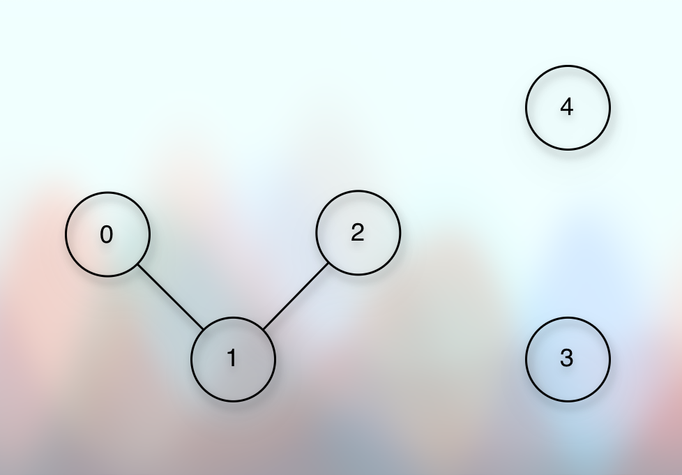
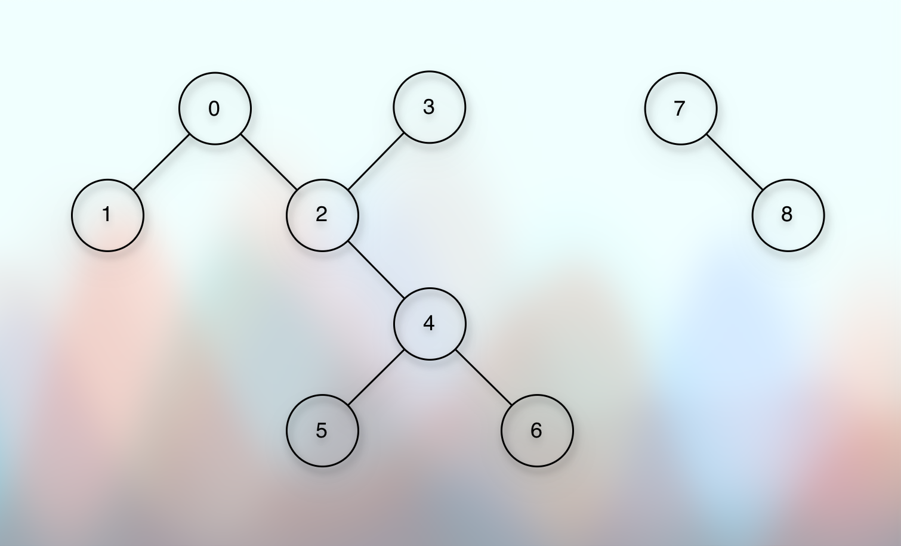

# BFS Traversal Of A Graph

## Prerequisites

* [Tree Traversals.md](../../../../02dataStructures/courses/uc/module01BasicDataStructures/section03trees/020treeTraversals.md)
* [Compute Tree Height Using BFS.md](../../../../02dataStructures/courses/uc/module01BasicDataStructures/section03trees/050computeTreeHeight.md)
* [Basic Introduction.md](010basicIntroduction.md)
* [Simple Graph Ops.md](012simpleGraphOps.md)
* [Exploring Graph Traversal.md](020exploringGraphTraversal.md)

## References

* [Tree Traversals.md](../../../../02dataStructures/courses/uc/module01BasicDataStructures/section03trees/020treeTraversals.md)
* [Compute Tree Height Using BFS.md](../../../../02dataStructures/courses/uc/module01BasicDataStructures/section03trees/050computeTreeHeight.md)
* [Shradha Madam](https://youtu.be/scQITTLgFJo?si=K-HBG0PKY3-Ta6He)

## Concept

* Previously, we have seen that:

```kotlin

class Graph(val size: Int) {
    val adjacencyList = List(size) { mutableListOf<Int>() }
    
    fun addEdges(a: Int, b: Int) {
        adjacencyList[a].add(b)
        adjacencyList[b].add(a)
    }
    
    fun printAdjacencyList() {
        val stringBuilder = StringBuilder()
        for ((index, neighbors) in adjacencyList.withIndex()) {
            stringBuilder.append("Vertex: $index Neighbors: ")
            neighbors.forEach {
                stringBuilder.append(" $it, ")
            }
            stringBuilder.append("\n")
        }
        println(stringBuilder)
    }
}

```

* BFS says cover the neighbor first.
* In a BST, we start from the root.
* In a graph, we can start from any vertex.
* The important point is that once we visit a node, we should mark it as visited.
* Because, a graph can have a cycle, and we do not want to keep traveling infinitely in a loop.
* And the size of this boolean array will be equivalent to the size of the vertex list, which is equivalent to the adjacency list.
* We already have the `size` property from the constructor.
* So, we will use it.
* It is shared by the adjacency list and the boolean array.
* So, this will look something like below:

```kotlin

fun bfsTraversalOfGraph(start: Int) {
    if (start !in adjacencyList.indices) return
    val visited = BooleanArray(size)
}

```

* Now, we want to start from the given `start` vertex.
* But if we remember, we are using the direct addressing method.
* So, we treat the vertex value as the vertex index.
* So, if it is out of the range of the adjacency index range, we don't have that value and we return.
* Otherwise, we continue the program.
---
* Now, we use almost the same concept of **BFS Traversal in a Tree/BST**.
* References:
* [Compute Tree Height Using BFS.md](../../../../02dataStructures/courses/uc/module01BasicDataStructures/section03trees/050computeTreeHeight.md)
* So, we use a queue as below:

```kotlin

val queue = ArrayDeque<Int>()

```

* We add (enqueue, push) the given `start` vertex eagerly.

```kotlin

queue.addLast(start)

```

* And when we push a vertex to the queue, it means that we have visited it.
* So, we mark it as visited.
* And to mark it as visited, we have the visited boolean array.
* Again, we are using the direct addressing method.
* So, the value and location of the vertex are equal to the index.
* We go to that index in the visited boolean array, and mark it as visited.

```kotlin

visited[start] = true

```

* Similar to the **BFS Traversal in a Tree/BST**, we start the loop.
* As long as the queue is not empty, we pop the element.
* And remember, this is a queue.
* So, we `addLast` and `removeFirst`.
* We print it.
* And we add its immediate neighbors to the queue.
* And we get its immediate neighbors from the adjacency list.
* But the adjacency list can repeat the vertices.
* For example, if there is an edge between A and B, then B will be there in the neighbor list of A and A will be there in the neighbor list of B.
* Also, a vertex can be a neighbor of multiple other vertices.
* But we don't want to add the vertex if we have already visited it before.
* That's the point (time) when we use the entries of the visited boolean array.
* We add (enqueue, push) only unvisited vertices to the queue.
* So, it will be something like below:

```kotlin

while (queue.isNotEmpty()) {
    val pop = queue.removeFirst()
    stringBuilder.append(" $pop, ")
    val neighbors = adjacencyList[pop]
    neighbors.forEach {
        if (!visited[it]) {
            queue.addLast(it)
            visited[it] = true
        }
    }
}

```

* And finally, we print the BFS order.

## Disconnected graph

* A disconnected graph might look like below:

* 

* To cover all the vertices, including the disconnected, we wrap/call the normal `BFS` function in a loop like below:

```kotlin

val visited = BooleanArray(size) { false }
for (vertex in adjacencyList) {
    if (!visited[vertex]) {
        bfs(vertex, visited)
    }
}

```

* For that, we may need to modify the existing `BFS` function slightly to accept the incoming `visited boolean array`.
* So, it becomes something like below: 

```kotlin

fun bfsTraversal(start: Int, visited_: BooleanArray? = null) {
    var visited = visited_
    if (visited == null) {
        visited = BooleanArray(size) { false }
    }
}

```

## Dry Run

* 

* Now remember, we first need the `adjacencyList` for the BFS Traversal (and for the DFS Traversal as well).
* So, the adjacency list will be like:

```markdown

| Vertex | Neighbors |
|--------|-----------|
| 0      | 1, 2      |
| 1      | 0         |
| 2      | 0, 3, 4   |
| 3      | 2         |
| 4      | 2, 5, 6   |
| 5      | 4         |
| 6      | 4         |
| 7      | 8         |
| 8      | 7         |

```

* Notice that the size of the adjacency list is equal to the total number of vertices.
* Now, we are doing this process for each vertex.
* And we get each vertex from the adjacency list.
* How do we get a vertex from the adjacency list?
* Which index do we pass? From where and how do we get the index? 
* Well, we are using the direct addressing method.
* So, each index of the adjacency list is a vertex.
* So, it will be like:

```kotlin

val visited = BooleanArray(size) { false }
for (vertex in adjacencyList.indices) {
    // 0, 1, 2, 3, 4, 5, 6, 7, 8
    // First, we get `0`
    if (!visited[vertex]) {
        bfsTraversal(vertex, visited) // 0
    }
}

```

* First, we get the vertex `0`.
* We check whether we have already visited.
* We have not visited it.
* So, we pass it to the `bfsTraversal(vertex, visited)` along with the `visited` boolean array.
* The `bfsTraversal` eagerly add (enqueue) the incoming argument to the queue.

```kotlin

queue.addLast(0)

```

* And we mark it as visited.

```kotlin

visited[0] = true

```

* Then, we run a while loop.
* As long as the queue is not empty, we repeat the process.

```kotlin

while (queue.isNotEmpty()) {
    
}

```

* And what do we repeat? What is the process?
* The process is: pop, print, get the neighbors, enqueue back each unvisited neighbor.
* We pop the vertex from the queue and print it.

```kotlin

val pop = queue.removeFirst() // 0
println(pop) // 0

```

* Next, we get the neighbor list of the popped vertex from the adjacency list.

```kotlin

// The popped vertex is `0`
val neighbors = adjacencyList[pop] // 1, 2

```

* So, we get the neighbor list of the vertex, 0 as:

```markdown

1, 2
```

* Once we get the neighbor list, we iterate through it.

```kotlin

neighbors.forEach {
    
}

```

* And we enqueue (add, push) only those vertices to the queue that are not already visited.
* And once we add (enqueue, push) the vertex to the queue, we mark it as visited.

```kotlin

neighbors.forEach {
    // 1, 2
    if (!visited[it]) {
        queue.addLast(it) // 1, 2
        visited[it] = true
    }
}

```

* So, first we get `1`.
* It is not already visited.
* So, we enqueue it to the queue.
* We mark it as visited.
* So, the queue has:

```markdown

1
```

* Next, we get `2`.
* It is not already visited.
* So, we enqueue it to the queue.
* We mark it as visited.
* Now, the queue has:

```markdown

1, 2
```

* The queue is not empty.
* So, we pop the vertex and print it.
* We get `1`.
* We print it.
* So, our print order becomes: 

```markdown

0, 1
```

* Once we pop and print the vertex, we get the neighbor list.
* So, we get the neighbor list of the popped vertex, `1`.
* So, it will be like:

```kotlin

// The popped vertex is `1`
val neighbors = adjacencyList[pop] // 0

```

* We get the neighbor list of the popped vertex, `1` as:

```markdown

0
```

* Next, we iterate through this neighbor list.
* And for each neighbor, if it is not already visited, we enqueue it to the queue.

```kotlin

neighbors.forEach {
    // 0, which is already visited
    if (!visited[it]) {
        // So, we don't enqueue it to the queue.
    }
}

```

* Again, the queue is not empty.
* The queue has:

```markdown
2
```

* So, we pop and print.
* So, the print order becomes:

```markdown

0, 1, 2
```

* And now, we get the neighbor list of the popped vertex, `2`.

```kotlin

// The popped vertex is `2`
val neighbors = adjacencyList[pop] // 0, 3, 4

```

* For each neighbor, if it is not already visited, we add (enqueue, push) it to the queue.

```kotlin

neighbors.forEach {
    // 0, 3, 4
    // 0 is already visited.
    // So, only 3 and 4 will pass the condition.
    if (!visited[it]) {
        queue.addLast(it) // 3, 4
    }
}

```

* `0` is already visited.
* So, we enqueue `3` and `4`.
* Now, the queue has:

```markdown

3, 4
```

* The queue is not empty.
* So, we pop and print.
* So, the print order becomes:

```markdown

0, 1, 2, 3
```

* We get the neighbor list of the popped vertex, `3`.
* So, it wil be like:

```kotlin

// The popped vertex is `3`
val neighbors = adjacencyList[pop] // 2
```

* We iterate through it, and for each neighbor, if it is not already visited, we enqueue it.

```kotlin

neighbors.forEach {
    // 2
    // `2` is already visited.
    // So, it does not pass the condition.
    if (!visited[it]) {
        
    }
}

```

* We get `2` and it is already visited.
* So, we don't enqueue it.
* Now, the queue has:

```markdown

4
```

* The queue is not empty.
* So, we pop, print, get the neighbor, and enqueue the unvisited neighbors.
* And the print order becomes:

```markdown

0, 1, 2, 3, 4
```

* So, it will be like:

```kotlin

val pop = queue.removeFirst() // Gives 4
val neighbors = adjacencyList[pop] // Gives 2, 5, 6
neighbors.forEach {
    // 2, 5, 6
    // But `2` is already visited.
    // So, only 5 and 6 pass the condition.
    if (!visited[it]) {
        queue.addLast(it) // Now, the queue has 5, 6
    }
}
```

* The queue has:

```markdown

5, 6
```

* The queue is not empty.
* So, we pop, print, get the neighbors, and enqueue the unvisited neighbors.
* And the print order becomes:

```markdown

0, 1, 2, 3, 4, 5
```

* The last popped vertex is `5`.
* We get the neighbor list of `5`.
* We get `4`.
* For each neighbor, if it is not already visited, we enqueue (add, push) it to the queue.
* But `4` is already visited.
* So, it will be like:

```kotlin

val pop = queue.removeFirst() // 5  
val neighbors = adjacencyList[pop] // 4
neighbors.forEach {
    // 4
    // `4` is already visited.
    // So, it does not pass the condition.
    // So, it does not go through the `if` condition.
    if (!visited[it]) {
        
    }
}
```

* Now, the queue has:

```markdown

6
```

* The queue is not empty.
* So, we pop, print, get the neighbor, and enqueue each unvisited neighbor.
* So, the print order becomes:

```markdown

0, 1, 2, 3, 4, 5, 6
```

* We get the neighbor list of the popped vertex, `6`.

```kotlin

val pop = queue.removeFirst() // 6
val neighbors = adjacencyList[pop] // 4
neighbors.forEach {
    // 4
    // `4` is already visited.
    // So, it does not pass the condition.
    // So, it will not go through the `if` condtion.
    if (!visited[it]) {
        
    }
}
```

* Now the queue is empty.
* So, the control goes back to the outer for-loop of the graph that covers all the vertices using the adjacency list.

```kotlin

val visited = BooleanArray(size) { false }
for (vertex in adjacencyList.indices) {
    // We started from `0`
    // The `bfsTraversal` of `0` marked all the vertices of that connected component, where `0` is one of the vertices of the connected component.
    // So, 1, 2, 3, 4, 5, 6 do not pass the condition.
    // However, `7` is not the part of the same connected component that of `0`.
    // `7` is a part of another isolated component.
    // So, 7 will pass the condition.
    if (!visited[vertex]) {
        bfsTraversal(vertex, visited) // 7, visited
    }
}

```

* Now, the control goes to the `bfsTraversal`.
* We eagerly enqueue the incoming vertex and mark it as visited.
* So, it becomes:

```kotlin

queue.addLast(7)
visited[7] = true

```

* Now, the queue is not empty.
* So, as long as the queue is not empty, we pop, print, get the neighbor, and enqueue the unvisited neighbors.
* When we pop, we get `7` and we print it.
* So, the print order becomes:

```markdown

0, 1, 2, 3, 4, 5, 6, 7
```

* So, it becomes something like:

```kotlin

while (queue.isNotEmpty()) {
    // Yes, the queue has `7`
    val pop = queue.removeFirst() // 7
    println(pop) // Prints 7
    val neighbors = adjacencyList[pop] // Gives 8
    neighbors.forEach {
        // 8
        // `8` is not visited, yet.
        // So, it passes the `if` condition.
        if (!visited[it]) {
            queue.addLast(it) // Now, the queue has `8`.
        }
    }
}

```

* The queue is not empty.
* So, we pop, print, get the neighbors, and enqueue unvisited neighbors.
* When we pop, we get `8`.
* So, we print it.
* So, the print order becomes:

```markdown

0, 1, 2, 3, 4, 5, 6, 7, 8
```

* After pop and print, we get the neighbor list.
* And we enqueue each unvisited neighbors.
* So, it becomes something like:

```kotlin

val pop = queue.removeFirst() // Gives 8
println(pop) // Prints 8
val neighbors = adjacencyList(pop) // Gives 7
neighbors.forEach {
    // `7` is already visited.
    // So, it does not pass the `if` condition.
    if (!visited[it]) {
        
    }
}
```

* At this point the queue is empty.
* So, the control goes back to the outer for-loop.

```kotlin

val visited = BooleanArray(size) { false }
for (vertex in adjacencyList.indices) {
    // Last time, we passed `7`.
    // And it also marked `8` as visited.
    // So `8` does not pass the `if` condition.
    // And the for-loop exhausts.
    if (!visited[vertex]) {
        
    }
}

```

## TL;DR

* Define `val visited = BooleanArray(size) { false }`.
* Iterate through each vertex:
```kotlin
// Vertex is an index of the adjacencyList
for (vertex in adjacencyList.indices) {
    // If not visited, pass it to the `bfsTraversal` along with the `visited` boolean array 
    if (!visited[vertex]) {
        bfsTraversal(vertex, visited)
    }
}
```
* `bfsTraversal` defines a queue, eagerly adds the incoming argument, and marks it as visited.
```kotlin
fun bfsTraversal(vertex, visited) {
    val queue = ArrayDeque<Int>()
    queue.addLast(vertex)
    visited[vertex] = true
}
```
* The queue is not empty.
* As long as the queue is not empty, we pop, print, get the neighbor list, and enqueue only the unvisited neighbors.
```kotlin
while (queue.isNotEmpty()) {
    val pop = queue.removeFirst()
    println(pop)
    // We get the neighbors from the adjacency list
    val neighbors = adjacencyList[pop]
    neighbors.forEach {
        if (!visited[it]) {
            queue.addLast(it)
        }
    }
}
```

## Implementation 

* [Graph Traversal.kt](../../../../../src/courses/uc/course03algorithmsOngraph/courses/uc/module01decompositionOfGraph01/020graphTraversal.kt)

## Next

* [Connectivity.md](035connectivity.md)