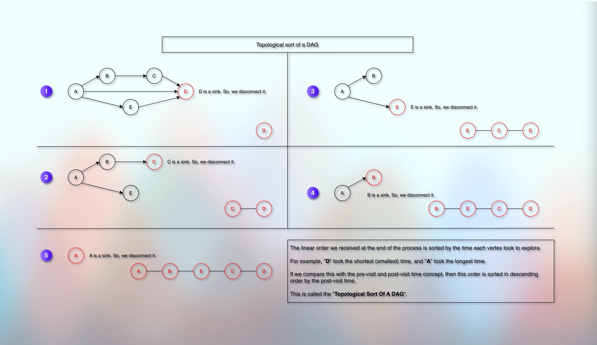

# Directed Acyclic Graph 

## Prerequisites

* [Basic Introduction.md](010basicIntroduction.md)
* [Simple Graph Ops.md](012simpleGraphOps.md)
* [Exploring Graph Traversal.md](020exploringGraphTraversal.md)
* [Bfs Graph Traversal.md](023bfsGraphTraversal.md)
* [Dfs Graph Traversal.md](026dfsGraphTraversal.md)
* [Cycle Detection In Graph Using Dfs.md](028cycleDetectionInGraphUsingDfs.md)
* [Cycle Detection In Graph Using Bfs.md](030cycleDetectionInGraphUsingBfs.md)
* [Number Of Islands.md](032numberOfIslands.md)
* [PreVisit And PostVisit Time.md](../../module01decompositionOfGraph01/010lectures/037preVisitAndPostVisitTime.md)

## References

* 

## Basic Understanding

* When an edge has one-way direction, the graph is known as the directed graph.
* In an undirected graph, edges do not have any direction and they are bidirectional.
* In a directed graph, edges have one-way direction like one-way roads.
* In other words, or as a formal definition:
* In a directed graph, edges have a start vertex and an end vertex.
* It shows one-way path or a dependency.
* For example, if there is an edge that starts from A and ends at B, then we can say that:
  * There is a path (way to go) from A to B, but not in the reverse order. 
  * A comes before B. So, in order to reach or start B, we must first reach and finish A.
    * In this sense, A is a prerequisite to B.
    * In academics terms, to learn B, we must first learn A, and not the other way around.
    * In a routine, we first do A before we start doing B and not the other way around.
      * For example, we have to wake up first before we can get shower.
  * In a social media, it could mean that A follows B, but not the other way around.
  * In a browser and webpages, it could mean that from page A, we can open and navigate to page B.
* The conclusion is that we can arrange such a graph in a linear order.

## Cycle

* Suppose that we have a graph G and there are vertices v1, v2, and vn.
* If we get edges like (v1, v2), (v2, vn), (vn, v1), then we have a cycle.
* In a directed graph, if there is an edge between (v1, vn) and also between (vn, v1), then there is a cycle.
* So basically, if we start from some vertex v1, and if we follow the edges, and if we come back to v1, it is a cycle.
* And the important consequence is that we cannot have a linear order for such a directed graph that has a cycle.

## DAG

* If a directed graph G does not have any cycle, we call it a **Directed Acyclic Graph**.
* In short, we call it **DAG**.
* And we can have a linear order for it.
* We can have a linear order for any DAG.
* In other words, in order to get the linear order, the directed graph must be a **DAG**.

## Topological Sort

* 

* As we can see in the image, if we keep disconnecting the sink vertex, we can arrange a DAG in a linear order.
* Sink is a vertex that does not have any outward edge - it does not point or go towards any other vertex.
* And if we compare the linear order that we are getting in the end with the pre-visit and post-visit concept, we can say that it is the order sorted in descending order by post-visit time.
* Reference: [PreVisit And PostVisit Time.md](../../module01decompositionOfGraph01/010lectures/037preVisitAndPostVisitTime.md)

### How do we find the sink?

* Sink is a vertex whose exploration we finish the first.
* In other words, it takes minimum (shortest) post-visit time.

## Next

* 