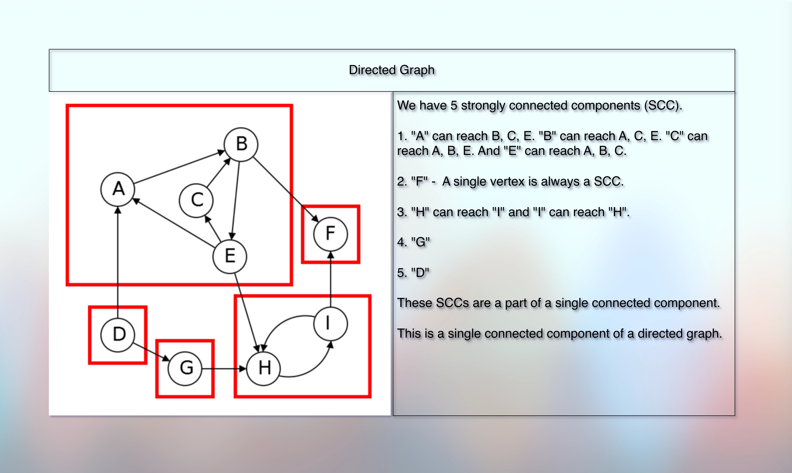
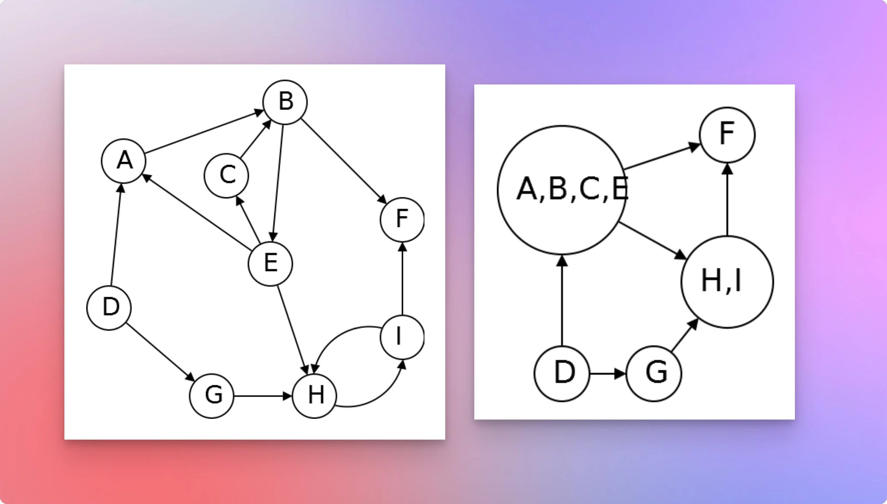

# Strongly connected components

## Prerequisites

* [Basic Introduction.md](010basicIntroduction.md)
* [Simple Graph Ops.md](012simpleGraphOps.md)
* [Exploring Graph Traversal.md](020exploringGraphTraversal.md)
* [Bfs Graph Traversal.md](023bfsGraphTraversal.md)
* [Dfs Graph Traversal.md](026dfsGraphTraversal.md)
* [Cycle Detection In Graph Using Dfs.md](028cycleDetectionInGraphUsingDfs.md)
* [Cycle Detection In Graph Using Bfs.md](030cycleDetectionInGraphUsingBfs.md)
* [Number Of Islands.md](032numberOfIslands.md)
* [Directed Acyclic Graph Intro.md](010directedAcyclicGraphIntro.md)

## References

* [Shradha Madam](https://youtu.be/lqY8TE0P1S8?si=9vpio5gxmiWONcKR)

## Concept

* 
* 

* In an undirected graph, if we can reach from one vertex to another vertex, they are in the same component, and we call it a connected component.
* And an undirected graph can have many isolated connected components (islands) where we cannot reach from a vertex of a connected component to the vertex of a different, isolated connected component.
* In other words, in an undirected graph, if there are two isolated connected components (islands), then it means that there is no edge between these two components that connects them.
* And in an undirected graph, if we can reach from A to B, it means that we can reach from B to A.
* Because an undirected graph is a bidirectional graph.

* However, in a directed graph, the notion of "Strongly Connected Component" is slightly different.
* The idea is that we can classify a single connected component of a directed graph into two categories.
* A strongly connected component and a connected component.
* If there is a source vertex from which we can reach to any other vertex and if any other vertex can reach to this source vertex, we call it a "Strongly Connected Component" of the directed graph.
* So for example, if we can reach from A to B and from B to A, then A and B is a strongly connected component of the directed graph.
* Now, the important distinction is that it doesn't have to be bidirectional.
* "A" can take a different path to reach B and B can take a different path to reach "A".
* The important point is: We should be able to reach B from "A" and "A" from B.
* And if it is the case, then it is a strongly connected component of the directed graph.
* Also, a connected component does not mean that it is a strongly connected component.
* But a strongly connected component is always a connected component.
* In short, in a strongly connected component, we can go from anywhere to anywhere.
* But once we leave the strongly connected component, we can't go back to it!
* A strongly connected component might be connected with a different connected component.
* A single vertex is always considered as a strongly connected component.
* And if there are `>= 2` vertices as a strongly connected component, then there must be a cycle.
* But not every cycle represents a strongly connected component.

* And if we group these strongly connected components and maintain their connections to other SCCs, we get a DAG!
* So, a metagraph of strongly connected components is always a DAG!
* It means that we can form such a directed graph into a DAG!

## Next