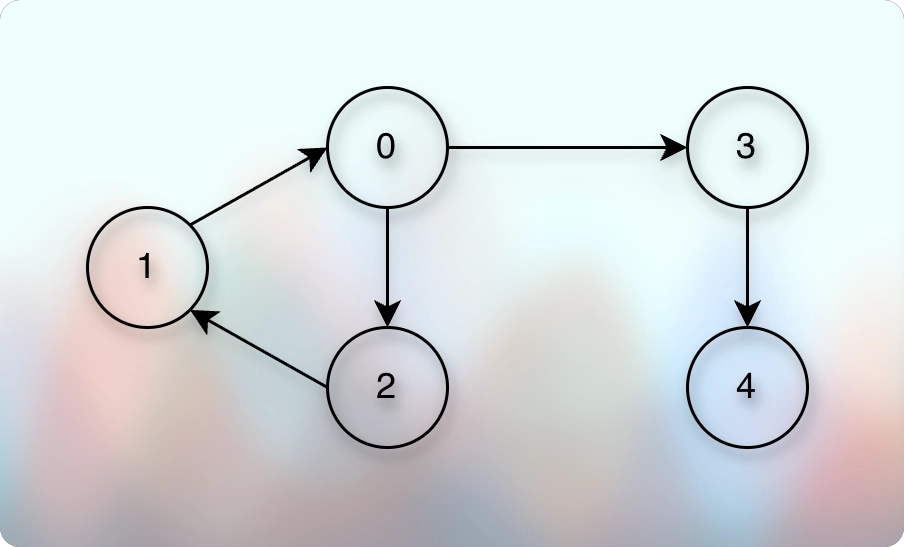
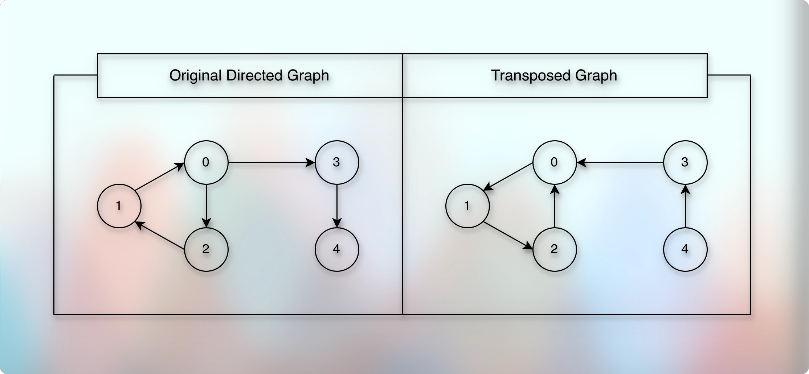
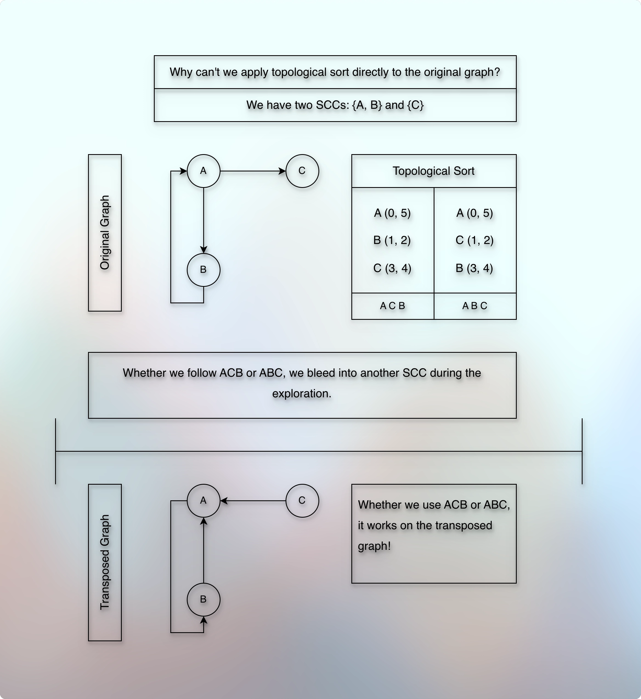

# Counting strongly connected components

## Prerequisites

* [Basic Introduction.md](010basicIntroduction.md)
* [Simple Graph Ops.md](012simpleGraphOps.md)
* [Exploring Graph Traversal.md](020exploringGraphTraversal.md)
* [Bfs Graph Traversal.md](023bfsGraphTraversal.md)
* [Dfs Graph Traversal.md](026dfsGraphTraversal.md)
* [Cycle Detection In Graph Using Dfs.md](028cycleDetectionInGraphUsingDfs.md)
* [Cycle Detection In Graph Using Bfs.md](030cycleDetectionInGraphUsingBfs.md)
* [Number Of Islands.md](032numberOfIslands.md)
* [Directed Acyclic Graph Intro.md](010directedAcyclicGraphIntro.md)
* [Topological Sort On Dag.md](020topologicalSortOnDag.md)
* [Strongly Connected Components.md](030stronglyConnectedComponents.md)

## References

* [Shradha Madam](https://youtu.be/lqY8TE0P1S8?si=ZmetY9PZoCfk_TCm)

## Concept, Thought Process

* We want to count strongly connected components of a directed graph.
* If we use a simple DFS exploration, we get a problem.
* We explore all the vertices of the graph.
* We keep going from one SCC to another SCC.
* And we can't identify when that happens.
* So, we can't count strongly connected components in this normal, simple, straightforward way.
* So, we use multiple theories to solve this problem.
* We will use a couple of theories that we have already learned:
  * [Dfs Graph Traversal.md](026dfsGraphTraversal.md)
  * [Number Of Islands.md](032numberOfIslands.md)
  * [Directed Acyclic Graph Intro.md](010directedAcyclicGraphIntro.md)
  * [Topological Sort On Dag.md](020topologicalSortOnDag.md)
  * [Strongly Connected Components.md](030stronglyConnectedComponents.md)
---

* 

---
* According to the definition of an SCC, if we can reach from `v` to `u` and back from `u` to `v`, then it is an SCC.
* So, the naive approach would be to find all the neighbors of `v` first.
* And then for each such neighbor, we try to find that if we can reach back to `v`.
* And if we can reach back to `v`, then that neighbor is part of the SCC of `v`.
* And we not only do this for one `v`, we do it for all the vertices of the entire graph.
* The graph can have multiple SCCs.
* It means that while trying to figure out one SCC, for example the SCC of `v`, we visit vertices of other SCCs as well.
* And it happens for each vertex.
* It works, but it takes $O(V^2 + VE)$.
* Because we know that a normal full exploration like we do in DFS, takes $O(V + E)$.
* And if we do it (repeat) for each vertex, it becomes: $O(V * (V + E)$, which is $O(V^2 + VE)$.
* We want to improve it.
---
* Now, the problem with the normal DFS for this problem is that we keep moving from one SCC to another SCC.
* We can't get an idea when we leave one SCC or when we enter to a new SCC.
* And we need to know that to restrict ourselves for one particular SCC at a time to improve the time complexity.
* So, it turns out that an SCC has a relevant important property.
* Once we leave an SCC, we can't go back.
* What if we block this direction?
* How can we block it?
* The path that leaves an SCC goes outward and connects with another SCC.
* So, we reverse this direction and block (trap) the SCC!
* Where and how do we reverse the direction?
* We need to reverse the direction exactly at the point where one SCC connects with the other SCC.
* But how do we get to know when that happens?
* We don't get to know it yet.
* So, instead of trying to figure it out to reverse only a few edges, we reverse all the edges!
* So, instead of reversing only the edges that connect one SCC to another SCC, we reverse all the edges!

* 

* When we reverse the directions of the original graph, we call it a transposed graph.
* Now, in the transposed graph, if we start from `0`, we get `1`, we get `2`, we get back to `0`.
* It is a cycle, the SCC is trapped, the SCC is covered, and so we conclude that we finished and covered one SCC.
* So, the SCC looks self-contained, quarantined.
* We take the other unvisited vertex from the adjacency list.
* We get `1` and `2` as already visited.
* So, we start with `3` and it goes to `0` which is already visited.
* So, `3` is the second SCC.
* We again take the remaining unvisited vertex from the adjacency list.
* We get `4` and it points to `3` which is already visited.
* So, `4` is the third SCC.
* So, we got a total of 3 SCCs, and it looks like it works.
* But what if we had started from `4` instead of `0`?
* Then we would have ended up in the same dilemma that we are trying to solve, and we thought that we have solved it!
* So, if we start counting the SCCs from `4`, we get `3`, `0`, `1`, `2`, get back to `0`, which is already visited, but we already stepped out of one SCC to other SCC.
* We already visited vertices of other SCCs.
* So, it works only if we start from the "correct" vertex.
* So now, the problem is, how do we determine the "correct" vertex?
---
* First of all, let us define the "correct" vertex here.
* We saw that when we started with the sink SCC (in a transposed graph), it worked.
* Otherwise, it did not work.
* So, we want to ensure that we always start with the sink vertex of the transposed graph.
---
* Now, what is a sink vertex?
* It is the vertex that does not have any outward edge.
* A graph can have many sink vertices.
* How do we find the sink vertex?
* We find it based on its property.
* A sink vertex will have the shortest post-visit time than its sources/parents/ancestors.
* There is no concept of parents or ancestors or successors in the graph. 
* But we use these terms to indicate the relation between the two vertices or to distinguish or to convey which vertex we visited earlier.
* So, how do we arrange and sort the vertices by post-visit time?
* We use the topological sort.
---
* Ok. So, to identify from which vertex we should start our exploration, we use the topological sort.
* And to trap each SCC, we use the transposed graph.
* And once we have the topological sort order and the transposed graph, we finally apply the DFS on the transposed graph.
* We start with the unvisited vertex from the topological sort, and it will cover all the vertices that belong to that particular SCC.
* Because each SCC is trapped, we get out of the loop, and get another unvisited vertex from the topological sort order.
* We repeat the process.
* Every time we start a new exploration with the unvisited vertex, it indicates a new SCC.
* The count logic is a little bit similar to the count island problem we have seen earlier.
---
* What is the problem if we use (iterate) the adjacency list to explore each unvisited vertex of the transposed graph instead of using the topological sort?
* There is no guarantee that we will always start with the sink vertex.
* We might start with the source vertex, and we will end-up with exploring the entire graph, going from one SCC to another, without any feedback, realization, or acknowledgement.
---
* What is the problem if we use a normal DFS order, store it, and use it on the transposed graph to explore each unvisited vertex instead of using the topological sort order?
* Can't we use pre-visit time sort in descending order - because doesn't it convey the same - the sink vertex is the vertex we visited the last?
* And the answer is:
* 
* If we use any other order, for example, maybe the pre-visit time sorted by ascending or descending order, it doesn't reliably determine the sink vertex.
---
* We could have applied this logic to the original graph as well. Why to use a transposed graph then?
* And the answer is:
* 
* Until and unless we trap each SCC, it doesn't work.
* We need two things to make it work:
  * Correct order
  * Trapped SCC
---

## Notes

* Conceptually, we can't have a topological sort on the directed graph due to possible one or more cycles.
* So, the "Topological sort" of a DAG, is "DFS in finish-order-sorted-descending" for a directed graph.
---
* A sink vertex and a sink SCC are conceptually the same, but physically (or at whole) they are different.
* It is true (same) that none of them can have outward edge.
* But a sink vertex represents a single vertex, whereas a sink SCC represents an SCC component.
* Although an SCC can have a single vertex, it can also include multiple vertices.
* So, it is a group of vertices and we have already learned about it earlier.
* Reference: [Strongly Connected Components Intro](https://github.com/sagarpatel288/kotlinDSAWithIntellijIdea/blob/8ed3ed68521817db6b99fcf09d1836d9b95e1fb3/docs/03graph/courses/uc/module02decompositionOfGraph02/010lectures/030stronglyConnectedComponents.md)
* An SCC is a group of vertices where each vertex can reach any other vertex of the same group (SCC).
* And if there are `>= 2` vertices in an SCC, then there must be a cycle to make it possible.
* But a single vertex is always a single vertex.
* When we say a sink SCC, it means that the sink SCC does not have any outward edge that connects with another SCC.
* When we say a sink vertex, it means that the sink vertex does not have any outward edge that connects with another vertex.
* When we use the word "sink" in the graph, we are talking about the subject that does not have any outward edge.
---
* And we have also learned that we can group these SCCs, maintain their connections with other SCCs, and in this way, we can transform the directed graph into a directed acyclic graph.
* [Strongly Connected Components Intro](https://github.com/sagarpatel288/kotlinDSAWithIntellijIdea/blob/8ed3ed68521817db6b99fcf09d1836d9b95e1fb3/docs/03graph/courses/uc/module02decompositionOfGraph02/010lectures/030stronglyConnectedComponents.md)
* So, the interesting thing we have done here by using the transposed graph to solve this "Count SCCs" problem, is that we convert the source SCC into the sink SCC!
* In other words, the source SCC of the original graph becomes sink SCC in the transposed graph.
---

## Implementation and complexity analysis

* Topological sort of the given original graph to get the right order for the exploration.
  * Time Complexity: $O(V + E)$ (Because it is almost the same DFS exploration).
  * Space Complexity: $O(V + E)$ for the stack.
* Create a transposed graph to trap each SCC.
  * Time Complexity: $O(V + E)$ because we iterate through the adjacency list.
  * Space complexity: $O(V + E)$ for the transposed adjacency list.
* DFS to count each SCC
  * Time Complexity: $O(V + E)$
  * Space Complexity: $O(V)$ for the visited boolean array.
* Total time and space complexity:
  * Time Complexity: $O(V + E)$
  * Space Complexity: $O(V + E)$
---
* 

## Next

* 