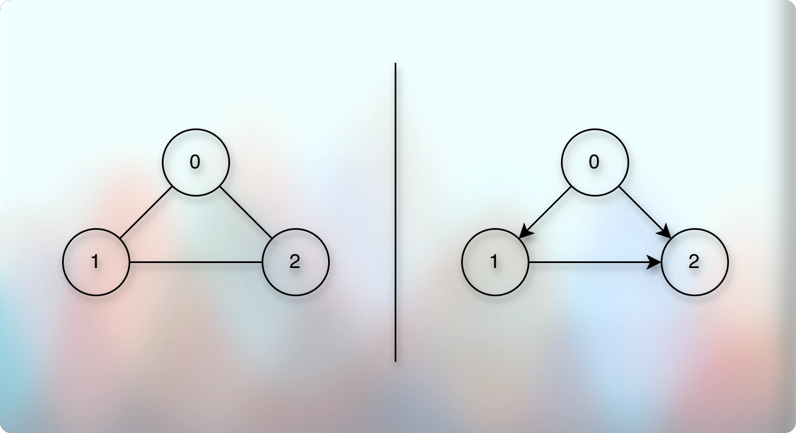
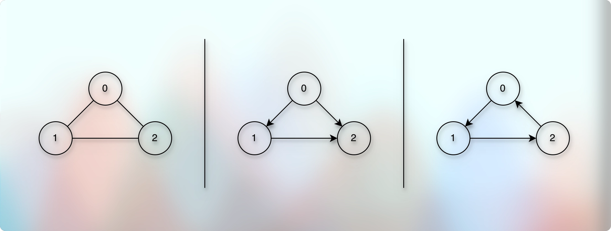
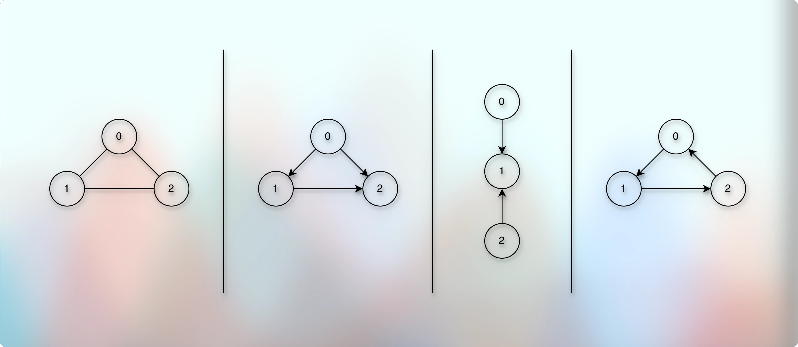

# Detect a cycle in a directed graph

## Problem Introduction

* A Computer Science curriculum specifies the prerequisites for each course as a list of courses that should be taken before taking this course. 
* You would like to perform a consistency check of the curriculum, that is, to check that there are no cyclic dependencies. 
* For this, you construct the following directed graph: 
* vertices correspond to courses, there is a directed edge (𝑢, 𝑣) is the course 𝑢 should be taken before the course 𝑣. 
* Then, it is enough to check whether the resulting graph contains a cycle.

## Problem Description

### Task 

* Check whether a given directed graph with 𝑛 vertices and 𝑚 edges contains a cycle.

### Input Format 

* A graph is given in the standard format.

### Constraints 

$$
1 ≤ 𝑛 ≤ 10^3, 0 ≤ 𝑚 ≤ 10^3
$$

### Output Format 

* Output 1 if the graph contains a cycle and 0 otherwise.

### Time Limits

```markdown

| language  | C | C++ | Java | Python | C#  | Haskell | JavaScript | Ruby | Scale |
|-----------|---|-----|------|--------|-----|---------|------------|------|-------|
| time(sec) | 1 | 1   | 1.5  | 5      | 1.5 | 2       | 5          | 5    | 3     |

```

### Memory Limit

* 512 MB

## Samples

### Sample 1

**Input**

```markdown
4 4
1 2
4 1
2 3
3 1
```

**Output**

* 1

**Explanation**

* This graph contains a cycle: 3 → 1 → 2 → 3.

### Sample 2

**Input**

```markdown
5 7
1 2
2 3
1 3
3 4
1 4
2 5
3 5
```

**Output**

* 0

## Thought Process

* 

* Earlier, we learned about detecting a cycle in an undirected graph.
* [Cycle Detection In Graph Using Dfs.md](../../module01decompositionOfGraph01/010lectures/028cycleDetectionInGraphUsingDfs.md)
* While detecting a cycle in an undirected graph, we had used the parent concept.
* Reference: [Cycle Detection In An Undirected Graph Using Dfs.md](../../module01decompositionOfGraph01/010lectures/028cycleDetectionInGraphUsingDfs.md)
* The definition or criteria for the cycle in an undirected graph is: "If there are multiple ways to reach from "A" to "B", then there is a cycle in the undirected graph."
* However, it is completely normal in a directed graph and it does not indicate a cycle.
* For example:
* 
* In the image, we can see that we can reach "2" from "0 → 1 → 2" as well from "0 → 2".
* But that is not a cycle in the directed graph!
* So, what is cycle in a directed graph?

---

* Let us observe the cycle in a directed graph.
 
* 

* Now, it might be completely normal in a bidirectional graph that if we can go from "A" to "B", then it inherently means we can go from "B" back to "A".
* That is why we call it a bidirectional graph.
* However, it is not normal in a directed graph.
* If we can go from "A" to "B" and then somehow, "B" can also reach back to "A", then there is a cycle in the directed graph.
* But "B" is a result of our exploration of "A".
* So, it is like during the exploration, within the same exploration, if we visit a particular vertex again, it indicates a cycle.
* Note that we might visit the same vertex multiple times while exploring a completely different vertex, and it doesn't necessarily indicate the cycle.
* For example:
* 
* In the third image, we can see that we visit "1" while exploring "0", and we visit "1" again while exploring "2".
* So, we visit "1" multiple times, but that doesn't indicate a cycle.
* Because we visit "1" during a complete separate exploration.
* So, let us lock this conclusion:
* If we visit the same vertex twice within the same exploration in a directed graph, there is a cycle.
---
* Ok. How do we translate this into a code?
* Exploration indicates our standard DFS or BFS traversal.
* How and where do we fit our logic to detect the cycle?
* For that, "Within the same exploration" becomes important.
* Especially, "Visit twice within the same exploration" or "Second visit within the same exploration".
* We are already using the "visited boolean array", but it is for the overall exploration of the entire graph.
* And we already know where the exploration of one particular vertex at a time happens.
* It happens in our "recursive dfs" function.
* So, we use another "visited boolean array" dedicated to the single exploration at a time.
* Let us call it something like "explored" or "visitedPath".
* So, our recursive function might look like:
```kotlin

fun dfs(vertex: Int, visited: BooleanArray, visitedPath: BooleanArray) {
    
}

```
* Every time we start a new exploration, we would have a brand new "visitedPath" with default "false" values.
* Every time we visit a vertex inside the recursive "dfs" function, we would also mark it visited in our "visitedPath".
* While exploring each neighbor, if we ever find that the vertex is already marked as "visited" in both "visited" boolean array and also in the "visitedPath", we declare it a cycle.