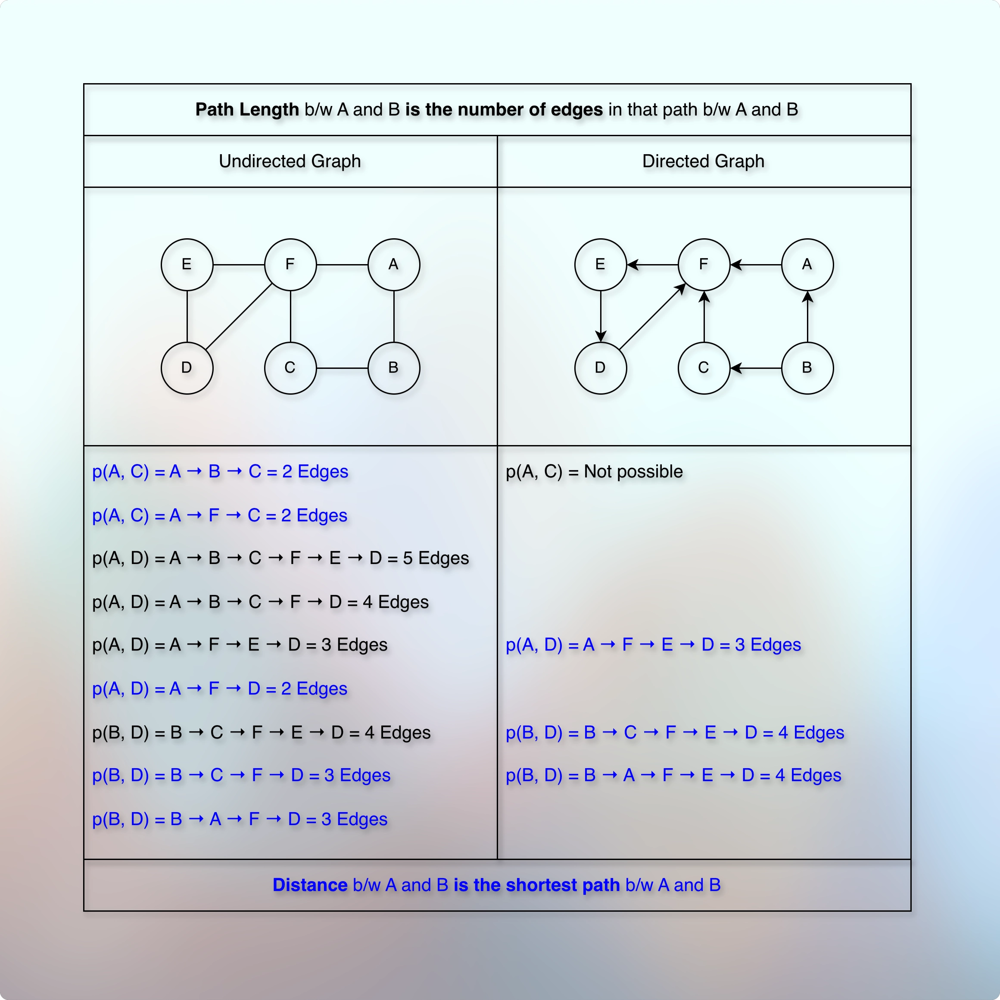
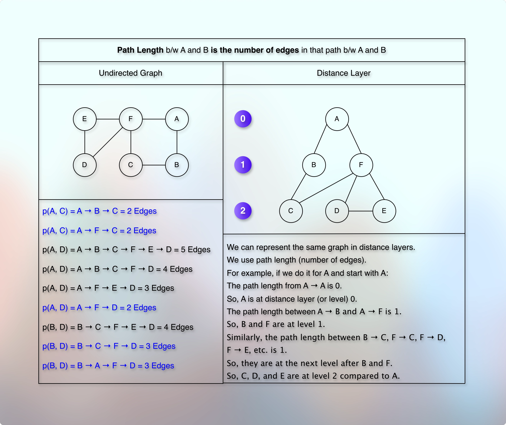
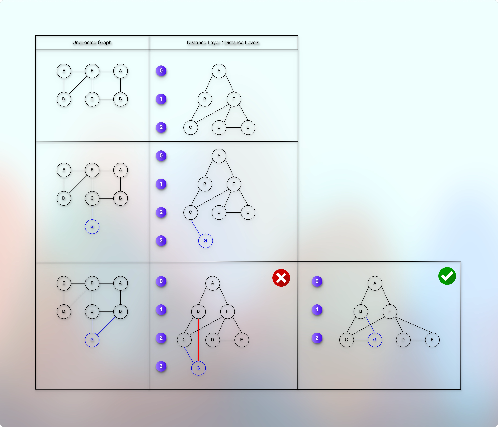

# Path length and Distance

## Prerequisites

* [Basic Introduction.md](../../module01decompositionOfGraph01/010lectures/010basicIntroduction.md)
* [Simple Graph Ops.md](../../module01decompositionOfGraph01/010lectures/012simpleGraphOps.md)
* [Exploring Graph Traversal.md](../../module01decompositionOfGraph01/010lectures/020exploringGraphTraversal.md)
* [Bfs Graph Traversal.md](../../module01decompositionOfGraph01/010lectures/023bfsGraphTraversal.md)
* [Dfs Graph Traversal.md](../../module01decompositionOfGraph01/010lectures/026dfsGraphTraversal.md)
* [Cycle Detection In Graph Using Dfs.md](../../module01decompositionOfGraph01/010lectures/028cycleDetectionInGraphUsingDfs.md)
* [Cycle Detection In Graph Using Bfs.md](../../module01decompositionOfGraph01/010lectures/030cycleDetectionInGraphUsingBfs.md)
* [Number Of Islands.md](../../module01decompositionOfGraph01/010lectures/032numberOfIslands.md)
* [Connectivity.md](../../module01decompositionOfGraph01/010lectures/035connectivity.md)
* [PreVisit And PostVisit Time.md](../../module01decompositionOfGraph01/010lectures/037preVisitAndPostVisitTime.md)
* [Directed Acyclic Graph Intro.md](../../module02decompositionOfGraph02/010lectures/010directedAcyclicGraphIntro.md)
* [Topological Sort On Dag.md](../../module02decompositionOfGraph02/010lectures/020topologicalSortOnDag.md)
* [Strongly Connected Components.md](../../module02decompositionOfGraph02/010lectures/030stronglyConnectedComponents.md)
* [Counting Strongly Connected Components.md](../../module02decompositionOfGraph02/010lectures/040countingStronglyConnectedComponents.md)
* [Detect Cycle In Directed Graph.md](../../module02decompositionOfGraph02/020assignment/010detectCycleInDirectedGraph.md)
* [Topological Sort In Directed Graph.md](../../module02decompositionOfGraph02/020assignment/020topologicalSortInDirectedGraph.md)
* [Count Strongly Connected Components.md](../../module02decompositionOfGraph02/020assignment/030countStronglyConnectedComponents.md)

## References

* 

## Path length

* 

* Path length between A and B is the number of edges between A and B.

## Distance

* 

* Distance between A and B is the length of the shortest path between A and B.

## Distance Layers (Distance Levels)

* 

* We can convert or represent the given graph into somewhat or similar to tree levels.
* For example, as shown in the image, suppose that we have an undirected graph.
* And we want to represent the given graph into distance layers or distance levels for "A".
* We start with "A".
* We can see that the path length between A to A is 0.
* So, we say that A is at level 0.
* Then, we have A → B and A → F with path length 1 for each.
* So, B and F are at level 1.
* Then, we have B → C, F → C, F → D, and F → E.
* So, the path length from B or F to C, D, or E is 1.
* So, C, D, and E are at the next level of B or F.
* From the perspective of A, they are at level 2.
* So, C, D, and E are at level 2.
---
* Now, this representation reveals a few invariants.
* For example, suppose that we want to add a new vertex (node) C → G at level 3.

* 

* Is it correct? Can we do that? 
* We can do that because it maintains the connections and also the levels.
* It means that in the undirected graph, the last level can add one more level and add a new vertex (node) there.
---
* But what if we want to connect this newly added G with B?
* How do we represent it in our levels?
* It turns out that now we cannot have "G" at level 3.
* We have to relocate it.
* Because if we connect "G" from level 3 with "B" of level "1", then the path length between B → G is "1".
* But as "B" is at level "1", then "G" should be on level "2".
* So, we place "G" at level 2.
* But what if we connect this newly added G with B?
* Is it correct? Can we do that?
* It means that a vertex adds a new direct connection with the new vertex only at the next level.
* A vertex cannot add a new direct connection with a new vertex beyond the next level.

## Next

* 