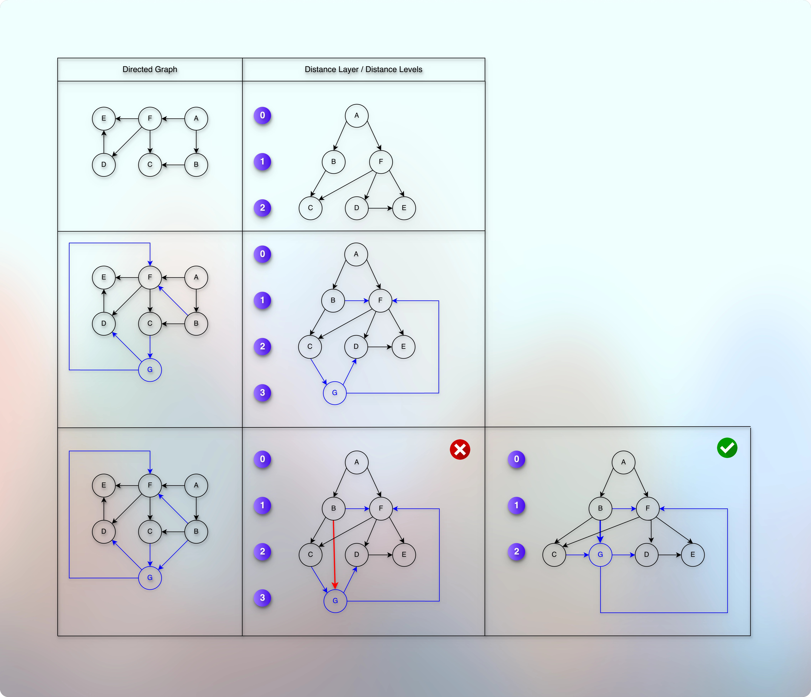

# Path length and Distance

## Prerequisites

* [Basic Introduction.md](../../module01decompositionOfGraph01/010lectures/010basicIntroduction.md)
* [Simple Graph Ops.md](../../module01decompositionOfGraph01/010lectures/012simpleGraphOps.md)
* [Exploring Graph Traversal.md](../../module01decompositionOfGraph01/010lectures/020exploringGraphTraversal.md)
* [Bfs Graph Traversal.md](../../module01decompositionOfGraph01/010lectures/023bfsGraphTraversal.md)
* [Dfs Graph Traversal.md](../../module01decompositionOfGraph01/010lectures/026dfsGraphTraversal.md)
* [Cycle Detection In Graph Using Dfs.md](../../module01decompositionOfGraph01/010lectures/028cycleDetectionInGraphUsingDfs.md)
* [Cycle Detection In Graph Using Bfs.md](../../module01decompositionOfGraph01/010lectures/030cycleDetectionInGraphUsingBfs.md)
* [Number Of Islands.md](../../module01decompositionOfGraph01/010lectures/032numberOfIslands.md)
* [Connectivity.md](../../module01decompositionOfGraph01/010lectures/035connectivity.md)
* [PreVisit And PostVisit Time.md](../../module01decompositionOfGraph01/010lectures/037preVisitAndPostVisitTime.md)
* [Directed Acyclic Graph Intro.md](../../module02decompositionOfGraph02/010lectures/010directedAcyclicGraphIntro.md)
* [Topological Sort On Dag.md](../../module02decompositionOfGraph02/010lectures/020topologicalSortOnDag.md)
* [Strongly Connected Components.md](../../module02decompositionOfGraph02/010lectures/030stronglyConnectedComponents.md)
* [Counting Strongly Connected Components.md](../../module02decompositionOfGraph02/010lectures/040countingStronglyConnectedComponents.md)
* [Detect Cycle In Directed Graph.md](../../module02decompositionOfGraph02/020assignment/010detectCycleInDirectedGraph.md)
* [Topological Sort In Directed Graph.md](../../module02decompositionOfGraph02/020assignment/020topologicalSortInDirectedGraph.md)
* [Count Strongly Connected Components.md](../../module02decompositionOfGraph02/020assignment/030countStronglyConnectedComponents.md)

## References

* 

## Path length

* 

* Path length between A and B is the number of edges between A and B.

## Distance

* 

* Distance between A and B is the length of the shortest path between A and B.

## Distance Layers (Distance Levels)

* 

* We can convert or represent the given graph into somewhat or similar to tree levels.
* For example, as shown in the image, suppose that we have an undirected graph.
* And we want to represent the given graph into distance layers or distance levels for "A".
* So, "A" is our subject vertex (node) and we will arrange all the other vertices (nodes) based on the distance of each vertex (shortest path) from/to "A".
* So, we will arrange each vertex (node) based on how far or how close it is with "A".
* We start with "A".
* We can see that the distance between A to A is 0.
* So, we say that A is at level 0.
* Then we take all the vertices (nodes) whose distance is "1" from A.
* So, we have A → B and A → F with distance 1 for each.
* So, B and F are at level 1.
* Then, we take all the vertices (nodes) whose distance is "2" from A.
* So, we have: A → B → C, A → F → C, A → F → D, and A → F → E.
* It means that A is connected with C, D, and E through B or F.
* It means that B and F adds and connects these new nodes: C, D, and E. 
* So, we have B → C, F → C, F → D, and F → E.
* So, the distance from B or F to C, D, or E is 1.
* So, C, D, and E are at the next level of B or F.
* From the perspective of A, they are at level 2.
* Because A reaches them through B or F and vice versa.
* For example, the distance (shortest path) from A → B → C, A → F → C, A → F → D, and A → F → E is "2". 
* So, C, D, and E are at level 2.
---
* Now, this representation reveals a few invariants.
* For example, suppose that we want to add a new vertex (node) C → G at level 3.

* 

* Is it correct? Can we do that? 
* We can do that because it maintains the connections and also the levels.
* Specifically, **if the new connection does not reduce the distance (shortest path) with the root node, then the distance-level structure remains as it is.**
* In other words:
* **If the new connection reduces the distance of the destination from the root node, we promote the destination and change the distance-level structure.** 
* What we need to understand is why it is so, when that happens, and what makes it happen in an undirected graph and also for a directed graph.
* It means that in the undirected graph, the last level can add one more level and add a new vertex (node) there.
---
* But what if we want to connect this newly added G with B?
* How do we represent it in our levels?
* If we connect B and G, then it actually brings G closer to the root node, A.
* Because earlier, it was A - B - C - G.
* Now with this new connection, it becomes A - B - G.
* So, this new connection gives a new, reduced distance between A and G.
* So, now we cannot have "G" at level 3.
* We have to relocate it.
* Also, if we connect "G" from level 3 with "B" of level "1", then the path length between B → G is "1".
* But as "B" is at level "1", then "G" should be on level "2".
* So, we place "G" at level 2.
* It means that a vertex adds a new direct connection with the new vertex only at the next level.
* A vertex cannot add a new direct connection with a new vertex beyond the next level.
* Or maybe, we can say that when we have a **direct connection between two vertices (nodes), it must be adjacent levels.**
* A direct connection cannot have the level gap more than |1|.
* As we add a new level, it increases the distance from "A".
* The nodes with the higher distance from "A" gets the bottom level (Between the level 2 and 3, 3 is the bottom level).
* The nodes with the shorter distance from "A" gets closer to "A" and gets the upper level (Between 2 and 3, 2 is the upper level). 
---
* But things are a little bit different for a directed graph.
* We saw that in an undirected graph, a direct connection must happen between the adjacent levels.
* But in a directed graph, it is only half the truth.
* For example:

* 

* We can see that we can add a new connection from C → G, and it will be on the level 3.
* Because "C" is at level 2 and there is 1 edge between C and G.
* So, "G" goes to the next level, at 3.
* Now, we can have a new connection from G → D, and G will still be on the level 3.
* Because this neither brings G nor D any closer to the root node "A".
* The distance (shortest path) from A to D still remains A → F → D.
* And the distance from A to G still remains A → B → C → G.
* Similarly, we can have a new connection from G → F. 
* G will still be on the level 3, and F will still be on the level 2.
* Because this neither brings G or F any closer (uplift) to "A" nor their relevant paths any shorter.
* It doesn't bring G any closer because the edge goes from G, not towards G.
* In this case, if it was the undirected graph, we would have changed the distance-level structure.
* Again, we can have a new connection from B → F, and there will be no change in the distance-level placement.
* Because the new edge that is coming towards F does not bring F any closer to "A".
* Because the shortest path (The Distance) from A → F remains "1" and this new connection from B → F doesn't make it any shorter.
* So the observation is that if the new edge does not make the distance any shorter from the root node, then there will be no change in the distance-level structure.
* **We change the distance-level structure only when a new connection reduces the distance from the root node to the destination node.**
* Now, let us see what can make the distance from the root node shorter.
* For example, we can have a new edge from B → G, and it will actually make the distance between G and A shorter.
* Before this new connection, it was A → B → C → G.
* With this new connection, it becomes A → B → G.
* Hence, this new connection actually makes the distance with the root node shorter.
* It actually brings G closer to A.
* So, we have to change the distance-level structure.
* Now, G cannot stay in level 3.
* We have to promote it.
* So, G goes to level 2.
* So the rule is: A vertex from the lower level can connect with any previous level vertex. But a vertex from the top level can connect only with the vertex at the adjacent (next) level.
* Here, between 2 and 3, 3 is the lower (bottom) level and 2 is the higher, upper, top level.

## TL;DR

**Path Length**

* Number of edges in that path

**Distance**

* Shortest path

**Distance-level Representation**

> What changes the distance-level structure?

* Any edge that reduces the distance with the root node.

> When that happens (what makes it) for an undirected graph?

* Whenever we get a direct edge across the distance levels whose gap is more than |1|.

> When that happens (what makes it) for a directed graph?

* Whenever there is a direct edge from the previous (top) level towards any next (bottom) level where the gap is more than |1|.
* The condition is that it must be the edge, the direction from the previous (top) level towards the bottom (next) level.
* Otherwise, we can have any edge from the bottom level towards the top level and it does not change the distance-level structure.

## Next

* 