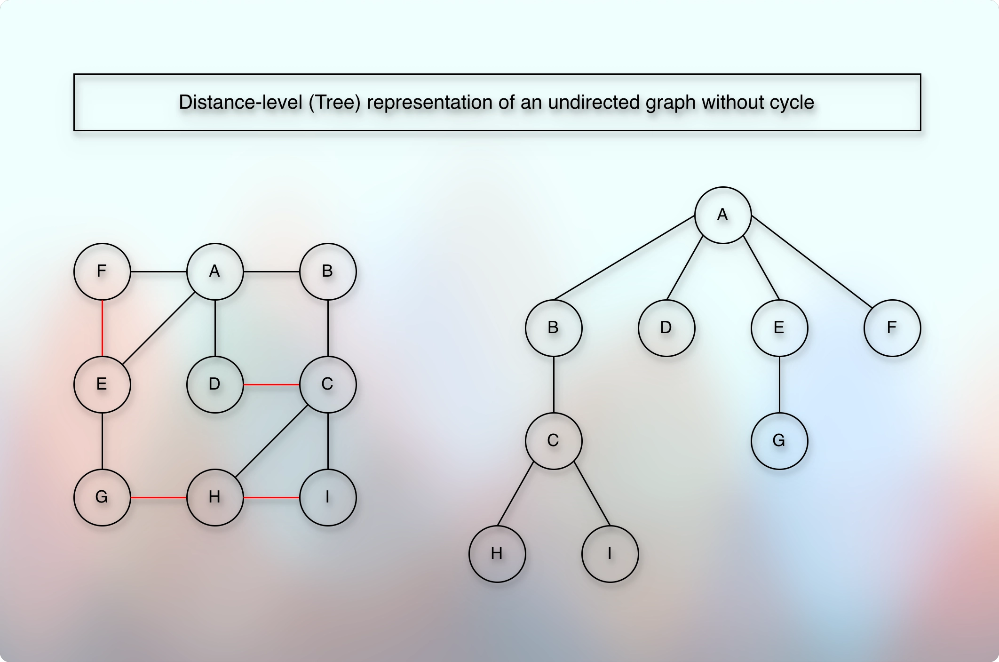
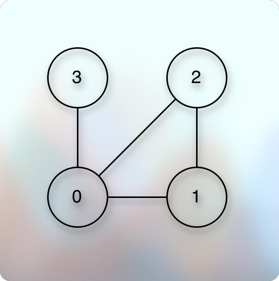
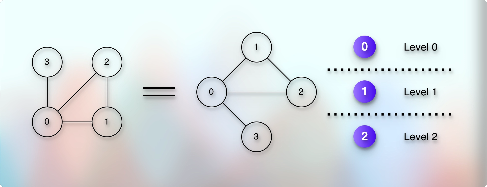
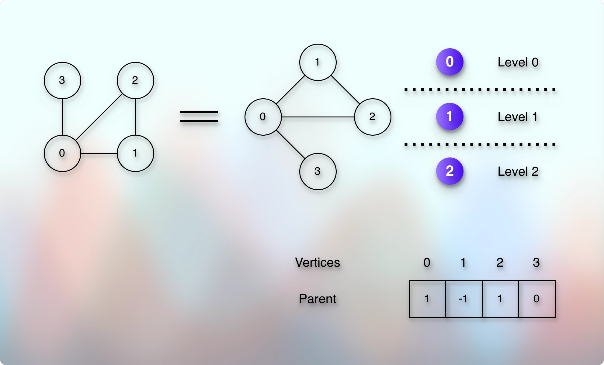
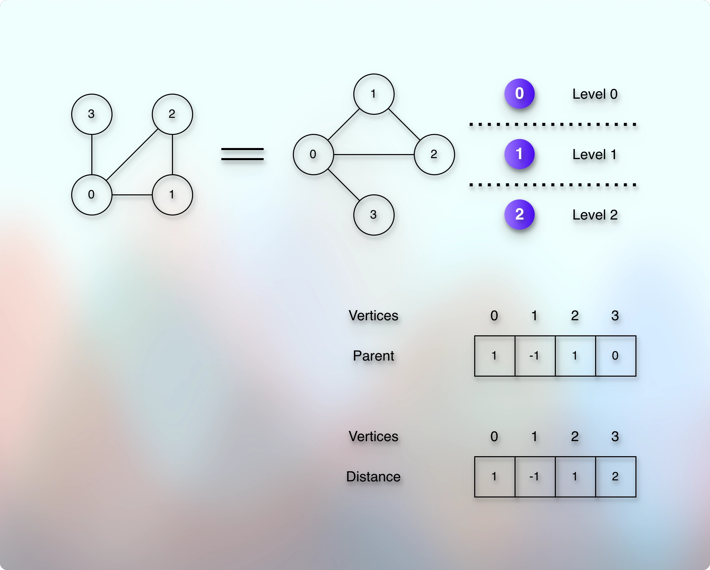

# Shortest Path

## Prerequisites

* [Path, Distance, And, Levels Intro.md](010pathDistanceAndLevelsIntro.md)

## Concept

* 

* Once we have the distance-level representation of a graph where the representation does not have any cycle, we can find the shortest path between two nodes.
* Because the distance-level representation is based on the distance between two nodes, and distance means the shortest path.
* We can call this distance-level representation a tree.
* And BFS Traversal also makes progress based on the distance-level.
* Suppose that we have the following graph:

* 

* So, the adjacency list is:

```markdown

0 - 1
0 - 2
0 - 3
1 - 2
```

* Now, suppose that we want to find the shortest path between `1` and `3`.
* We start the BFS Traversal.
* So, just a quick recap, it looks like below:

* Reference: [Bfs Graph Traversal.md](../../module01decompositionOfGraph01/010lectures/023bfsGraphTraversal.md)

```kotlin

fun bfs(start: Int, visited: BooleanArray) {
    val queue = ArrayDeque<Int>()
    queue.addLast(start)
    visited[start] = true
    while (queue.isNotEmpty()) {
        val vertex = queue.removeFirst()
        // What does this print indicate?
        // It tells us which vertex we visited and in which order
        // It does not represent the shortest path
        // It represents all the paths that it has explored
        println(vertex)
        val neighbors = adjacencyList[vertex]
        neighbors.forEach {
            if (!visited[it]) {
                queue.addLast(it)
                visited[it] = true
            }
        }
    }
}

```

* So, it goes like:
* We add `1` to the queue, then as long as the queue is not empty, we repeat:
* Remove the top, and enqueue the neighbors.
* So, when we remove the top, we get `1`.
* If we print it, we get: `1`.
* We add the unvisited neighbors: `0` and `2`.
* So, the queue has: `0, 2`.
* Remove the top, and we get `0`.
* The print order becomes: `1, 0`.
* We add the unvisited neighbors: `3`.
* So, the queue has: `2, 3`.
* We remove the top, we get `2`.
* The print order becomes: `1, 0, 2`.
* All the neighbors are already visited.
* We remove the top, we get `3`.
* The print order becomes: `1, 0, 2, 3`.
* All the neighbors are already visited.
* But the simple, normal, straightforward BFS printing does not reveal the shortest path.
* It reveals all the vertices it explored and in which order it explored them.
* So, how do we find the shortest path and its value?
* So, in our example, how do we get the answer that:
* The shortest path from 1 to 3 is: 1 → 0 → 3 and the value is: 2 (Because there are 2 edges).
* How do we get this answer?
---
* If we look at our print, it has the answer if we remove `2` from it.
* The print is: `1, 0, 2, 3`.
* If we drop `2`, it becomes: `1, 0, 3`.
* And it is exactly the answer we expect.
* But we cannot drop any vertex or vertices arbitrarily.
* But we can use one important property of the BFS Traversal.
* We know that the BFS Traversal explores (visits) the vertices by distance-level.
* For example, we can imagine the same graph as:



* So, with this distance-level perspective and if we anchor our focus on the start and the destination vertices, it gives us the expected path:
* `1, 0, 3`.
* Let us see how.
---
* Now, the printed value is: `1, 0, 2, 3`.
* And if we ask `3`, who is your parent/previous vertex from which we could reach you?
* The answer will be: `0`
* And if we ask `0`, who is your parent/previous vertex from which we could reach you?
* The answer will be `1`.
* And if we notice the pattern, we started asking from `3`, we got `0`, and finally, `1`.
* So, it is: `3, 0, 1`.
* And if we reverse this order, it becomes exactly the expected answer:
* `1, 0, 3`.
---
* It clearly means that we need to store the `parent` or `previous` vertex information for each vertex that we visit.
* Think of it like the parent information we stored in DSU for union by rank/size.
* Reference: [Disjoint Sets Union.md](../../../../../02dataStructures/courses/uc/module03priorityQueuesHeapsDisjointSets/section04DisjointSetsImplementation/disjointSets.md)
* An array is an obvious choice to get this answer in `O(1)` time.
* And we are already using the direct addressing method in the `adjacencyList`.
* So, we want to treat the indices as vertices, and the value will represent the `parent` or `previous` vertex information through which we could reach this index (vertex).
* So, it will be like:

* 

* And the number of vertices for which we want to store this information cannot exceed given number of total vertices.
* So, the array size will be equal to the given total number of vertices.
* Ok. How do we use this `prev` or `parent` array?
* What is the right time to store the `prev` or `parent` information for a vertex?
* When we get the neighbors.
* Because at that point, we will have both the parent vertex that we remove from the queue and its neighbors that we get from the `adjacencyList`.
---
* So, it might look like below:

```kotlin

fun bfs(start: Int, visited: BooleanArray) {
    val queue = ArrayDeque<Int>()
    val prev = IntArray(vertices) { -1 }
    queue.addLast(start)
    visited[start] = true
    // We treat the starting vertex as the root node
    // And the root node does not have any parent
    // It helps us identify the starting point when we backtrack from the destination
    prev[start] = -1
    while (queue.isNotEmpty()) {
        val vertex = queue.removeFirst()
        val neighbors = adjacencyList(vertex)
        neighbors.forEach {
            if (!visited[it]) {
                queue.addLast(it)
                visited[it] = true
                // For all the neighbors of the vertex that we remove from the top of the queue, the vertex is the previous/parent vertex
                // For each neighbor vertex, the vertex that we removed from the top of the queue is the previous/parent vertex
                prev[it] = vertex
            }
        }
    }
}

```

* Now, if we ask the `destination` about its parent, `prev[destination]` it will be like:
* 
```markdown

// Starting our journey from the destination back to the parent (backward move)
prev[destination]
 = Starting from the destination = 3 // Store it   
 = prev[3]
 = Gives 0 // Store it
 = prev[0]
 = Gives 1 // Store it
 = prev[1]
 = Gives -1 // Indicates that we have reached the starting point   
```

* So, we get: `3, 0, 1`.
* And when we reverse it, we get our expected answer: `1, 0, 3`.
* Which indicates that the shortest path is: `1 → 0 → 3`.
---
* What about the distance?
* We can find the distance in two ways.
* By simply counting the vertices in the final result - 1.
* Or if we want to store the distance for each vertex, we can take a separate `dist` array.
* We want to store the distance value for each vertex.
* So, the size of the `dist` array will be equal to the given total number of the vertices.
* And again, we will be using the direct addressing method.
* So, we will consider the indices as vertices.
* And the value will represent the distance from the starting (root) node/vertex/point.
* So, it will be something like below:

* 

```kotlin

// The default value indicates that we have not visited the vertex yet.
// Or that it is the starting vertex.
val dist = IntArray(vertices) { -1 }
```

---
* Where and how do we use this `dist` array?
* How do we store the value?
* When we go into the next distance-level.
* For each distance-level, as we go into the next distance-level, we increase the value by `+1`.
* How do we get to know when we go into the next distance-level?
* When we start exploring the neighbors.
* And what about the value? What distance value will we store?
* We start with the root node, and we cross each distance-level gradually.
* It means that we start with the distance `0` - from the root to the root.
* So, the distance of the vertex `1` means from `1` to `1`, the distance to itself is `0`.
* Then, as we reach `0`, the distance of `0` means from `1` to `0`, becomes the distance of 0's parent + 1.
* Because we moved/crossed `+1` distance than the parent.
* We always move/cross `+1` distance at a time.
* That's how the BFS Traversal works.
* So, `dist[0] = dist[0's parent, whichc is 1] + 1` = `dist[1] + 1` = `0 + 1` = `1`.
* Similarly, `dist[2] = dist[2's parent, which is 1] + 1` = `dist[1] + 1` = `0 + 1` = `1`.
* And `dist[3] = dist[3's parent, which is 0] + 1` = `dist[0] + 1` = `1 + 1` = `2`.
* What is the point in the code where we can use this logic?
* When we start exploring the neighbors, it indicates that we are into the next distance level.
* So, it becomes something like below:

```kotlin

fun bfs(start: Int, visited: BooleanArray) {
    val queue = ArrayDeque<Int>()
    val prev = IntArray(vertices) { -1 }
    val dist = IntArray(vertices) { -1 }
    queue.addLast(start)
    visited[start] = true
    prev[start] = -1
    dist[start] = 0
    while (queue.isNotEmpty()) {
        val vertex = queue.removeFirst()
        val neighbors = adjacencyList[vertex]
        neighbors.forEach {
            if (!visited[it]) {
                queue.addLast(it)
                prev[it] = vertex
                // The distance of this neighbor from the root node is the distance of this neighbor's parent/previous + 1
                dist[it] = dist[vertex] + 1 
            }
        }
    }
}

```

---
* So, we apply BFS Traversal with a few more assignments to find the shortest path (Distance) between two nodes.
* The idea is that we would use two arrays: `dist` and `prev`.
* Each of size vertices.
* Initially, all the values in the `dist` will be "infinite", because we have not visited any node yet.
* We update the actual distance as we visit each node.
* And it will help us determine whether we have visited a particular node already.
* For example, if the distance value of a particular node is `infinite`, it means that we have not visited it yet.
* And we update the actual distance value only for the nodes that we are visiting for the first time.
* And we update the value based on the "+1" theory.
* For example, if we go from "A to B", then `dist[B] = dist[A] + 1`.
* Because going from A to B indicates that we have already visited "A" before we visited "B".
* In other words, we visited "B" while exploring "A.
* And as we can go from A to B, it also indicates that "B" is at "+ 1" distance-level than "A".
* So, if "A" is at distance-level 0, then "B" is at distance level "1".
* Similarly, we also update the `prev` array.
* So, `prev[B] = A`.
* And we do this when we explore the neighbors of "A" and we find "B" as one of the neighbors of "A".
* So, it becomes something like below:

```kotlin

fun bfs(root: Int, destination: Int) {
    val queue = ArrayDeque<Int>()
    queue.addLast(root)
    dist[root] = 0 // The distance from the root to the root is 0
    prev[root] = -1 // There is no previous vertex of root
    while (queue.isNotEmpty()) {
        val vertex = queue.removeFirst()
        if (vertex == destination) break
        val neighbors = adjacencyList[vertex]
        neighbors.forEach {
            if (dist[it] == Int.MAX_VALUE) {
                dist[it] = dist[vertex] + 1
                prev[it] = vertex
            }
        }
    }
}

```

* So, we start our BFS traversal from the root node.
* If the root node is "A" and the destination node is "I", then the `prev` array gives us the shortest path from "A to I".
* And to get the shortest path from "I to A", we just need to reverse the `prev` array. 

## Note

* We are using the adjacency list for the BFS traversal.
* But we may think that we need to optimize it to remove any cycle first.
* So, maybe we need to have the "cycleDetection" function, that first detects the cycle.
* And then we break that cycle and create a new adjacency list that does not have any cycle.
* And then we use this new adjacency list for our BFS traversal.
* But we are already handling a cycle by using the `dist` check.
* We don't process the same node twice.
* So, we don't need to handle and break the cycle separately.

## Next

* 