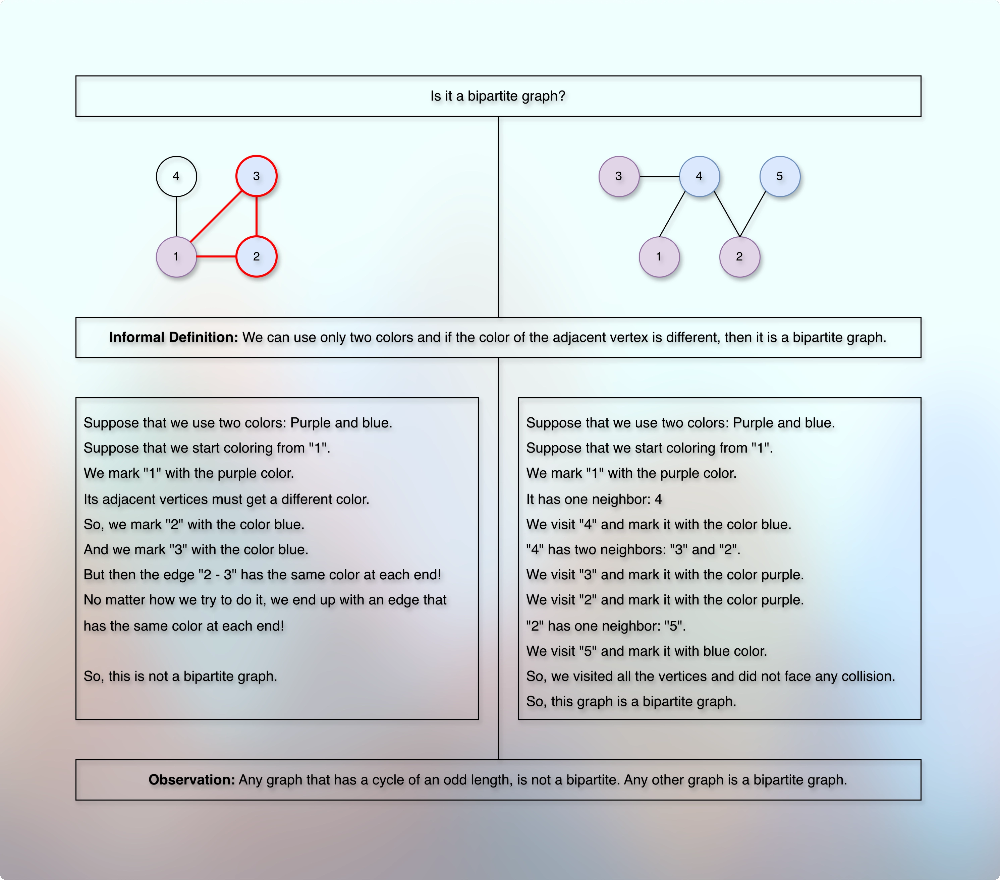

# Is it a bipartite graph?

## Prerequisites

* [Basic Introduction.md](../../module01decompositionOfGraph01/010lectures/010basicIntroduction.md)
* [Simple Graph Ops.md](../../module01decompositionOfGraph01/010lectures/012simpleGraphOps.md)
* [Exploring Graph Traversal.md](../../module01decompositionOfGraph01/010lectures/020exploringGraphTraversal.md)
* [Bfs Graph Traversal.md](../../module01decompositionOfGraph01/010lectures/023bfsGraphTraversal.md)
* [Dfs Graph Traversal.md](../../module01decompositionOfGraph01/010lectures/026dfsGraphTraversal.md)
* [Cycle Detection In Graph Using Dfs.md](../../module01decompositionOfGraph01/010lectures/028cycleDetectionInGraphUsingDfs.md)
* [Cycle Detection In Graph Using Bfs.md](../../module01decompositionOfGraph01/010lectures/030cycleDetectionInGraphUsingBfs.md)
* [Number Of Islands.md](../../module01decompositionOfGraph01/010lectures/032numberOfIslands.md)
* [Connectivity.md](../../module01decompositionOfGraph01/010lectures/035connectivity.md)
* [PreVisit And PostVisit Time.md](../../module01decompositionOfGraph01/010lectures/037preVisitAndPostVisitTime.md)
* [Directed Acyclic Graph Intro.md](../../module02decompositionOfGraph02/010lectures/010directedAcyclicGraphIntro.md)
* [Topological Sort On Dag.md](../../module02decompositionOfGraph02/010lectures/020topologicalSortOnDag.md)
* [Strongly Connected Components.md](../../module02decompositionOfGraph02/010lectures/030stronglyConnectedComponents.md)
* [Counting Strongly Connected Components.md](../../module02decompositionOfGraph02/010lectures/040countingStronglyConnectedComponents.md)
* [Detect Cycle In Directed Graph.md](../../module02decompositionOfGraph02/020assignment/010detectCycleInDirectedGraph.md)
* [Topological Sort In Directed Graph.md](../../module02decompositionOfGraph02/020assignment/020topologicalSortInDirectedGraph.md)
* [Count Strongly Connected Components.md](../../module02decompositionOfGraph02/020assignment/030countStronglyConnectedComponents.md)
* [Path, Distance, And Levels Intro.md](../010lectures/010pathDistanceAndLevelsIntro.md)
* [Shortest Path.md](../010lectures/020shortestPath.md)

# Checking whether a Graph is Bipartite

## Problem Introduction

* An undirected graph is called bipartite if its vertices can be split into two parts such that each edge of the graph joins to vertices from different parts. 
* Bipartite graphs arise naturally in applications where a graph is used to model connections between objects of two different types (say, boys and girls; or students and
dormitories).
* An alternative definition is the following: a graph is bipartite if its vertices can be colored with two colors (say, black and white) such that the endpoints of each edge have different colors.

## Problem Description

### Task 

* Given an undirected graph with 𝑛 vertices and 𝑚 edges, check whether it is bipartite.

### Input Format 

* A graph is given in the standard format.

### Constraints 

$$
1 ≤ 𝑛 ≤ 10^5, 
0 ≤ 𝑚 ≤ 10^5.
$$

### Output Format 

* Output 1 if the graph is bipartite and 0 otherwise.

### Time Limits

```markdown

| language  | C | C++ | Java | Python | C#  | Haskell | JavaScript | Ruby | Scale |
|-----------|---|-----|------|--------|-----|---------|------------|------|-------|
| time(sec) | 2 | 2   |  3   | 10     | 3   | 4       | 10         | 10   | 6     |

```

### Memory Limit

* 512 MB

## Samples

### Sample 1

**Input**

```markdown
4 4
1 2
4 1
2 3
3 1
```

**Output**

```markdown
0
```

**Explanation**

* 

* This graph is not bipartite. 
* To see this assume that the vertex 1 is colored white. 
* Then the vertices 2 and 3 should be colored black since the graph contains the edges {1, 2} and {1, 3}. 
* But then the edge {2, 3} has both endpoints of the same color.

### Sample 2

**Input**

```markdown
5 4
5 2
4 2
3 4
1 4
```

**Output**

```markdown
1
```

**Explanation**

* 

* This graph is bipartite: assign the vertices 4 and 5 the white color, assign all the remaining vertices the black color.

## Concept, Thought Process

**References**

* [codestorywithMIK](https://youtu.be/NeU-C1PTWB8?si=iC7isb8SjbY-T91N)
* [wrathOfMath](https://youtu.be/HqlUbSA9cEY?si=5ZD-ZT99Jrd3c70h)
* [WilliamFiscet](https://youtu.be/GhjwOiJ4SqU?si=TYdADsMkZk29kKWb)
* [NeetCodeIO](https://youtu.be/mev55LTubBY?si=LHOn3vx1dMKGfuKU)

* 

* 

* 

* 

**Informal Definition**

* If we use only two colors, then any graph where the color of the adjacent (neighbor) vertex is different, it is a bipartite graph.
* We can divide such a bipartite graph into exactly two groups.

**Observation**

* Any graph that has a cycle with an odd length, cannot be a bipartite graph.
* Any other graph is a bipartite graph.
* Any edge of such a bipartite graph gets the vertex of different colors at each end.
* In a bipartite graph, the vertices of the same group do not connect with each other.
* In other words, they don't fight or compete with each other.
* They strictly connect with the vertices of the opposite group only.
* In other words, they compete with the vertices of the opposite group only.
* In a bipartite graph, we don't get a vertex which is connected with both the groups.

## Coding

* How do we write and implement the actual code?
* How do we convert and model the explanation, concept, intuition into the code?
* We need to cover the entire graph.
* So, we can use DFS or BFS.
* We will use DFS.
* We need to ensure that the neighbor vertex gets a different color.
* So, we need to track (store, read, write, update, use) vertex color.
* Initially, all the vertices get some default color value.
* The default value will also help us determine whether the vertex is already visited.
* It means that we can replace the `visited BooleanArray` with the `color array`.
* So, the function parameters will be: `vertex, colors`. 
* We also need to determine which color a vertex should get.
* Basically, each vertex gets a different color than the neighbor vertex.
* We can pass this information every time we start exploring a particular vertex.
* It means that we will pass the color that we want to apply to the vertex that we are about to explore.
* So, the function parameters become: `vertex, colors, color`.
* And we already know from the [Prerequisites](#prerequisites) section that when we get the neighbors, how we get the neighbors, and now we also know what we do with the neighbor.
* We pass the neighbor with the color different from the parent/previous vertex.
* So, the code will look something like below:

```kotlin

fun isBipartite(): Boolean {
    // Two colors: 0 and 1 with the default value -1
    val colors = IntArray(vertices) { -1 }
    for (vertex in adjacencyList.indices) {
        if (colors[vertex] == -1) {
            // Do not ignore the result of the below function.
            // If it says that the graph is not bipartite, accept it.
            if (isBipartiteDfs(vertex, colors, 1) == false) {
                return false
            }
        }
    }
    // We successfully explored and colored the entire graph without any collisions.
    // The graph is a bipartite graph.
    return true
}

private fun isBipartiteDfs(vertex: Int, colors: IntArray, color: Int): Boolean {
    colors[vertex] = color
    val neighbors = adjacencyList[vertex]
    neighbors.forEach {
        if (colors[it] == -1) {
            // If the parent color is 1, then the neighbor color will be: 1 - 1 = 0
            // If the parent color is 0, then the neighbor color will be: 1 - 0 = 1
            // Magic (trick)!
            val neighborColor = 1 - color
            // Do not ignore the result of any exploration.
            // If a particular exploration says that it is not a bipartite graph, accept it.
            if (isBipartiteDfs(it, colors, neighborColor) == false) {
                return false
            }
        } else if (colors[it] == color) {
            // If the neighbor is already colored with the same color of its parent/previous vertex, this cannot be a bipartite graph.
            return false
        }
    }
    // If the exploration did not face any collisions, it is a bipartite graph.
    return true
}

```

## Time Complexity

* A normal DFS Traversal only.
* So, it is: `O(V + E)`.

## Space Complexity

* The color array: `O(V)`.
* The call stack: `O(V)`.
* So, it is: `O(V)`.

## Implementation

* 

## Next