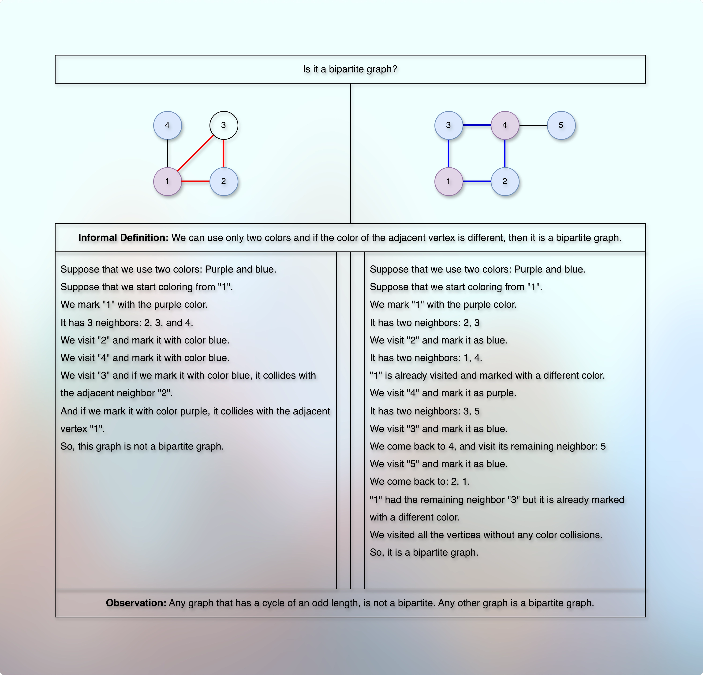
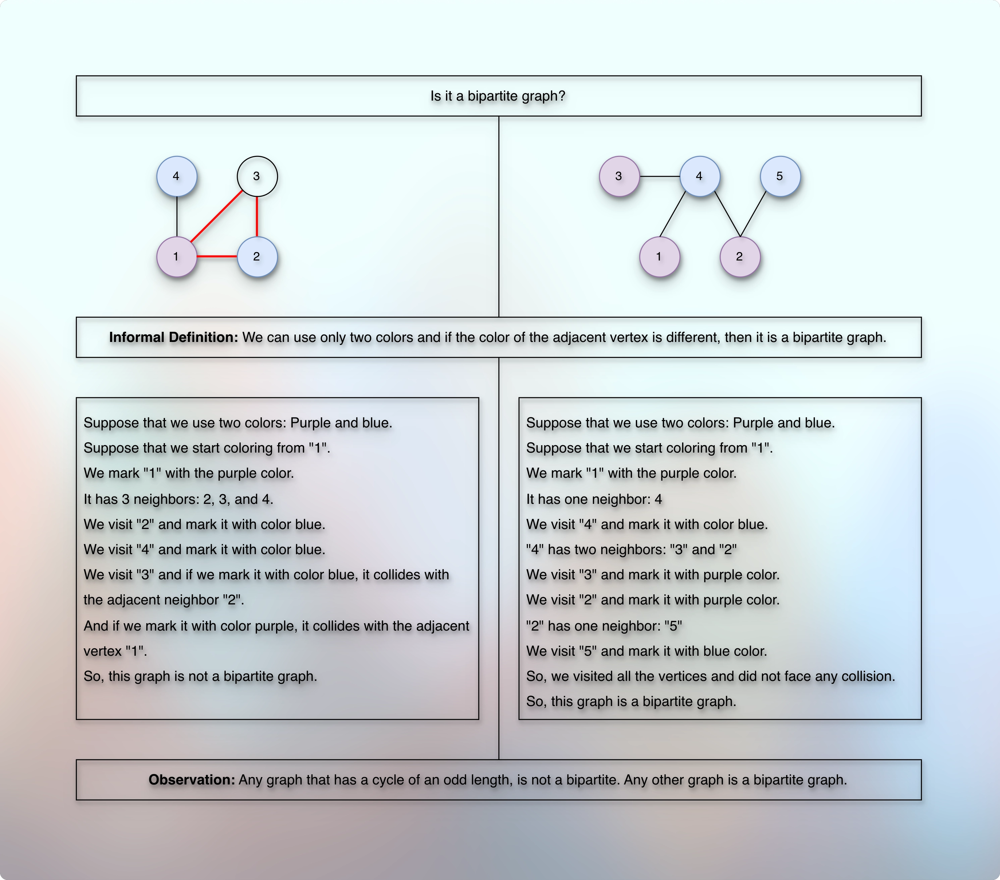
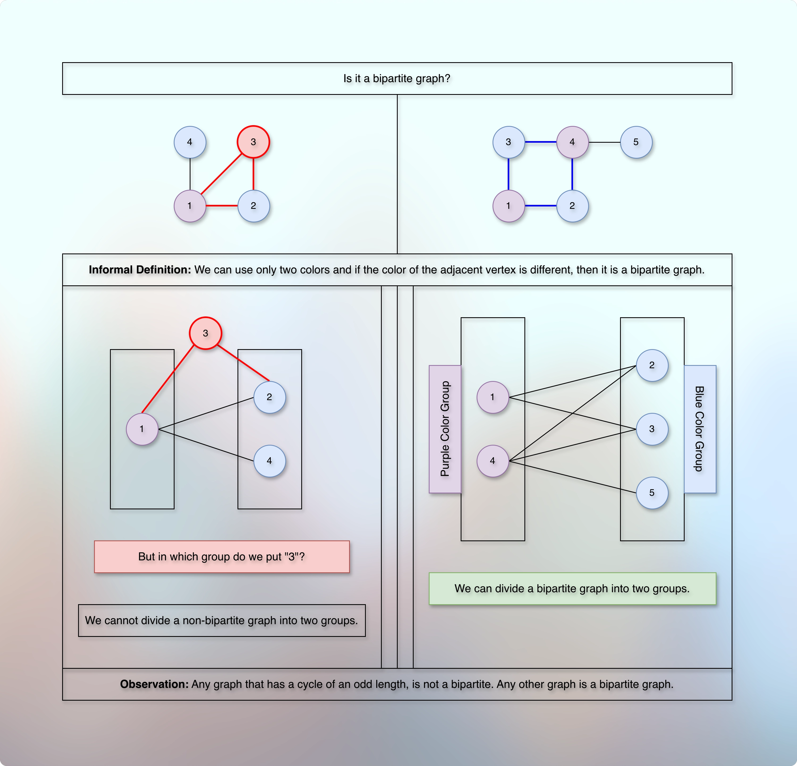
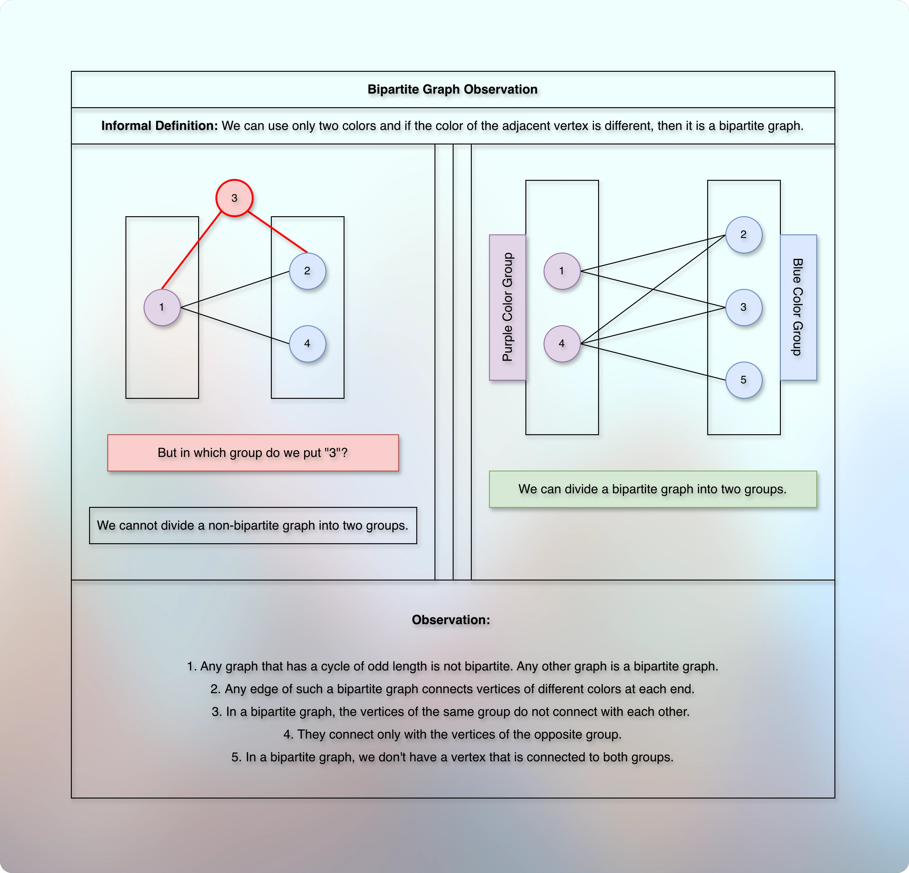

# Is it a bipartite graph?

## Prerequisites

* [Basic Introduction.md](../../module01decompositionOfGraph01/010lectures/010basicIntroduction.md)
* [Simple Graph Ops.md](../../module01decompositionOfGraph01/010lectures/012simpleGraphOps.md)
* [Exploring Graph Traversal.md](../../module01decompositionOfGraph01/010lectures/020exploringGraphTraversal.md)
* [Bfs Graph Traversal.md](../../module01decompositionOfGraph01/010lectures/023bfsGraphTraversal.md)
* [Dfs Graph Traversal.md](../../module01decompositionOfGraph01/010lectures/026dfsGraphTraversal.md)
* [Cycle Detection In Graph Using Dfs.md](../../module01decompositionOfGraph01/010lectures/028cycleDetectionInGraphUsingDfs.md)
* [Cycle Detection In Graph Using Bfs.md](../../module01decompositionOfGraph01/010lectures/030cycleDetectionInGraphUsingBfs.md)
* [Number Of Islands.md](../../module01decompositionOfGraph01/010lectures/032numberOfIslands.md)
* [Connectivity.md](../../module01decompositionOfGraph01/010lectures/035connectivity.md)
* [PreVisit And PostVisit Time.md](../../module01decompositionOfGraph01/010lectures/037preVisitAndPostVisitTime.md)
* [Directed Acyclic Graph Intro.md](../../module02decompositionOfGraph02/010lectures/010directedAcyclicGraphIntro.md)
* [Topological Sort On Dag.md](../../module02decompositionOfGraph02/010lectures/020topologicalSortOnDag.md)
* [Strongly Connected Components.md](../../module02decompositionOfGraph02/010lectures/030stronglyConnectedComponents.md)
* [Counting Strongly Connected Components.md](../../module02decompositionOfGraph02/010lectures/040countingStronglyConnectedComponents.md)
* [Detect Cycle In Directed Graph.md](../../module02decompositionOfGraph02/020assignment/010detectCycleInDirectedGraph.md)
* [Topological Sort In Directed Graph.md](../../module02decompositionOfGraph02/020assignment/020topologicalSortInDirectedGraph.md)
* [Count Strongly Connected Components.md](../../module02decompositionOfGraph02/020assignment/030countStronglyConnectedComponents.md)
* [Path, Distance, And Levels Intro.md](../010lectures/010pathDistanceAndLevelsIntro.md)
* [Shortest Path.md](../010lectures/020shortestPath.md)

# Checking whether a Graph is Bipartite

## Problem Introduction

* An undirected graph is called bipartite if its vertices can be split into two parts such that each edge of the graph joins to vertices from different parts. 
* Bipartite graphs arise naturally in applications where a graph is used to model connections between objects of two different types (say, boys and girls; or students and
dormitories).
* An alternative definition is the following: a graph is bipartite if its vertices can be colored with two colors (say, black and white) such that the endpoints of each edge have different colors.

## Problem Description

### Task 

* Given an undirected graph with 𝑛 vertices and 𝑚 edges, check whether it is bipartite.

### Input Format 

* A graph is given in the standard format.

### Constraints 

$$
1 ≤ 𝑛 ≤ 10^5, 
0 ≤ 𝑚 ≤ 10^5.
$$

### Output Format 

* Output 1 if the graph is bipartite and 0 otherwise.

### Time Limits

```markdown

| language  | C | C++ | Java | Python | C#  | Haskell | JavaScript | Ruby | Scale |
|-----------|---|-----|------|--------|-----|---------|------------|------|-------|
| time(sec) | 2 | 2   |  3   | 10     | 3   | 4       | 10         | 10   | 6     |

```

### Memory Limit

* 512 MB

## Samples

### Sample 1

**Input**

```markdown
4 4
1 2
4 1
2 3
3 1
```
### Output

```markdown
0
```

### Explanation

**References**

* [codestorywithMIK](https://youtu.be/NeU-C1PTWB8?si=iC7isb8SjbY-T91N)
* [wrathOfMath](https://youtu.be/HqlUbSA9cEY?si=5ZD-ZT99Jrd3c70h)
* [WilliamFiscet](https://youtu.be/GhjwOiJ4SqU?si=TYdADsMkZk29kKWb)
* [NeetCodeIO](https://youtu.be/mev55LTubBY?si=LHOn3vx1dMKGfuKU)

* 

* 

* 

* 

**Informal Definition**

* If we use only two colors, then any graph where the color of the adjacent (neighbor) vertex is different, it is a bipartite graph.
* We can divide such a bipartite graph into exactly two groups.

**Observation**

* Any graph that has a cycle with an odd length, cannot be a bipartite graph.
* Any other graph is a bipartite graph.
* Any edge of such a bipartite graph gets the vertex of different colors at each end.
* In a bipartite graph, the vertices of the same group do not connect with each other.
* In other words, they don't fight or compete with each other.
* They strictly connect with the vertices of the opposite group only.
* In other words, they compete with the vertices of the opposite group only.
* In a bipartite graph, we don't get a vertex which is connected with both the groups.

## Implementation

* 

## Next