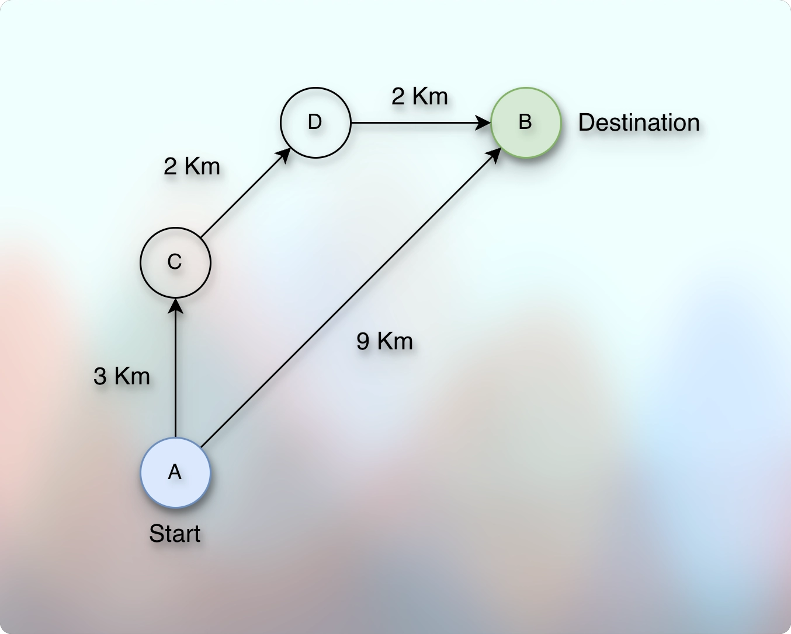
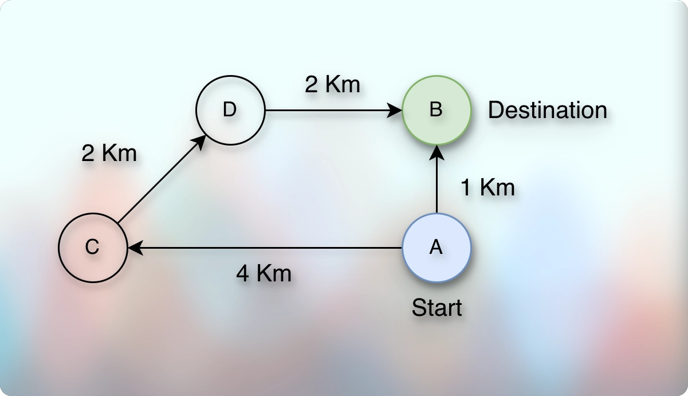
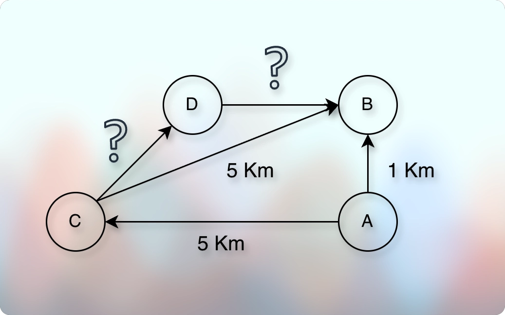

# Fastest Route (Foundation of Dijkstra's Algorithm)

## Prerequisites

* [Basic Introduction.md](../../module01decompositionOfGraph01/010lectures/010basicIntroduction.md)
* [Simple Graph Ops.md](../../module01decompositionOfGraph01/010lectures/012simpleGraphOps.md)
* [Exploring Graph Traversal.md](../../module01decompositionOfGraph01/010lectures/020exploringGraphTraversal.md)
* [Bfs Graph Traversal.md](../../module01decompositionOfGraph01/010lectures/023bfsGraphTraversal.md)
* [Dfs Graph Traversal.md](../../module01decompositionOfGraph01/010lectures/026dfsGraphTraversal.md)
* [Cycle Detection In Graph Using Dfs.md](../../module01decompositionOfGraph01/010lectures/028cycleDetectionInGraphUsingDfs.md)
* [Cycle Detection In Graph Using Bfs.md](../../module01decompositionOfGraph01/010lectures/030cycleDetectionInGraphUsingBfs.md)
* [Number Of Islands.md](../../module01decompositionOfGraph01/010lectures/032numberOfIslands.md)
* [Connectivity.md](../../module01decompositionOfGraph01/010lectures/035connectivity.md)
* [PreVisit And PostVisit Time.md](../../module01decompositionOfGraph01/010lectures/037preVisitAndPostVisitTime.md)
* [Directed Acyclic Graph Intro.md](../../module02decompositionOfGraph02/010lectures/010directedAcyclicGraphIntro.md)
* [Topological Sort On Dag.md](../../module02decompositionOfGraph02/010lectures/020topologicalSortOnDag.md)
* [Strongly Connected Components.md](../../module02decompositionOfGraph02/010lectures/030stronglyConnectedComponents.md)
* [Counting Strongly Connected Components.md](../../module02decompositionOfGraph02/010lectures/040countingStronglyConnectedComponents.md)
* [Detect Cycle In Directed Graph.md](../../module02decompositionOfGraph02/020assignment/010detectCycleInDirectedGraph.md)
* [Topological Sort In Directed Graph.md](../../module02decompositionOfGraph02/020assignment/020topologicalSortInDirectedGraph.md)
* [Count Strongly Connected Components.md](../../module02decompositionOfGraph02/020assignment/030countStronglyConnectedComponents.md)
* [Path, Distance, And Levels Intro.md](../010lectures/010pathDistanceAndLevelsIntro.md)
* [Shortest Path.md](../010lectures/020shortestPath.md)
* [Minimum Numbers Of Flight Segments.md](../../module03pathsInGraph01/020assignment/010computingTheMinimumNumberOfFlightSegments.md)

## Context

* So far, from the previous lectures, we have learned to find the shortest path from A to B.
* However, we defined the shortest path in terms of edges.
* But there can be a condition where a direct path is actually longer than the subroutines.
* For example:

* 

* It means that it is not necessary that the shortest path is the fastest path if the definition of the shortest path still holds, which depends on the number of edges.
* However, it can be the other way around as well.
* So, it is also possible that the path with a fewer edges is indeed the shortest path.

* 

* So, whether the path is the shortest or not really depends on the weight of the edges.
* Here, the weight is in the sense of some value.
* It can represent distance, time, or anything.
* All the edges represent the same measurement unit or measurement family or context.
* And each value is positive.
* For example, we might want to convey how much time we will take to travel from A to B or what will be the total distance between A and B.
* So, we don't want these values to be negative.
* This is known as the case where edges have non-negative weights (values).
* Sometimes we use these terms interchangeably: weights, length, distance, values.
---
* It means that we need to know the edge weight to determine the shortest path.
* For example:

* 

* As shown in the image above, we cannot determine if the distance between C to B is the shortest distance.
* Because we don't know the total distance of the subroutines for which we don't know the weights yet.
* For example, if the distance between C to D is 2 Km and D to B is also 2 Km, then this subroutine, from C to B via D is actually the shortest path.
* But it could be the case that the distance between C to D is 3 Km and D to B is also 3 Km, then the distance from C to B is indeed the shortest path.
* It means that we need to know the weight of the edges to determine the shortest path.
---
* However, we don't always need to know the weight of all the edges to determine the shortest path.

* 

* For example, we know that the distance between A to B is 1 Km. 
* Now, even though we don't know the distance between C → D → B, (which are the parts of the subroutine A → C → D → B), we are sure that it cannot be shorter than the direct path A → B.
* And we could say it deterministic because we know the distance between A and C is already higher than the direct distance between A and B.
* It means that any subroutine that starts from A and reaches B via C must be longer than the direct path from A to B.
* This highlights the importance of knowing the adjacent vertices.
* So, knowing the adjacent distance is still helpful.
---
* Notice the shift in the perspective compared to the graph lessons we have learned so far.
* Here, we are not talking about minimum transfers while going from A to B.
* We are not talking about the minimum number of edges to reach from A to B.
* We are talking about the distance or time to reach from A to B.
* We are talking about the fastest path to reach from A to B.
* The number of edges or transfers it take does not matter for the goal. 
* It can take more or fewer edges or transfers, but it does not matter for the goal.
* The goal does not primarily depend on the number of edges at all.
* The primary focus is on the weights of the edges.

## Dijkstra's Algorithm

* When we have edges with non-negative weights, we use the Dijkstra's Algorithm to determine the shortest (and fastest) path. 