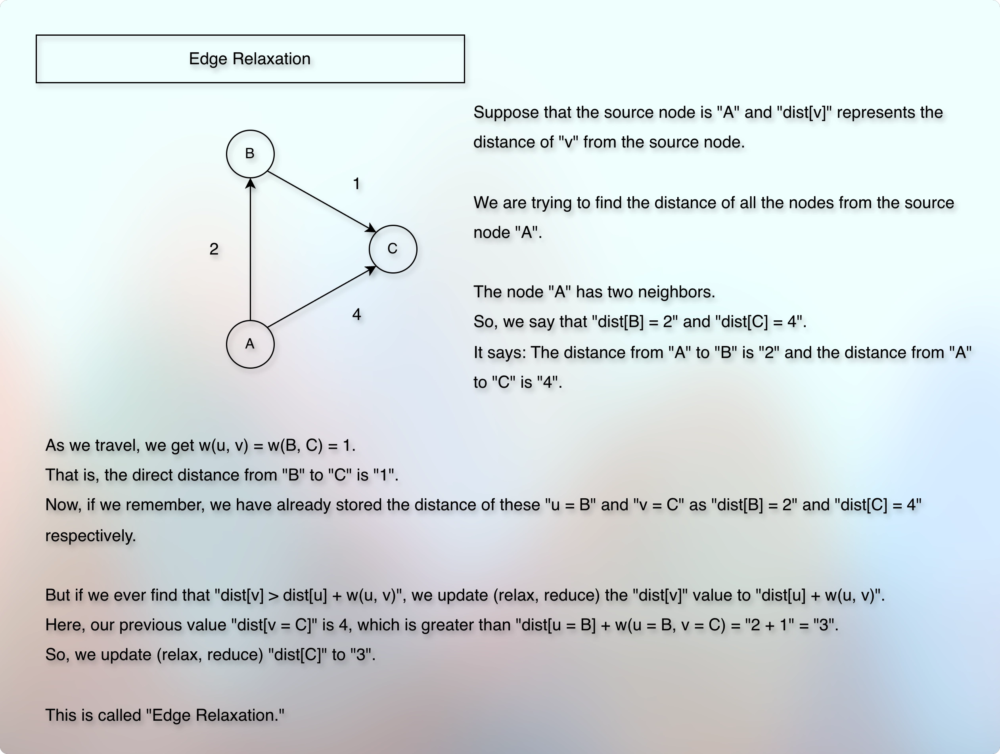

# Edge Relaxation

## Prerequisites

* [Basic Introduction.md](../../module01decompositionOfGraph01/010lectures/010basicIntroduction.md)
* [Simple Graph Ops.md](../../module01decompositionOfGraph01/010lectures/012simpleGraphOps.md)
* [Exploring Graph Traversal.md](../../module01decompositionOfGraph01/010lectures/020exploringGraphTraversal.md)
* [Bfs Graph Traversal.md](../../module01decompositionOfGraph01/010lectures/023bfsGraphTraversal.md)
* [Dfs Graph Traversal.md](../../module01decompositionOfGraph01/010lectures/026dfsGraphTraversal.md)
* [Cycle Detection In Graph Using Dfs.md](../../module01decompositionOfGraph01/010lectures/028cycleDetectionInGraphUsingDfs.md)
* [Cycle Detection In Graph Using Bfs.md](../../module01decompositionOfGraph01/010lectures/030cycleDetectionInGraphUsingBfs.md)
* [Number Of Islands.md](../../module01decompositionOfGraph01/010lectures/032numberOfIslands.md)
* [Connectivity.md](../../module01decompositionOfGraph01/010lectures/035connectivity.md)
* [PreVisit And PostVisit Time.md](../../module01decompositionOfGraph01/010lectures/037preVisitAndPostVisitTime.md)
* [Directed Acyclic Graph Intro.md](../../module02decompositionOfGraph02/010lectures/010directedAcyclicGraphIntro.md)
* [Topological Sort On Dag.md](../../module02decompositionOfGraph02/010lectures/020topologicalSortOnDag.md)
* [Strongly Connected Components.md](../../module02decompositionOfGraph02/010lectures/030stronglyConnectedComponents.md)
* [Counting Strongly Connected Components.md](../../module02decompositionOfGraph02/010lectures/040countingStronglyConnectedComponents.md)
* [Detect Cycle In Directed Graph.md](../../module02decompositionOfGraph02/020assignment/010detectCycleInDirectedGraph.md)
* [Topological Sort In Directed Graph.md](../../module02decompositionOfGraph02/020assignment/020topologicalSortInDirectedGraph.md)
* [Count Strongly Connected Components.md](../../module02decompositionOfGraph02/020assignment/030countStronglyConnectedComponents.md)
* [Path, Distance, And Levels Intro.md](../010lectures/010pathDistanceAndLevelsIntro.md)
* [Shortest Path.md](../010lectures/020shortestPath.md)
* [Minimum Numbers Of Flight Segments.md](../../module03pathsInGraph01/020assignment/010computingTheMinimumNumberOfFlightSegments.md)
* [Fastest Route.md](010fastestRoute.md)

## Concept

* 
* Suppose that we have given the below edges and weights.

```markdown
A → B = 2
A → C = 4
B → C = 1
```

* We want to find the shortest distance from A → C.
* Now, suppose that there is a direct edge between U → C.
* If we know the shortest distance from A → U, then we also find the shortest distance from A → C.
* Because then, it will be: `dist(A, C) = dis(A, U) + w(U, C)`.
* Now, there can be many vertices between A and C.
* And these vertices don't have to be connected in a linear fashion.
* They form a complex graph.
* The idea is, if we know the shortest distance for each vertex, we can ultimately find the shortest distance from A → C.
* So, how do we find the shortest distance for each vertex?
---
* We start with the source node.
* Suppose, we want to find the distance of all the other nodes from "A".
* Then, "A" is the source node.
* Initially, we don't know the distance of any other node except "A" - the source node itself.
* The distance from "A" to "A" is "0".
* So, we store this information to a `dist` array.
* The size of this `dist` array is equal to the given vertices.
* Because we are going to store the distance of each vertex.
* And we will be using the direct addressing method.
---
* We want to cover each vertex.
* But this is not simply about covering each vertex.
* This is about finding the shortest path (and not just any path) for each vertex.
---
* Does the order in which we explore the vertices matter?
* Do we have any particular pattern for that? Why? How does it help?
---
* So, mainly, the edge relaxation includes two things:
  * Reduce the stored distance whenever we find a shorter distance
  * Choose the next unexplored vertex that has the smallest distance so far

## Next

* 