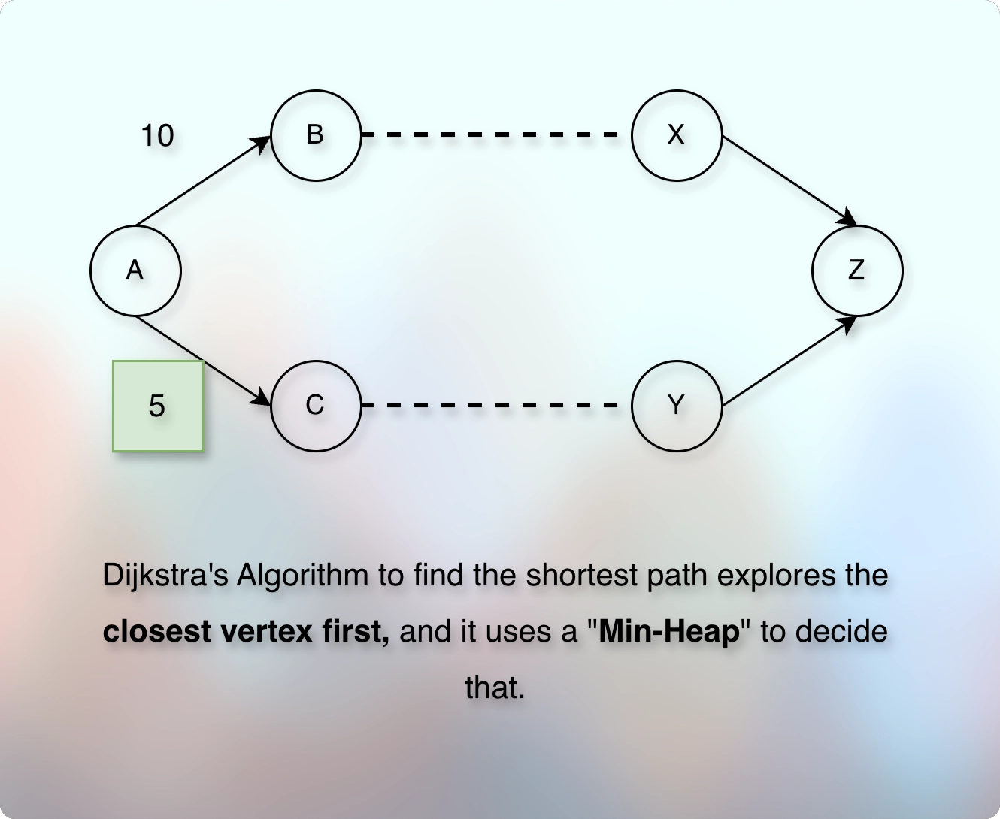

# Dijkstra's Algorithm

## Prerequisites

* [Edge Relaxation.md](020edgeRelaxation.md)

## References

* [Spanning Tree](https://youtu.be/EFg3u_E6eHU?si=9LMk9KDV1Xl8Z264)
* [Abdul Bari Sir](https://youtu.be/XB4MIexjvY0?si=D_Z_2n7Z3nlacc6D)
* [Computerphile - Using paper cards. I love this approach.](https://youtu.be/GazC3A4OQTE?si=lsnTPVUU55cF_Oh4)

## Concept

* Suppose that we have the following graph:
* 
* We want to find the shortest distance from A → D.
* Node "A" is our source node and node "D" is our destination node.
* If there were only two nodes, A and D, and if there was a direct edge from A to D, we would have taken the edge weight and concluded it as the shortest path.
* But here, we have many nodes and there are more than one possible routes (subpaths, sidepaths) from A to D.
* So, we want to try them all and then declare the final shortest path.
* But if we try each route one by one, we would re-visit many nodes and path along the way.
* And it will be very inefficient.
* So, we break this large problem into a smaller problem.
* We focus on the neighbors first because there is a direct edge for them.
* And we repeat this for each neighbor.
* But we still need to store the distance information.
* So, we take the `dist` array.
* Ultimately, we are going to store the distance of each vertex.
* So, the size of the `dist` array will be equal to the total number of `vertices`.
* Initially, we don't know the distance of any node.
* So, by default the value for each vertex will be `MAX_VALUE` in the `dist`.
* However, we know the distance of the source node "A" from "A", which is "0".
* So, it becomes `dist[A] = 0`.
* Also, similar to the [Shortest Path.md](../../module03pathsInGraph01/010lectures/020shortestPath.md) problem, we need a `prev` array to reconstruct the path back from the destination to the source node and then reverse it to get the actual path.
* So, we will take a `prev` array.
* And the size of this `prev` array will also be equal to the total number of `vertices`.
* Because we are going to store the **previous vertex** information for each vertex we visit.
* Initially, the default value in the `prev` array can be `-1`. 
---
* Now, we start with the source node, "A".
* Node "A" is our current node.
* We are standing at the node "A".
---
* What is the shortest known distance of "A" from "A"?
* It is `dist[A] = 0`.
* Who are the neighbors (having direct edge with the current node "A")?
* The neighbors are: B and C.
* Currently, `dist[B] = MAX_VALUE` and `dist[C] = MAX_VALUE`.
* However, the distance from the direct edge between A → B is `4`.
* It means that we have found a shorter distance than the currently known distance of B.
* So, we update (reduce) the shortest known distance of B.
* So, it becomes `dist[B] = 4`.
* And we also update the `prev` array.
* So, `prev[B] = A`.
* Together, the `dist` and the `prev` arrays indicate that the shortest path to B is via A, and it is 4.
* Now, we check the next neighbor of A.
* Currently, `dist[C] = MAX_VALUE`.
* But the distance from the direct edge from A → C is `1`.
* It means that we have found a shorter distance than the currently known distance of C.
* So, we update (reduce) the shortest known distance of C.
* So, it becomes `dist[C] = 1`.
* And we also update the `prev` array.
* So, `prev[C] = A`.
* Together, the `dist` and the `prev` arrays indicate that the shortest path to C is via A, and it is 1.
* Alright. We are done for the node "A". We checked its neighbors.
* Now, we explore the next vertex.
* But which vertex will we pick up first between B and C?
---
* 
* As shown in the image, we know that the distance between A → B is 10.
* And we know that the distance between A → C is 5.
* We don't know anything else, yet.
* We want to find the shortest distance from A → Z.
* We have two options:
* Either we can first explore the path that goes via B, or we can first explore the path that goes via C.
* The general intuition (inclination) is first to try (explore) the path that goes via C.
* Because it is already shorter.
* It doesn't always end-up causing the shortest path.
* But that is what Dijkstra had used to find the shortest path.
* And when we are asked to represent the Dijkstra's Algorithm to find the shortest path, we use the same original approach.
* We don't modify it.
* And to decide which vertex is the closest one from the source node, he used a `min-heap`.
* So, we will use a `min-heap` to decide and process the closest vertex first.
---
* So, in our example, we will first explore `C` compared to `B`.
* Because `C` is the closest vertex to the source node than `B`.
* Ok. So now, our current node is C. 
* We repeat the same process that we did for the vertex, A.
* The node C has two neighbors: B and D.
* Now comes the interesting part.
* We are going to use the [Edge Relaxation.md](020edgeRelaxation.md).
* We know that `dist[C] = 1`.
* And `dist[B] = 4`.
* But the distance from the direct edge from C to B is `2` only.
* It means that, A to C is `1` and C to B is `2`.
* So, the total distance from A to B via C is 1 + 2 = `3`, which is smaller than the current `dist[B]`.
* It means that we have found a better (shorter, smaller) path to reach B.
* If we represent the shortest distance from A to B as `dist[B]`, the shortest distance from A to C as `dist[C]`, and the distance from the direct edge between C and B as `w(C, B)`, then:
* `dist[B] > dist[C] + w(C, B)`.
* Whenever this happens, we update (reduce) the larger distance with the shorter distance we have just found.
* So, it becomes:
* 
```kotlin
if (dist[B] > dist[C] + weight(C, B)) {
    dist[B] = dist[C] + weight(C, B)
}
```
* So now, `dist[B]` is `3`.
* And with this, we also update the `prev` array.
* Now, the shortest path to B goes through C.
* So, `prev[B] = C`.
* Together, `dist` and `prev` indicate that the shortest distance from A to B is `3` and it goes through `C`.
* And then, we have another remaining neighbor of C, which is D.
* Currently, `dist[D]` is `MAX_VALUE`.
* But if we go through C, it is `dist[C] + weight(C, D)`.
* So, it becomes: `dist[D] = 1 + 5 = 6`.
* And this path goes through, C.
* So, we also update `prev[D] = C`.
* Together, `dist` and `prev` indicate that the shortest distance from A to D is `6` and it goes through `C`.
* And with this, we are done with C.
* Next, we explore the remaining neighbor of A, which is B.
---
* The node B has one neighbor, D.
* Currently, `dist[D]` is `6` via C.
* But the distance of the direct edge from B to D is `1`.
* And `dist[B]` is `3`.
* Together, it makes `dist[D] > dist[B] + weight(B, D)`.
* Because, `6 > 3 + 1`.
* So, we update (reduce) `dist[D]` to `dist[B] + weight(B, D)` = `3 + 1` = `4`.
* And this path goes through B.
* So, we also update the `prev[D] = B`.
* Together, `dist` and `prev` indicate that the shortest distance to reach D is `4`, and it goes via `B`.
---
* We have finished exploring all the neighbors of the node B.  
---
* Next, it is node D.
* Node D is the destination node.
---
* Now, we know that the shortest distance from A to D is 4, and it goes via B.
* But, we also need to reconstruct the path.
* So, we use the same technique we have used in the: [Shortest Path.md](../../module03pathsInGraph01/010lectures/020shortestPath.md).
* So, the shortest path from A to D is: ACBD, and the distance is 4.
---

---
* We follow the greedy approach and repeat the edge relaxation process.
* For example, suppose we have the below graph.
* We want to find the shortest path between A and V.
* We start with the source node, "A".
* We check the direct edges and try to relax them.
* Then, the vertex with the shortest distance becomes the source.
* And we repeat the process until we reach the destination.
---
* And to remember the distance for each vertex, we store the distance information.
* To store the distance information, we take the `dist` array.
* The size of the `dist` array will be equal to the total `vertices`.
---
* Recall the syntax of the edge relaxation.
* `dist[v]` represents the shortest known distance of node `v` from the source node.
* `w(u, v)` represents the direct edge weight between the node `u` and `v`.
---
* Now, when we start the process, the only thing that we know is the distance from the start node to the destination node.
* So, if the source node is `A`, then `dist[A] = 0`.
* And by default, all the other nodes get the distance `MAX_VALUE`.
* We start with the neighbor nodes of the source.
* Let us assume that the neighbor node is `B` and `C`.
* Remember that by default, `dist[B] = MAX_VALUE` and `dist[C] = MAX_VALUE`.
* But as we travel from the source node to the neighbor node via the provided edge and weight, we get some weight value.
* For example, suppose we travel from A to B.
* And assume that the given weight from A to B is `4`.
* It means that we have a smaller value than the previous value of `dist[B]`.
* Earlier, `dist[B]` was `MAX_VALUE`, and now it is `4`.
* So, we update the `dist[B]` to `4`.
* It represents that the shortest known path to reach B from A is `4`.
---
* If we notice, the entire algorithm is based on:
* What is the shortest path to reach from the source node to the next node (and not directly the original destination node)?
* We reduced the problem into the smaller size.
* We solved the problem incrementally using the extremum.
* So, this algorithm is classified as the greedy algorithm.
---
* What is the concept of the known region in the Dijkstra's Algorithm?
---
* Why does it use a priority queue instead of a normal queue?
* To find the shortest path, we have to take the shortest path that is already known.
* It means that we always want to explore the nodes in the ascending order of their distance from the source node.
* And this is possible through the priority queue, as we can get the extremum (min or max) efficiently in `O(log n)` time.
* In a normal queue, if the queue has "BC", then it will process "B" first and then "C".
* It doesn't matter for the normal queue which distance is the shortest, which node is the closest to the source node. 
---
* Does Dijkstra's Algorithm use BFS?
* No. BFS uses a queue and a queue follows FIFO.
* Dijkstra's Algorithm uses min-heap.
---


## Next

* 