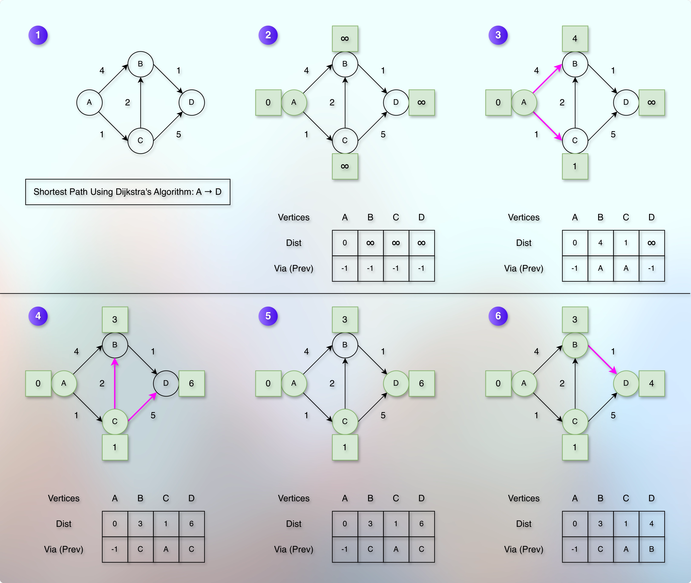
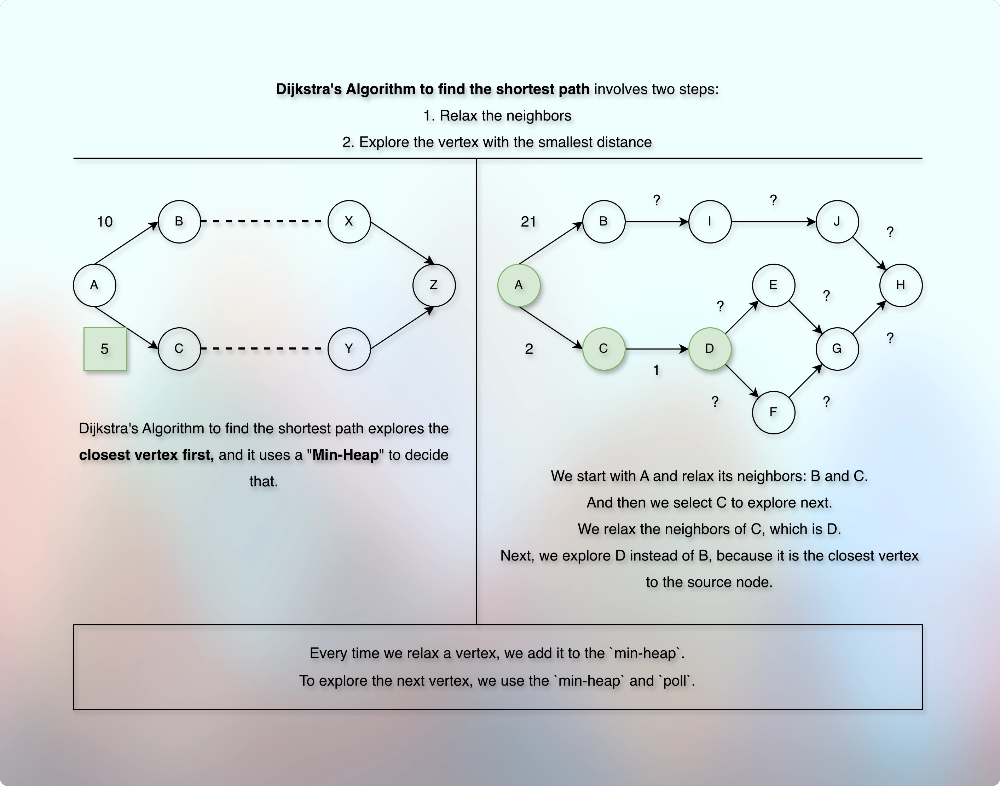
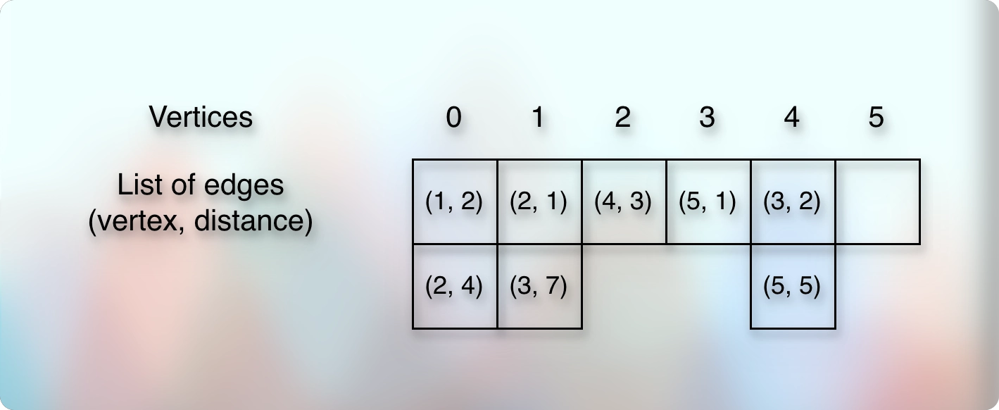

# Dijkstra's Algorithm

## Prerequisites

* [Edge Relaxation.md](020edgeRelaxation.md)

## References

* [Spanning Tree](https://youtu.be/EFg3u_E6eHU?si=9LMk9KDV1Xl8Z264)
* [Abdul Bari Sir](https://youtu.be/XB4MIexjvY0?si=D_Z_2n7Z3nlacc6D)
* [Computerphile - Using paper cards. I love this approach.](https://youtu.be/GazC3A4OQTE?si=lsnTPVUU55cF_Oh4)

## Concept

* Suppose that we have the following graph:
* 
* We want to find the shortest distance from A → D.
* Node "A" is our source node and node "D" is our destination node.
* If there were only two nodes, A and D, and if there was a direct edge from A to D, we would have taken the edge weight and concluded it as the shortest path.
* But here, we have many nodes and there are more than one possible routes (subpaths, sidepaths) from A to D.
* So, we want to try them all and then declare the final shortest path.
* But if we try each route one by one, we would re-visit many nodes and path along the way.
* And it will be very inefficient.
* So, we break this large problem into a smaller problem.
* We focus on the neighbors first because there is a direct edge for them.
* And by neighbors, we are talking about the vertices that are connected through the outgoing edges.
* For example, in the given image, the vertex A has two outgoing edges.
* So, we say that the vertex A has two neighbors.
* And we repeat this for each neighbor.
* But we still need to store the distance information.
* So, we take the `dist` array.
* Ultimately, we are going to store the distance of each vertex.
* So, the size of the `dist` array will be equal to the total number of `vertices`.
* Initially, we don't know the distance of any node.
* So, by default the value for each vertex will be `MAX_VALUE` in the `dist`.
* However, we know the distance of the source node "A" from "A", which is "0".
* So, it becomes `dist[A] = 0`.
* Also, similar to the [Shortest Path.md](../../module03pathsInGraph01/010lectures/020shortestPath.md) problem, we need a `prev` array to reconstruct the path back from the destination to the source node and then reverse it to get the actual path.
* So, we will take a `prev` array.
* And the size of this `prev` array will also be equal to the total number of `vertices`.
* Because we are going to store the **previous vertex** information for each vertex we visit.
* Initially, the default value in the `prev` array can be `-1`. 
---
* Now, we start with the source node, "A".
* Node "A" is our current node.
* We are standing at the node "A".
---
* What is the shortest known distance of "A" from "A"?
* It is `dist[A] = 0`.
* What are the outgoing edges of A?
* They are: A → B and A → C.
* Currently, `dist[B] = MAX_VALUE` and `dist[C] = MAX_VALUE`.
* However, the weight (distance) from the direct edge between A → B is `4`.
* The vertex A is the source node, and we just found that from A to B is `4`.
* It means that we have found a shorter distance than the currently known distance of B.
* So, we update (reduce) the shortest known distance of B.
* So, it becomes `dist[B] = 4`.
* This particular operation or process is known as the edge relaxation.
* Earlier, it was `dist[B] = MAX_VALUE`, then we found the shortest path from the source to B, so we updated `dist[B]` - This process or operation is known as the edge relaxation.
* Particularly, we relaxed one of the outgoing edge of the vertex A.
* And after the successful edge relaxation, we also update the `prev` array.
* So, `prev[B] = A`.
* Together, the `dist` and the `prev` arrays indicate that the shortest path to B is via A, and it is 4.
* After the successful edge relaxation, we add the vertex to the `min-heap`.
* Which vertex do we add? And what exactly do we add?
* What we found (discovered)?
* We discovered that `dist[B]` is no longer `MAX`, because we found a better (shorter, smaller) path.
* So, we add the vertex for which we found the shorter distance.
* In our example, at this moment, it is vertex B.
* And we add the distance (from the source node) along with it.
* So, we add: `(distance, vertex)` = `(4, B)` to `min-heap`.
---
> Now, the `min-heap` has: `(4, B)`.
---
* Now, we check the next outgoing edge of A.
* It is A → C, and the weight is `1`.
* Currently, `dist[C] = MAX_VALUE`.
* But the distance from the direct edge from A → C is `1`.
* The vertex A is the source node, and we just found that A → C is `1`.
* It means that we have found a shorter distance than the currently known distance of C.
* So, we update (reduce) the shortest known distance of C.
* So, it becomes `dist[C] = 1`.
* It is an edge relaxation.
* Because earlier it was `dist[C] = MAX_VALUE`, then we updated it to `dist[C] = 1`.
* We reduced the `dist[C]` because we found a better shortest path that is shorter than the `MAX_VALUE`.
* And after the successful edge relaxation, we also update the `prev` array.
* So, `prev[C] = A`.
* Together, the `dist` and the `prev` arrays indicate that the shortest path to C is via A, and it is 1.
* After a successful edge relaxation, we add the vertex to the `min-heap`.
* We have found a shorter distance for `C`.
* So, we add: `(1, C)` to the `min-heap`.
---
> It means that the `min-heap` has: `(1, C), (4, B)`.
---
* Notice that the `min-heap` keeps the vertex with the shortest known distance on top.
* This is the property of the `min-heap`.
* If it was a `max-heap`, it would have kept the vertex with the longest known distance on top.
* [Min Heap.md](../../../../../02dataStructures/courses/uc/module03priorityQueuesHeapsDisjointSets/section02priorityQueuesUsingHeaps/topic04buildBinaryHeap/020buildBinaryMinHeap.md)
* [Max Heap.md](../../../../../02dataStructures/courses/uc/module03priorityQueuesHeapsDisjointSets/section02priorityQueuesUsingHeaps/topic04buildBinaryHeap/010buildBinaryMaxHeap.md)
---
* Alright. We are done for the node "A". We checked all of its outgoing edges.
* Now, we explore the next vertex.
* But which vertex will we pick up first between B and C?
---
* 
* As shown in the image, we know that the distance between A → B is 10.
* And we know that the distance between A → C is 5.
* We don't know anything else, yet.
* We want to find the shortest distance from A → Z.
* We have two options:
* Either we can first explore the path that goes via B, or we can first explore the path that goes via C.
* The general intuition (inclination) is first to try (explore) the path that goes via C.
* Because it is already shorter.
* It doesn't always end-up causing the shortest path.
* But that is what Dijkstra had used to find the shortest path.
* And when we are asked to represent the Dijkstra's Algorithm to find the shortest path, we use the same original approach.
* We don't modify it.
* And to decide which vertex is the closest one from the source node, he used a `min-heap`.
* So, we will use a `min-heap` to decide and process the closest vertex first.
---
* Notice that this is neither BFS nor DFS.
* It uses two steps:
* Relax the edges + Select from the `min-heap`.
* Every time we relax an edge, we push (add, offer) it to the `min-heap`.
* What we add (push, offer)?
* When we relax an edge, it conveys that we found a new shorter distance for a vertex.
* Which vertex?
* The edge that we just relaxed and is going towards the vertex - going inside the vertex.
* In other words, we had a vertex whose outgoing edge we relaxed, and that outgoing edge is an incoming edge for some vertex.
* The vertex for which the edge is incoming, that is the vertex for which we found a shorter path, and that is the vertex we add to the `min-heap` as (distance, vertex) pair.
* And to explore the next vertex, we use `poll` on the `min-heap`. 
* Coincidentally, it can end up with BFS or DFS, but it is never the intention here.
* In fact, the closer intention is to explore the closest (shortest) known path first (greedy).
* The algorithm constantly follows and tries the tentative shortest known path first (greedy). 
---
* So, the pattern, the approach of the progress, the invariant, the steps of relaxing edges and exploring the vertices are:
* Start with the source node.
* Then:
* Relax the outgoing edges.
* If the edge is relaxed, add reduced `(distance, vertex)` to the `min-heap`.
* Poll from the `min-heap`.
* Repeat.
---
* In our example, if we `poll` the `min-heap`, we get `(1, C)`.
--- 
> The `poll` gives us `(1, C)` and now the `min-heap` has: `(4, B)`.
---
* So, we will first explore `C` compared to `B`.
* 
* Because `C` is the closest vertex to the source node than `B`.
* Ok. So now, our current node is C. 
* We repeat the same process that we did for the vertex, A.
* The node C has two outgoing edges: C → B and C → D.
* Now comes the interesting part.
* We are going to use the [Edge Relaxation.md](020edgeRelaxation.md).
* We know that `dist[C] = 1`.
* And `dist[B] = 4`.
* But the distance from the direct edge from C to B is `2` only.
* It means that, A to C is `1` (which is `dist[C]`) and C to B is `2` (which is `weight(C, B)`). 
* So, the total distance from A to B via C (`dist[B]` where `prev[B] = C`) is 1 (that is from `dist[C]`) + 2 (that is from `weight(C, B)`) = `3`, which is smaller than the current `dist[B]` (which is 4).
* It means that we have found a better (shorter, smaller) path to reach B (from the source).
* If we represent the shortest distance from A to B as `dist[B]`, the shortest distance from A to C as `dist[C]`, and the distance from the direct edge between C and B as `w(C, B)`, then:
* Currently, `dist[B] > dist[C] + w(C, B)`.
* Whenever this happens, we replace (update, reduce) the larger distance with the shorter distance we have just found.
* So, it becomes:
* 
```kotlin
if (dist[B] > dist[C] + weight(C, B)) {
    dist[B] = dist[C] + weight(C, B)
}
```
* So now, `dist[B]` is `3`.
* We just reduced the distance of node B from the source node.
* That is the edge relaxation.
* And with this, we also update the `prev` array.
* Now, the shortest path to B goes through C.
* So, `prev[B] = C`.
* Together, `dist` and `prev` indicate that the shortest distance from A to B is `3` and it goes through `C`.
* After the successful edge relaxation, we add it to the `min-heap`.
* So, we add `(3, B)` to the `min-heap`.
---
> With this, the `min-heap` has: `(3, B), (4, B)`.
---
* Notice that the `min-heap` can have multiple distances for the same vertex.
* It means that if we ever find that `dist[vertex] <= (distance, vertex)`, then we can simply skip the vertex that we have polled (removed from top) from the `min-heap`.
* Because it conveys that we have already found and stored the shortest path distance for the vertex in the `dist[vertex]` than what the `min-heap` gives us. 
---
* And then, we have another remaining outgoing edge of C, which is D.
* Currently, `dist[D]` is `MAX_VALUE`.
* But if we go through C, it is `dist[C] + weight(C, D)`.
* So, it becomes: `dist[D] = 1 + 5 = 6`.
* And this path goes through, C.
* So, we also update `prev[D] = C`.
* Together, `dist` and `prev` indicate that the shortest distance from A to D is `6` and it goes through `C`.
* After the successful edge relaxation, we add it to the `min-heap`.
---
> So, the `min-heap` becomes: `(3, B), (4, B), (6, D)`.
---
* And with this, we are done with all the outgoing edges of C.
* Now, we want to explore the next vertex.
* So, we `poll` on the `min-heap`.
---
> The `poll` gives us `(3, B)` and the `min-heap` becomes: `(4, B), (6, D)`.
---
* The node B has one outgoing edge, B → D.
* Currently, `dist[D]` is `6` via C.
* But the distance of the direct edge from B to D is `1`.
* And `dist[B]` is `3`.
* Together, it makes `dist[D] > dist[B] + weight(B, D)`.
* Because, `6 > 3 + 1`.
* So, we update (reduce) `dist[D]` to `dist[B] + weight(B, D)` = `3 + 1` = `4`.
* And this path goes through B.
* So, we also update the `prev[D] = B`.
* Together, `dist` and `prev` indicate that the shortest distance to reach D is `4`, and it goes via `B`.
* After the successful edge relaxation, we add it to the `min-heap`.
---
> So, the `min-heap` becomes: `(4, B), (4, D), (6, D)`.
---
* We `poll` and get `(4, B)`.
* The current `dist[B]` is `3` and it is already smaller, shorter than this `4`.
* So, there will be no edge relaxation.
* We `poll` and get `(4, D)`.
* The current `dist[D]` is also `4`.
* So, there will be no edge relaxation.
* We `poll` and get `(6, D)`.
* The current `dist[D]` is already smaller, shorter than `6`.
* So, there will be no edge relaxation.
* And with this, our `min-heap` becomes empty and we exit.
---
* Now, to find the shortest distance of any node from the source, we use the `dist` array. 
* For example, the shortest distance of node D is `dist[D]`, which is `4`.
* And we use the `prev` array to understand which subpath leads `dist[D]` to be `4`. 
* We know that the shortest distance from A to D is 4, and it goes via B.
* But, we also need to reconstruct the path.
* So, we use the same technique we have used in the: [Shortest Path.md](../../module03pathsInGraph01/010lectures/020shortestPath.md).
* So, the shortest path from A to D is: ACBD, and the distance is 4.
---
* TL:DR
* We take `dist` array to store the distance of all the nodes from the source node.
* We also take the `prev` array to store the `previous` vertex information to understand through which (`previous`) vertex we reached.
* The size of the `dist` and the `prev` are equal to the total number of `vertices`.
* The default value in the `dist` is: `MAX_VALUE`.
* The default value in the `prev` is: `-1`.
* We start with the source node.
* We pick up the closest vertex first using the direct edge weight and min-heap.
* When possible, we update (reduce) the distance of the vertex through edge relaxation. 
* If `dist[v] > dist[u] + weight(u, v)`, then `dist[v] = dist[u] + weight(u, v)`.
* Accordingly, we update `prev` based on the `prev/parent` vertex information.
* If we relax the edge, we add the `(distance, vertex)` to the `min-heap`.
* We explore the next vertex using `poll` on the `min-heap`.
* We repeat the process until the `min-heap` is empty, we find the destination, or we hit the dead-end (finished entire graph).
---
* Story to Code:
* Arsenal / Tools to find the shortest path using the Dijkstra's Algorithm:
* Two arrays: `dist`, `prev`.
* Each of size: `vertices`.
* Default values: `dist` = `MAX_VALUE`, `prev` = `-1`.
* Exploration: Start from the source node, then choose the vertex with the smallest known distance. It doesn't have to be a neighbor.
* How to choose the next vertex with the smallest distance? Using `min-heap`.
* To select it from the `min-heap`, we need to have distance and corresponding vertex in the `min-heap`.
* When and how do we add (push, offer) them to the `min-heap`?
* 
* We know that the edge weight represents the distance.
* Unlike unweighted graphs, here we get weight along with the edges.
* We are talking about the distance of all the nodes from the source node.
* It means that suppose there is an edge between A and B, and the weight is 10.
* Then, it represents that the distance while going from A to B is 10.
* So, we can model it as: `weight(A, B) = 10`.
* And this is the distance from A to B only, not necessarily from the source node.
* The distance of B from the source node is:
* Distance of B = Distance of A + distance from A to B via direct edge = `dist[A] + weight(A, B)`.
* Here, `dist[A]` represents the shortest known distance from the source node.
* Using this information, we want to find the shortest distance of B from the source node.
* We don't know yet if the shortest distance is going through A or some other route.
* Each edge has two vertices and the associated weight here represents the distance between these two vertices only.
* And if the edge is directional, then we are talking about one-way direction and one-way distance only.
* So, for example, if the edge is A → B and the weight is 10, then the distance from A to B is 10.
* But it doesn't represent the distance from B to A. 
* So, maybe it is possible, or maybe it is not possible to go from B to A.
* Also, it represents distance because of the current context.
* Otherwise, as we have seen it earlier that it can represent different values based on the context.
  * [Basic Introduction.md](../../module01decompositionOfGraph01/010lectures/010basicIntroduction.md)
  * [Fastest Route.md](010fastestRoute.md)
* But that's a slight drift, or it was a quick recap.
* Let us come back to the current problem.
* So, we can have a data class for edge.
* It can be something like: `data class Edge(val vertex: Int, val distance: Int)`.
* And we are expecting the distance and vertex values for each edge from the input.
* Now, each vertex can have multiple edges.
* Here, we consider the outgoing edges only.
* It means that each vertex can get a list of edges.
* So, it becomes: `data class Vertex(val vertex: Int, val edges: List<Edge>)`.
* And we can have multiple vertices.
* So, it becomes: `List<Vertex>`.
* And remember that we use the direct addressing method.
* So, the size of this list of vertices is equal to the total vertices.
* So, it becomes: `List(vertices) { mutableListOf<Edge>() }`.
* Here, the index of the `List` represents the vertex.
* And each vertex has the `mutableListOf<Edge>`.
* Now, the distance-level layer is based on the source node.
* So, we need to know the source node as well.
* And it is something that we cannot create or assume on our own.
* So, we are also expecting that the source node will be given in the input.
* Now, we have all the required data to understand and process the edge, the distance, and the associated vertex.
* Index `0` of the `List` will give us the list of edges of the vertex `0`.
* And each edge will give us two things: Vertex and Distance.
* It represents that `0` is directly connected to the `Vertex` and the weight/distance is `Distance`.
* We derive the actual `vertex` and `distance` from each edge.
* So, this is how we get the distance.
* Once we get the vertex, we check if we can relax its edge.
* If we can relax it, we add (distance, vertex) to the `min-heap` along with the new, updated, reduced distance.
* When and how do we relax the edge?
* Initially, we will add the `source` to the `min-heap`.
* Then, we run a while loop.
* We get the neighbors through the outgoing edges.
* And if relax the edge according to the formula, we add `(distance, vertex)` to the `min-heap`.
* The `min-heap` keeps the vertex with the shortest path on top.
* To keep the vertex with the shortest path on top, we must give the `(distance, vertex)` to the `min-heap`.
* So that it can compare and auto-sort based on the `distance`.
* Otherwise, we can also provide a custom comparator.
* The goal is to keep the shortest distance on top.
* And if there are multiple similar distances, the vertex with the smallest index takes the priority and stays on top.
* As long as the `min-heap` is not empty, we `poll` the top vertex.
* And we repeat the same process until the `min-heap` is empty.
* But when do we update the `prev` array?
* The `prev` array stores the information of the previous/parent vertex through which we reached the current vertex.
* And we can get this information when we get the neighbors from the vertex through the outgoing edges.
* So, when we get the neighbors to relax the edges, we have the required information to update `prev`.
* Now, let us use all these details, tools, information to model the story into the code:
---
```kotlin

fun shortestPathUsingDijkstra(source: Int, vertices: List<Vertex>) {
    // The `dist` array to store the shortest known distance
    val dist = Array<Int>(totalVertices) { Int.MAX_VALUE }
    // The `prev` array to reconstruct the path
    val prev = Array<Int>(totalVertices) { -1 }
    // `minHeap` to `poll` and process the vertex with the shortest distance first
    val minHeap = PriorityQueue<Pair<Int, Int>>(
        compareBy<Pair<Int, Int>> { it.first }.thenBy { it.second }
    )
    // The shortest known distance from source to source is 0 
    dist[source] = 0
    // We add (distance, vertex) to the min-heap
    minHeap.add(Pair(0, source))
    while (minHeap.isNotEmpty()) {
        val (distance, vertex) = minHeap.poll()
        // Process all the outgoing edges of this vertex (polled - removed from top)
        val vertexWithEdges = vertices[vertex]
        for ((neighbor, distance) in vertexWithEdges.edges) {
            if (dist[neighbor] > dist[vertex] + distance) {
                // Edge relaxation
                dist[neighbor] = dist[vertex] + distance
                minHeap.add(Pair(dist[neighbor], neighbor))
                // Update the `prev` path via which we found the better shortest path
                prev[neighbor] = vertex
            }
        }
    }
    // Shortest path from source to each node
    val stringBuilder = StringBuilder()
    dist.forEach {
        stringBuilder.append("$it , ")
    }
    println(stringBuilder)
}

```
---
* If we notice, we broke the original large problem into a smaller version.
* And when we got multiple options, we choose the extremum (minimum) first.
* And we eventually tried all the options.
* And we repeated the same process at each incremental stage.
* And we gradually built the solution for the original, larger problem.
* All these properties imply that this is a greedy approach.
* So, this algorithm is classified as a greedy algorithm.
---
* What is the concept of the known region in the Dijkstra's Algorithm?
---
* Why does it use a priority queue instead of a normal queue?
* To find the shortest path, we have to take the shortest path that is already known.
* It means that we always want to explore the nodes in the ascending order of their distances from the source node.
* And this is possible through the priority queue (min-heap), as we can maintain and get the extremum (min or max) efficiently in `O(n log n)` time. 
---
* Does Dijkstra's Algorithm use BFS?
* No. BFS uses a queue and a queue follows FIFO.
* Dijkstra's Algorithm uses min-heap.
---


## Next

* 