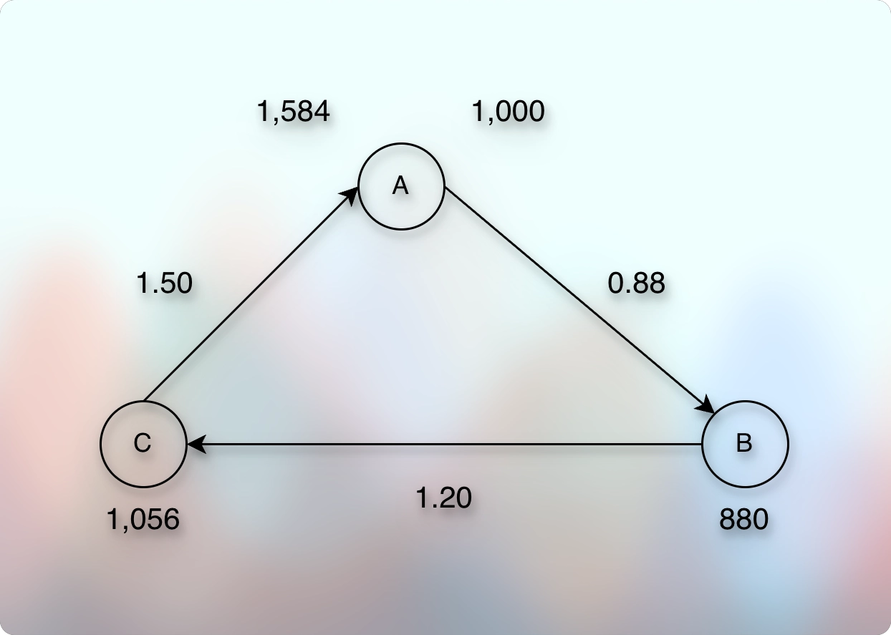
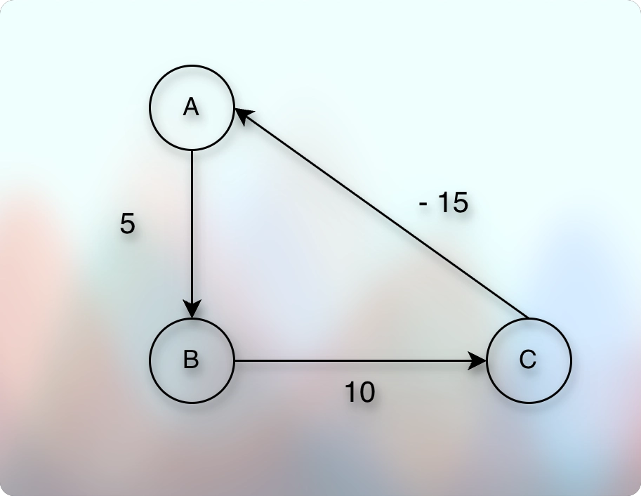

# Bellman Ford Algorithm

## Prerequisites

* [DijkstrasAlgorithm.md](030dijkstrasAlgorithm.md)

## Concept

* Earlier, we have seen the Dijkstra's Algorithm to find the shortest path (distance).
* And there was an important invariant (or assumption).

> Once we extract the (distance to vertex) pair from the `min-heap`, it cannot have a shorter distance than it.

* Let us use it again:

* As we can see in the image, the invariant (or assumption) fails when there is a negative weight on the edge.
* We might think that what is the problem if we add (-10 to B) again to the `min-heap` after we have already extracted (5 to B)?
* The problem is, if B had many outgoing edges, then adding (-10 to B) forces us (the algorithm) to inspect those outgoing edges again.
* And it breaks the promised time complexity of the algorithm.
* Because the promised time complexity does not include this case.
* So, what is the solution?

## Bellman-Ford Algorithm

* Let us take a real life example where edges can have negative weights.
* The currency exchange problem is the famous one.

* So, the question is, is it possible to go through a certain currency exchange path using which we can actually end-up earning more than what we had when we started?
* In the given image, we started with 1,000 in currency A. 
* Then, we converted it into some other currency, called B, and got 880.
* Then, we converted it again into yet other currency, called C, and got 1056.
* And finally, we converted it again into the original currency from where we started, and we got 1584 in currency A!
* This is known as "Arbitrage".
* For example, suppose initially we have $1,000 USD.
* And then maybe we can go through RUB, GBP, and some other currency exchange paths.
* Now, is it possible that somehow we get more than $1,000 USD when we return to USD through a particular exchange rate route?
* For example, maybe going through USD → EUR → GBP → RUB → USD gives us more USD than the direct USD → RUB → USD.
* If it is possible, then people can earn a lot of money through this process.
* All they have to do is just to find the path of this different currency exchange routes using which they can get more money than they started with.
* So, how do we model this problem as a graph problem?
* Imagine that these currencies, USD, RUB, EUR, GBP, etc. are vertices.
* When we convert one currency to another currency, it becomes a direct edge.
* For example, suppose we convert from USD to RUB, then there is an edge from USD to RUB.
* And when we convert one currency to another currency, it will have some exchange rate, and we denote this rate as the weight.
* So, for example the weight of USD → EUR might be 0.83 or something like that.
* It indicates that if we have 1 USD, then we get 0.83 EUR. 
* So now, the goal is to find such a path using which we can have maximum money.
* It means that we are interested in a path where 1 becomes more.
* For example, if the exchange rate of USD → RUB is 83, then 1 USD becomes 83 RUB.
* So, we constantly look for a path that increases the value in such a way that we end-up having maximum money using a particular route.
* We can think of the exchange rate in this way:
* If we have 1 USD, then we get 83 RUB because the edge weight is 83.
* How many RUB do we get if we have $1,000 USD?
* So, we multiply with the exchange rate (weight) of USD → RUB, which is 83.
* So, we get 1,000 USD * 83 (USD to RUB Exchange Rate) = 83,000 RUB.
* So, we want to find a path using which we can get the maximum product (multiplication) of two vertices (currencies).
* Now, this sounds a little bit strange.
* Because, we normally ask: What will be the minimum sum of weights?
* Notice: Minimum and Sum.
* Here, we ask: What will be the maximum product of weights?
* Notice: Maximum and Product.
* So, we need a way to come up with some mathematical formula.
* For example, we can convert a multiplication product into a summation formula using logarithm arithmetic.
* For example:
* $log(xy) = log x + log y$
* So, if we have the below multiplication problem:
* $4 * \frac{1}{2} = 2$, then we can convert it into a logarithmic problem using base-2 as:
* $log_2(4) + log_2(\frac{1}{2}) = 2 - 1 = 1$
* And this 1 is for $log_2(2) = 1$.
* And $log_2(2) = 1$ translates into $2^1$, which is 2.
* So this is how we can convert a multiplication problem into a summation problem.
* In other words, if we denote exchange rate as `r`, then: 
* $r_1 * r_2 * r_3 * ...* r_n$ into $log(r_1) + log(r_2) + log(r_3) +...+ log(r_n)$.
* But how do we convert a maximization problem into a minimization problem?
* So, we negate the values.
* For example:
* $log(r_1)$ becomes $- log(r_1)$, and so on...
* Now, we want minimum sum of $- log(r_n)$. 
---
* So, logarithm converts multiplication (product) into summation.
* And negation converts maximum into minimum.
---
* It means if some exchange rate (edge weight) is $r = 2$.
* Then, it becomes: $- log_2(2) = -1$.
* It means that the edge weight becomes negative.
* And we have seen it earlier that we cannot use Dijkstra's Algorithm to solve the problem where edges can have negative weight.
* Because we have seen it that for any edge, `weight >= 0` is the Dijkstra's Algorithm's core condition due to which we say that once we `poll` the item, it cannot have any shorter distance than that.
* Reference: [Dijkstras Algorithm.md](030dijkstrasAlgorithm.md)
* And we have also seen it in the beginning of this lecture, how Dijkstra's Algorithm fails if we ever get `weight < 0`.
* It means that we need a different algorithm when an edge can have negative weight.
---
* Why did we say that we need a maximum product? Product of what? Product of currencies? It was too fast for me. How did we conclude that in order to end-up having more money than we started, we need to find maximum product?
---
* So, to solve the graph problems where an edge can have a negative weight, we use "Bellman-Ford" Algorithm.
* Let us see how it works.
---
* Now, let us come back to the currency exchange problem.
* We converted multiplication into summation using logarithm.
* We converted maximization into minimization using negation.
* Now, our goal is to produce the minimum result which will be in reality, the maximum result.
* Now, suppose that we get the following graph:

* We continue the usual process.
* The source node is A.
* Initially, A to A is 0.
* So, `dist[A] = 0`.
* So, we add `(0 to A)` to the `min-heap`.
* We `poll`, and get `(0 to A)`.
* We inspect the outgoing edges.
* We get A → B.
* We update `dist[B]` to `0 + 5 = 5`.
* We add `(5 to B)` to the `min-heap`.
* No other outgoing edges of `A`.
* We `poll`, and get `(5 to B)`.
* We inspect the outgoing edges.
* We get B → C.
* We update `dist[C]` to `5 + 10 = 15`.
* We add `(15 to C)` to the `min-heap`.
* No other outgoing edges of `B`.
* We `poll`, and get `(15 to C)`.
* We inspect the outgoing edges.
* We get C → A.
* We update `dist[A]` to `15 - 20 = -5`.
* Notice something unusual.
* The `dist[A]` got reduced.
---
* So, we add `(-5 to A)` to the `min-heap`.
* We `poll`, and get `(-5 to A)`.
* We inspect the outgoing edges.
* We get A → B.
* We update `dist[B]` to `-5 + 5 = 0`.
* The `dist[B]` also got reduced!
* We add `(0 to B)` to the `min-heap`.
* No other outgoing edges of `A`.
* We `poll`, and get `(0 to B)`.
* We inspect the outgoing edges.
* We get B → C.
* We update `dist[C]` to `0 + 10 = 10`.
* The `dist[C]` also got reduced!
* We add `(10 to C)` to the `min-heap`.
* No other outgoing edges of `B`.
* We `poll`, and get `(10 to C)`.
* We inspect the outgoing edges.
* We get C → A.
* We update `dist[A]` to `10 - 20 = -10`.
* The `dist[A]` got reduced, again!
---
* If we continue, we get $-\infty$.
* And if we remember, getting as minimum value as we can, is actually getting as much value as we can.
* So, if we continue through such a loop, we get infinite profit.
* And that would make us billionaire!
---
* Let us inspect when, why, and how that happens.
* If we observe the cycle, the initial values are: 5 + 10 - 20 = -10.
* This is called the negative cycle.
* It means that whenever we get a negative cycle, we decrease the value in each turn.
* And if we keep moving through such a cycle, we keep decreasing the value with each turn.
* And that is how it becomes $- \infty$.
* How do we prevent such an arbitrage opportunity?
* To prevent it, we need to detect it first.
* How do we detect it?
---
* The formula is:
* If `n` is the total number of vertices, and if even after inspecting all the edges `n - 1` times, if we can still reduce the distance (and so, relax an edge), it means that there is a negative cycle.
* We can start with any vertex, and it will still hold true.
* For example, let us use the same graph that has the negative cycle.

* There are a total of `n = 3` vertices.
* The lemma states that even after inspecting all the edges `n - 1` times, if we find that the value decreases, there is a negative cycle.
* And we can start with any vertex.
---
* So, let us start from `C`.
* This is the first round of inspecting all the edges.
---
* Initially, from `C to C` is `0`.
* So, `dist[C] = 0`.
* We add `(0 to C)` to the `min-heap`.
* Now we can start the first round.
---
* We `poll` and get `(0 to C)`.
* We inspect the outgoing edges. 
* We get `C → A`.
* We update `dist[A] = 0 - 20 = - 20`.
* We add `(-20 to A)` to the `min-heap`.
* No other outgoing edges from `C`.
* We `poll` and get `(-20 to A)`.
* We inspect all the outgoing edges of `A`. 
* We get `A → B`.
* We update `dist[B] = -20 + 5 = -15`.
* We add `(-15 to B)` to the `min-heap`.
* No other outgoing edges from `A`.
* We `poll` and get `(-15 to B)`. 
* We inspect all the outgoing edges.
* We get `B → C`.
* We update `dist[C] = 15 + 10 = -5`.
* Notice that the `dist[C]` is reduced!
---
* We are going to inspect all the edges again. 
* This will be the `(n - 1) = 3 - 1 = 2`nd time and the last time.
---
* Initially, from `C to C` is `-5`.
* So, `dist[C] = -5`.
* And `(-5 to C)` is already in the `min-heap` from the last run.
* Now, we start the second round:
---
* We `poll` and get `(-5 to C)`.
* We inspect the outgoing edges.
* We get `C → A`.
* The `dist[A]` is `-20`.
* We update `dist[A] = -5 - 20 = - 25`.
* We add `(-25 to A)` to the `min-heap`.
* No other outgoing edges from `C`.
* We `poll` and get `(-25 to A)`.
* We inspect all the outgoing edges of `A`.
* We get `A → B`.
* The `dist[B]` is `-15`.
* We update `dist[B] = -25 + 5 = -20`.
* We add `(-20 to B)` to the `min-heap`.
* No other outgoing edges from `A`.
* We `poll` and get `(-20 to B)`.
* We inspect all the outgoing edges.
* We get `B → C`.
* The `dist[C]` is `-5`.
* We update `dist[C] = -20 + 10 = -10`.
* Notice that the `dist[C]` is reduced!
---
* Now, if we inspect all the edges one more time, and if we can relax any edge, it will conclude that there is a negative cycle.
* And if the `dist` values remain as it is, there is no negative cycle, and we can conclude that `dist` values represent the shortest distance (path) for each node from the source.
* Let us inspect all the edges `nth` time.
---
* Initially, from `C to C` is `-10`.
* So, `dist[C] = -10`.
* And `(-10 to C)` is already in the `min-heap` from the last run.
* Now, we start the third (nth) round:
---
* We `poll` and get `(-10 to C)`.
* We inspect the outgoing edges.
* We get `C → A`.
* The `dist[A]` is `-20`.
* We can relax the edge: `dist[A] = -10 - 20 = - 30`.
* We could relax the edge, reduce the `dist` value, and it indicates that there is a negative cycle.
* This should not happen when there is no negative cycle.
* When there is no negative cycle, when we inspect all the edges for the `nth` time, nothing changes.
* We don't get the chance to reduce any of the `dist` values.
---

* And now, we will see that when there is no negative cycle, this doesn't happen.

* Total vertices, `n = 3`.
* The source node is `A`, and we start from `A`.
* From A to A is 0.
* So, we add `(0 to A)` to the `min-heap`.
* We are going to start the first round.
---
* We `poll` and get `(0 to A)`. 
* We inspect all the outgoing edges.: A → B.
* We update `dist[B]` from `MAX` to `(5 to B)`.
* We add it to the `min-heap`: `(5 to B)`.
* `A` does not have any other outgoing edge.
* We `poll` and get `(5 to B)`. 
* We inspect all the outgoing edges.: B → C.
* We update `dist[C]` from `MAX` to `(15 to C)`.
* We add it to the `min-heap`: `(15 to C)`.
* `B` does not have any other outgoing edge.
* We `poll` and get `(15 to C)`.
* We inspect all the outgoing edges.: C → A.
* `dist[A]` is `0`. 
* `dist[C]` is `15`, and `weight(C, A) = -15`.
* So, `dist[C] + weight(C, A) = 15 + (-15) = 0`.
---
* We can see that, it couldn't reduce the existing `dist[A]`.
* It means that we could not successfully relax the edge.
* It means that there is no negative cycle.
---
* In our example, we could successfully relax all the possible edges in the first run only.
* But when there is no negative cycle, it might take up to (inclusive) `n - 1` time.
* In other words, when there is no negative cycle, all the possible edges get relaxed by `n - 1`th iteration (inclusive).
* If there is no negative cycle, we can't relax any edge after the `n - 1`th iteration.
---
* At this point, we conclude that we have identified the shortest distance for all the nodes.
* We conclude that we cannot reduce the shortest distance of any node now.
---
* So, when there is no negative cycle, we can't reduce the shortest distance of any vertex after the `(n - 1)` times iteration of edge relaxation, where `n` is the total number of vertices.
---
* However, we can perform the `nth` iteration of edge relaxation to detect if there is any negative cycle.
* And if we detect any negative cycle (by observing that we can still relax an edge), we discard our `dist` values.
* Because those values are possibly contaminated by the negative cycle.
---
* So, the conclusion is: 
* If edges have negative weight, we don't use Dijkstra's Algorithm.
* But we keep performing edge relaxation `(n - 1)` times.
* If we can relax any edge even after the `(n - 1)`th iteration, it confirms a negative cycle and we stop.
* This algorithm is known as the `Bellman-Ford Algorithm.`
---
* Pseudocode:
* 

## Time Complexity

## Space Complexity

## Next