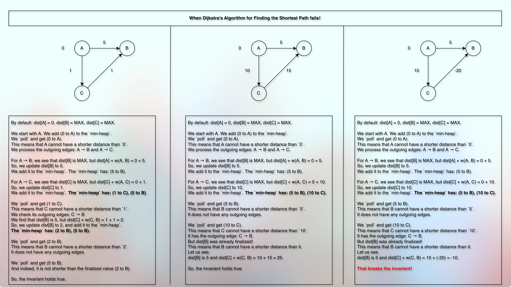

# Bellman Ford Algorithm

## Prerequisites

* [DijkstrasAlgorithm.md](030dijkstrasAlgorithm.md)

## Concept

* Earlier, we have seen the Dijkstra's Algorithm to find the shortest path (distance).
* Let us use it again:

* 

## Time Complexity

## Space Complexity

## Next