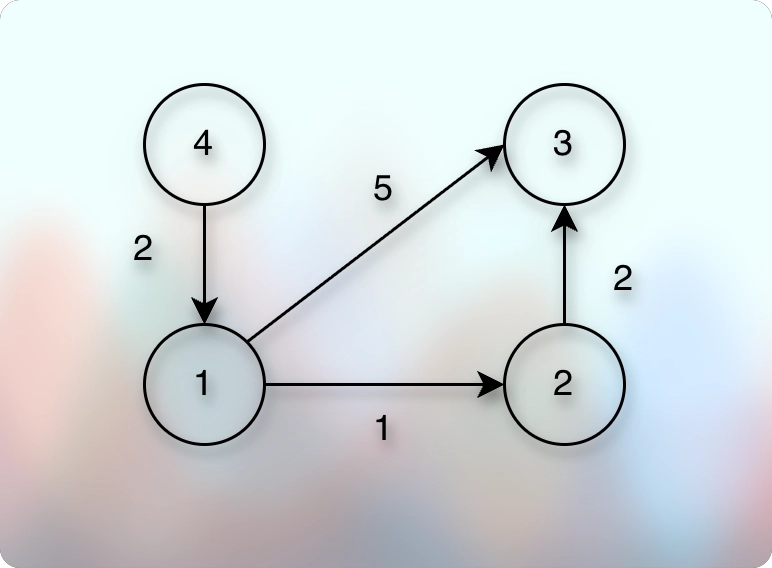
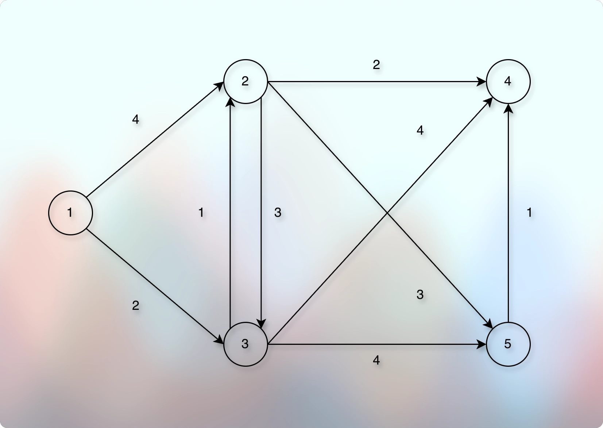

# Computing the minimum flight cost

## Problem Introduction

* Now, you are interested in minimizing not the number of segments, but the total cost of a flight. 
* For this you construct a weighted graph: the weight of an edge from one city to another one is the cost of the corresponding flight.

## Problem Description

### Task 

* Given a directed graph with positive edge weights and with 𝑛 vertices and 𝑚 edges as well as two vertices 𝑢 and 𝑣, compute the weight of a shortest path between 𝑢 and 𝑣 (that is, the minimum total weight of a path from 𝑢 to 𝑣).

### Input Format 

* A graph is given in the standard format. 
* The next line contains two vertices 𝑢 and 𝑣.

### Constraints 

$$
1 ≤ 𝑛 ≤ 10^4, 0 ≤ 𝑚 ≤ 10^5, 𝑢 \neq 𝑣, 1 ≤ 𝑢, 𝑣 ≤ 𝑛 
$$

* Edge weights are non-negative integers not exceeding $10^8$.

### Output Format 

* Output the minimum weight of a path from 𝑢 to 𝑣, or −1 if there is no path.

### Time Limit
*
* | language   	| C 	| C++ 	| Java 	| Python 	| C# 	| Haskell 	| JavaScript 	| Ruby 	| Scala 	|
* |------------	|---	|-----	|------	|--------	|----	|---------	|------------	|------	|-------	|
* | time (sec) 	| 2 	| 2   	| 3    	| 10     	| 3  	| 4       	| 10         	| 10   	| 6     	|
*
 
### Memory Limit

* 512 MB.

### Sample 1

**Input**

```markdown
4 4
1 2 1
4 1 2
2 3 2
1 3 5
1 3
```

**Output**

> 3
 
**Explanation**



* There is a unique shortest path from vertex 1 to vertex 3 in this graph (1 → 2 → 3), and it has weight 3.

### Sample 2

**Input**

```markdown
5 9
1 2 4
1 3 2
2 3 2
3 2 1
2 4 2
3 5 4
5 4 1
2 5 3
3 4 4
1 5
```

**Output**

> 6

**Explanation**



* There are two paths from 1 to 5 of total weight 6: 1 → 3 → 5 and 1 → 3 → 2 → 5.

### Sample 3

**Input**

```markdown
3 3
1 2 7
1 3 5
2 3 2
3 2
```

**Output**

```markdown
-1
```

**Explanation**


* There is no path from 3 to 2.

## Implementation

