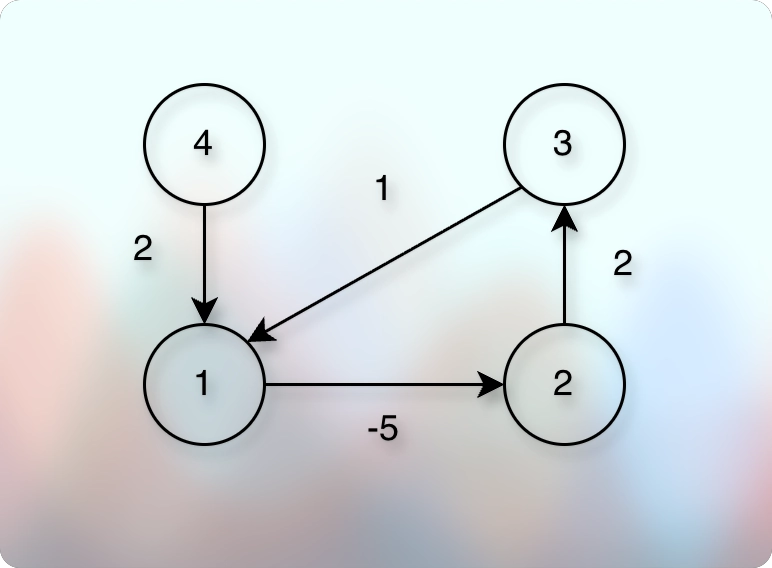

# Detect Anomalies (Negative cycle in currency exchange)

## Problem Introduction
* You are given a list of currencies 𝑐1, 𝑐2, . . . , 𝑐𝑛 together with a list of exchange
rates: 𝑟𝑖𝑗 is the number of units of currency 𝑐𝑗 that one gets for one unit
of 𝑐𝑖. 
* You would like to check whether it is possible to start with one unit
of some currency, perform a sequence of exchanges, and get more than one
unit of the same currency. 
* In other words, you would like to find currencies 𝑐𝑖1, 𝑐𝑖2, . . . , 𝑐𝑖𝑘 such that 𝑟𝑖1,𝑖2 · 𝑟𝑖2,𝑖3 · 𝑟𝑖𝑘−1,𝑖𝑘 , 𝑟𝑖𝑘,𝑖1 > 1. 
* For this, you construct the following graph: 
* Vertices are currencies 𝑐1, 𝑐2, . . . , 𝑐𝑛, the weight of an edge from 𝑐𝑖 to 𝑐𝑗 is equal to − log 𝑟𝑖𝑗 . 
* There (then) it suffices to check whether there is a negative cycle in this graph. 
* Indeed, assume that a cycle 𝑐𝑖 → 𝑐𝑗 → 𝑐𝑘 → 𝑐𝑖 has negative weight. 
* This means that −(log 𝑐𝑖𝑗 + log 𝑐𝑗𝑘 + log 𝑐𝑘𝑖) < 0 and hence log 𝑐𝑖𝑗 + log 𝑐𝑗𝑘 + log 𝑐𝑘𝑖 > 0. 
* This, in turn, means that:

$$
𝑟_{𝑖𝑗} 𝑟_{𝑗𝑘} 𝑟_{𝑘𝑖} = 2^{log_{𝑐𝑖𝑗}} * 2^{log_{𝑐𝑗𝑘}} * 2^{log_{𝑐𝑘𝑖}} = 2^{log_{𝑐𝑖𝑗}+log_{𝑐𝑗𝑘}+log_{𝑐𝑘𝑖}} > 1 .
$$

## Problem Description

### Task 

* Given a directed graph with possibly negative edge weights and with 𝑛 vertices and 𝑚 edges, check whether it contains a cycle of negative weight.

### Input Format 

* A graph is given in the standard format.

### Constraints 

$$
1 ≤ 𝑛 ≤ 10^3, 0 ≤ 𝑚 ≤ 10^4, 
$$

* edge weights are integers of absolute value at most $10^3$.

### Output Format 

* Output 1 if the graph contains a cycle of negative weight and 0 otherwise.

### Time Limit

* | language   	| C 	| C++ 	| Java 	| Python 	| C# 	| Haskell 	| JavaScript 	| Ruby 	| Scala 	|
* |------------	|---	|-----	|------	|--------	|----	|---------	|------------	|------	|-------	|
* | time (sec) 	| 2 	| 2   	| 3    	| 10     	| 3  	| 4       	| 10         	| 10   	| 6     	|

### Memory Limit 

* 512MB.

### Sample 1.

**Input**

```markdown
4 4
1 2 -5
4 1 2
2 3 2
3 1 1
```

**Output**

```markdown
1
```

**Explanation**

* 

## Implementation

* 
