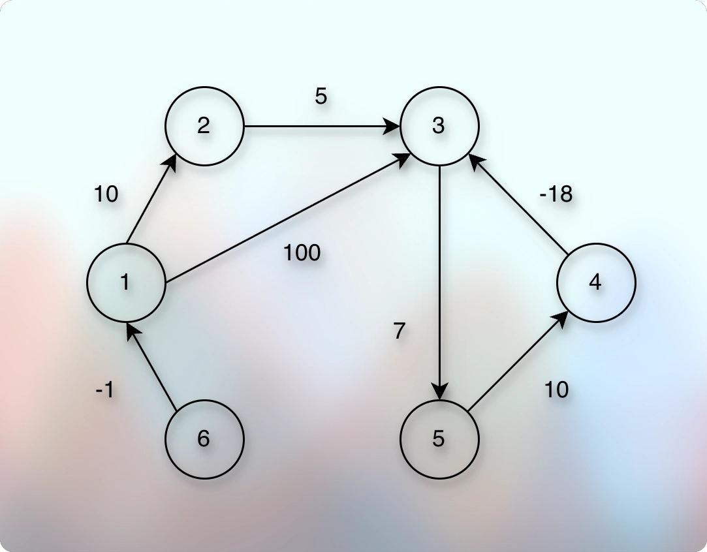
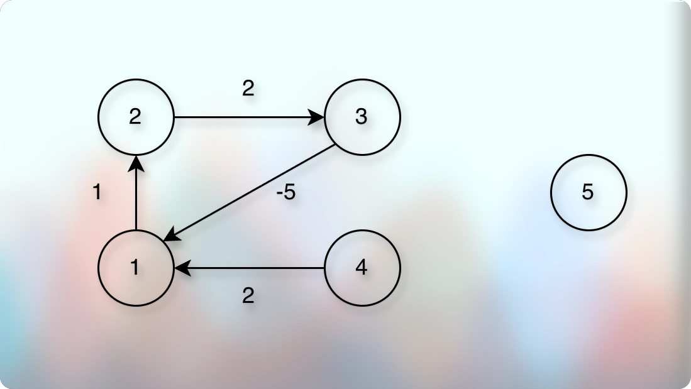

# Optimal Money Exchange: Exchanging Money Optimally

## Problem Introduction

* Now, you would like to compute an optimal way of exchanging the given currency 𝑐𝑖
into all other currencies. 
* For this, you find the shortest paths from the vertex 𝑐𝑖 to all the other vertices.

## Problem Description

### Task 

* Given a directed graph with possibly negative edge weights and with 𝑛 vertices and 𝑚 edges as well as its vertex 𝑠, compute the length of shortest paths from 𝑠 to all other vertices of the graph.

### Input Format 

* A graph is given in the standard format.

### Constraints 

$$
1 ≤ 𝑛 ≤ 10^3, 0 ≤ 𝑚 ≤ 10^4, 1 ≤ 𝑠 ≤ 𝑛, 
$$

* Edge weights are integers of absolute value at most 10^9 .

### Output Format 

* For all vertices 𝑖 from 1 to 𝑛 output the following on a separate line:
∙ “*”, if there is no path from 𝑠 to 𝑢;
∙ “-”, if there is a path from 𝑠 to 𝑢, but there is no shortest path from 𝑠 to 𝑢 (that is, the distance from 𝑠 to 𝑢 is −∞);
∙ The length of the shortest path otherwise.

### Time Limit

* | language   	| C 	| C++ 	| Java 	| Python 	| C# 	| Haskell 	| JavaScript 	| Ruby 	| Scala 	|
* |------------	|---	|-----	|------	|--------	|----	|---------	|------------	|------	|-------	|
* | time (sec) 	| 2 	| 2   	| 3    	| 10     	| 3  	| 4       	| 10         	| 10   	| 6     	|

### Memory Limit 

* 512 MB.

### Sample 1

**Input**

```markdown
6 7
1 2 10
2 3 5
1 3 100
3 5 7
5 4 10
4 3 -18
6 1 -1
1
```

**Output**

```markdown
0
10
-
-
-
*
```

**Explanation**

* 

* The first line of the output states that the distance from 1 to 1 is equal to 0. 
* The second one shows that the distance from 1 to 2 is 10 (the corresponding path is 1 → 2). 
* The next three lines indicate that the distance from 1 to vertices 3, 4, and 5 is equal to −∞: 
* Indeed, one first reaches the vertex 3 through edges 1 → 2 → 3 and then makes the length of a path arbitrary small by making sufficiently many walks through the cycle 3 → 5 → 4 of negative weight. 
* The last line of the output shows that there is no path from 1 to 6 in this graph.

### Sample 2

**Input**

```markdown
5 4
1 2 1
4 1 2
2 3 2
3 1 -5
4
```

**Output**

```markdown
-
-
-
0
*
```

**Explanation**

* 

* In this case, the distance from 4 to vertices 1, 2, and 3 is −∞ since there is a negative cycle 1 → 2 → 3
  that is reachable from 4. 
* The distance from 4 to 4 is zero. There is no path from 4 to 5.

## Thought Process

* 3 Things:
* 1: Vertices with the finite values (distance, number): With their corresponding values
* 2: Vertices with infinite values (due to negative cycle! Does it say that explicitly?!): Marked as: "-"
  * They said: The distance from S to u is $-\infty$
* 3: Vertices that are not reachable: Marked as: "*"
---
* How do we find the distance when an edge can have negative weight? Using the Bellman-Ford Algorithm.
* So, in the first phase, after we relax all the edges (V - 1) times, we have possible values.
* And when we relax all the edges one more time, we may find a reachable negative cycle.
* And if we find, we need to identify the affected (infected?) vertices and mark them as: $-\infty$. 
---
* How do we identify infected vertices?
* During the negative cycle detection, we add all the infected vertices to a container.
* And then for each infected vertex, we need to add their neighbors.
* Because if a vertex is infected, then the connected neighbor is also infected (becomes $-\infty$).
---
* How do we find and cover all the neighbors of a vertex, and their neighbors, and so on?
* We perform DFS or BFS on them.
* We mark these vertices as infected.
---
* And now we have several useful details.
* We get some finite values from the (V - 1) times edge relaxation.
* And during that phase, we also get the vertices that are non-reachable.
* They will remain "MAX" in the `dist`.
* And during the negative cycle detection and DFS/BFS traversal, we replace some values in `dist` with: "-".  

## Implementation


