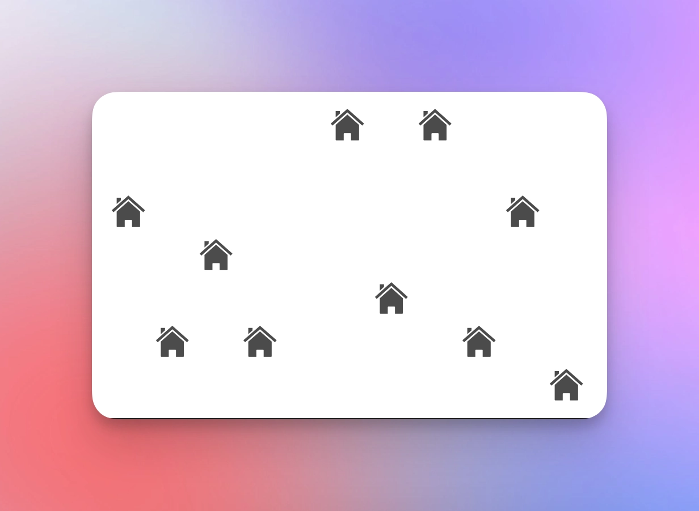
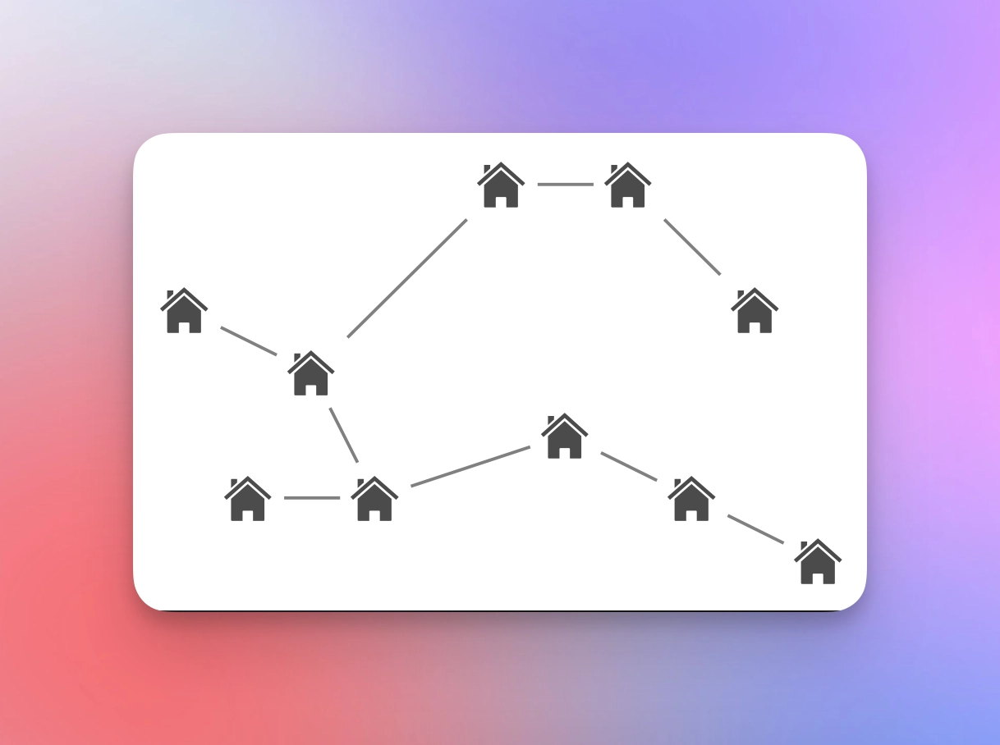
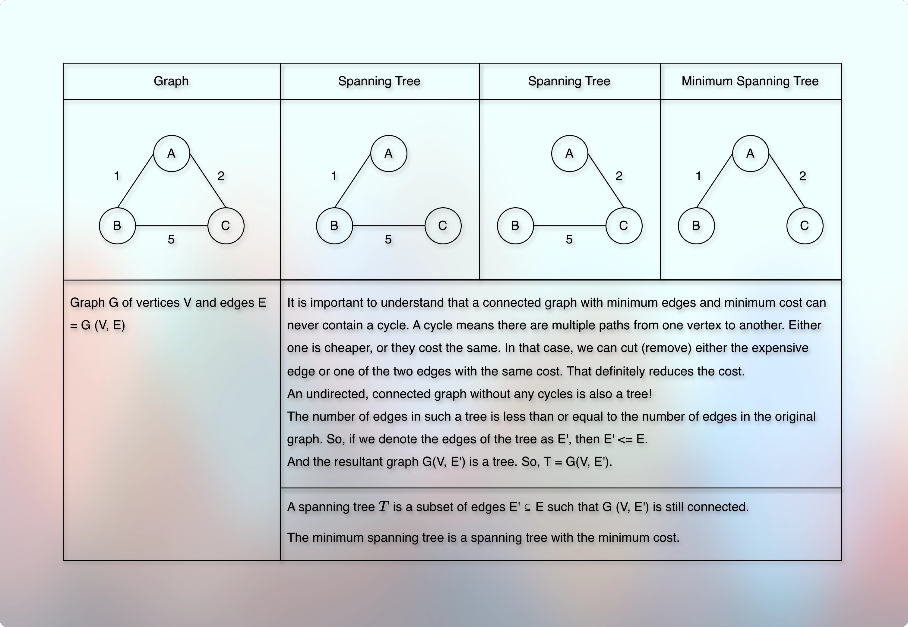
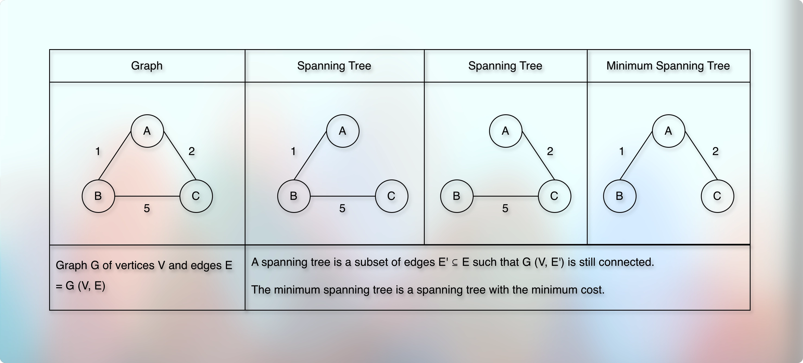
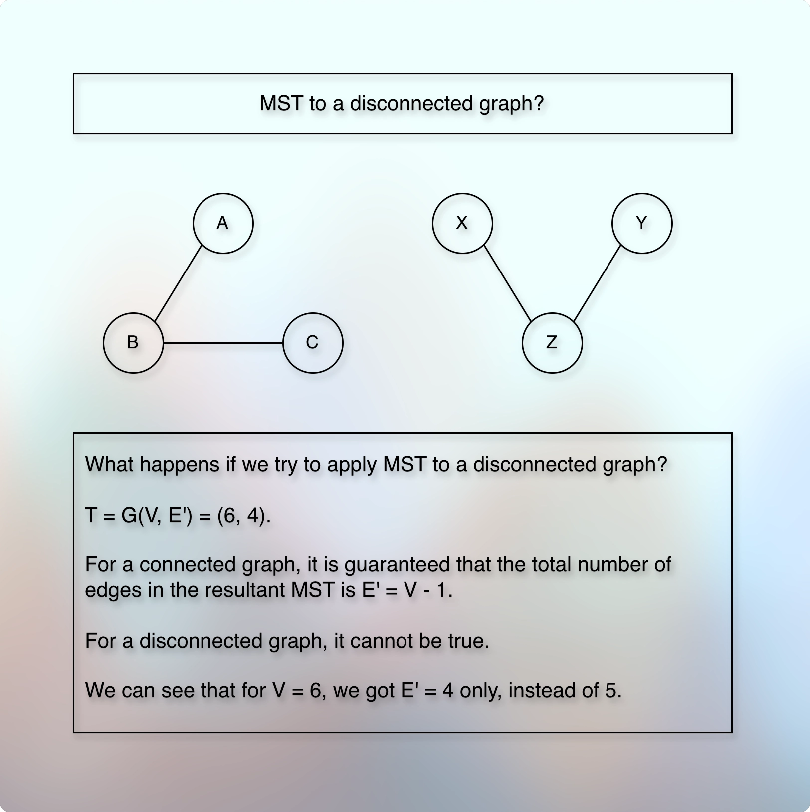

# Spanning Tree

## Prerequisites/References

* [SpanningTree](https://youtu.be/Yldkh0aOEcg?si=x9XfeOGvVHN3uasc)
  * Brian Yu. Harvard professor and head. Integrity. Simplification. Respect. 
  * Worth watching: [Introduction to AI -cs50 Harvard Edu](https://youtu.be/WbzNRTTrX0g?si=aiFelgbBHH1nhGOV)
* [Abdul Bari Sir](https://youtu.be/4ZlRH0eK-qQ?si=PEnhqZon5EeJmqvy)
* [Shradha Madam](https://youtu.be/inoM6jwj1CA?si=95884cT7zeF0ZFly)

## Problem

* We have some homes (or cities, machines, etc.), and we want to connect them with each other.
* We are interested in connectivity and minimum cost.
* We want to avoid cycles.
* For example, the result might look like below:

* A path that connects all the vertices (homes, machines, cities, etc.) using the minimum cost.

* When we have multiple objects, and we want to connect them all using the minimum cost, we use the minimum spanning tree concept.

## Concept

* The problem:
* We have a few vertices, we want to connect them all, without any cycle, with minimum cost.
* Or there is an undirected, connected, cyclic, and weighted graph for which we want to remove all the cycles, and keep all the vertices connected using minimum cost. 
* The lemma:
> For an undirected and weighted graph, the optimal solution where we keep all the vertices connected without any cycle, and the sum of weight of edges is the minimum, then it is guaranteed that the result forms a tree.  
* The requirement is aligned with a tree.
* If all the vertices are connected, they are undirected, the path between the two vertices is unique, and there is no cycle it essentially becomes a tree.
* Because these are the properties of a tree.
* It means that we need to solve this problem considering the fact that we are going to form a tree, or the result will be a tree.
* A tree cannot have a cycle and a graph can have a cycle.
* A tree cannot have directed edges, but we can have a directed or an undirected graph.
* Also, a tree cannot have disconnected (isolated) nodes. Whereas, a graph can have separate, multiple, isolated connected components. 
* And if there are `V` vertices, then the tree gets exactly `V - 1` edges.
* So, to convert a graph into a tree, we need to ensure that we use an undirected and connected graph and the result does not have any cycle.
* In other words, an undirected, connected graph where there is no cycle is a tree.
* A spanning tree is a tree that covers (connects) all the vertices of a graph without any cycle by using `V - 1` edges.
* For example:

* 

* A minimum spanning tree or a minimum cost spanning tree is a tree that connects all the vertices of the graph, without any cycle, with minimum cost, using `V - 1` edges. 
* The term minimum corresponds to the minimum cost and minimum edges.
* For example, if we have `V` vertices (or nodes), then to form a tree, we need exactly `V - 1` edges.
* And to form the MST, the sum of the weight of these edges must be minimum.
* The term spanning corresponds to the fact that the resulting tree is still a connected graph, and the term tree corresponds to the properties of a tree.
* For example, the result is not cyclic, it is not directed, and it covers all the vertices of the original graph.
* We use MST (Minimum Spanning Tree) only for an undirected and weighted graph where vertices are connected.
---
* What if we get a disconnected graph where the graph can have multiple, isolated connected components?

---
* There are two popular algorithms to find the MST.
  * Kruskal's Algorithm
  * Prims Algorithm

## Next

* [Kruskal's Algorithm To Find Mst.md](020kruskalsAlgorithmToFindMst.md)
* [Prim's Algorithm To Find Mst.md](030primsAlgorithmToFindMst.md)