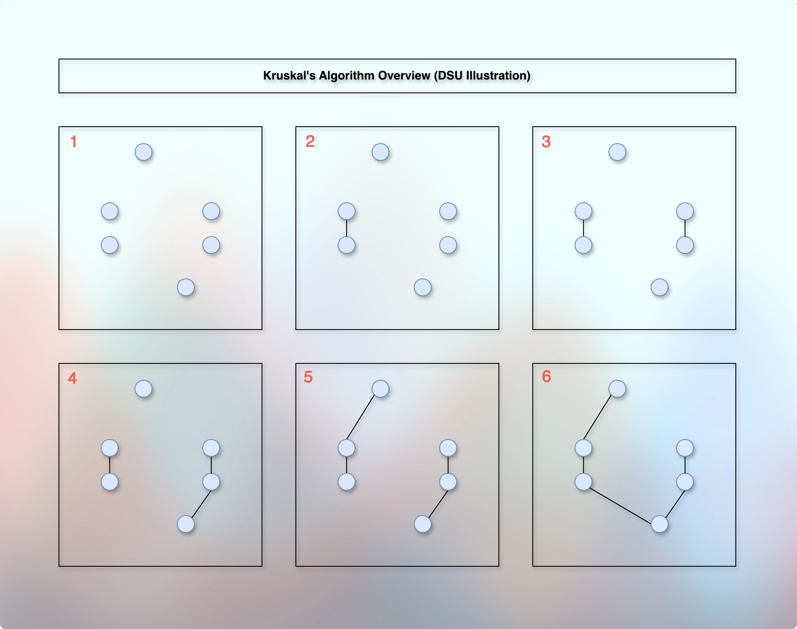
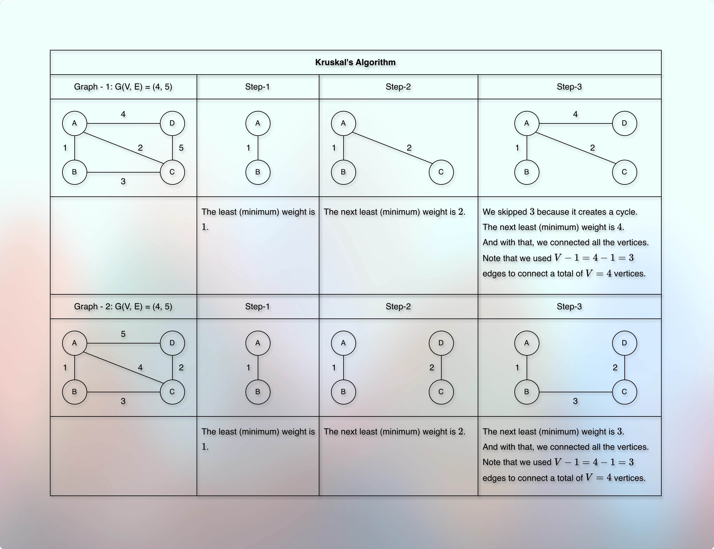
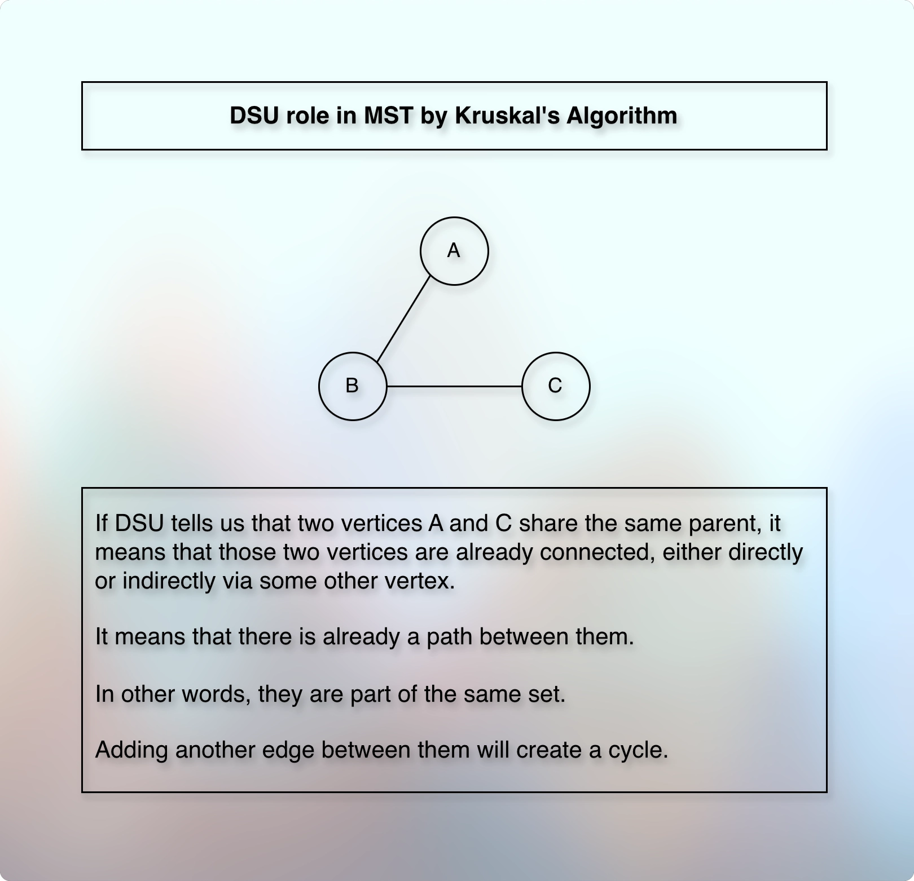

# Kruskal's Algorithm

## Prerequisites/References

* [010spanningTree.md](010spanningTree.md)

## Concept





* We always pick the edge with the least (minimum) weight as long as it does not create a cycle.
* In other words, we select the edge with the least available weight out of the entire graph even if it is not connected to the selected graph as long as it does not create any cycle.
* It is like we start with a forest of trees, where each vertex is an independent tree, and then we start selecting edges, one after other, from the minimum weight. 
* And we keep adding more edges by selecting the edge with the least available weight without creating a cycle.
* So, it selects the next lightest edge that does not create a cycle.
* Initially, it might look disconnected (isolated) edges, but by the end of the algorithm, we get a proper tree with the minimum cost.

---
* Selects the edge that has the least weight and doesn’t create a cycle.
* Initially, imagine that we have a forest of trees where each tree is an individual set.
* Then, we sort the edges in non-decreasing order by their weights.
* We process each edge one by one.
* Each edge gives us two vertices.
* We find the root (leader) of each vertex.
* If their roots (leaders) are different, they belong to a different set.
* Otherwise, we skip such edges.
* This is to avoid the cycle.
* If they belong to a different set, we merge (union) them.
* After the union, they share the same root (leader).
* They become part of the same set.
* We expect a total of `V - 1` selected edges.
* So, we repeat this process until we get `V - 1` total edges.
---

* To identify whether two objects are connected, we use DSU.
  * [DisjointSetsUnion.md](../../../../../02dataStructures/courses/uc/module03priorityQueuesHeapsDisjointSets/section04DisjointSetsImplementation/disjointSets.md)


* If DSU tells us that the root of two vertices is the same, then those two vertices are already connected, either directly or indirectly via some other vertex.



* There is already a path between them.
* Adding another edge between them will create a cycle.
---
* In DSU, we use an array and the direct-addressing method.
* Initially, each object is an individual, independent set.
* In other words, each object is a leader/root of their own.
* The `find` operation reveals their leader/root.
* Before we `union` two objects, we check their roots using `find`.
* If their roots/leaders are different, it means that they are disjoint, disconnected, different sets. So, we can join, union them.
* If they share the same root/leader, it means that they are part of the same set.
* It means that they are already connected.
* So, we discard the union operation on them.
---
* In the Kruskal's Algorithm, we want to check whether taking an edge creates a cycle or not.
* An edge consists of two vertices.
* So, we check the leaders/roots of these vertices.
* If they share the same roots/leaders, then they are already connected.
* It means that taking (including) such an edge will create a cycle.
* So, we discard such an edge.
* And if their roots are different, we join, union them.
* Once we union them, they share the same root.
---
* Initially, each vertex is its own root.
* We use an array and a direct addressing method.
* An index represents the vertex and the value represents the root.
---
```kotlin

val dsu = IntArray(vertices) { it }
```
---
* To connect two vertices, we need an edge.
* We want to select the edge with the least weight.
* So, we sort the edges in a non-decreasing order by weight.
* So that the edge with the least weight is on the top (first), and the edge with the largest weight is at the bottom (last).
---
```kotlin

val sortedEdges = edges.sortedBy { it.weight }

```
---
* We need `V - 1` edges out of all the available edges.
* We select edges from the `sortedEdges`.
---
```kotlin

for ((from, to, weight) in sortedEdges) {
    val fromRoot = find[from]
    val toRoot = find[to]
    if (fromRoot != toRoot) {
        union(from, to)
    }
}
```
---
* But we also need to provide the final cost.
* So, we take `minCost`, initialize it to `0`, and update it for every edge we use.
---
```kotlin
minCost = 0
for ((from, to, weight) in sortedEdges) {
    val fromRoot = find[from]
    val toRoot = find[to]
    if (fromRoot != toRoot) {
        union(from, to)
        minCost += weight
    }
}
```
---
* And as we know that we don't need more than `V - 1` edges, we need to count the edges that we add.
* So that after adding `V - 1` edges, we can break the loop and conclude.
---
```kotlin
var selectedEdges = 0
for ((from, to, weight) in sortedEdges) {
    val fromRoot = find[from]
    val toRoot = find[to]
    if (fromRoot != toRoot) {
        union(from, to)
        minCost += weight
        selectedEdges++
    }
    if (selectedEdges == (totalVertices - 1)) {
        break
    }
}
```
---
* But what if we get a disconnected graph?
* We have seen this in the [Spanning Tree.md](010spanningTree.md).
* If we apply MST to a disconnected graph, the selected edges cannot be equal to the `V - 1` in the end.
* So, if there is a possibility of getting a disconnected graph, then we can add verification code something like below:
---
```kotlin
var selectedEdges = 0
for ((from, to, weight) in sortedEdges) {
    val fromRoot = find[from]
    val toRoot = find[to]
    if (fromRoot != toRoot) {
        union(from, to)
        minCost += weight
        selectedEdges++
    }
    if (selectedEdges == (totalVertices - 1)) {
        break
    }
}
return if (selectedEdges == (totalVertices - 1)) {
    minCost // It was a connected graph
} else {
    -1 // It was a disconnected graph
}
```
---
* The find and union code of the DSU will be as it is.
* [Disjoint Sets Union Find Using Rank.kt](../../../../../../src/courses/uc/course02dataStructures/module03PriorityQueuesHeapsDisjointSets/programmingAssignment01/03disjointSetsUnionFindUsingRank.kt)
* [Disjoint Sets Union Find Using Size.kt](../../../../../../src/courses/uc/course02dataStructures/module03PriorityQueuesHeapsDisjointSets/programmingAssignment01/03disjointSetsUnionFindUsingSize.kt)
---
* Find:

```kotlin

private fun find(a: Int): Int {
    if (parent[a] == a) return a
    parent[a] = find(parent[a])
    return parent[a]
}

private fun union(a: Int, b: Int): Boolean {
    val aRoot = find(a)
    val bRoot = find(b)
    if (aRoot == bRoot) return false
    val aRank = rank[aRoot]
    val bRank = rank[bRoot]
    if (aRank > bRank) {
        parent[bRoot] = aRoot
    } else if (bRank > aRank) {
        parent[aRoot] = bRoot
    } else {
        parent[bRoot] = aRoot
        rank[aRoot]++
    }
    return true
}

```

## Questions

* Does it work with directed graphs?
* A standard Kruskal's MST applies only to an undirected, weighted graph.
---
* Why do we say that this is a greedy algorithm?
* Because at each iteration, we are looking for the cheapest option available locally.
---
* Does it work with negative weights?
* Yes. The goal is to minimize the overall cost of the spanning tree and we always select the minimum weight as long as it does not create a cycle.
* So, negative weights do not create any problems.
---
* Does this work when the given graph has cycles?
* Yes, because we deliberately avoid cycles by using `union`.
* If an edge consisting of two vertices share the same parent/leader, it is an indication that including such an edge will create a cycle.
* So, we avoid such edges.
* And hence, the resultant minimum spanning tree does not contain any cycles.
---
* How does it handle parallel edges and self-loop edges?
* Having parallel edges means having two different direct edges between two vertices.
* Either one of them will be cheaper or they both will have the same weight.
* Either we select the cheapest edge or one of them if their costs are the same.
* Once we select the edge, they share the same parent.
* So, when we reach the point to select the remaining edge, DSU rejects it.
* The same logic applies to the self-loop edges.
---
* What is the core idea, intuition behind the Kruskal's Algorithm compared to Prim's Algorithm?
* It grows multiple trees (components) in a forest and then merges them using DSU to avoid cycles.
* It constantly looks for the cheapest safe edge to select anywhere from the entire graph.
* DSU ensures that we don't merge already connected components (trees).
* Whereas the Prim's algorithm focuses on one tree.
* It grows one tree using the minimum weight.
* It constantly looks for the cheapest safe edge that leaves the current tree to add one more vertex to the existing tree.
* It keeps adding one after other vertex to the existing tree using the cheapest safe edge that leaves the existing tree.
---

## Implementation

* The complete implementation is at:
* [010kruskalAlgorithm.kt](../../../../../../src/courses/uc/course03algorithmsOngraph/courses/uc/module05minimumSpanningTrees/010kruskalAlgorithm.kt)

## Time Complexity

* Sorting edges: O(E log E)
* DSU: `m` operations take O(⍺(n)) time, where ⍺(n) is an inverse Ackermann function that grows almost linear.
* We process (V - 1) edges (or inspect at most E edges).
* E edges take O(E log E) time.
* The dominating cost is: O(E log E)

## Space Complexity

* DSU: O(V)
* Edges to store and sort: O(E)
* Total: O(V + E)

## Next