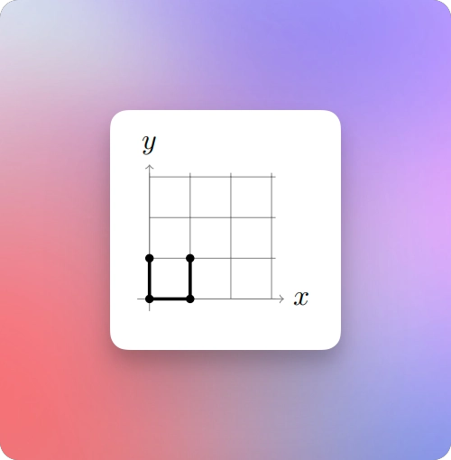
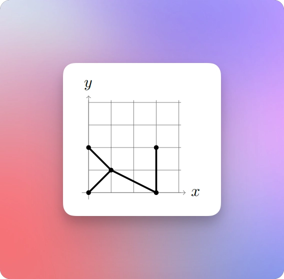

# Building roads to connect cities

## Problem Introduction

* In this problem, the goal is to build roads between some pairs of the given cities such that there is a path between any two cities and the total length of the roads is minimized.

## Problem Description

### Task 

* Given 𝑛 points on a plane, connect them with segments of minimum total length such that there is a path between any two points. 
* Recall that the length of a segment with endpoints (𝑥1, 𝑦1) and (𝑥2, 𝑦2) is equal to 
$\sqrt{(𝑥1 − 𝑥2)^2 + (𝑦1 − 𝑦2)^2}$.

### Input Format 

* The first line contains the number 𝑛 of points. 
* Each of the following 𝑛 lines defines a point (𝑥𝑖 , 𝑦𝑖).

### Constraints 

* $1 ≤ 𝑛 ≤ 200; −10^3 ≤ 𝑥𝑖, 𝑦𝑖 ≤ 10^3$ are integers. 
* All points are pairwise different, no three points lie on the same line.

### Output Format 

* Output the minimum total length of segments. 
* The absolute value of the difference between the answer of your program and the optimal value should be at most $10^{−6}$. 
* To ensure this, output your answer with at least seven digits after the decimal point (otherwise your answer, while being computed correctly, can turn out to be wrong because of rounding issues).

### Time Limit

| language   	 | C 	 | C++ 	 | Java 	 | Python 	 | C# 	 | Haskell 	 | JavaScript 	 | Ruby 	 | Scala 	 |
|-------------|----|------|-------|---------|-----|----------|-------------|-------|--------|
| time (sec) 	 | 2 	 | 2   	 | 3    	 | 10     	 | 3  	 | 4       	 | 10         	 | 10   	 | 6     	 |

### Memory Limit

* 512 MB

### Sample 1

**Input**

```markdown
4
0 0
0 1
1 0
1 1
```

**Output**

```markdown
3.000000000
```



* An optimal way to connect these four points is shown below. 
* Note that there exists other ways of connecting these points by segments of total weight 3.

### Sample 2

**Input**

```markdown
5
0 0
0 2
1 1
3 0
3 2
```

**Output**

```markdown
7.064495102
```



* An optimal way to connect these five points is shown below.

