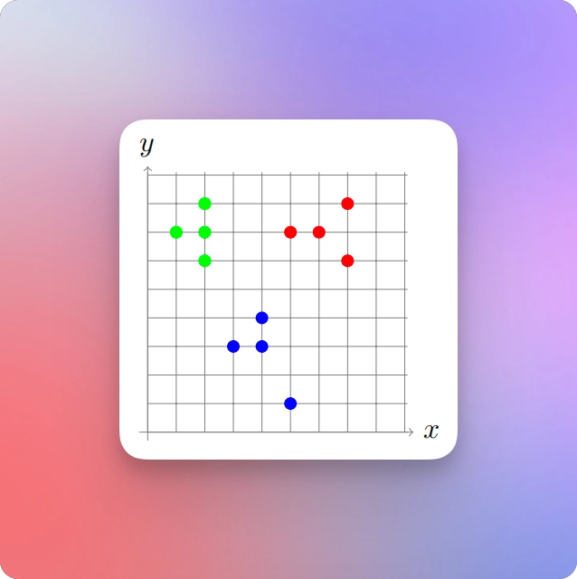
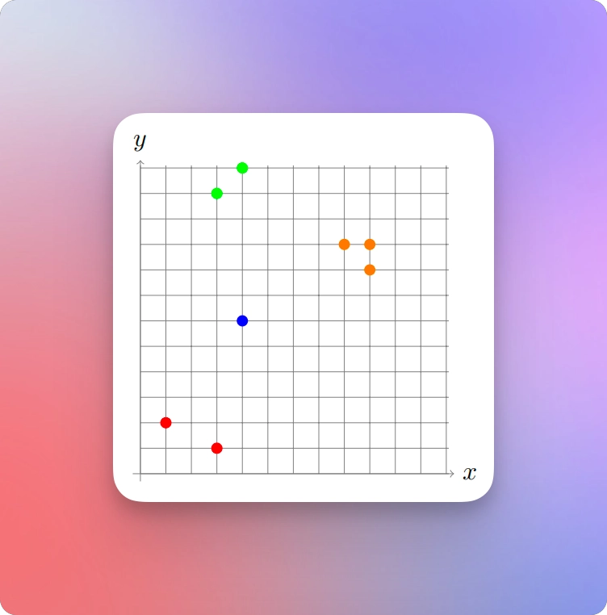
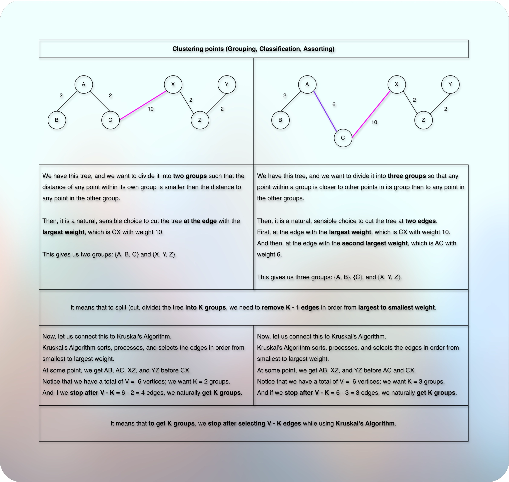

# Grouping (Classify, Organize, Assort): Clustering

## Problem Introduction

* Clustering is a fundamental problem in data mining. 
* The goal is to partition a given set of objects into subsets (or clusters) in such a way that any two objects from the same subset are close (or similar) to each other, while any
two objects from different subsets are far apart.

## Problem Description

### Task 

* Given 𝑛 points on a plane and an integer 𝑘, compute the largest possible value of 𝑑 such that the given points can be partitioned into 𝑘 non-empty subsets in such a way that the distance between any two points from different subsets is at least 𝑑.

### Input Format 

* The first line contains the number 𝑛 of points. Each of the following 𝑛 lines defines a point (𝑥𝑖 , 𝑦𝑖). 
* The last line contains the number 𝑘 of clusters.

### Constraints 

* $2 ≤ 𝑘 ≤ 𝑛 ≤ 200; −10^3 ≤ 𝑥𝑖 , 𝑦𝑖 ≤ 10^3$ are integers. 
* All points are pairwise different.

### Output Format 

* Output the largest value of 𝑑. 
* The absolute value of the difference between the answer of your program and the optimal value should be at most $10^{−6}$. 
* To ensure this, output your answer with at least seven digits after the decimal point (otherwise your answer, while being computed correctly, can turn out to be wrong because of rounding issues).

### Time Limit

| Language   | C | C++ | Java | Python | C# | Haskell | JavaScript | Ruby | Scala |
|------------|---|-----|------|--------|----|---------|------------|------|-------|
| Time (Sec) | 2 | 2   | 3    | 10     | 3  | 4       | 10         | 10   | 6     |


### Memory Limit

* 512 MB

### Sample 1

**Input**

```markdown
12
7 6
4 3
5 1
1 7
2 7
5 7
3 3
7 8
2 8
4 4
6 7
2 6
3
```

**Output**

```markdown
2.828427124746
```

**Explanation**

* The answer is $\sqrt8$. 



* The corresponding partition of the set of points into three clusters is shown above.

### Sample 2

**Input**

```markdown
8
3 1
1 2
4 6
9 8
9 9
8 9
3 11
4 12
4
```

**Output**

```markdown
5.000000000
```

**Explanation**



* The answer is 5. 
* The corresponding partition of the set of points into four clusters is shown above.

## Thought Process



* As shown in the above image, to get **K groups**, we need to **remove `K - 1` edges** in order from largest to smallest weight.
* However, we are not getting the readily available MST.
* We get coordinated points.
* So, first we need to connect all the points.
* And when it comes to connect all the objects, MST is a natural, sensible choice.
* And we have already learned about how to connect coordinated points in the previous example.
  * Reference: [010buildingRoads.md](010buildingRoads.md)

### Overall Flow Diagram (Simple)

* So, the overall flow becomes:

```markdown
              ALL POINTS
                  │
                  ▼
         Build Minimum Spanning Tree
                  │
                  ▼
            One connected tree
                  │
                  ▼
       Need k connected components
                  │
                  ▼
        Remove k - 1 largest edges
                  │
                  ▼
              k clusters
                  │
                  ▼
       Spacing = smallest remaining
          cross-cluster distance
```

* And we stop after selecting `V - K` edges.
* So, it becomes:

```markdown

Calculate all pairwise distances
↓
Sort all edges by distance
↓
Start with n separate components
↓
Kruskal merge
↓
Stop after successfully selecting (merging, connecting) `V - K` edges to get K groups
↓
Look at the next useful edge
↓
That edge's weight = answer

```

### What do we need for Kruskal's Algorithm?

* Kruskal's Algorithm sorts, processes, and selects the **edges** in order from **smallest to largest weight**.
* How do we get edges and corresponding weights?
* We have points.
* We calculate the distance of all the points from each other!
* How do we do that?
---

```kotlin

for (i in 0 until size) {
    for (j in 0 until size) {
        val cost = euclideanDistance(i, j)
        edges.add(Edge(i, j, cost)) // Edge(val from: Int, val to: Int, val weight: Int)
    }
}

```

---

* And to optimize it a little bit, we can avoid already selected vertices (points).
* For example, AB is equal to BA.
* So, when we start processing BA, we check if A is already selected.
* If A is already selected, we skip calculating and storing the distance for this pair.
* Similarly, we don't need to calculate the distance from the same vertex to the same vertex for each vertex.
* For example, we don't need to calculate the distance from A to A, or B to B, or C to C, and so on...
* So, it may look like below:

---

```kotlin

for (i in 0 until size) {
    for (j in 0 until size) {
        if ((selected[i] && selected[j]) || (i == j))  continue
        val cost = euclideanDistance(i, j)
        edges.add(Edge(i, j, cost)) // Edge(val from: Int, val to: Int, val weight: Int)
        selected[i] = true
        selected[j] = true
    }
}

```

---

* Now, we follow the standard Kruskal's Algorithm.
  * Reference: [020kruskalsAlgorithmToFindMst.md](../010lectures/020kruskalsAlgorithmToFindMst.md)
* We sort the edges in order from smallest to largest weight.
* Then, we process each edge.
* Initially, each point is its own cluster.
* Then, as we process each edge, we check the root of both the points (DSU find operation with path compression).
* If their roots are the same, we skip.
* Otherwise, we merge (union) them, and update corresponding roots/ranks as per DSU union by rank heuristic.
* We mark the edge as selected.
* We stop after processing `V - K` edges.