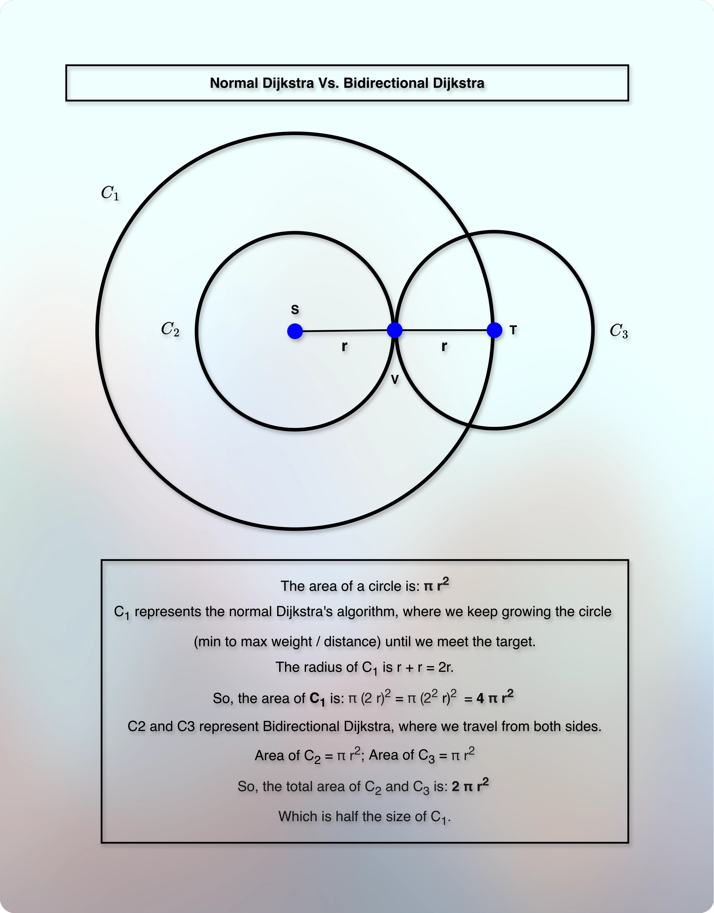
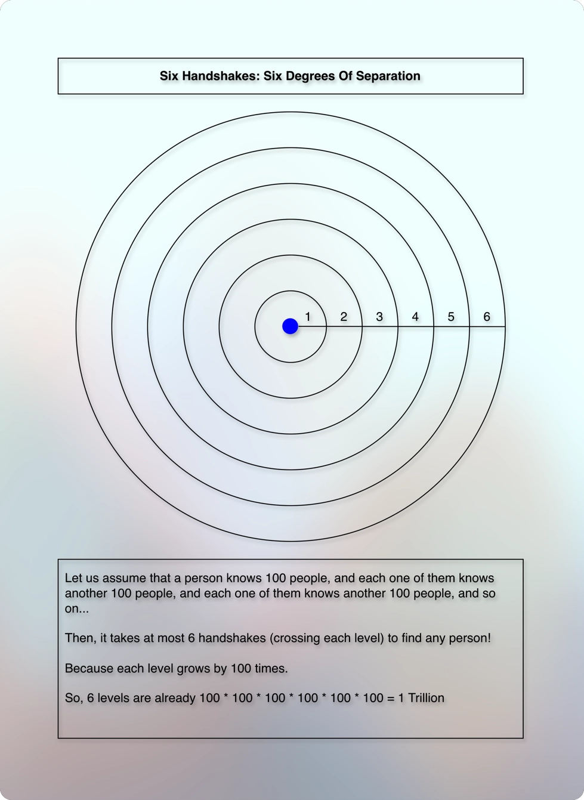
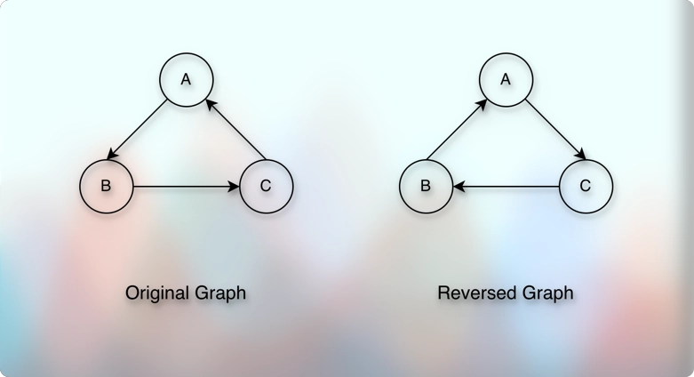
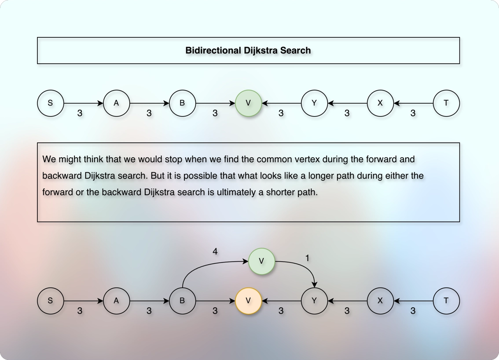

# Bidirectional Dijkstra

## Prerequisites

* [Dijkstra Algorithm.md](../../module04pathsInGraph02/010lectures/030dijkstrasAlgorithm.md)

## References

* [Practical Visual Comparison By PhysicsFX](https://youtu.be/JHgk9ZgHXjY?si=GGQ_LUa716OMFUZM)

## Concept

* Assume that there are two friends: A and B.
* They want to meet.
* We have three options: 
  * A travels towards B.
  * B travels towards A.
  * Both travel towards each other.
* Now, it is natural that if they both travel towards each other, they will meet faster.
* If we total the work done by A + the work done by B, it is almost similar to the cost if either only A had traveled towards B or B had traveled towards A.
* But then why do we say that when both travel towards each other, it is faster compared to when only one of them travel towards the other?
* Because when they both travel towards each other, the travel space that each one covers is reduced by almost half the total space.
* This is the general intuition behind Bidirectional Dijkstra.
---
* We saw the idea (intuition) that if both the source and the target travel towards each other, it improves the performance.
* In the practice, we don't travel simultaneously.
* But it doesn't change the fact that we still reduce the search space.
* And we can still get some benefits.
* To understand, we take an example of a circle.
---



* We can see that Bidirectional Dijkstra is almost twice the faster than the normal Dijkstra.
* But there is even more practical insights.
---
* Six Handshakes



* We are going to see a significant difference in the performance between a simple Dijkstra's Algorithm Vs. the Bidirectional Dijkstra's Algorithm.
* Assume that in a social network, a person knows 100 people, and each one of them knows another 100 people, and each one of them knows another 100 people, and so on...
* We can represent it in the form of circles. 
* We start with one person, and we draw a circle around the person to indicate the direct connection between that person and the 100 people.
* And because each one of this 100 people knows another 100 people, we draw another circle around those 100 people and so on...
* The two closest circles indicate the direct connections.
* Otherwise, every time we go beyond the direct connections, it is like crossing a level.
* Each level grows by 100 times.
* So, in the first level, we have 100 people ($100^1$).
* In the second level, we get 100 * 100 people ($100^2$).
* In the third level, we get 100 * 100 * 100 people ($100^3$).
* And so on...
* In the sixth level, we get ($100^6$) = 1 Trillion people.
---
* 
* Now, assume that we want to find a target person from the last level.
* The conceptual work for the normal Dijkstra's Algorithm would be to visit approximately $100^6 = 10^{12}$ people.
* On the other hand, if we use the Bidirectional Dijkstra, it becomes $100^3 + 100^3 = 2 * 10^6$.
* This difference is enormous.
---
* But how do we travel backward from the target vertex T to the source vertex S?
* We use two graphs.
* The original graph and the reversed graph.



* And then we perform normal Dijkstra on both the graphs.
* In the original graph, we travel from the source vertex S to the target vertex T.
* And in the reversed graph, we travel from the target vertex T to the source vertex S.
* And when we find a common vertex from both the forward and the backward traversal, we stop.
---
* However, notice that meeting at the middle, or finding the common vertex point does not mean that the global shortest path goes through that vertex only.
* For example:



* We need to understand what the `dist` array and the `priority queue` represent in the Dijkstra's algorithm.
* So, let us recall some implications of them in the normal Dijkstra's algorithm.
---
* Initially, all the values in the `dist` is `MAX`.
* Then, we start with the source and set its `dist` value to `0`.
* Then, we add `(distance, vertex)` to the priority queue.
* And then, as long as the priority queue is not empty, we repeat the below process:
* We extract the vertex.
* We inspect the outgoing edges.
* Each outgoing edge gives us the ending (destination, target, to) vertex.
* We call it discovery.
* It is like as if we are saying "we discovered a path to this vertex".
* The path doesn't have to be the final path.
* This is just a discovery.
* We check the `dist` value of that ending (destination, target, to) vertex.
* If we find that `dist[to] > dist[from] + weight(from, to)`, then we relax the edge.
* We update the corresponding `dist` for `to`.
* And when we relax the edge, we add `(distance, to)` to the priority queue.
* Now, adding `(distance, vertex)` to the priority queue does not mean that the `distance` is the final shortest distance for the `vertex`.
* We might add the same or different `distance` values for the same `to` vertex in the priority queue due to different connections and paths.
* So, a priority queue can have the same vertex with different values.
* Each `(distance, vertex)` value in the priority queue says that "there is a path to this vertex, and it costs us the `distance` value."
* We get the final shortest distance of a vertex only when we `poll` from the priority queue.
---
* The values in `dist` may decrease, but it cannot increase.
* Whenever we store or update some value in `dist`, it is like as if we are saying **"the value cannot be more than this."**
* So, it is like as if we are storing the **upper bound** in the `dist` and we keep decreasing this **upper bound** in the `dist` whenever we get the opportunity.
* We get this opportunity through **edge relaxation**.
* Similarly, the values of the `top` elements in our `min - heap priority queue` keep increasing.
* It starts with `0` and then it increases.
* Each `top` element conveys that "shortest path cannot be shorter than this".
* In other words, each `top` element has the **lower bound** of the shortest path.
* And as we make progress, this lower bound keeps increasing.
* Also, once we `poll` from the priority queue, the corresponding `dist` value is final. 
* It cannot decrease further.
* So, the `poll` says something like "the value cannot be smaller than this for the corresponding vertex".
* The `poll` operation finalizes the corresponding `dist` value.
* In terms of distance, for the `(distance, vertex)` we get from `poll`, we can say that the `vertex` cannot have any shorter (smaller) distance (from the source) than this `distance`.  
---
* So, in short, each value in the `dist` is the "upper bound of the shortest path" that goes through the corresponding vertex.
* In other words, it says that "the shortest path that goes through me cannot be larger than this value."
* Each `top` element of the `min-heap priority queue` is the "lower bound of the shortest path".
* In other words, it says that "the shortest path that goes through me will be at least of this value."
* The `poll` stamps (finalizes) the shortest path for the corresponding vertex.
* In other words, it says that "the shortest distance (from the source) to this vertex cannot be shorter/smaller than this value."
---
* So, we look for a vertex that either the forward or the backward search has finalized.
* So, a vertex that one of them have `polled`.
* We take the corresponding `dist` value of such a vertex.
* Using that value, we perform: `min = minOf(min, value)`.
* Here, `min` represents the **upper bound**.
* It says that "We are expecting a lower value than this".
* It waits for the next `min` value, but it does not wait forever.
* It observes the stop condition.
---
* If we combine all these representatives and their implications (perspectives), we get:
* Upper bound from `min` that expects lower values.
* Lower bound from the `top` elements of the priority queue.
* At any point, if we ever find that `lower bound >= upper bound`, it becomes our **stop condition**.
---
**Recap:**

* Bidirectional Dijkstra Search = Forward Search + Backward Search
* Forward Search = Original graph = From S to T
* Backward Search = Reversed graph = From T to S
* When do we stop?
* In the middle?
* Nah! The middle doesn't have to be the shortest path!
* Or: The shortest path doesn't have to go through the middle.
* Then?
* We track the complete path.
* Why? Because we are trying to find the shortest complete path!
* Ok. How do we track the complete path?
* Or in other words, how do we find the shortest complete path among all the complete paths we find?

```kotlin
var min = minOf(min, distance)
```

* Every time we get a complete path, we maintain the `min` among them.
* The `min` says: "This is the minimum value of a complete path. I expect a lower value than this. The subsequent `min` value will be either equal to the immediate previous `min` or strictly lower than that. I better prefer that you call me only when you have a lower subsequent value. Otherwise, exit early." 
* So, if the `min` changes, then the new value must be smaller than or equal to the previous `min` value.
* It cannot expect a higher value than the previous `min` value.
* So, it is strictly non-increasing.
* So, either it stops changing or it keeps decreasing. 
* In other words, the `min` value represents the `upper bound`.

---

* But how do we get the complete path?
* When we get the final distance of a particular vertex.
* When do we get the final distance for a particular vertex?
* When we `poll`.
* Ok. So, when we `poll`, we get the final distance for a particular vertex.
* So what? Then what? What do we do with that? 
* How do we use that to get the complete path?
* Whenever we get the final distance for a vertex in any of the searches, we check the `dist` value of other search for the same vertex.
* If it is not the default value in other search, then:

```kotlin
if (distOther[v] != MAX) {
  val distance = distThis[v] + distOther[v]
  min = minOf(min, distance)
}
```
* This is how we maintain the total minimum distance among all the complete paths we find.
* Until when do we keep finding the complete path and keep maintaining the minimum among them?
* The stop condition is:

```markdown
if (lowerBound >= upperBound) {
    stop, exit, no need to find the complete path for the remaining vertex/vertices
}
```

## Explanation of code with implications (meaning)

* Dijkstra inspects all the outgoing edges of the polled vertex.
* So, we need a vertex using which we can inspect its edges.
* Clearly, we need an `adjacencyList`.
* The `adjList` gives us the edges corresponding to a particular vertex.
* We use direct-addressing.
* So, we are expecting that `adjList[index]` gives us the corresponding list of edges.
* So, the `adjList` becomes:

```kotlin
private val adjList = List(totalVertices) { mutableListOf<Edge>() }
```

* And to inspect each edge, we need the `Edge` data class.
* When we inspect each edge, we are trying to find two things:
  * Where can we go using this edge? To which vertex do we reach using this edge?
  * How much does that cost to reach that vertex?
* So, the edge data class becomes:

```kotlin
data class Edge(val to: Int, val weight: Long)
```
---

* We get the standard input in the form of `from, to, weight` using which we need to build the `adjList`.
* So, for a directed graph, it becomes:

```kotlin
fun addEdge(from: Int, to: Int, weight: Int) {
    adjList[from].add(Edge(to, weight))
}
```

* And for an undirected graph, it becomes:


```kotlin

fun addEdge(from: Int, to: Int, weight: Int) {
    adjList[from].add(Edge(to, weight))
    adjList[to].add(Edge(from, weight))
}

```

* If it is a directed graph, we need a reverse graph as well.
* To reverse the graph, we iterate through the existing `adjList`.
* And for each edge, we reverse the direction.
* So, it might look something like below:


```kotlin

private val revAdjList = List(totalVertices) { mutableListOf<Edge> }

fun reverseGraph() {
    for ((vertex, edges) in adjList.withIndex()) {
        for ((to, weight) in edges) {
            revAdjList[to].add(Edge(vertex, weight))
        }
    }
}

```


---

* Dijkstra uses a `dist` array to store the distance for each vertex.
* Again, we ues the direct-addressing method.
* And initially, we don't know the distance of any vertex.
* So, the default value becomes: `MAX`.
* And we use two `dist`.
* Because we have two Dijkstra: Forward and backward. 
* So, it becomes:

```kotlin
private val distForward = IntArray(totalVertices) { Int.MAX_VALUE }
private val distBackward = IntArray(totalVertices) { Int.MAX_VALUE }
```

---

* And to track and keep the minimum distance of the complete path, we maintain a variable:


```kotlin

var min = Long.MAX_VALUE
```

* We keep it `MAX` so that we can replace it with the real value of any complete path when we perform:

```kotlin

min = minOf(min, distance)
```

---

* When we start, we know the distance from the source to the source is `0`.
* Similarly, for the reversed graph, we start from the target, and move towards the source.
* And we know the distance from the target to the target is `0`.
* So, we use these known values and add them to their corresponding `dist`.
* So, it becomes:

```kotlin

distForward[0] = 0
distBackward[0] = 0
```

---

* Dijkstra uses a `priority queue` to get the minimum from the `top`.
* For each item that we `pop`, Dijkstra uses (needs) two information:
  * The popped vertex and the associated, corresponding distance.
  * `(distance, vertex)`.
  * And yes, we keep the `distance` parameter first due to the way our `priority queue` works.
  * We want to sort by `distance` in the order of `min to max`.
  * It means that our priority queue will have: `(distance, vertex)` pair.
---

* We use two Dijkstra here: Forward and backward.
* So, we use two `priority queues` here.

```kotlin
private val forwardPriorityQueue = PriorityQueue(
    compareBy<Pair<Int, Int>> { it.first }.thenBy { it.second }
)

private val backwardPriorityQueue = PriorityQueue(
    compareBy<Pair<Int, Int>> { it.first }.thenBy { it.second }
)
```

---

* Now, we repeat the standard Dijkstra process for each search.
* As long as the queue is not empty, we repeat:
* Poll.
* `if (distance > dist[polledVertex]) continue` (skip).
* Otherwise: 
* `(distance, polledVertex)` indicates that this is the final `distance` of the associated `polledVertex`.
* And at this point, we can check if the other search has also some tentative distance for the same vertex.
* So, we check:

```kotlin

if (distOther[polledVertex] != Int.MAX_VALUE) {
    val distance = distThis[polledVertex] + distOther[polledVertex]
    min = minOf(min, distance)
}
```

* Also, we get the outgoing edges of this vertex:
* `val edges = adjList[polledVertex]`
* For each edge:
* `for ((to, weight) in edges)`
* We check:
* `if (dist[to] > dist[polledVertex] + weight)`
* Then, we relax the edge:

```kotlin

val distance = dist[polledVertex] + weight
dist[to] = distance
queue.addLast(distance to to) // Enqueue only for the relaxed edges
```

* And we come back to the loop condition.
* But we don't want to check all the vertices and possible paths from Source to Target.
* Similarly, we don't want to check all the vertices and possible paths from Target to Source.
* So, as we have **early exit** condition in a normal Dijkstra, we have a **stop condition** in Bidirectional Dijkstra.

```markdown

lowerBound >= upperBound
```

* Which is:

```kotlin


val nextForwardDistance = forwardPriorityQueue.peek().distance
val nextBackwardDistance = backwardPriorityQueue.peek().distance

if (nextForwardDistance + nextBackwardDistance >= min) {
    break
}

```

* What does the `peek().distance` imply?
* This is the `min-heap (priority queue)`.
* And we have seen that each next `top` element will have a value greater than or equal to the current `top` element.
* In other words, either it remains the same or it increases.
* And to get the distance of the complete path, we add them together.
* So, `nextForwardDistance + nextBackwardDistance` represents a value for a complete path.
* It means that each subsequent total value will be either the same as the previous one or it will be higher than the previous one. 
* The total says that: "I am the lowest complete path value. Get me or prepare for either the same value or the higher value."
* On the other hand, recall that `min` expects: Either the same value or a lower one. 
* So, either `min` remains the same or it decreases. 
* It means once the total value becomes equal to or greater than `min`, it cannot produce any lower value than that in the future.
* So, the moment the total value becomes equal to or greater than `min`, we can exit early.
* Because all the subsequent total value will be either the same or the greater value than the previous values.
* But `min` expects either the same or a lower one.
* So, if we (the total) cannot give a lower value to `min`, we better exit.
* Especially, the break (early exit) condition says that:
* "The total value is either equal to the `min` or greater than the `min`. And this will be true for all the subsequent total value. So, neither current nor any future total value will produce a lower value than the current `min`. So, exit early with the current `min` value. The current `min` value is your answer to: Shortest complete path."

---

* Also, we know that the forward search and the backward search do not run simultaneously.
* So, how does that work?
* As we know that Dijkstra's algorithm is a greedy algorithm, we always look for the `minimum`.
* So, at any moment, whether to iterate over the forward search or the backward search, depends on the answer to: Who gives the smallest tentative complete path?
* How do we get the answer to that question? From where?
* From the `top` elements - that we also use for the **exit early** condition.
* So, it becomes:

```kotlin

if (nextForwardDistance <= nextBackwardDistance) {
    // iterate over the forward search
} else {
    // iterate over the backward search
}

```

## Questions

* Why is it so that Bidirectional Dijkstra is even faster in the case of social network than compared to the road network?
  * Because the bigger (larger) the area, the larger the search space we save (cut).
* Why is this applicable to undirected and non-negative weighted graph only?
  * Because it is Dijkstra. We use Dijkstra only on non-negative-weighted graphs only.
  * We can use Dijkstra's algorithm (and Bidirectional Dijkstra) on both directed and undirected graphs as long as the graph does not contain any negative-weighted edge/s.
* How do we interpret the phrase "when we find a common vertex processed by forward and backward search"? Is it related to discovery or finalization? How and when do we conclude it?
  * The common vertex is the vertex for which at least one of the searches has finalized the distance and the other search has at least some tentative value (instead of the default value).
* How do we calculate, and conclude the complete path? When?
  * Whenever we get the common vertex.
  * See the definition, implication, interpretation of the "common vertex" in the above question.
  * Once we have such a common vertex:
  ```markdown
  if (distOther[v] != MAX) {
      val distance = distThis[v] + distOther[v]
      min = minOf(min, distance)  
  }
  ``` 
* 