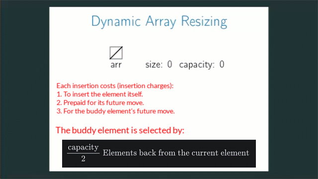
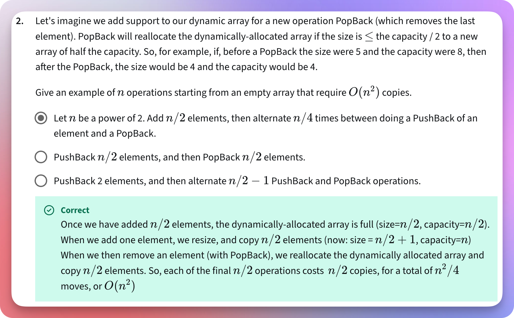
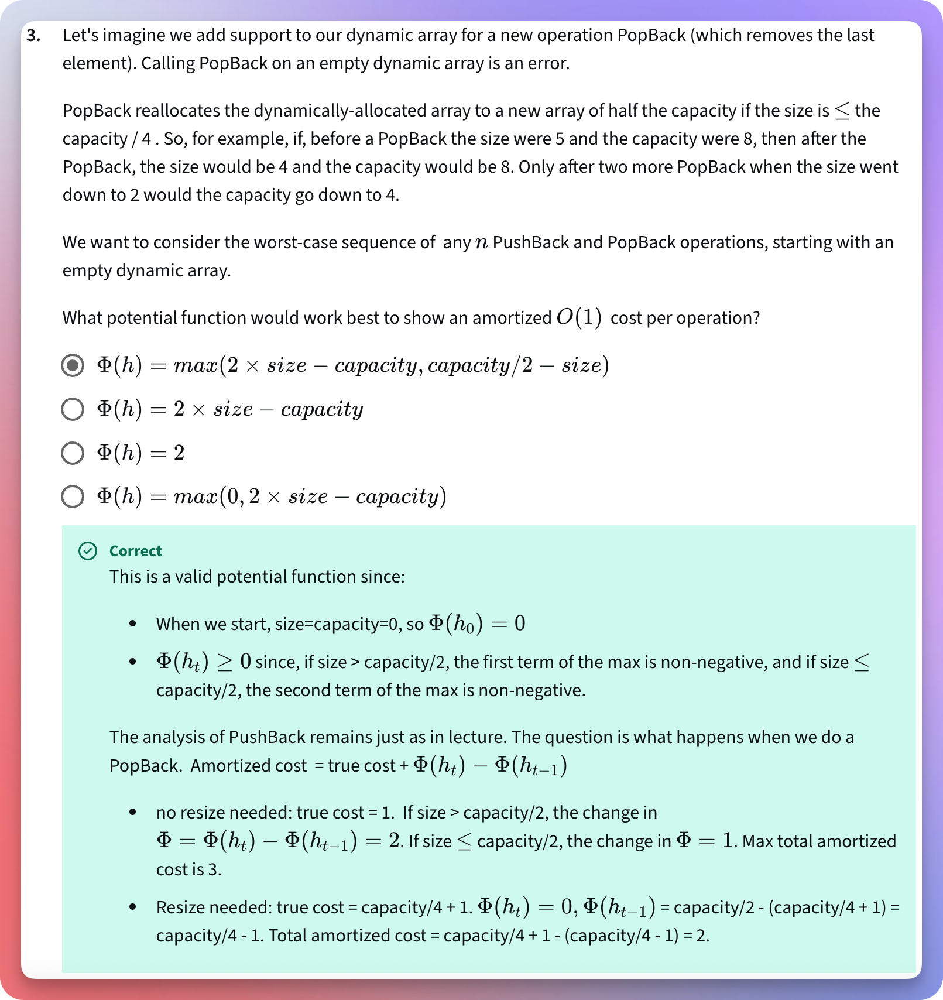

# Dynamic Arrays

<!-- TOC -->
* [Dynamic Arrays](#dynamic-arrays)
  * [References / Resources](#references--resources)
  * [What is a dynamic array? How a dynamic array is different from a fixed size static array?](#what-is-a-dynamic-array-how-a-dynamic-array-is-different-from-a-fixed-size-static-array)
  * [What is the time complexity of adding more items to a dynamic array?](#what-is-the-time-complexity-of-adding-more-items-to-a-dynamic-array)
  * [What is the difference between the `Amortized` and `Worst-Case` Time Complexity of a dynamic array?](#what-is-the-difference-between-the-amortized-and-worst-case-time-complexity-of-a-dynamic-array)
  * [How do we resize the array?](#how-do-we-resize-the-array)
  * [Why do we double the size of an array? Isn't it inefficient? Don't we waste too much space also?](#why-do-we-double-the-size-of-an-array-isnt-it-inefficient-dont-we-waste-too-much-space-also)
  * [Aggregated method of Amortized Analysis](#aggregated-method-of-amortized-analysis)
    * [Which insertion operations made the array full?](#which-insertion-operations-made-the-array-full)
    * [Which insertion operations force resize operations?](#which-insertion-operations-force-resize-operations)
    * [When does the last resize operation happen to insert the `nth` element?](#when-does-the-last-resize-operation-happen-to-insert-the-nth-element)
    * [Table format](#table-format)
    * [The mathematical pattern](#the-mathematical-pattern)
      * [What happens in the resize process?](#what-happens-in-the-resize-process)
      * [How do we find the "Power Of 2" in math when the target is (n - 1)?](#how-do-we-find-the-power-of-2-in-math-when-the-target-is-n---1)
  * [The banker method of Amortized Analysis](#the-banker-method-of-amortized-analysis)
    * [How do we select the buddy element?](#how-do-we-select-the-buddy-element)
    * [Process](#process)
      * [Inserting a](#inserting-a)
      * [Inserting b](#inserting-b)
      * [Inserting c](#inserting-c)
      * [Inserting d](#inserting-d)
      * [Inserting e](#inserting-e)
    * [Observation](#observation)
  * [The Physicist's Method (Potential Method) Of Amortized Analysis](#the-physicists-method-potential-method-of-amortized-analysis)
    * [The rules (assumption) of the potential function](#the-rules-assumption-of-the-potential-function)
    * [Intuition](#intuition)
    * [Mathematical Representation](#mathematical-representation)
      * [Part-01: Mathematical Representation: Notations, Relations, And Expressions](#part-01-mathematical-representation-notations-relations-and-expressions)
        * [Amortized Cost](#amortized-cost)
      * [Part-02: Mathematical Representation: The General Potential Formula](#part-02-mathematical-representation-the-general-potential-formula)
        * [How did we come up with that formula?](#how-did-we-come-up-with-that-formula)
          * [Part-01: Potential Formula](#part-01-potential-formula)
          * [Part-02: Potential Formula](#part-02-potential-formula)
      * [Part-03: Mathematical Representation: Amortized Analysis](#part-03-mathematical-representation-amortized-analysis)
        * [Case-01: We have the room. We don't have to resize the array](#case-01-we-have-the-room-we-dont-have-to-resize-the-array)
        * [Case-02: We don't have a room. We double the array size](#case-02-we-dont-have-a-room-we-double-the-array-size)
  * [Why is any other factor other than two not optimal?](#why-is-any-other-factor-other-than-two-not-optimal)
    * [How did we get this average cost per insertion formula?](#how-did-we-get-this-average-cost-per-insertion-formula)
      * [The Geometric Series](#the-geometric-series)
    * [The Conclusion](#the-conclusion)
  * [What is the space complexity of a dynamic array?](#what-is-the-space-complexity-of-a-dynamic-array)
  * [MCQ-01](#mcq-01)
    * [Understanding the problem (the question, the requirements)](#understanding-the-problem-the-question-the-requirements)
    * [The area of focus: What is asked?](#the-area-of-focus-what-is-asked)
    * [The area of focus: What do we need to do? How?](#the-area-of-focus-what-do-we-need-to-do-how)
    * [Understanding the options](#understanding-the-options)
      * [Option#01: PushBack 2 Elements. Then, alternate $\frac{n}{2} - 1$ PushBack and PopBack operations](#option01-pushback-2-elements-then-alternate-fracn2---1-pushback-and-popback-operations)
        * [Initially](#initially)
        * [`PushBack 1`](#pushback-1)
        * [`PushBack 2`](#pushback-2)
        * [`Alternate` $\frac{n}{2} - 1$ `times PushBack and PopBack`](#alternate-fracn2---1-times-pushback-and-popback)
          * [1st Time: `PushBack`](#1st-time-pushback)
          * [1st Time: `PopBack`](#1st-time-popback)
          * [2nd Time: `PushBack`](#2nd-time-pushback)
          * [2nd Time: `PopBack`](#2nd-time-popback)
          * [3rd Time: `PushBack`](#3rd-time-pushback)
          * [3rd Time: `PopBack`](#3rd-time-popback)
        * [Evaluation](#evaluation)
      * [Option#02: Let `n` be a power of 2. Add $\frac{n}{2}$ elements, then alternate $\frac{n}{4}$ times between doing a PushBack of an element and a PopBack](#option02-let-n-be-a-power-of-2-add-fracn2-elements-then-alternate-fracn4-times-between-doing-a-pushback-of-an-element-and-a-popback)
        * [Initially](#initially-1)
        * [Add $\frac{n}{2}$ elements = Add $\frac{8}{2} = 4$ elements](#add-fracn2-elements--add-frac82--4-elements)
          * [Add 1st element](#add-1st-element)
          * [Add 2nd element](#add-2nd-element)
          * [Add 3rd element](#add-3rd-element)
          * [Add 4th element](#add-4th-element)
        * [Alternate $\frac{n}{4}$ times = $\frac{8}{4}$ = 2 times: What to alternate? `PushBack`, followed by `PopBack`](#alternate-fracn4-times--frac84--2-times-what-to-alternate-pushback-followed-by-popback)
          * [1st `PushBack`](#1st-pushback)
          * [1st `PopBack`](#1st-popback)
          * [2nd `PushBack`](#2nd-pushback)
          * [2nd `PopBack`](#2nd-popback)
        * [Evaluation](#evaluation-1)
      * [Option#03: PushBack $\frac{n}{2}$ elements, and then PopBack $\frac{n}{2}$ elements](#option03-pushback-fracn2-elements-and-then-popback-fracn2-elements)
        * [Initially](#initially-2)
        * [PushBack $\frac{n}{2} = \frac{8}{2} = 4$ elements](#pushback-fracn2--frac82--4-elements)
          * [1st `PushBack`](#1st-pushback-1)
          * [2nd `PushBack`: Resize](#2nd-pushback-resize)
          * [3rd `PushBack`: Resize](#3rd-pushback-resize)
          * [4th `PushBack`](#4th-pushback)
        * [PopBack $\frac{n}{2} = \frac{8}{2} = 4$ elements](#popback-fracn2--frac82--4-elements)
          * [1st `PopBack`](#1st-popback-1)
          * [2nd `PopBack`: Resize](#2nd-popback-resize)
          * [3rd `PopBack`: Resize](#3rd-popback-resize)
          * [4th `PopBack`](#4th-popback)
        * [Evaluation](#evaluation-2)
      * [Conclusion](#conclusion)
    * [Solution image](#solution-image)
  * [MCQ: 02](#mcq-02)
    * [The area of focus](#the-area-of-focus)
    * [Understanding the problem (requirements)](#understanding-the-problem-requirements)
      * [The Potential Function: What are the conditions for any potential function?](#the-potential-function-what-are-the-conditions-for-any-potential-function)
    * [What are the worst-case sequences of `PushBack` and `PopBack`?](#what-are-the-worst-case-sequences-of-pushback-and-popback)
    * [Value Set Up](#value-set-up)
      * [Initial Values](#initial-values)
      * [Negativity Check](#negativity-check)
        * [Normal Operations: No Resize](#normal-operations-no-resize)
          * [PushBack](#pushback)
          * [PopBack](#popback)
        * [Resize Operations](#resize-operations)
          * [PushBack: The array grows and gets twice the capacity of the old array.**](#pushback-the-array-grows-and-gets-twice-the-capacity-of-the-old-array)
          * [PopBack: The array shrinks and gets half the capacity of the old array.**](#popback-the-array-shrinks-and-gets-half-the-capacity-of-the-old-array)
        * [Finalization](#finalization)
          * [PushBack](#pushback-1)
          * [PopBack](#popback-1)
          * [Amortized Cost](#amortized-cost-1)
    * [Option-01: $\phi(h) = max(2 * size - capacity, \frac{capacity}{2} - size)$](#option-01-phih--max2--size---capacity-fraccapacity2---size)
      * [Initial Condition](#initial-condition)
      * [Resize Operation: Through `PushBack`](#resize-operation-through-pushback)
        * [Previous State (i - 1): Using Maths](#previous-state-i---1-using-maths)
        * [Previous State (i - 1): Using Values](#previous-state-i---1-using-values)
        * [After State (i): Using Maths](#after-state-i-using-maths)
        * [After State (i): Using Values](#after-state-i-using-values)
      * [PushBack: Amortized Cost = Actual Cost + Potential Difference](#pushback-amortized-cost--actual-cost--potential-difference)
        * [Using Maths](#using-maths)
        * [Using Values](#using-values)
      * [Resize Operation: Through `PopBack`](#resize-operation-through-popback)
        * [Previous State (i - 1): Using Maths](#previous-state-i---1-using-maths-1)
        * [Previous State (i - 1): Using Values](#previous-state-i---1-using-values-1)
        * [After State (i): Using Maths](#after-state-i-using-maths-1)
        * [After State (i): Using Values](#after-state-i-using-values-1)
      * [PopBack: Amortized Cost = Actual Cost + Potential Difference](#popback-amortized-cost--actual-cost--potential-difference)
        * [Using Maths](#using-maths-1)
        * [Using Values](#using-values-1)
      * [Conclusion](#conclusion-1)
    * [Option:02: $\phi(h) = 2 * size - capacity$](#option02-phih--2--size---capacity)
      * [Initial Condition](#initial-condition-1)
      * [Negativity Check: For `PushBack`](#negativity-check-for-pushback)
        * [Previous state (i - 1): Using Maths](#previous-state-i---1-using-maths-2)
        * [Previous state (i - 1): Using Values](#previous-state-i---1-using-values-2)
        * [After state (i): Using Maths](#after-state-i-using-maths-2)
        * [After state (i): Using Values](#after-state-i-using-values-2)
      * [Negativity Check: For `PopBack`](#negativity-check-for-popback)
        * [Previous state (i - 1): Using Maths](#previous-state-i---1-using-maths-3)
        * [Previous state (i - 1): Using Values](#previous-state-i---1-using-values-3)
      * [Conclusion](#conclusion-2)
    * [Option: 03: $\phi(h) = 2$](#option-03-phih--2)
      * [Initial Condition](#initial-condition-2)
      * [Conclusion](#conclusion-3)
    * [Option: 04: $\phi(h) = max(0, 2 * size - capacity)$](#option-04-phih--max0-2--size---capacity)
      * [Initial Condition](#initial-condition-3)
      * [Negative check: For `PushBack`](#negative-check-for-pushback)
        * [Previous state (i - 1): Using Maths](#previous-state-i---1-using-maths-4)
        * [Previous state (i - 1): Using Values](#previous-state-i---1-using-values-4)
        * [After state (i): Using Maths](#after-state-i-using-maths-3)
        * [After state (i): Using Values](#after-state-i-using-values-3)
      * [PushBack: Amortized Cost = Actual Cost + Potential Difference](#pushback-amortized-cost--actual-cost--potential-difference-1)
        * [Using Maths](#using-maths-2)
        * [Using Values](#using-values-2)
      * [Negativity Check: For `PopBack`](#negativity-check-for-popback-1)
        * [Previous state (i - 1): Using Maths](#previous-state-i---1-using-maths-5)
        * [Previous state (i - 1): Using Values](#previous-state-i---1-using-values-5)
        * [After state (i): Using Maths](#after-state-i-using-maths-4)
        * [After state (i): Using Values](#after-state-i-using-values-4)
      * [PopBack: Amortized Cost = Actual Cost + Potential Difference](#popback-amortized-cost--actual-cost--potential-difference-1)
        * [Using Maths](#using-maths-3)
      * [Conclusion](#conclusion-4)
    * [Final Result/Solution](#final-resultsolution)
    * [Solution image](#solution-image-1)
<!-- TOC -->

## References / Resources

* [Reducible: Dynamic Arrays](https://youtu.be/5AllG-i_yto?si=SnwlIy0MStKN3CTD)
* [Reducible: Amortized Analysis](https://youtu.be/Ij7NQ-0mIVA?si=O5O1xvr6XrKuXc2N)
* [122 Videos](https://youtu.be/L8cXZ_4RHt8?si=SpCTF8SHVxBzo2ci)

## What is a dynamic array? How a dynamic array is different from a fixed size static array?

* **Fixed Capacity:** A fixed-size static array has a fixed-size capacity.
* **So?** We cannot add more items to it than its maximum capacity.
* **And Dynamic Arrays?** However, unlike a fixed-size static array, a dynamic array can resize itself.
* **Resize means?** It can grow as we add more items, and it can shrink as we remove items.
* **Example?** Kotlin `ArrayList` is an example of a `Dynamic Array`.

## What is the time complexity of adding more items to a dynamic array?

* There are two different ways to look at it.
* For a dynamic array, the `Amortized time complexity` of adding a new item is `O(1)`.
* Worst-case time complexity, is `O(n)`.

## What is the difference between the `Amortized` and `Worst-Case` Time Complexity of a dynamic array?

* **Synonymous:** `Amortized Time Complexity` is an `Average Time Complexity`.
* **Simple Math:** For example, if we have `n` operations, then `Amortized Cost` is the `cost of those n operations divided by n`.
* **When:** In a dynamic array, we double the size of the array when the array hits the maximum capacity.
* **Worst-Case:** Doubling the size is a worst-case scenario, which takes `O(n)` time.
* **Frequency:** However, we don't have to double the size frequently.
* **Split:** So, if we split the cost across worst-case and best-case scenarios, on average, we get `O(1)` time complexity.
* **Balance:** So, the `Amortized` time complexity is less than the expensive operations, and more than the cheap operations.
* **Purpose:** The purpose is to shift our focus from the worst-case analysis to average time analysis,
and give a more realistic analysis.

## How do we resize the array?

* **When:** As soon as the array reaches maximum capacity, we create a new array twice the size of the previous array.
* **How:** We copy all the items from the previous array and insert each item into the newly created array.
* **Shrink:** Similarly, as soon as the number of items becomes less than half the size of the array, we shrink the array
by creating a new array based on the number of items.
* **Purpose:** The purpose is to **limit the resize operations** in such a way that we get an amortized time complexity of
`O(1)`.

## Why do we double the size of an array? Isn't it inefficient? Don't we waste too much space also?

* **Addition is $O(n^2)$:** Other schemes, such as resizing the array by one or `n` more blocks of memory, take `O(n^2)`
time.
* **Other Factors:** Using any other factor than `2` either increases the resize frequency or results in more wasted
unused allocated memory.
* **Frequency:** On the other hand, doubling the array size takes `O(n)` in the worst case, which happens very infrequently.
* **Average:** So, the average time, known as the amortized time of doubling the array, is `O(1)` only.
* **When:** For space, when the array reaches its maximum capacity, we double its size.
* **Space:** It means that when we double the size, it is half full. So, at max, we get 50% unused allocated memory.
In terms of Big-O, it is `O(n)`.
* **Shrink:** Also, we shrink the array size as soon as we find that the number of items is less than half the size of the array.

## Aggregated method of Amortized Analysis

* Let us assume that we start with an array whose maximum capacity is `1` at the moment.

```markdown
              ┌─────┐
   Indices    │     │
──────────────└─────┘
   Elements   │     │
              └─────┘

```

* We add the first item. This is the first insertion.
* The array is full now.

```markdown
              ┌─────┐
   Indices    │  0  │
──────────────└─────┘
   Elements   │  1  │
              └─────┘

```

* If the number of insertions is denoted by `i`, then `i = 1` made the array full.
* Next, when `i = 2` arrives, we don't have space.
* Notice that for `i = 2`, the total number of insert operations `n = 2`.
* And for `n = 2`, the resize happens at `n - 1` so that we can insert the `nth` element.
* This is going to be an interesting pattern that we always resize the array at `n - 1`.
* Now, we resize the array. We double the size of the array.
* So, the array capacity becomes 2 now.
* We now have the room for `i = 2` (second) operation.
* The insertion number `i = 1` made the array full.
* And for insertion `i = 2`, we have to resize the array.

```markdown
              ┌─────┌─────┐
   Indices    │  0  │  1  │
──────────────└─────└─────┘
   Elements   │  1  │  2  │
              └─────└─────┘
```

* When `i = 3`, we don't have the room.
* So, `i = 3` forces us to resize the array.
* Notice that for each `ith` operation that forces the resize, `i - 1` is always going to be a `power of 2`.
* For example, `i = 3` forces the resize operation. So, `i - 1 = 3 - 1 = 2`, which is a `power of 2`.

```markdown
              ┌─────┌─────┐─────┌─────┐
   Indices    │  0  │  1  │  2  │     │
──────────────└─────└─────┘─────└─────┘
   Elements   │  1  │  2  │  3  │     │
              └─────└─────┘─────└─────┘
```

* The insertion operation `i = 4` takes `O(1)`.
* But when `i = 4`, the array becomes full.
* The insertion operation `i = 4` made the array full.

```markdown
              ┌─────┌─────┐─────┌─────┐
   Indices    │  0  │  1  │  2  │  3  │
──────────────└─────└─────┘─────└─────┘
   Elements   │  1  │  2  │  3  │  4  │
              └─────└─────┘─────└─────┘
```

* The insertion operation `i = 4` made the array full.
* When `i = 5`, it will force us to resize the array.
* Again, `i = 5` means `n = 5`. And it means the resize happens at `n - 1 = 4` so that we can insert the `nth` element.
* Also, `i = 5` forced the resize operation. And `i - 1 = 5 - 1 = 4` is a `power of 2`.
* Once we resize, the insertion operations from `i = 5` to `i = 8` will take `O(1)` time.

```markdown
              ┌─────┌─────┐─────┌─────┐─────┌─────┌─────┌─────┐
   Indices    │  0  │  1  │  2  │  3  │  4  │     │     │     │
──────────────└─────└─────┘─────└─────┘─────└─────└─────└─────┘
   Elements   │  1  │  2  │  3  │  4  │  5  │     │     │     │
              └─────└─────┘─────└─────┘─────└─────└─────└─────┘

```

* When `i = 8`, it will make the array full.
* When `i = 9`, it will force us to resize the array.
* Again, `i = 9` means `n = 9`. The resize happens after `n - 1` so that we can insert the `nth` element.
* Also, `i = 9` forced the resize operation. And `i - 1 = 9 - 1 = 8` is a `power of 2`.
* Once we resize, the insertion operations from `i = 9` to `i = 16` will take `O(1)` time.

```markdown
// i = 8 makes the array full.


              ┌─────┌─────┐─────┌─────┐─────┌─────┌─────┌─────┐
   Indices    │  0  │  1  │  2  │  3  │  4  │  5  │  6  │  7  │
──────────────└─────└─────┘─────└─────┘─────└─────└─────└─────┘
   Elements   │  1  │  2  │  3  │  4  │  5  │  6  │  7  │  8  │
              └─────└─────┘─────└─────┘─────└─────└─────└─────┘

// i = 9 forces resize operation.

              ┌─────┌─────┐─────┌─────┐─────┌─────┌─────┌─────┐─────┌─────┌─────┌─────┐─────┌─────┐─────┌─────┐
   Indices    │  0  │  1  │  2  │  3  │  4  │  5  │  6  │  7  │  8  │     │     │     │     │     │     │     │
──────────────└─────└─────┘─────└─────┘─────└─────└─────└─────┘─────└─────└─────└─────┘─────└─────┘─────└─────┘
   Elements   │  1  │  2  │  3  │  4  │  5  │  6  │  7  │  8  │  9  │     │     │     │     │     │     │     │
              └─────└─────┘─────└─────┘─────└─────└─────└─────┘─────└─────└─────└─────┘─────└─────┘─────└─────┘

```

* When `i = 16`, it will make the array full.
* The insertion operation `i = 17` will force the resize operation.
* Again, `i = 17` means `n = 17` and the resize happens at `n - 1` to insert the `nth` element.
* Also, `i = 17` forced the resize operation. And `i - 1 = 17 - 1 = 16` is a `power of 2`.
* Once we resize, the insertion operations from `i = 17` to `i = 32` will take `O(1)` time.

```markdown
// i = 16 makes the array full.

              ┌─────┌─────┐─────┌─────┐─────┌─────┌─────┌─────┐─────┌─────┌─────┌─────┐─────┌─────┐─────┌─────┐
   Indices    │  0  │  1  │  2  │  3  │  4  │  5  │  6  │  7  │  8  │  9  │  10 │  11 │  12 │  13 │  14 │  15 │
──────────────└─────└─────┘─────└─────┘─────└─────└─────└─────┘─────└─────└─────└─────┘─────└─────┘─────└─────┘
   Elements   │  1  │  2  │  3  │  4  │  5  │  6  │  7  │  8  │  9  │  10 │  11 │  12 │  13 │  14 │  15 │  16 │
              └─────└─────┘─────└─────┘─────└─────└─────└─────┘─────└─────└─────└─────┘─────└─────┘─────└─────┘

// i = 17 forces the resize operation.

              ┌─────┌─────┐─────┌─────┐─────┌─────┌─────┌─────┐─────┌─────┌─────┌─────┐─────┌─────┐─────┌─────┐─────┌─────┌─────┌─────┐─────┌─────┐─────┌─────┐─────┌─────┐─────┌─────┐─────┌─────┌─────┌─────┐
   Indices    │  0  │  1  │  2  │  3  │  4  │  5  │  6  │  7  │  8  │  9  │  10 │  11 │  12 │  13 │  14 │  15 │  16 │  17 │  18 │  19 │  20 │  21 │  22 │  23 │  24 │  25 │  26 │  27 │  28 │  29 │  30 │  31 │
──────────────└─────└─────┘─────└─────┘─────└─────└─────└─────┘─────└─────└─────└─────┘─────└─────┘─────└─────┘─────└─────└─────└─────┘─────└─────┘─────└─────┘─────└─────┘─────└─────┘─────└─────└─────└─────┘
   Elements   │  1  │  2  │  3  │  4  │  5  │  6  │  7  │  8  │  9  │  10 │  11 │  12 │  13 │  14 │  15 │  16 │  17 │  18 │  19 │  20 │  21 │  22 │  23 │  24 │  25 │  26 │  27 │  28 │  29 │  30 │  31 │  32 │
              └─────└─────┘─────└─────┘─────└─────└─────└─────┘─────└─────└─────└─────┘─────└─────┘─────└─────┘─────└─────└─────└─────┘─────└─────┘─────└─────┘─────└─────┘─────└─────┘─────└─────└─────└─────┘

```

* **We can observe an interesting pattern here.**

### Which insertion operations made the array full?

* It is when: i = 1, 2, 4, 8, 16, 32, and so on...

### Which insertion operations force resize operations?

* It is when: i = 3, 5, 9, 17, 33, and so on...
* In other words, each `ith` operation where `i - 1` is a `power of 2` forces the resize operation.

### When does the last resize operation happen to insert the `nth` element?

* The last resize operation happens at `n - 1`.

### Table format

```markdown
| i (insertion #)  | i - 1  | Is i-1 a power of 2?  | Resize needed?  |
|:---------------: |:-----: |:--------------------: |:--------------: |
|        1         |   0    |          No           |       No        |
|        2         |   1    |       Yes (2⁰)        |       Yes       |
|        3         |   2    |       Yes (2¹)        |       Yes       |
|        4         |   3    |          No           |       No        |
|        5         |   4    |       Yes (2²)        |       Yes       |
|        6         |   5    |          No           |       No        |
|        7         |   6    |          No           |       No        |
|        8         |   7    |          No           |       No        |
|        9         |   8    |       Yes (2³)        |       Yes       |
```

### The mathematical pattern

> [!Important]  
>
> 1. It means that all those `i`th insertion operations where `i - 1` is power of 2, force the resize operation.
> 2. The last resize can happen at `n - 1` to insert the `nth` element.
  
#### What happens in the resize process?

* We create a new array that is twice the size of the previous one.
* We first copy all the items from the previous array, which takes `O(n)` time.
* We insert the new item for which we had to resize the array, which takes `O(1)` time.
* In other words, we can say that the:

> [!Important]
>
> The ith insertion operations that force the resize takes:  
> The insertion cost of all the previous items + 1 (the insertion cost of itself)  
> = The cost of (i - 1) items + 1

* Now, all the other insert operations that do not force resize take `O(1)` time.
* Only those insertion operations that force a resize take `The cost of (i - 1) + 1`.
* It means:

> [!Important]
>
> For any insert operation, the cost is:  
> = Either
> (The cost of inserting the new item itself + The cost of inserting all the previous items)
> OR
> (The cost of inserting the new item itself + 0)\
> = Either `1 + (i - 1)` OR `1 + 0`.

* If we denote an insert operation by $c_i$, then the mathematical term is:

$$
c_i = 1 +
\begin{cases}
i - 1 & \text{if } i - 1 \text{ is a power of } 2 \\
0 & \text{otherwise}
\end{cases}
$$

* Now, let us assume that the range of our insert operation is up to `n`.
* So, we have the insert operations from `1` to `n`.
* We can split these insert operations into two parts.

> [!Important]
>
> 1. All the `ith` insert operations that do not require any extra cost.  
> 2. All the `i - 1` insert operations that require extra cost.

* If we combine (add, sum) all the `ith` insert operations that take `O(1)` time, it cannot be greater than `n`.
* So, it is a simple math: We have `n` insert operations, and each insert operation takes `O(1)` time.
* So, the total time of all the insert operations is `O(1 * n)` = `O(n)`.
* We can express this process of combining (addition/summation of) all the `ith` insert operations that take `O(1)` time as below:
* [Prerequisites: Summation/Sigma Notation](https://www.khanacademy.org/math/ap-calculus-ab/ab-integration-new/ab-6-3/a/review-summation-notation)

$$\sum_{i=1}^{n} 1 = n$$

* So, that was the sum of all the `ith` insert operations that do not require any extra cost.
* And then we are left with all the `(i - 1)th` insert operations that force the resize operation.
* We can express this process of combining (addition/summation of) all the `(i - 1)th` insert operations as below:

$$
\sum_{\substack{i=1 \\ i-1\ \text{is a power of}\ 2}}^{n} (i-1)
$$

* Note that the cost of inserting the element (itself or a buddy element) is already counted in the first part.
* So, the second part is the sum of all the `(i - 1)th` insert operations that require some extra cost.
* Together, they give the total cost of all the insert operations (from i = 1 to n) as below:

$$
\sum_{i=1}^{n} c_i = \sum_{i=1}^{n} 1 + \sum_{\substack{i=1 \\ i-1\ \text{is a power of}\ 2}}^{n} (i-1)
$$

* Now, we know that the total number of insert operations are `n`.
* So, we cannot exceed `n`.
* And we know that the `ith` operation, where `i - 1` is a `power of 2`, forces the resize.
* So, let us denote (express) it in math:

$$
(i - 1) = 2^j
$$

* So, we can rewrite the total cost expression as below:

$$
\sum_{i=1}^{n} c_i = \sum_{i=1}^{n} 1 + \sum_{\substack{j=0}}^{n} 2^j
$$

* And we also know that the last resize operation happens at `n - 1`.
* So, how many such `power of 2` can we fit (get) in such a way that it does not exceed `n - 1`?

#### How do we find the "Power Of 2" in math when the target is (n - 1)?

* [Prerequisites: Logarithms](https://www.khanacademy.org/math/algebra2/x2ec2f6f830c9fb89:logs/x2ec2f6f830c9fb89:log-intro/a/intro-to-logarithms)
* How do we find "How many powers of 2 make 16"? We use logarithms.

$$
\log_{2}(16) = 4
$$

* So, how do we express the statement "Some powers of 2 that make n - 1"? We use logarithms.

$$
\log_{2}(n - 1)
$$

* It means that we can change the upper limit of the second part and rewrite the total cost expression as below:

$$
\sum_{i=1}^{n} c_i = n + \sum_{j=0}^{\lfloor \log_{2}(n-1) \rfloor} 2^j
$$

* Now, the second part looks like a geometric series as below:

$$
\sum_{j=0}^{k} 2^j = 2^{k+1} - 1
$$

$$
\text{where k is }\ \lfloor \log_{2}(n-1) \rfloor
$$

* Now, we know that the power of 2, $2^k$ will always be less than or equal to `(n - 1)`.
* So, we can write it as:

$$
2^k <= (n - 1)
$$

* Now, we can multiply both sides by $2^1$ as below:

$$
2^{k} * 2^{1} <= 2^1 (n - 1)
$$

* Which is equivalent to: [Prerequisites: Exponents](https://www.khanacademy.org/math/cc-eighth-grade-math/cc-8th-numbers-operations/cc-8th-exponent-properties/v/exponent-properties-involving-products)

$$
2^{k + 1} <= 2(n - 1)
$$

* Now, it is obvious that the term `2(n - 1)` cannot be greater than `2n`.
* So, for simplicity and convenience, we can say:

$$
2^{k + 1} <= 2n
$$

* So, if we replace the second term with `2n`, then the total cost becomes:

$$
\sum_{i=1}^{n} c_i <= n + 2n
$$

$$
\sum_{i=1}^{n} c_i <= 3n
$$

* Now, the definition of the `Amortized Cost` is:

> [!Important]
>
> The cost of the total number of operations divided by the total number of operations

* The cost of the total number of operations is at most `3n`, and the total number of operations is `n`.
* So:

$$
\textbf{Amortized Cost} = \frac{\text{Total Cost}}{n} \leq \frac{3n}{n} = 3 = O(1)
$$

## The banker method of Amortized Analysis



* The banker's method of Amortized Analysis contains the following major points:

* Each insert operation consumes 3 tokens.
  * 1 token to insert the element itself.
  * 1 token as a prepaid, reserved, saved money to be used in case we have to create a new array and move the element
from the old array to the new array. So, it represents the moving charge or shifting charge that we get and save when we
insert the element initially.
  * 1 token, again as a prepaid, reserved, saved money for a buddy element in case we have to move the buddy element in
the future from an old array to a new array. So, it covers the moving or shifting charge of a buddy element.
  
### How do we select the buddy element?

$$
\frac{\text{capacity}}{2} \text{ Elements back from the current element}
$$

### Process

#### Inserting a

* Let us imagine that we have an element "a" to push into an array (Dynamic Array).
* So, we create an array of size 1.
* And we push the element "a" to the array.
* Remember that each push operation costs 3 tokens.
* So, the first token we have used to insert the element "a" into the array.
* The second token is saved for the future move of the element.
* And there is no buddy element at the moment. The element "a" is the only element in the array.
* So, in this particular case, we lose the third token.
* The array is full now.
* Notice that by the time the array becomes full, each element in the array has enough funds to pay the moving charge.

#### Inserting b

* The array is full.
* We create a new array of size 2, which is twice the size of the old array.
* And we have to move the old elements from the old array to the new array.
* Now, remember that we have already prepaid the moving charge of the element "a" when we initially inserted it.
* So, we use it and move the old element "a" to the new array.
* Now, we insert the new element "b" to the new array.
* Remember that each insertion costs 3 tokens.
* We use the 1st token to insert the "b" into the array.
* We save 1 token for the future move of the "b".
* We give 1 token to the buddy element, "a", for its future move.
* The array is full.
* Notice that by the time the array becomes full, each element in the array has enough funds to pay the moving charge.

#### Inserting c

* The array is full.
* We create a new array of size 4, which is twice the size of the old array.
* We need to move each old element from the old array to the new array.
* Remember that when we inserted the element "b", it covered the moving charges of itself and its buddy element, "a".
* So, we use it and move "a, b" to the new array.
* We insert the new element "c" and it consumes 1 token.
* We save 1 token for its future move.
* We save 1 token for the future move of the buddy element, "a".
* At this point, "b" does not have any reserved money to cover its moving charge in the future.
* It is looking for a buddy element that covers its moving charge.
* Anyway. The array is of size 4, and we have 3 elements.
* The array can include 1 more element.
* Hopefully, this future element will cover the moving charge of "b".

#### Inserting d

* The array has room to include "d".
* We pay 1 token to insert "d".
* We save 1 token for the future move of "d".
* We save 1 token for the future move of the buddy element, "b".
* Now, all the elements have the required tokens to cover their moving charges.
* The array is full.
* Notice that by the time the array becomes full, each element in the array has enough funds to pay the moving charge.

#### Inserting e

* The array is full.
* We create a new array of size 8, which is twice the size of the old array.
* We need to move old elements to the new array.
* Do they have the required money to bear and pay the moving charge?
* Yes, they have.
* When we initially inserted the element "c", it covered the moving charges of itself and "a".
* When we initially inserted the element "d", it covered the moving charges of itself and "b".
* So, we use this saved money and move old elements to the new array.
* We insert the new element "e". It consumes 1 token.
* We save 1 token for the future move of "e".
* We save 1 token for the future move of the buddy element, "a".
* The array size is 8 and the inserted elements are: "a, b, c, d, e".
* Each new element that we may insert in the future will cover the moving cost of itself and the buddy element.
* By the time the array becomes full, each element gets enough funds to pay the moving cost.

### Observation

* Each insertion operation costs 3 tokens, and it is a constant charge.
* This charge can be different for a different data structure.
* We may need to calculate that for a particular data structure.
* But, the point is, it is a constant charge.
* And a constant cost means `O(1)`.

## The Physicist's Method (Potential Method) Of Amortized Analysis

* The idea is that we represent different states of the data structure as different potentials using the `phi function`.
* And by "state of the data structure," we mean any measurable property that changes as we perform operations.
* The most common measurable properties in our case are size and capacity.
* We assume that it is incremental with time.
* For example, initially, the data structure has 0 size, 0 capacity. So, the potential is 0.
* Then, we insert an item into the array. So, the potential becomes 1.
* And so on...
* Hence, we can say that the `phi function` represents a snapshot of the state of the data structure for a
particular time.

### The rules (assumption) of the potential function

* The state of the data structure at time `0` is `0`:

  * $\Phi(h_0) = 0$

* The state of the data structure at time `t` is always greater than or equal to `0`. It cannot be negative.:

  * $\Phi(h_t) \geq 0$

* However, please note that the difference between the two potential states can be negative, showing a decrease
(expense, use) in the potential. (Analogy: Spending money.)

### Intuition

* We have learned in the [Banker Method](#the-banker-method-of-amortized-analysis) that each operation has an
additional charge than the actual charge.
* The actual charge was the cost of inserting the element itself.
* But we pay extra (prepaid) for moving the element itself and for moving a buddy element in the future.
* So, we know that there is some additional cost beyond the actual cost for each operation.
* And we use that extra (additional) cost when we move the element and a buddy element from an old array to a new array.
* In other words, we use that additional cost to move the element and a buddy element from one state to another state.
* Moving an element from one state to another state is a state difference.
* It means that the extra cost is equal to (or corresponds to) the state difference.
* In the potential method, we refer to "state" as "potential".
* So, we refer to "State Difference" as "Potential Difference."
* We continue with this idea (analysis, analogy, concept) and give a formula as below:

> [!Important]
>
> Amortized Cost = Actual Cost + Potential Difference

### Mathematical Representation

#### Part-01: Mathematical Representation: Notations, Relations, And Expressions

* Actual Cost is represented as: $c_t$
* Old state (Old Potential, a.k.a. "before") is: $\Phi(h_{t - 1})$
* New state (New Potential, a.k.a. "after") is: $\Phi(h_t)$
* Potential difference is: $\Phi(h_t) - \Phi(h_{t-1})$
* Hence, Amortized cost is: $c_t + \Phi(h_t) - \Phi(h_{t-1})$

##### Amortized Cost

$$c_t + \Phi(h_t) - \Phi(h_{t-1})$$

* The sum of the actual cost of each operation is (where we have a total of `1` to `n` operations):
  $$\sum_{i=1}^{n} c_i$$

* We have the amortized cost for each element.
* So, the sum of the amortized cost for each element becomes:

$$
\sum_{i = 1}^{n} ({c_i + \phi(h_i) - \phi(h_{i - 1}}))
$$

* If we replace the index`i` with the actual values, we see an interesting pattern.

$$
c_1 + \phi(h_1) - \phi(h_0) + c_2 + \phi(h_2) - \phi(h_1) + c_3 + \phi(h_3) - \phi(h_2) +..+ c_n + \phi(h_n) - \phi(h_{n - 1})
$$

* If we observe the pattern, each subsequent (next, succeeding) operation cancels out something from the previous operation.
* For example:
* When `i = 2`, it has $\\-\phi(h_1)$ and it cancels out the $\phi(h_1)$ of `i = 1`.
* Similarly, `i = 3` has $\\-\phi(h_2)$ and it cancels out the $\phi(h_2)$ of `i = 2`.
* In the end, we are left with:

$$
\\-\phi(h_0) + \phi(h_n)
$$

* And we know that $\phi(h_0)$ is `0`.
* So, we are left with $\phi(h_n)$.
* And of course, we need to count (sum) all the $c_i$.
* So, it becomes:

$$
\sum_{i = 1}^{n} c_i + \phi(h_n) \text{ And it is clearly >= } \sum_{i = 1}^{n} c_i
$$

* The last formula effectively says that the sum of the amortized cost of each element is at least the sum of the actual
cost of each element.
* What we get here is the lower bound.
* In other words, the sum of the amortized cost of each element cannot be less than the sum of the actual cost of each
element.

#### Part-02: Mathematical Representation: The General Potential Formula

* Now, at any given point in time, the general formula to represent the potential of the data structure is:

$$
\phi(h) = 2 * size - capacity
$$

##### How did we come up with that formula?

###### Part-01: Potential Formula

* According to the [potential theory rules](#the-rules-assumption-of-the-potential-function), we want to ensure
the positive and incremental potential.
* The formula ensures a couple of things as follows:
* Initially, the potential is zero.

$\phi(h) = 2 * size - capacity$

$\phi(h_0) = 2 * 0 - 0 = 0 >= 0$

* Initially, there is no element in the array. So, `size = 0`.
* When there is no element, we don't keep the data structure in memory. So, `capacity = 0`.
* And our potential function satisfies this condition that initially, the potential will be `0`.
* The potential will not be negative.
* The formula confirms that the `size` does not exceed the `capacity`.
* As the `size` increases, the `potential` increases as well.
* The factor of `2` on `size` represents `extra charge` to each element for each insert operation.
* The "Subtracting capacity" represents the idea that we `use the reserved money` as we resize the array.
* So, it is not like we keep charging (and saving) extra cost (potential) for each insert operation and never use it.
* We use it when we resize the array, when we create a new array twice the size of the old array.
* This usage is a subtraction (deduction) in our saved (reserved) money (or potential) at the time of resizing the array.
* And how much do we use? It is exactly equivalent to the `old capacity`.
* When the array is full, and we get a new element to insert, we create a new array, and we have to move each old
element to the new array.
* How many elements do we move? We move elements equal to the value of the `old capacity`.
* Each shifting charges 1 token. And the number of elements we move is equal to the `capcity`.
* So, the money we spend on shifting is `1 * capacity` = `capacity`.
* We need to deduct that from our savings (or `potential` in this case).

###### Part-02: Potential Formula

* We will take the minimum and the maximum size to understand the potential formula.

> Minimum Size:

* At any given point in time, the `size` cannot be less than $\frac{capacity}{2}$.
>
* For example, when the array size is `2`, and if we want to insert the third element, we create a new array of twice
the size of the old array.
* Then, we insert the element for which we had to resize the array, and the number of elements we get is `3`,
and the `capacity` is `4`.
>
* Here, we can clearly see that `size` is at least $\frac {capacity}{2} + 1$.
>
* If we replace the `size` with $\frac {capacity}{2} + 1$, what we get is:

$$
2 * \frac {capacity}{2} + 1 - capacity = 1 >= 0
$$

* It means that it satisfies the condition that at any given point in time, the potential will never be negative.

> Maximum Size:

* The size is maximum when it is equal to the capacity.
* Also, it is easy to understand that when `size` is equal to the `capacity`, it represents the highest potential.
* Again, we can replace the `size` with `capacity` and it becomes:

$$
(2 * capacity) - capacity = capacity >= 0
$$

> Conclusion:

* So, the potential function satisfies the rules.
* The initial potential is zero.
* Even at the time of minimum or maximum size, the potential is not negative.

#### Part-03: Mathematical Representation: Amortized Analysis

* Now, when we insert an element, we get two possibilities.
  * Either we have room in the data structure. So, we don't have to resize the array.
  * Or the array is full. So, we have to resize the array.
* Let us calculate the amortized cost for each case.

##### Case-01: We have the room. We don't have to resize the array

* What is the formula for calculating amortized cost?

> [!Important]
>
> Amortized Cost = Actual Cost + Potential Difference

$$
c_i + (\phi(h_i) - \phi(h_{i - 1}))  
$$

* What is the cost of inserting an element without resizing or shifting? 1.
* So, $c_i = 1$.

$$
1 + (\phi(h_i) - \phi(h_{i - 1}))
$$

* What is the general potential formula?

$$
\phi(h) = 2 * size - capacity
$$

* Applying the general potential formula to each potential state:

$$
1 + (2 * size_i - capacity_i) - (2 * size_{i - 1} - capacity_{i - 1}))
$$

* Do we increase the capacity? No.
* It means that there is no difference in the capacity.
* So, the difference in capacity cancels itself out.
* So, we are left with:

$$
1 + (2 * size_i) - (2 * size_{i - 1})
$$

* Now, we can rewrite:

$$
(2 * size_i) - (2 * size_{i - 1}) = 2 * (size_i - size_{i - 1})
$$

* Hence, we can rewrite the expression as below:

$$
1 + 2 * (size_i - size_{i - 1})
$$

* What is the difference in size? 1. Because we add one element. So, we increase the size by 1.
* So, it becomes:

$$
1 + 2 * (1) = 3 = \text{A Constant Time, The exact value we got in the Banker's Method!}
$$

##### Case-02: We don't have a room. We double the array size

* When do we resize? When the array is full = it means that the size is equal to the capacity.
* So, initially we have `size = capacity.`
* Then, we double the capacity.
* So, when `size = capacity,` it is the `before state`.
* And how do we represent the `before (previous) state`? It is `i - 1`.
* So:

$$
size_{i - 1} = capacity_{i - 1}
$$

* Let us denote this equality by `k`.
* So, it becomes:

$$
k = size_{i - 1} = capacity_{i - 1}
$$

* And what is the amortized cost?

> [!Important]
>
> Amortized Cost = Actual Cost + Potential Difference

* So, it becomes:

$$
c_i + \phi(h_i) - \phi(h_{i - 1})
$$

* And, what is the general potential expression?

$$
\phi(h) = 2 * size - capacity
$$

* So, it becomes:

$$
c_i + (2 * size_i - capacity_i) - (2 * size_{i - 1} - capacity_{i - 1})
$$

* We know that for the previous (before) state, `size = capacity`.
* And we have taken $k = size_{i - 1} = capacity_{i - 1}$.
* So, we can rewrite the expression as:

$$
c_i + (2 * size_i - capacity_i) - (2 * k - k)
$$

* $2k - k = k$. So, it becomes:

$$
c_i + (2 * size_i - capacity_i) - k
$$

* Now, what is the new size $size_i$ after we add the element?
* Well, it becomes the `old size + 1` = `k + 1`.
* Because we have just added one element to the old size.
* So, we can replace the `new size` $size_i$ with $k + 1$.
* Hence, the expression becomes:

$$
c_i + (2 * (k + 1) - capacity_i) - k
$$

* Now, what is the new capacity after we double the array size?
* Well, it is 2 * old capacity.
* How did we represent the old capacity? It is `k`.
* Recall that $size_{i - 1} = capacity_{i - 1} = k$.
* So, the new capacity, $capacity_i = 2 \text{ old capacity} = 2k$.
* Hence, we can rewrite the expression as:

$$
c_i + (2 * (k + 1) - 2k) - k
$$

* Now:  

$$
2 * (k + 1) - 2k = 2k + 2 - 2k = 2
$$

* So, the expression becomes:

$$
c_i + 2 - k
$$

* Now:

$$
c_i = \text{ The cost of moving } \\size_{i - 1} \text{ elements} + \text { The cost of inserting the new element, which is 1}
$$

* So, basically, it is the cost of $size_i$ elements.
* Because when we add one element to the previous size $size_{i - 1}$, it becomes the new size, $size_i$.
* As $size_i = size_{i - 1} + 1$, we can rewrite the expression as:

$$
c_i = size_i
$$

* So, the expression becomes:

$$
size_i + 2 - k
$$

* And we know that $size_i = size_{i - 1} + 1 = k + 1$.
* So, we can rewrite the expression as:

$$
(k + 1) + 2 - k  = 3 \text{ (Again, the same constant time that we had calculated using the Banker's Method!)}
$$

## Why is any other factor other than two not optimal?

* The expression of average cost per insertion is:

$$
\frac {C}{C - 1}
$$

* It is clear that only when `C = 2` we get the minimum value.

### How did we get this average cost per insertion formula?

* We already know that:

$$
\text{Average Cost} = \frac{\text{Total Cost of n operations}}{n}
$$

* And we also know that:

$$
\text{Total cost of n operations} = \text{Total cost of each cheap operation + Total cost of each expensive operation}
$$

* Now, we know that:

$$
\text{Total cost of each cheap operation} <= n
$$

* And for the total cost of each expensive operation, we have already seen that each resize (expensive) operation
happens at `power of constant factor (multiplication factor)` where the `constant` is the factor we use to resize the
array. [Reference: Resize frequency](#which-insertion-operations-force-resize-operations).
* It means that each resize operation happens at:

$$
C^0 + C^1 + C^2 + C^3 + \dots + C^m \text{ where } C^m <= n
$$

> Why $C^m <= n$?

* Because the last resize operation might happen to insert the `nth` element.
* And we first resize, and then insert the `nth` element.
* So, it is obvious that the last resize operation must happen before we insert the `nth` element.
* It means that the last resize operation, $C^m$ is less than `n`.

#### The Geometric Series

* Now, the pattern of resize frequency is a geometric series.

$$
S = 1 + C + C^2 + \dots + C^m = \frac{C^{m+1} - 1}{C - 1}
$$

* We know that:

$$
C^m <= n \text { Because it is the last resize operation}
$$

* So: The next operation:

$$
C^{m + 1} \text{ goes beyond n}
$$

* So:

$$
C^{m + 1} > n
$$

* If we combine these two relationships, it becomes:

$$
C^m <= n < C^{m + 1}
$$

* It is interesting to notice that either $C^m$ or $C^{m + 1}$ must be near around $n$.
* So, even if we take the largest one, we can evaluate them as:

$$
\mathcal{C}^{m+1} = \mathcal{C}^{m} * {C}^{1} \approx \mathcal{C}^{1} * n \quad (\text{since } n \text{ is close to } \mathcal{C}^m).
$$

* Hence, the simplification of the geometric series becomes:

$$
\frac{\mathcal{C}n - 1}{\mathcal{C} - 1}
$$

* It is obvious that `-1` of the $C_n - 1$ is negligible. So, we can avoid it.
* Hence, it becomes:

$$
\text{Total cost of each expensive operation} = \frac{\mathcal{C}n}{\mathcal{C} - 1}
$$

* So, the total cost becomes:

$$
\text{Total Cost } = n + \frac{\mathcal{C}n}{\mathcal{C} - 1}
$$

* We can simplify it as below:

$$
\text{Total Cost } = n + \left (\frac{\mathcal{C}}{\mathcal{C} - 1} \right)n
$$

* So, the average cost is:

$$
\text {Average Cost} = \frac{\text{ Total Cost of n operations}}{n}
$$

$$
\text{=} \frac{n + \left (\frac{\mathcal{C}}{\mathcal{C} - 1} \right)n}{n}
$$

$$
\text{=} \frac{n}{n} + \frac{\left (\frac{\mathcal{C}}{\mathcal{C} - 1} \right)n}{n}
$$

$$
\text{= } 1 + \left (\frac{\mathcal{C}}{\mathcal{C} - 1} \right)
$$

$$
\approx \left (\frac{\mathcal{C}}{\mathcal{C} - 1} \right)
$$

### The Conclusion

* Any constant factor forms a beautiful geometric series and forms the ultimate formula of the average cost as
$\frac{C}{C - 1}$.
* Using `C = 2` here gives an ultimate balance between the number of resize operations we have to perform and the
unused allocated space.
* Hence, `2` is the most optimal factor of the resizing. ❤️

## What is the space complexity of a dynamic array?

* For the best case, it is `O(n)`, where `n` is the number of items.
* For the worst-case, it is `O(2n)`. However, we drop the constants for the complexity analysis.
* So, overall, it is `O(n)` only.

## MCQ-01

Let's imagine we add support to our dynamic array for a new operation, `PopBack` (which removes the last element).
`PopBack` will reallocate the dynamically-allocated array if the `size is ≤` the $\frac{Capacity}{2}$ to a new array of
half the capacity.

So, for example, if, before a `PopBack`, the size were 5 and the capacity were 8, then after the `PopBack`, the size
would be 4 and the capacity would be 4.

Give an example of `n` operations starting from an empty array that require $O(n^2)$ copies:

1. PushBack 2 elements, and then alternate $\frac{n}{2} - 1$ PushBack and PopBack operations.
2. Let `n` be a power of 2. Add $\frac{n}{2}$ elements, then alternate $\frac{n}{4}$ times between doing a PushBack of an
element and a PopBack.
3. PushBack $\frac{n}{2}$ elements, and then PopBack $\frac{n}{2}$ elements.

### Understanding the problem (the question, the requirements)

* If the size of the array is <= $\frac{Capacity}{2}$, we create a new array of half the capacity of the old array.
* We need to find `n operations` (Note: Not a single operation, but `n operations`) that require $O(n^2)$ copies.
* What is the term `copies` here?
* When we resize an array, we copy items from the old array to the new array.
* It means find `n operations` such that each `resize operation` where we have to perform `copy` might cost us $O(n)$.

### The area of focus: What is asked?

* **So, we need to find such `n operations` (from the given options) that cause a total of $n^2$ copies.**
* Copying a single item costs us $O(1)$. So, $n^2$ copies would cost us $O(n^2)$.
* **This means we will focus on the total number of copies we must perform for each option.**
* It means we will have to count and keep track of the total number of copies we perform for each option.

----

* The letter `n` represents `number of operations`.
* The phrase `starting from an empty array` clearly indicates that we start with an empty array.
* We are given 3 options. These options do not represent a single operation. Each option represents a sequence
(pattern) of operations.

### The area of focus: What do we need to do? How?

* We need to count and keep track of the number of copies we must perform for each option.
* We copy items when we perform the resize operation and create a new array.
* We perform the resize operation and create a new array either when we don't have the room to insert the new element
or when removing an element makes the array size <= $\frac{Capacity}{2}$.
* To insert an item, we perform `PushBack`. And to remove an item, we perform `PopBack`.
* It means every time we use `PushBack` or `PopBack`, we need to count and keep track of the number of copies we
perform.

### Understanding the options

#### Option#01: PushBack 2 Elements. Then, alternate $\frac{n}{2} - 1$ PushBack and PopBack operations

##### Initially

* Initially, the array is empty. (As given in the problem statement.)
* The array size is 0, capacity is 1.
* Let us choose `n = 8`. We check (test) the given sequence for 8 operations.

##### `PushBack 1`

* Check the capacity.
* We have the capacity.
* Insert the item.
* Cost of this insertion is 1.

----

* Total cost of all the normal insertions: 1

----

* Total cost (total normal insertions + total copies after resize operations): 1 + 0 = 1.

----

* Size = 1. Capacity = 1.
* The array is full.

##### `PushBack 2`

* Check the capacity.
* We don't have the capacity.
* Resize the array. Double the capacity.
* Copy 1 item.

----

* **Total number of copies so far: 1**

----

* Cost of each copy: 1
* Cost of total copies so far: 1
* Insert the new item.
* Cost of this insertion: 1

----

* Total cost of all the normal insertions: 1 + 1 = 2

----

* Total cost (total normal insertions + total copies after resize operations): 2 + 1 = 3

----

* Size = 2. Capacity = 2.
* The array is full.

##### `Alternate` $\frac{n}{2} - 1$ `times PushBack and PopBack`

* $\frac{n}{2} - 1 = \frac{8}{2} - 1 = 3$
* We will repeat the sequence, `PushBack` and then `PopBack` a total of `3` times.
* If we notice, it will be a total of `6` operations, and we have already performed `2 PushBack` operations earlier.
* So yes, it will be a total of `8` operations.

###### 1st Time: `PushBack`

* Do we have the capacity? No.
* What do we do when we don't have the capacity?
* We resize the array. We create a new array twice the capacity of the old array.
* What was the capacity of the old array? It was 2.
* What will be the capacity of the new array? It will be 4.
* What do we do after creating a new array? Copy old items from the old array to the new array.
* How many items do we need to copy? We have `2` items. (from `2` `PushBack` operations.)

----

* **Total number of copies in this particular operation: 2**

----

* **Total number of copies so far: 1 + 2 = 3**

----

* What do we do after copying the old items? We insert the new item.
* Cost of inserting this item: 1.

----

* Total cost of all normal insertions: 2 + 1 = 3

----

* Total cost (total normal insertions + total copies after resize operations): 3 + 3 = 6

----

* What is the size of the array now? 3.
* What is the capacity of the array? 4.

###### 1st Time: `PopBack`

* Do we have items in the array? Yes.
* What was the last item? 3.
* Remove it.
* What is the size now? 2.
* Did it force the resize?
* For `PopBack`, the resize happens only if it makes the $size <= \frac{Capacity}{2}$.
* After removing the last item, the size is 2. The capacity is 4. So, resize will happen.
* What happens during the resize?
* We create a new array, copy old items from the old array, and insert them into the new array.
* What will be the capacity of the new array? 2.
* How many items do we have to copy? 2.

----

* **Total number of copies in this particular operation: 2**

----

* **Total number of copies so far: 1 + 2 + 2 = 5**

----

* Total number of insertions in this particular operation: 0.
* Total cost (total normal insertions + total copies after resize operations): 3 + 5 = 8

----

* After the resize, the new capacity is 2.

###### 2nd Time: `PushBack`

* Do we have the capacity? No.
* What do we do when we don't have the capacity?
* We create a new array with a new capacity.
* What will be the new capacity? Twice the old capacity. So, 4.
* What do we do after creating a new array?
* Copy old items from the old array into the new array.
* How many items do we have to copy? `2`.

----

* **Total number of copies in this particular operation: 2**

----

* **Total number of copies so far: 1 + 2 + 2 + 2 = 7**

----

* What do we do after copying the items?
* We insert the new item for which we had to create a new array.
* Insert cost in this operation: 1.

----

* Total cost of all the normal insertions: 3 + 1 = 4

----

* Total cost (total normal insertions + total copies after resize operations): 4 + 7 = 11

----

* What is the size of the array now? 3.
* What is the capacity of the array now? 4.

###### 2nd Time: `PopBack`

* Do we have the items in the array? Yes.
* What is the last item? 3.
* Remove it.
* What is the size now? 2.
* Does it force the resize?
* For the `PopBack`, the resize happens if it makes the $size <= \frac{Capacity}{2}$.
* After removing the last item, the size is 2. The capacity is 4. So, resize will happen.
* We create a new array of half the capacity of the old array.
* After the resize, the new capacity is 2.
* We copy the old items into the new array.
* How many items do we have to copy? 2.

----

* **Total number of copies in this particular operation: 2**

----

* **Total number of copies so far: 1 + 2 + 2 + 2 + 2 = 9**

----

* Insertion cost in this operation: 0

----

* Total cost (total normal insertions + total copies after resize operations): 4 + 9 = 13

----

* New capacity is 2.

###### 3rd Time: `PushBack`

* We don't have the capacity.
* We create a new array twice the capacity of the old array.
* The new capacity is 4.
* We copy old items into the new array. We have two items to copy.

----

* **Total number of copies in this particular operation: 2**

----

* **Total number of copies so far: 1 + 2 + 2 + 2 + 2 + 2 = 11**

----

* We insert the new item into the new array.
* Insertion cost of this operation: 1

----

* Total cost of all the normal insertions: 4 + 1 = 5

----

* Total cost (total normal insertions + total copies after resize operations): 5 + 11 = 16

----

* Size is 3. Capacity is 4.

###### 3rd Time: `PopBack`

* The last item is 3.
* We remove it.
* New size is 2. Capacity is 4.
* $size <= \frac{Capacity}{2}$
* So, the array shrinks.
* We create a new array.
* New capacity is 2.
* We copy the old items from the old array to the new array.
* We have two items to copy.

----

* **Total number of copies in this particular operation: 2**

----

* **Total number of copies so far: 1 + 2 + 2 + 2 + 2 + 2 + 2 = 13**

----

* Insertion cost of this operation: 0.

----

* Total cost (total normal insertions + total copies after resize operations): 5 + 13 = 18

----

* Size is 2.

##### Evaluation

* Total number of operations, `n` = 8.
* Total copies for `n` operations: 13.
* Total resize operations: 6.
* Total number of copies each resize operation performs: 2.
* Total copies during (and combining, for) all the resize operations: 6 * 2 = 12.

----

* **What is the relationship between the number of resize operations and the total number of copies?**
* If the total number of resize operations is `n`, then the total number of copies is $2n$.

----

#### Option#02: Let `n` be a power of 2. Add $\frac{n}{2}$ elements, then alternate $\frac{n}{4}$ times between doing a PushBack of an element and a PopBack

* `n` must be a power of 2. Let us take `n = 8`, which is $2^3$.
* Add $\frac{n}{2}$ elements = Add $\frac{8}{2} = 4$ elements.
* Then, alternate $\frac{n}{4}$ times = $\frac{8}{4}$ = 2 times.
* What do we need to alternate? `PushBack` and `PopBack`.
* So, the sequence of operations becomes:
  * Add 4 elements.
  * Then, 1st PushBack: Add 1 more element.
  * Then, 1st PopBack: Remove 1 element.
  * Then, 2nd PushBack: Add 1 element.
  * Then, 2nd PopBack: Remove 1 element.
* We need to find out the total number of copies these `n` operations make.

##### Initially

* The array is empty.
* The array size is zero.
* The array capacity is 1.

##### Add $\frac{n}{2}$ elements = Add $\frac{8}{2} = 4$ elements

###### Add 1st element

* The insert cost is 1.
* The array is full.
* The array size is 1.
* The array capacity is 1.
* Total items in the array: 1.
* There is no resize operation here.
* There is no copy operation here.

###### Add 2nd element

* The array is full.
* We have to resize.
* We create a new array, twice the capacity of the old array.
* The new array capacity is 2 now.
* We copy the old items into the new array.
* We have 1 item to copy.

----

* Total copies in this operation: 1.
* **Total copies overall: 1.**

----

* We insert the `2nd` element.
* The insertion cost of this operation: 1.
* Total insertions cost: 1 + 1 = 2.
* The array size is 2.
* The array capacity is 2.
* Total items in the array: 2.

###### Add 3rd element

* The array is full.
* We have to resize.
* We create a new array, twice the capacity of the old array.
* The new array capacity is 4 now.
* We copy the old items into the new array.
* We have 2 items to copy.

----

* Total copies in this operation: 2.
* **Total copies overall: 1 + 2 = 3.**

----

* We insert the `3rd` element.
* The insertion cost of this operation: 1.
* Total insertions cost: 1 + 1 + 1 = 3.
* The array size is: 3.
* The array capacity is: 4.
* Total items in the array: 3.

###### Add 4th element

* The array capacity is 4.
* There are 3 items in the array.
* We have room to insert this new item as well.
* We insert the `4th` element.
* The insertion cost is: 1.
* Total insertion cost: 1 + 1 + 1 + 1 = 4.
* The array size is: 4.
* The array capacity is: 4.
* Total items in the array: 4.

##### Alternate $\frac{n}{4}$ times = $\frac{8}{4}$ = 2 times: What to alternate? `PushBack`, followed by `PopBack`

###### 1st `PushBack`

* The array is full.
* We have to resize.
* We create a new array, twice the capacity of the old array.
* The new array capacity is 8 now.
* We copy old items from the old array into the new array.

----

* Total copies in this operation: 4.
* **Total copies overall: 3 + 4 = 7.**

----

* Now, we can insert this new, `5th` element.
* The insertion cost of this operation is: 1.
* Total insertion cost: 1 + 1 + 1 + 1 + 1 = 5.
* The array size is: 5.
* The array capacity is: 8.
* Total items in the array: 5.

###### 1st `PopBack`

* The last item is: The `5th` element.
* We remove it.
* The array size is: 4.
* The array capacity is: 8.
* Now, $size <= \frac{Capacity}{2}$.
* So, we get the resize operation.
* We create a new array, half the capacity of the old array.
* The new array capacity is: 4.
* The number of items we have to copy from the old array to the new array: 4.

----

* Total copies in this operation: 4.
* **Total copies overall: 3 + 4 + 4 = 11.**

----

* The array size is: 4.
* The array capacity is: 4.
* Total items in the array: 4.

###### 2nd `PushBack`

* The array is full.
* We have to create a new array, twice the size of the old array.
* The new array capacity is: 8.
* The total number of items we have to copy from the old array into the new array: 4.

----

* Total copies in this operation: 4.
* **Total copies overall: 3 + 4 + 4 + 4 = 15.**

----

* Now, we can insert the new `5th` element.
* The insertion cost of this operation: 1.
* Total insertion cost: 1 + 1 + 1 + 1 + 1 = 5. (Ignoring the cost of each element that we have removed.)
* The array size is: 5.
* The array capacity is: 8.
* Total items in the array: 5.

###### 2nd `PopBack`

* The last item is: The `5th` element.
* We remove it.
* The array size is: 4.
* The array capacity is: 8.
* Now, $size <= \frac{Capacity}{2}$.
* So, we get the resize operation.
* We create a new array, half the capacity of the old array.
* The new array capacity is: 4.
* The number of items we have to copy from the old array to the new array: 4.

----

* Total copies in this operation: 4.
* **Total copies overall: 3 + 4 + 4 + 4 + 4 = 19.**

----

* The array size is: 4.
* The array capacity is: 4.
* Total items in the array: 4.

##### Evaluation

* Total copies during the `n` operations: 19.
* Total resize operations: 4.
* Total number of copies during each resize operation: 4.
* Total copies during (and combining, for) all the resize operations: 4 * 4 = 16.

----

* **What is the relationship between the number of resize operations and the total number of copies?**
* If the total number of resize operations is `n`, then the total number of copies is $ n * n = n^2$.
* Notice how each resize operation causes quadratic (polynomial) copies!
* This is exactly the answer we are looking for.
* `n` operations that make $n^2$ copies.
* This option does the same!
* However, let us understand the 3rd option as well.

----

#### Option#03: PushBack $\frac{n}{2}$ elements, and then PopBack $\frac{n}{2}$ elements

##### Initially

* The array is empty.
* The array size is zero.
* The array capacity is 1.
* Let us take `n = 8` to be consistent across our test and evaluation process.

##### PushBack $\frac{n}{2} = \frac{8}{2} = 4$ elements

###### 1st `PushBack`

* We insert the element.
* The insert cost is: 1.
* Total insertion cost: 1.
* There is no resize operation here.
* There is no copy operation here.
* The array size is: 1.
* The array capacity is: 1.
* Total items in the array: 1.

###### 2nd `PushBack`: Resize

* The array is full.
* We have to resize the array.
* We create a new array of twice the capacity of the old array.
* The new array capacity is: 2.
* We copy the old items from the old array into the new array.
* Total items we have to copy: 1.

----

* **Total copies in this operation: 1.**
* **Total number of copies overall: 1.**

----

* Now, we can insert the new element.
* The insertion cost is: 1.
* Total insertion cost is: 1 + 1 = 2.
* The array size is: 2.
* The array capacity is: 2.
* Total items in the array: 2.

###### 3rd `PushBack`: Resize

* The array is full.
* We have to resize the array.
* We create a new array, twice the capacity of the old array.
* The new array capacity is 4.
* We have to copy old items from the old array into the new array.
* Total items we have to copy: 2.

----

* Total copies in this operation: 2.
* **Total number of copies overall: 1 + 2 = 3.**

----

* Now, we can insert the new element.
* The insertion cost is: 1.
* Total insertion cost becomes: 1 + 1 + 1 = 3.
* The array size is: 3.
* The array capacity is: 4.
* Total items in the array: 3.

###### 4th `PushBack`

* The array capacity is: 4.
* The array size is: 3.
* We have the room to insert this new element.
* We insert this new element.
* The insertion cost is: 1.
* Total insertion cost becomes: 1 + 1 + 1 + 1 = 4.
* There is no resize operation here.
* There is no copy operation here.
* The array size is: 4.
* The array capacity is: 4.
* Total items in the array: 4.

##### PopBack $\frac{n}{2} = \frac{8}{2} = 4$ elements

###### 1st `PopBack`

* The array size is: 4.
* The array capacity is: 4.
* The last item is: The `4th` element.
* We remove it.
* The array size is: 3.
* The array capacity is: 4.
* There is no resize operation here.
* There is no copy operation here.

###### 2nd `PopBack`: Resize

* The array size is: 3.
* The array capacity is: 4.
* The last item is: The `3rd` element.
* We remove it.
* The array size is: 2.
* The array capacity is: 4.
* Now, $size <= \frac{Capacity}{2}$.
* So, we get the resize operation.
* We create a new array, half the capacity of the old array.
* The new array capacity is: 2.
* We copy the old items from the old array into the new array.
* Total items we have to copy: 2.

----

* Total copies in this operation: 2.
* **Total number of copies overall: 1 + 2 + 2 = 5.**

----

* The array size is: 2.
* The array capacity is: 2.
* Total items in the array: 2.

###### 3rd `PopBack`: Resize

* The array size is: 2.
* The array capacity is: 2.
* Total items in the array: 2.
* The last item is: The `2nd` element.
* We remove it.
* The array size is: 1.
* The array capacity is: 2.
* Now, $size <= \frac{Capacity}{2}$.
* So, we get the resize operation.
* We create a new array, half the capacity of the old array.
* The new array capacity is: 1.
* Total items we have to copy: 1.

----

* Total copies in this operation: 1.
* **Total number of copies overall: 1 + 2 + 2 + 2 = 7.**

----

* The array size is: 1.
* The array capacity is: 1.
* Total items in the array: 1.

###### 4th `PopBack`

* The array size is: 1.
* The array capacity is: 1.
* The last element is: The `1st` element.
* We remove it.
* The array size is: 0.
* The array capacity is 1.
* There is no element in the old array.
* It means there is nothing to copy from the old array into the new array.
* The array is empty.
* We may nullify the array reference.
* There is no copy operation here.

##### Evaluation

* Total operations: `n = 8`.
* Total resize operations: 4.
* Total copies we have performed: 7.
* On average, each resize operation caused:

$\frac{\text{ Total Copies }}{\text{ Total Resize Operations}} = \frac{7}{4} = 1.75 \text{ Copies per resize operation}$

* It means if we have `n` resize operations, we might get `n * 1.75` copies.
* It is clearly not $n^2$ copies.

#### Conclusion

* The answer is: To get $O(n^2)$ copies for `n` operations:

> Let `n` be a power of 2. Add $\frac{n}{2}$ elements, then alternate $\frac{n}{4}$ times between doing a PushBack of an element and a PopBack.

### Solution image



## MCQ: 02

Let's imagine we add support to our dynamic array for a new operation, `PopBack` (which removes the last element).
Calling `PopBack` on an empty dynamic array is an error.  
`PopBack` reallocates the dynamically-allocated array to a new array of half the capacity if
$size <= \frac{capacity}{4}$.

So, for example, if, before a `PopBack` the size were `5`, and the capacity were `8`, then after the `PopBack`,
the size would be `4`, and the capacity would (remain to) be `8`.

Only after two more `PopBack` when the size went down to `2` would the capacity go down to `4`.  

We want to consider the worst-case sequence of any `n` `PushBack` and `PopBack` operations,
`starting with an empty dynamic array`.  

What potential function would work best to show an amortized O(1) cost per operation?

1. $\phi(h) = max ( 2 * size - capacity, \frac{capacity}{2} - size)$
2. $\phi(h) = 2 * size - capacity$
3. $\phi(h) = 2$
4. $\phi(h) = max(0, 2 * size - capacity)$

### The area of focus

* Start with an empty array.
* Create a new array of half the capacity of the old array only if $size <= \frac{capacity}{4}$.
* Consider the `worst-case sequence` of `PushBack` and `PopBack` operations.
* Find (select) the `potential function` that shows the amortized cost `O(1)`.

### Understanding the problem (requirements)

#### The Potential Function: What are the conditions for any potential function?

**Prerequisites and References:**

[Physicist's Method](#the-physicists-method-potential-method-of-amortized-analysis)
[Potential Function Rules](#the-rules-assumption-of-the-potential-function)

* The state of the potential function at time 0, should be 0.
* At any point in time, the potential function can never be negative.

### What are the worst-case sequences of `PushBack` and `PopBack`?

* When there is no room in the array, and we have to create a new array twice the capacity of the old array, to insert
a new element.
  * At this point, the difference between $size_i$ and $size_{i - 1}$ is 1.
  * Also notice that at this point, $size_{i - 1} = capacity_{i - 1} = k$.
  * And for the capacity, if the $capacity_{i - 1}$ was `k`, then $capacity_{i}$ is `2k`.
* After removing an element, if the array $size <= \frac{capacity}{4}$.
  * At this point, the difference between $size_i$ and $size_{i - 1}$ is 1.
  * And for the capacity, if the $capacity_{i - 1}$ was `k`, then the new capacity, $capacity_i$ becomes $\frac{k}{4}$.

### Value Set Up

* **Let us consider the $capacity_{i - 1} = 8$.**
* Now, we may not need to perform each operation here.
* We know when (at which point) the expensive operation happens (in which conditions).
* We will directly test (evaluate) each option based on the [potential function theory](#the-physicists-method-potential-method-of-amortized-analysis).

----

#### Initial Values

* Size = 0, and capacity = 0.
* If we put these values into any given potential function, it must result in `0`.

----

#### Negativity Check

* We have mainly two scenarios.
* The normal (inexpensive) operations that do not cause a resize.
* The expensive operations that cause a resize (either the array grows or shrinks).

##### Normal Operations: No Resize

* When we want to insert an element, and we have room in the array.
* Clearly, the size is less than the capacity here.
* Maybe, after the operation, the size can be equal to the capacity.
* Note that the capacity remains the same before and after the insertion/removal in this case.
* And for both `PushBack` and `PopBack`, the difference between the size before the insertion/removal and after the insertion/removal is 1.

###### PushBack

* For `PushBack`, where we don't have to resize, we know that $size_{i - 1} < capacity_{i - 1}$ and
  $size_{i - 1} > \frac{capacity_{i - 1}}{4}$.
  * Because the size cannot exceed the capacity.
  * And it cannot be equal to the capacity in this case, where we don't have to resize to insert the new element.
* So, for `PushBack`, the $size_{i - 1}$ needs to be greater than $\frac{capacity_{i - 1}}{4} = \frac{8}{4} = 2$,
  and less than $capacity_{i - 1} = 8$.
* It means that, for `PushBack`, the $size_{i - 1}$ can be anything between (inclusive) `3` and `7`.
  * So, let us take two extreme values of $size_{i - 1}$ for `PushBack`: `3` and `7`.

###### PopBack

* For `PopBack`, where we don't have to resize, we know that $size_{i - 1} > \frac{capacity_{i - 1}}{4} + 1$,
  and $size_{i -1} <= capacity_{i - 1}$.
  * Because in this case, we don't resize (shrink).
  * So, even after removing an element, the new $size_i$ must be greater than $\frac{capacity_{i - 1}}{4}$.
* So, for `PopBack`, the $size_{i - 1}$ needs to be greater than $\frac{capacity_{i - 1}}{4} + 1 = \frac{8}{4} + 1 = 3$,
  and less than or equal to the $capacity_{i - 1} = 8$.
  * So, let us take two extreme values of $size_{i - 1}$ for `PopBack`: `4` and `8`.

##### Resize Operations

###### PushBack: The array grows and gets twice the capacity of the old array.**

* To force resize for a `PushBack` operation, $size_{i - 1}$ has to be equal to the $capacity_{i - 1}$.
* So, $size_{i - 1} = capacity_{i - 1} = k = 8$.
* Now, to insert a new element, we have to create a new array twice the capacity of the old array.
* So, the new capacity becomes:
* $capacity_i = 2 * capacity_{i - 1} = 2 * k = 2 * 8 = 16$.
* And then, we can insert the new element.
* So, the new size becomes:
* $size_i = size_{i - 1} + 1 = k + 1 = 8 + 1 = 9$.

###### PopBack: The array shrinks and gets half the capacity of the old array.**

* To force resize (shrink) for a `PopBack` operation:
* $size_{i - 1} = \frac{capacity_{i - 1}}{4} + 1$.
* So, the $size_{i - 1} = \frac{k}{4} + 1 = \frac{8}{4} + 1 = 3$.
* So, after we perform `PopBack`, the new size becomes:
* $size_i = size_{i - 1} - 1 = (\frac{k}{4} + 1) - 1 = \frac{k}{4} = \frac{8}{4} = 2$.
* Now, $size_i = \frac{capacity_{i - 1}}{4} = \frac{8}{4} = 2$.
* So, it forces the resize (shrink) operation.
* So, the new capacity becomes:
* $capacity_i = \frac{capacity_{i - 1}}{2} = \frac{k}{2} = \frac{8}{2} = 4$.

##### Finalization

* We need to check only the `worst-case scenarios`.
* Hence, it is enough to test each potential function, using only the `resize` values.

###### PushBack

* For the resize operation by `PushBack`:
* $size_{i - 1} = capacity_{i - 1} = k = 8.$
* It forces the resize operation.
* Hence, the new capacity becomes:
* $capacity_i = 2 * capacity_{i - 1} = 2 * k = 2 * 8 = 16$.
* And then we insert the new element.
* So, the new size becomes:
* $size_i = size_{i - 1} + 1 = k + 1 = 8 + 1 = 9$.

###### PopBack

* For the resize operation by `PopBack`:
* $size_{i - 1} = \frac{capacity_{i - 1}}{4} + 1 = \frac{k}{4} + 1 = \frac{8}{4} + 1  = 3$.
* When we remove an element, the new size becomes:
* $size_i = size_{i - 1} - 1 = (\frac{capacity_{i - 1}}{4} + 1) - 1 = (\frac{k}{4} + 1) - 1 = (\frac{8}{4} + 1) - 1 = 2$.
* It will force the resize operation.
* Hence, the new capacity becomes:
* $capacity_i = \frac{capacity_{i - 1}}{2} = \frac{k}{2} = \frac{8}{2} = 4$.

###### Amortized Cost

* Finally, calculate the amortized cost of a valid potential function.
* And select the potential function that gives `O(1)` amortized cost.

----

### Option-01: $\phi(h) = max(2 * size - capacity, \frac{capacity}{2} - size)$

* The potential function must satisfy [the basic rules](#the-rules-assumption-of-the-potential-function).

#### Initial Condition

* Size = 0, Capacity = 0.
* If we put these values into the function:

$\phi(h_0) = max(2 * size - capacity, \frac{capacity}{2} - size)$

$\phi(h_0) = max(2 * 0 - 0, \frac{0}{2} - 0)$

$\phi(h_0) = max(0, 0)$

* Passed. It satisfies the initial condition.
* Now, let us check the next condition: Non-negativity.
* A potential cannot be negative.

----

#### Resize Operation: Through `PushBack`

##### Previous State (i - 1): Using Maths

$\phi(h_{i - 1}) = max(2 * size_{i - 1} - capacity_{i - 1}, \frac{capacity_{i - 1}}{2} - size_{i - 1}$

$= max(2 * k - k, \frac{k}{2} - k)$

$= max(k, -\frac{k}{2})$

$= k$

* It is a positive value.

----

##### Previous State (i - 1): Using Values

$\phi(h_{i - 1}) = max(2 * size_{i - 1} - capacity_{i - 1}, \frac{capacity_{i - 1}}{2} - size_{i - 1}$

$= max(2 * 8 - 8, \frac{8}{2} - 8)$

$= max(8, 4 - 8)$

$= 8$

* It is a positive value.

----

##### After State (i): Using Maths

$\phi(h_i) = max(2 * size_i - capacity_i, \frac{capacity_i}{2} - size_i)$

$= max(2 * (k + 1) - 2k, \frac{2k}{2} - (k + 1))$

$= max(2k + 2 -2k, k - k + 1)$

$= max(2, 1)$

$= 2$

* It is a positive value.

----

##### After State (i): Using Values

$\phi(h_i) = max(2 * size_i - capacity_i, \frac{capacity_i}{2} - size_i)$

$= max(2 * 9 - 16, \frac{16}{2} - 9)$

$= max(2, -1)$

$= 2$

* It is a positive value.

----

#### PushBack: Amortized Cost = Actual Cost + Potential Difference

##### Using Maths

$c_a = size_i + (2 - k)$

$= (k + 1 + 2 - k)$

$= 3$

* It is a constant `O(1)` amortized cost.

----

##### Using Values

$c_a = size_i + (2 - 8)$

$= 9 + 2 - 8$

$= 3$

* It is a constant `O(1)` amortized cost.

----

#### Resize Operation: Through `PopBack`

##### Previous State (i - 1): Using Maths

$\phi(h_{i - 1}) = max(2 * size_{i - 1} - capacity_{i - 1}, \frac{capacity_{i - 1}}{2} - size_{i - 1})$

$= max(2 * (\frac{capacity_{i - 1}}{4} + 1) - capacity_{i - 1}, \frac{capacity_{i - 1}}{2} - (\frac{capacity_{i - 1}}{4} + 1))$

$= max((\frac{2 * capacity_{i - 1}}{4} + 2) - capacity_{i - 1}, (\frac{capacity_{i - 1}}{2} - \frac{capacity_{i - 1}}{4} - 1))$

$= max( (\frac{capacity_{i - 1}}{2} + 2) - capacity_{i - 1}, (\frac{capacity_{i - 1}}{4} - 1) )$

$= max( (2 - \frac{capacity_{i - 1}}{2}), (\frac{capacity_{i - 1}}{4} - 1) )$

* Now, we know example values for which the `PopBack` operation causes a resize (shrinking).
* For example, if the $capacity_{i - 1}$ is `8`, and the $size_{i - 1}$ is `3`.
* If we put (use) these values in the above expression (formula, equation), we get:

$= max((2 - \frac{8}{2}), (\frac{8}{4} - 1))$

$= max((-2), (1))$

$= 1$.

* There are two meanings of this final value here.
  * It is certain that the result is positive.
  * As we increase the capacity, after a certain point in time, it is certain that the second term will be the maximum one.

* Hence:

$= max( (2 - \frac{capacity_{i - 1}}{2}), (\frac{capacity_{i - 1}}{4} - 1) )$

$= (\frac{capacity_{i - 1}}{4}) - 1$ will be the maximum value as we keep increasing the capacity.

* It is a positive value.

----

##### Previous State (i - 1): Using Values

$\phi(h_{i - 1}) = max(2 * size_{i - 1} - capacity_{i - 1}, \frac{capacity_{i - 1}}{2} - size_{i - 1})$

$= max(2 * 3 - 8, \frac{8}{2} - 3)$

$= max(-2, 1)$

$= 1$

* It is a positive value.

----

##### After State (i): Using Maths

$\phi(h_i) = max(2 * size_i - capacity_i, \frac{capacity_i}{2} - size_i)$

* Now, we know that $size_i$ must become $<= \frac{capacity_{i - 1}}{4}$ to trigger the resize (shrink) operation.
* So, we can take $size_i = \frac{capacity_{i - 1}}{4}$.
* And we know that the new capacity becomes:
* $capacity_i = \frac{capacity_{i - 1}}{2}$.

$= max((2 * \frac{capacity_{i - 1}}{4} - \frac{capacity_{i - 1}}{2}), (\frac{\frac{capacity_{i - 1}}{2}}{2} - \frac{capacity_{i - 1}}{4}))$

$= max((\frac{capacity_{i - 1}}{2} - \frac{capacity_{i - 1}}{2}), (\frac{capacity_{i - 1}}{4} - \frac{capacity_{i - 1}}{4}))$

$= max(0, 0)$

$= 0$

* It is a positive value.

----

##### After State (i): Using Values

$\phi(h_i) = max(2 * size_i - capacity_i, \frac{capacity_i}{2} - size_i)$

$= max(2 * 2 - 4, \frac{4}{2} - 2)$

$= max(0, 0)$

$= 0$

* It is a positive value.

----

#### PopBack: Amortized Cost = Actual Cost + Potential Difference

##### Using Maths

$c_a = size_i + (\phi(h_i) - \phi(h_{i - 1}))$

$c_a = size_i + (0 - (\frac{capacity_{i - 1}}{4} - 1))$

$= \frac{capacity_{i - 1}}{4} - \frac{capacity_{i - 1}}{4} + 1$

$= 1$

* The amortized cost is constant `O(1)`.

----

##### Using Values

$c_a = size_i + (\phi(h_i) - \phi(h_{i - 1}))$

$= 2 + (0 - 1)$

$= 1$

* The amortized cost is constant `O(1)`.

#### Conclusion

* Passed all the checks.
* Passed the initial condition.
* Passed the non-negativity condition.
* Gives a constant amortized cost.

### Option:02: $\phi(h) = 2 * size - capacity$

#### Initial Condition

$= 2 * size - capacity$

$= 2 * 0 - 0$

$= 0$

* Passed.

----

#### Negativity Check: For `PushBack`

##### Previous state (i - 1): Using Maths

$\phi(h_{i - 1}) = 2 * size_{i - 1} - capacity_{i - 1}$

$= 2 * k - k$

$= k$

* It is a positive value.

----

##### Previous state (i - 1): Using Values

$\phi(h_{i - 1}) = 2 * size_{i - 1} - capacity_{i - 1}$

$= 2 * 8 - 8$

$= 8$

* It is a positive value.

----

##### After state (i): Using Maths

$\phi(h_{i}) = 2 * size_i - capacity_i$

$= 2 * (k + 1) - 2k$

$= 2k + 2 - 2k$

$= 2$

* It is a positive value.

----

##### After state (i): Using Values

$\phi(h_i) = 2 * size_i - capacity_i$

$= 2 * (8 + 1) - 16$

$= 16 + 2 - 16$

$= 2$

* It is a positive value.

----

#### Negativity Check: For `PopBack`

##### Previous state (i - 1): Using Maths

$\phi(h_{i - 1}) = 2 * size_{i - 1} - capacity_{i - 1}$

$= 2 * \frac{capacity_{i - 1}}{4} - capacity_{i - 1}$

$= \frac{capacity_{i - 1}}{2} - capacity_{i - 1}$

$= - \frac{capacity_{i - 1}}{2}$

* It is a negative value.
* At any point in time, a potential function cannot be negative.
* Hence, this potential function is not valid.
* However, we will verify and confirm the same using actual values as well.

----

##### Previous state (i - 1): Using Values

$\phi(h_{i - 1}) = 2 * size_{i - 1} - capacity_{i - 1}$

$= 2 * \frac{capacity_{i - 1}}{4} - capacity_{i - 1}$

$= 2 * \frac{8}{4} - 8 $

$= 4 - 8$

$= -4$

* It is a negative value.
* Hence, this is not a valid potential function.

#### Conclusion

* It did not pass all the checks.
* It passed the initial condition.
* But it failed the non-negativity check for the `PopBack` condition.

----

### Option: 03: $\phi(h) = 2$

#### Initial Condition

* There are no `size` and `capacity` variables (components) in the given potential function.
* The given potential function suggests a constant (steady) potential throughout all the cases.
* It means that the given potential function suggests that even at time `0`, the potential is, `2`.
* It immediately breaks the rule (condition) that **the potential must be `0` at time `0`.**

#### Conclusion

* Negative. It did not pass the initial condition.
* This is not a valid potential function.

----

### Option: 04: $\phi(h) = max(0, 2 * size - capacity)$

#### Initial Condition

$\phi(h_0) = max(0, 2 * 0 - 0)$

$= max(0, 0)$

$= 0$

* Passed.

----

#### Negative check: For `PushBack`

##### Previous state (i - 1): Using Maths

$\phi_{i - 1} = max(0, 2 * size_{i - 1} - capacity_{i - 1})$

$= max(0, 2 * capacity_{i - 1} - capacity_{i - 1})$

$= max(0, capacity_{i - 1})$

$= capacity_{i - 1}$

* It is a positive value, because the capacity cannot be a negative value.

----

##### Previous state (i - 1): Using Values

$\phi(h_{i - 1}) = max(0, 2 * size_{i - 1} - capacity_{i - 1})$

$= max(0, 2 * 8 - 8)$

$= 8$

* It is a positive value.

----

##### After state (i): Using Maths

$\phi(h_i) = max(0, 2 * size_i - capacity_i)$

$= max(0, 2 * (size_{i - 1} + 1) - 2 * capacity_{i - 1})$

$= max(0, 2 * (capacity_{i - 1}) + 1 - 2 * capacity_{i - 1})$

$= max(0, 2 * capacity_{i - 1} + 2 - 2 * capacity_{i - 1})$

$= max(0, 2)$

$= 2$

* It is a positive value.

----

##### After state (i): Using Values

$\phi(h_i) = max(0, 2 * size_i - capacity_i)$

$= max(0, 2 * 9 - 16)$

$= max(0, 18 - 16)$

$= 2$

----

#### PushBack: Amortized Cost = Actual Cost + Potential Difference

##### Using Maths

$c_a = size_i + (\phi(h_i) - \phi(h_{i - 1}))$

$= size_i + (2 - capacity_{i - 1})$

$= (size_{i - 1} + 1) + (2 - capacity_{i - 1})$

$= (capacity_{i - 1} + 1) + (2 - capacity_{i - 1})$

$= 3$

* It is a constant amortized cost `O(1)`.

----

##### Using Values

$c_a = size_i + (\phi(h_i) - \phi(h_{i - 1}))$

$= 9 + 2 - 8$

$= 3$

* It is a constant amortized cost, `O(1)`.

----

#### Negativity Check: For `PopBack`

##### Previous state (i - 1): Using Maths

$\phi(h_{i - 1}) = max(0, 2 * size_{i - 1} - capacity_{i - 1})$

$= max(0, 2 * (\frac{capacity_{i - 1}}{4} + 1) - capacity_{i - 1})$

$= max(0, \frac{capacity_{i - 1}}{2} + 2 - capacity_{i - 1})$

$= max(0, 2 - \frac{capacity_{i - 1}}{2})$

$= 0$

* It is a positive value (or at least, non-negative!).

----

##### Previous state (i - 1): Using Values

$\phi(h_{i - 1}) = max(0, 2 * size_{i - 1} - capacity_{i - 1})$

$= max(0, 2 * 3 - 8)$

$= max(0, -2)$

$= 0$

* It is a positive value (or at least, non-negative!).

----

##### After state (i): Using Maths

$\phi(h_{i}) = max(0, 2 * size_{i} - capacity_{i})$

$= max(0, 2 * (\frac{capacity_{i - 1}}{4}) - \frac{capacity_{i - 1}}{2})$

$= max(0, 0)$

$= 0$

* It is a positive value (or at least, non-negative!).

----

##### After state (i): Using Values

$\phi(h_i) = max(0, 2 * size_i - capacity_i)$

$= max(0, 2 * 2 - 4)$

$= max(0, 0)$

$= 0$

* It is a positive value (or at least, non-negative!).

----

#### PopBack: Amortized Cost = Actual Cost + Potential Difference

##### Using Maths

$c_a = size_i + (\phi(h_i) - \phi(h_{i - 1}))$

$= (\frac{capacity_{i - 1}}{4}) + (0 - 0)$

$= \frac{capacity_{i - 1}}{4}$

* If we drop the constant, $\frac{1}{4}$, the amortized cost is directly proportional to $capacity_{i - 1}$.
* It means that if $capacity_{i - 1}$ is `n`, then the amortized cost is `O(n)`.

----

#### Conclusion

* This potential function passed all the checks.
* It passed the initial condition.
* It passed the non-negativity checks.
* However, the amortized cost of this function is `O(n)`.
* On the other hand, [option#1](#option-01-phih--max2--size---capacity-fraccapacity2---size) gives `O(1)` amortized cost.

### Final Result/Solution

* Only two potential functions are valid.
* [Option#1](#option-01-phih--max2--size---capacity-fraccapacity2---size) and [Option#4](#option-04-phih--max0-2--size---capacity).
* Out of which, only one potential function gives `O(1)` amortized cost.
* And it is: [Option#01](#option-01-phih--max2--size---capacity-fraccapacity2---size).
* So, the right answer is: [Option#01](#option-01-phih--max2--size---capacity-fraccapacity2---size).

### Solution image

