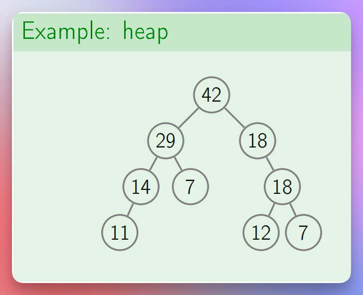
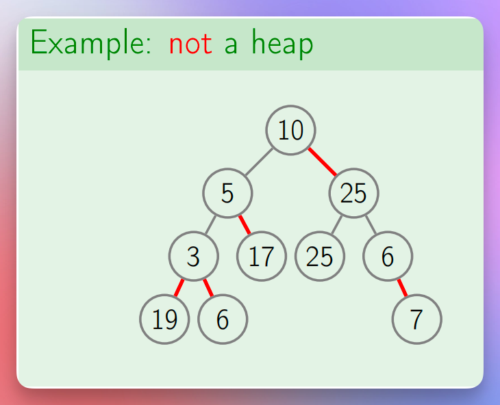
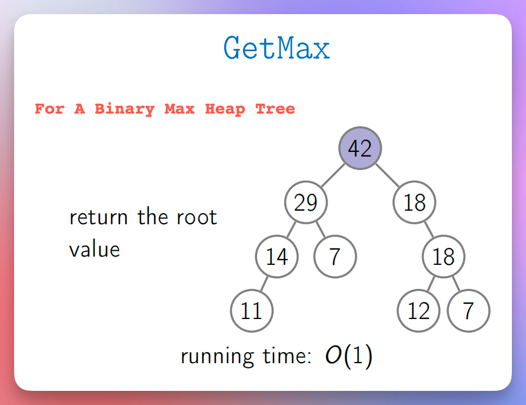
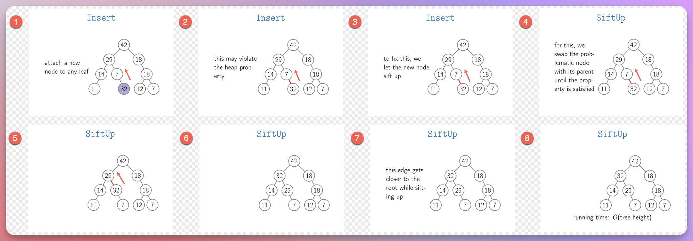

# Binary Heap Trees

## Binary Max Heap

### Definition

* It is a binary tree where the parent node (the top node of an edge) is always greater than or equal to the child 
  node (the bottom node of the edge).
* And it is a binary tree. It means that a node can have 0, 1, or 2 children.
* A node cannot have more than 2 children.

### Common Operations

* getMax(or peek), insert(or add), extractMax(or poll), changePriority, remove, etc.

### Time Complexity Of Each Operation

#### GetMax (or peek)

* For a binary max heap tree, as per the definition, the root node has the highest value.
* So, we simply return the root node.
* It is `O(1)` time.

#### Insert (or add)

* We insert a new element as a leaf.
* It may violate the binary max heap [structure (rules)](#definition).
* So, to ensure that the structure remains valid, we perform the **SiftUp** procedure.
* In the **SiftUp** procedure, we compare the new element with the parent.
* If the parent is smaller than the new element, we swap the elements (or, in other words, their positions or 
  relationships in the tree).
* We repeat this process until we get a [valid structure](#definition).
* We can see that we insert the element as a leaf and travel upwards towards the root.
* So, the time complexity of this operation depends on the tree height.
* Hence, it is `O(tree height)`.

#### ExtractMax (or poll)

