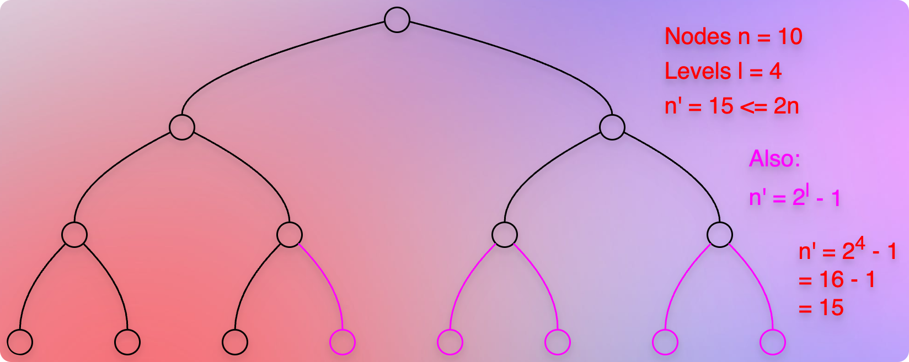

# Complete Binary Trees

## References / Resources

* [The CS Underdog](https://youtu.be/tUSF7I9cr_k?si=I5QyojPLAGVgmm6J)
* 

## Definition

* A complete binary tree is a binary tree where all the levels are completely filled, except maybe the last level.
* The last level can be partially filled. (If the last level is also completely filled, it becomes a perfect binary tree.)
* The last level must follow the left-to-right filling order.
* It means that if we have a node on the right side, there must be a node on the left side as well. 
* We cannot have a node on the right side without a node on the left side. 
* The right portion cannot be filled without or before the left portion.
* In other words, all the nodes of the last level must be aligned to the left side.

## Examples

### Example 01

### Example 02

### Example 03

### Example 04

### Example 05

* It is fine for the last level to be empty, partially filled, or completely filled.
* However, it must follow the left-to-right filling order.
* It means that we cannot have a right node without or before filling a left node.

### Example 06

### Example 07

### Example 08

## Benefits Of A Complete Binary Tree

### Height is at most O(log n) 

* The height of a complete binary tree is shallow.
* So, we get the minimum height for a given number of nodes when we use a complete binary tree to arrange the nodes.
* If we have `n` nodes, and we want to create a binary tree that has minimum height, we can follow the complete binary tree structure.
* It makes the tree traversal fast.

#### Proof: Method#01

* Let us assume that we have `n` nodes. 
* And let us assume that `n = 10` to form a complete binary tree.
* Now, take `n'` such that `n' > n` and it forms a perfect binary tree.
* It is obvious that a complete binary tree will have fewer nodes than a perfect binary tree of height `h`.
* So, we know that `n < n'`. That is the upper bound.
* `n'` indicates a perfect binary tree.
* A perfect binary tree is a binary tree where all the levels are completely filled and all the leaves are at the same level.
* It means that it follows the following pattern:

* At level 1 (or 0), $2^0$ nodes = 1.
* Next level, $2^1$ nodes = 2 nodes.
* Next level, $2^2$ nodes = 4 nodes.
* If the height of the perfect binary tree is `h`, then:
* At level `h`, $2^h$ nodes.
* So, for a perfect binary tree:

$n' = 1 + 2 + 4 + \dots + 2^h$

$n' = \sum_{i = 0}^{h} 2^h$, Which is a geometric series that we can simplify as:

$n' = 2^{h + 1} - 1$

* Thus, the upper boundary of a complete binary tree is:

$n <= 2^{h + 1} - 1$

* Now, let us talk about the lower boundary.
* As per the [definition of a complete binary tree](#definition), we know that if the height of a perfect binary tree is `h`, a complete binary tree will have the same number of nodes as the perfect binary tree up to `h - 1` level.
* It means that if a perfect binary tree of height `h` has nodes equal to:

$n' = 2^{h + 1} - 1$

* Then, for `h - 1` height for a complete binary tree, it becomes:

$2^{h - 1 + 1} - 1 = 2^h - 1$

* And again, just because it is a complete binary tree, it must have at least `1` node at the last level.
* So, it becomes:

$2^h - 1 + 1 = 2^h$.

* So, this is the lower bound of a complete binary tree.
* It means that the complete binary tree must have at least $2^h$ nodes.
* Using both the lower and the upper boundaries, it becomes:

$2^h <= n <= 2^{h + 1} - 1$

* Now, we can convert any exponential expression into a logarithmic expression.
* So, we apply $\log_2$ to each expression.
* Let us first take the left expression (relationship with the lower boundary).
* So, it becomes:

$\log_2(2^h) <= \log_2(n)$

$h <= \log_2(n)$

* Now, let us take the right expression (relationship with the upper boundary).
* But before it, let us first simplify it.

$n <= 2^{h + 1} - 1$

$n + 1 <= 2^{h + 1}$

* Taking $\log_2$ both the sides:

$\log_2(n + 1) <= \log_2(2^{h + 1})$

$\log_2(n + 1) <= (h + 1)$

$\log_2(n + 1) - 1 <= h$

$\log_2(n) <= h$

* Now, if we rewrite the boundaries, it becomes:

$h <= \log_2(n) <= h$

* It clearly means that:

$h = \log_2(n)$

* Since height `h` is an integer (whole) number, the height of a complete binary tree is:

$h = \lfloor\log_2(n)\rfloor$

#### Proof: Method#02

* If a complete binary tree has `n` nodes, then for a perfect binary tree that has `n'` nodes, `n' >= n`.
* For example, if we take `n = 10`, then for a perfect binary tree, `n' = 15`.
* Also, `n' <= 2n`.
* Because we can see that, `n' = 15` which is less than `2n = 2 * 10 = 20`.
* Also, $n' = 2^l - 1$, where `l = number of levels`, using which we can define the height of a tree.
* We can confirm this as shown in the image.
* We know that $n' = 15$.
* We have 4 levels. So, `l = 4`.
* And it makes $2^l = 2^4 = 16$.
* And indeed, $2^l - 1 = 16 - 1 = 15$, which is the value of $n'$.
* So:
* $n' = 2^l - 1$.
* $n' + 1 = 2^l$.
* If we take $log_2$ both the sides, it becomes:
* $\log_2(n' + 1) = \log_2(2^l)$
* $\log_2(n' + 1) = l$
* And since, `n' <= 2n`, we can rewrite it as below:
* $\log_2(2n + 1) <= l$
* It means that:
* $l = O(\log_2 (n)) = O(\log(n))$.

### Array Representation and O(1) Random Access

* A complete binary tree cannot have gaps between two nodes.
* It means all the nodes are one after another, level by level, from left to right, without any gap.
* This characteristic allows us to cleverly represent (or translate, form, express) a complete binary tree as an array.

* For example, we can store the value of each node, from top to bottom, left to right, level by level, in an array.
* Suppose we want to find a relationship of an element at index, `i`.
* We can find parents and children using simple formulas as follows:
* Parent of index `i` is at index, $\lfloor\frac{i}{2}\rfloor$
* Left child of index `i` is at index, = $2 * i$
* Right child of index `i` is at index, = $(2 * i) + 1$
* For example, suppose we want to find the parent of index `i = 4`.
* So, it will be:
* Parent of index, `i = 4` is at index, $\lfloor\frac{i}{2}\rfloor$ =  $\lfloor\frac{4}{2}\rfloor$ = $2$.
* Left child of index, `i = 4` is at index, $2 * i = 2 * 4  = 8$.
* Right child of index, `i = 4` is at index, $(2 * i) + 1 = 8 + 1 = 9$.
* This is amazing. 
* Because on one hand, we get `Random Access` in `O(1)`.
* And on the other hand, we don't get the problem of shifting positions that can cause `O(n)` time when we insert or remove an element.
* Why? How? Because to [insert](../topic02BinaryHeapTrees/binaryHeapTrees.md#insert-or-add--siftup-) or [remove](../topic02BinaryHeapTrees/binaryHeapTrees.md#remove) an element, we follow the `SiftUp` or the `SiftDown` procedure, which is more efficient than `O(n)`.
* Why is it more efficient than `O(n)`? Because we have the benefit of `O(log(n))` height also!
* And in the `SiftUp` and the `SiftDown` procedures, we don't travel and cover each and every node. We target either parents or children. It means we are definitely covering (iterating) fewer nodes than `n`.
* So, on one hand, we have an advantage of an array data structure to get `random access` in `O(1)`.
* And on the other hand, we have the advantage of faster insert and remove operations.
* But both the `insert` and the `remove` operations can change the shape of the complete binary tree.
* How do we keep the binary tree `complete` while performing the `insert` or `remove` operations?
* Let us see.

### Keeping the binary tree, `Complete`

#### The operations that can change the shape of the tree

* We have already seen [various common operations of a binary max heap tree](../topic02BinaryHeapTrees/binaryHeapTrees.md#common-operations).
* If we notice, only the [insert](../topic02BinaryHeapTrees/binaryHeapTrees.md#insert-or-add--siftup-) and the [extractMax](../topic02BinaryHeapTrees/binaryHeapTrees.md#extractmax-or-poll--siftdown-) operations can change the shape of the binary max heap tree.
* [insert](../topic02BinaryHeapTrees/binaryHeapTrees.md#insert-or-add--siftup-) adds an element to a tree.
  * We need to ensure that we maintain the shape of the tree even after adding a new element. 
  * So, it can change the shape of the tree.
* [max (or getMax)](../topic02BinaryHeapTrees/binaryHeapTrees.md#getmax-or-peek-max) is just reading the element with the highest priority. 
  * It doesn't change the shape of the tree.
* [extractMax](../topic02BinaryHeapTrees/binaryHeapTrees.md#extractmax-or-poll--siftdown-) removes the element with the highest priority.
  * We need to ensure that even after removing an element, the tree must maintain the shape.
  * So, `extractMax` can change the shape.
* [SiftUp](../topic02BinaryHeapTrees/binaryHeapTrees.md#insert-or-add--siftup-) and [SiftDown](../topic02BinaryHeapTrees/binaryHeapTrees.md#extractmax-or-poll--siftdown-) are the procedures that we use as a part of a particular operation to swap element positions to maintain the binary max heap tree. 
  * They are not publicly available operations.
  * Their core work does not change the shape of the tree.
* [changePriority](../topic02BinaryHeapTrees/binaryHeapTrees.md#changepriority-increase--siftup-decrease--siftdown) uses `SiftUp` when we increase the priority, and it uses `SiftDown` when we decrease the priority.
  * So again, it does not change the shape of the tree.
* [remove](../topic02BinaryHeapTrees/binaryHeapTrees.md#remove) first increases the priority. So, first, it uses `SiftUp`. And then it uses `extractMax` to actually remove the element.
  * Removing an element can change the shape of the tree.
  * But under the hood, the operation that is responsible for potentially changing the shape of the tree is then `extractMax`.
* So, only `insert` and `extractMax` can change the shape of the tree.
* Now, let us see how we can keep the binary tree `complete` while performing these two operations.

#### Precautions for the operations that can change the shape of the tree

##### Insert (or add): To the Left-most vacant position in the last level

* We just need to ensure that whenever we insert (or add) a new element, we first place it in the immediately next available position, considering the left-to-right sequence in the last level.
* In other words, we place it (or insert it, add it) to the left-most vacant position of the last level.
  * So, we must insert it at the last level, as a leaf.
  * We must insert it into the left-most vacant position to keep it aligned left. 
* And then, we can follow the `SiftUp` procedure.

##### ExtractMax: With the last leaf of the last level

* We know that in the [extractMax](../topic02BinaryHeapTrees/binaryHeapTrees.md#extractmax-or-poll--siftdown-) operation, we replace (swap) the root node (with the highest priority or value) with the leaf node.
  * We just need to ensure that the leaf node is the last leaf node of the tree.
  * So, it will be the left-aligned, but the right-most leaf node of the last level. (If this line creates confusion, then avoid it!)
* And then, we can simply follow the `SiftDown` procedure.