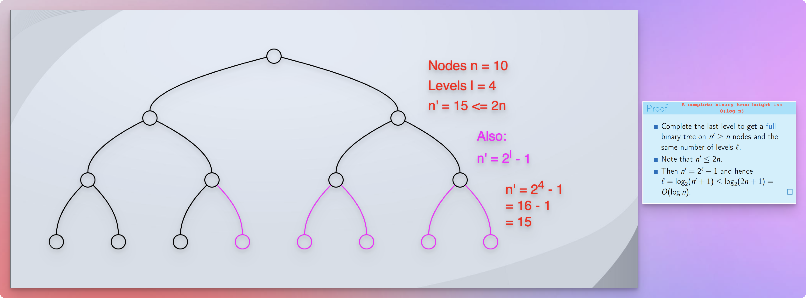
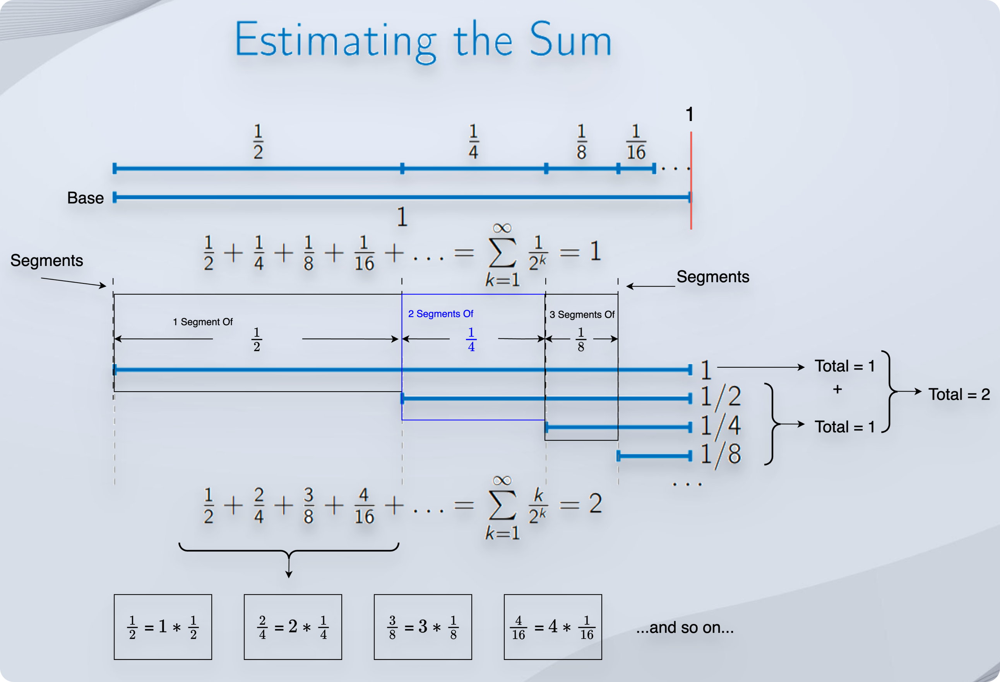

# Heap Sort

## References / Resources

* [Michael Sambol](https://youtu.be/2DmK_H7IdTo?si=K6g9BPvsCyOY9_eC)

## Prerequisites

* We have learned about:
  * [Priority Queues](../section01priorityQueuesIntroduction/priorityQueues.md)
  * [A Complete Binary Trees](../section02priorityQueuesUsingHeaps/topic03CompleteBinaryTrees/completeBinaryTrees.md)
  * [Binary Heaps](../section02priorityQueuesUsingHeaps/topic02BinaryHeapTrees/binaryHeapTrees.md)
* And now, we are going to see one of the applications of a binary heap.
  * Heap Sort

## Reflection

* We know that in a max heap tree, the maximum value is always at the root.
* It means that if we follow the process below: 
  * We maintain the heap structure, 
  * Call `extractMax`, and 
  * Add the result of `extractMax` to the end of the new array (we fill the array from end to start), 
  * Repeat this process until there are no more elements left to perform the `extractMax` function, 
  * The resultant array, where we store the result of each `extractMax` call, becomes a sorted array (ascending).
* However, in that case, we take the additional array, which increases the space complexity.
* What if we can do this process as an `in-place` sorting?
* To make it an `in-place` sorting process, we don't take the new array to store the results.
* Instead, we follow the process below:

## `In-Place` Sorting

* First of all, we call the `buildHeap` function to ensure that we have a valid max heap structure.
* The `buildHeap` function would use the `siftDown` function.
* The `siftDown` function ensures that the parent node is always greater than or equal to the child nodes.
* How does it ensure that? It compares the parent node with child nodes.
* If any child node is greater than the parent node, it swaps the position with the max child index.
* The `siftDown` function needs an index to compare parents and children.
* So, from where do we start?
* Well, we start from $\frac{n}{2}$ instead of from the last node.
* Why?
* Because $\frac{n}{2}$ is the last parent node.

* All the other nodes will be at the last level without any children!
* So, this is the advantage of this algorithm. We reduce (cut, ignore) many nodes at once in this process.
* We store the `extractMax` result at the last unsorted index of the existing array.
* The existing last element will become the first element. So, we swap the positions.
* And once we place the `extractMax` result at the last unsorted index, we get one less element to sort.
* The result of the `extractMax` call gets its true, final, sorted position in the array.
* Once we place the result of the `extractMax` at the end, we narrow down the ending boundary.
* Now, we have `n - 1` elements to sort instead of the `n` elements.
* But, note that we have performed the `swap` operation to fit the `extractMax` result to the last unsorted index.
* That might have violated the max heap structure.
* So, we repeat the process.
* We call `buildHeap` and so on... 

## Worst-Case Analysis

* We perform the `siftDown` operation for at least $\frac{n}{2}$ elements.
* We know that the height of a complete binary tree that we use for the heap tree is `log n`.

* So, we know that each `siftDown` call gets `log n` time complexity.
* And for $\frac{n}{2}$ elements, it becomes $\frac{n}{2} * \log n$.
* Which is, $n \log n$ time, because we drop the constant $\frac{1}{2}$.

## Realistic Analysis

* If we notice, only when a node travels top-to-bottom or bottom-to-top do we travel `log n` distance.

* In all the other cases, it is always less than `log n`.
* So, what is the realistic time complexity of the **buildHeap** process?

### Mathematical Calculation

* We can see in the image that:
* A total of around $\frac{n}{2}$ nodes require 0 swaps. Let us be a bit more generous and consider that they require at least 1 swap. (Well, the reason behind being generous here is actually to get a proper geometric series!)
  * So, the total number of swaps for $\frac{n}{2}$ nodes is $1 * \frac{n}{2}$. 
* A total of around $\frac{n}{4}$ nodes require at most 2 swaps. (Yes, 2 instead of 1, as we continue adding "1" additional swap to get a proper geometric series! We are going to calculate an upper bound only. So, the additional "1" will not make much difference!)
  * So, the total swaps for $\frac{n}{4}$ are $2 * \frac{n}{4}$.
* A total of around $\frac{n}{8}$ nodes require at most 3 swaps.
  * So, the total swaps for $\frac{n}{8}$ are $3 * \frac{n}{8}$.
* A total of around $\frac{n}{16}$ nodes require at most 4 swaps.
  * So, the total swaps for $\frac{n}{16}$ are $4 * \frac{n}{16}$.
* And so on...

* If we want to find the total number of swaps, it is clearly:

$$
(1 * \frac{n}{2}) + (2 * \frac{n}{4}) + (3 * \frac{n}{8}) + (4 * \frac{n}{16}) + \dots + \text{...and so on...}
$$

* If we separate the terms 1 to n, we get the following expression:

$$
\text{Total swaps = } n \sum_{i = 1}^{\infty}{\frac{i}{2^i}}
$$

* Now, we know the answer of the sum of $\frac{1}{2^i}$.

* So, the answer of the sum of $\frac{1}{2^i}$ is 1 as we can see in the image.
* However, we have a bit of a different series, which looks like below:

$$
(1 * \frac{1}{2}) + (2 * \frac{1}{4}) + (3 * \frac{1}{8}) + (4 * \frac{1}{16}) + \dots + \text{...and so on...} 
$$

* We can read our series as follows:
* We have 1 segment of $\frac{1}{2}$.
* We have 2 segments of $\frac{1}{4}$.
* We have 3 segments of $\frac{1}{8}$.
* We have 4 segments of $\frac{1}{16}$.
* ...and so on...

* If we try to represent this concept in an image (heads up! It will be a complicated one!), it looks like follows:

* So, it turns out that the answer to the sum of our series is **2**.
* It means that the expression becomes:

$$
\text{Total swaps = } n * 2 = 2n
$$

* It proves that the running time of the **buildHeap** process is actually a linear time `O(n)` even though the height of the tree is `log n`.