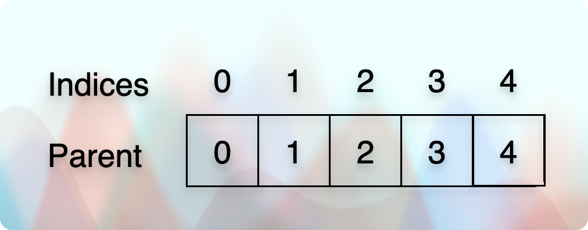
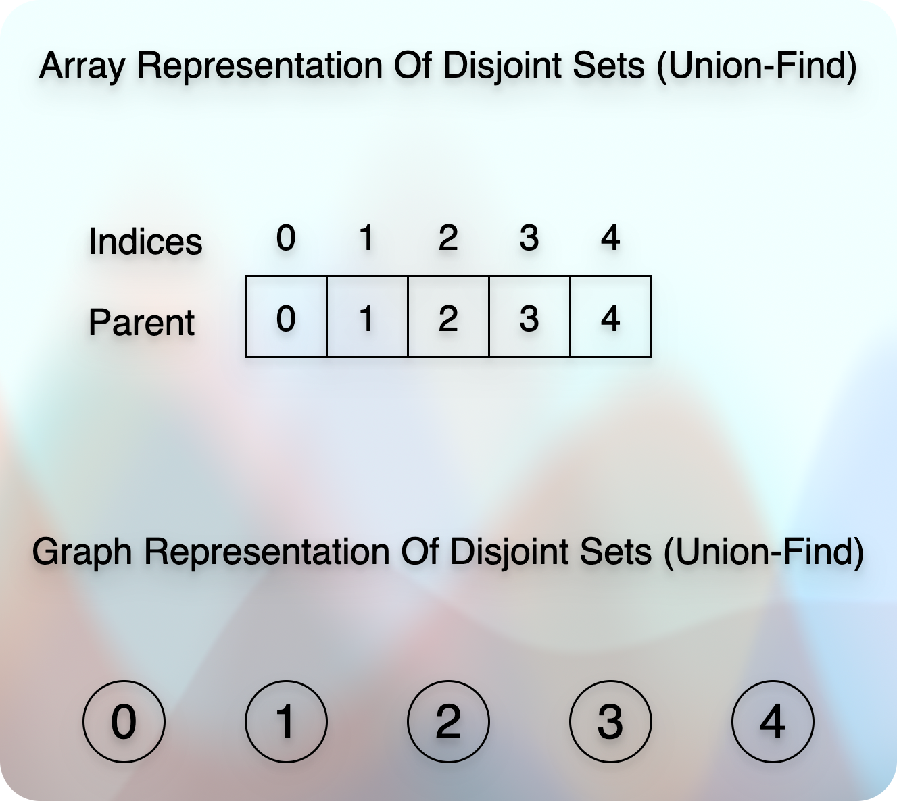
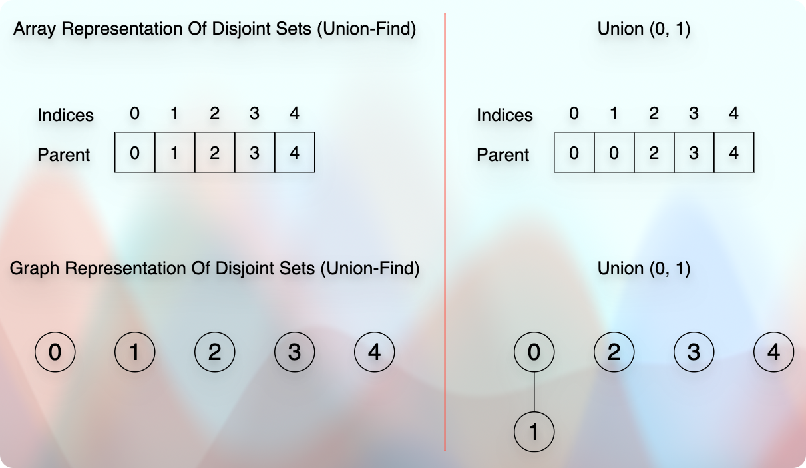

# Disjoint Set Union (Also known as, Union Find)

## Resources / References

* [Abdul Bari Sir](https://youtu.be/wU6udHRIkcc?si=huj_Km4_SKLZshdP)
* [codestorywithMIK: DSU: Part-01: Concept](https://youtu.be/AsAdKHkITBQ?si=jKFfP4miBOLYIgTZ)
* [codestorywithMIK: DSU: Part-02: Rank & Path Compression](https://youtu.be/iH3XVIVzl7M?si=azdvs1H431SH8LNk)
* [Coursera UC San Diego Data Structures](https://www.coursera.org/learn/data-structures)

## Disjoint Sets

* We have two sets in the image, and they are disconnected.
* So, we call them **Disjoint Sets**.
* In the technical term, we would say:
  * When the intersection of sets is `NULL,` we call such sets **Disjoint Sets**.

## Find

* This is the operation that tells about the parent set of the target element.
  * In other words, it tells us about the set the element belongs to.
* For example, `1` belongs to `set 1`. `7` belongs to `set 2`.

## Union

* When we get two elements to perform the union operation on them.
  * First, we find their sets. Only if they belong to two different sets can we perform the union operation on them.
  * Second, when we perform a union operation on two elements, we get a different set.

## Array Representation

* We have two data:
  * The element value.
  * The parent value (or the set value it belongs to).
* Using these two data, we do a couple of things:
  * We can find if we have a particular element (the `find` operation).
  * We can find the set of a particular element.
  * We can find whether two elements belong to the same set (parent).
  * We can perform the `union` operation between elements that have different parents (sets).
* Let us assume that the indices are the values.
  * In that case, the actual values represent the parent value.
  * For example, in the given image, the parent of each index is itself.
  * In other words, initially, each element has a different set.
* Then, we create a union.
  * For example, we see that the element `0` belongs to the set `0` and the element `1` belongs to the set `1`.
  * They are both in different sets.
  * So, we can perform the union operation on them.
* Once we perform the union operation, we need to decide who becomes the parent (leader) of both elements.
  * For example, if we perform the union between the elements (0, 1), we have two options.
  * Either the parent of `0` or `1` can become the parent of the new set `(0, 1)`.
* So, **is there any rule for making or selecting the parent?**
  * Yes. If the size (rank, weight) of each set (parents, subtrees) is equal, we can select anyone.
  * Otherwise, we always select and make the parent who has the higher rank (size, weight). 
  * So, the set (parent, subtree) with the higher rank (size, weight) becomes the parent. And the set (subtree) with the lower rank (size, weight) becomes the child.
* **How do we define the size (rank, weight) of a set (subtree)?**
  * It is just the height of the subtree (set). 
  * So, the taller set (subtree) becomes the parent, and the shorter set (subtree) becomes the child. 
* So, it goes like this:

* So, now it says that the parent of element `1` is `0`.
  * We could have selected `1` as a parent of `0`. 