# Disjoint Set Union (Also known as, Union Find)

<!-- TOC -->
* [Disjoint Set Union (Also known as, Union Find)](#disjoint-set-union-also-known-as-union-find)
  * [Resources / References](#resources--references)
  * [Disjoint Sets](#disjoint-sets)
  * [Find](#find)
  * [Union](#union)
  * [Array & Graph Representation](#array--graph-representation)
    * [Union By Rank](#union-by-rank)
    * [Path Compression](#path-compression)
  * [Conceptual Examples](#conceptual-examples)
    * [Maze](#maze)
      * [Translating the process into pseudocode](#translating-the-process-into-pseudocode)
    * [Networking (Network Cabling) Example](#networking-network-cabling-example)
  * [Next](#next)
<!-- TOC -->

## Resources / References

* [Abdul Bari Sir](https://youtu.be/wU6udHRIkcc?si=huj_Km4_SKLZshdP)
* [codestorywithMIK: DSU: Part-01: Concept](https://youtu.be/AsAdKHkITBQ?si=jKFfP4miBOLYIgTZ)
* [codestorywithMIK: DSU: Part-02: Rank & Path Compression](https://youtu.be/iH3XVIVzl7M?si=azdvs1H431SH8LNk)
* [Coursera UC San Diego Data Structures](https://www.coursera.org/learn/data-structures)
* [Next: DisjointSet Implementation](disjointSets02implementation.md)


## Disjoint Sets

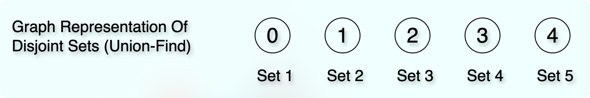

* The image shows a forest, where we have several independent trees without any children.
  * [Forest tree reference](../../module01BasicDataStructures/section03trees/trees.md#forest)
  * They are disconnected. They are disjointed. They are independent.
* Each tree has only one element.
* It means that the element itself is a parent, a leader, a representative of that set.
* We can create a child-parent relationship between them, as shown in the image below:


* We have two sets in the image, and they are disconnected.
* So, we call them **Disjoint Sets**.
* In the technical term, we would say:
  * When the intersection of sets is `NULL,` we call such sets **Disjoint Sets**.
* The leader (parent, representative) of the "set 1" is `1`.
* And the leader (parent, representative) of the "set 2" is `5`.

## Find


* This is the operation that tells about the parent (leader, representative) of the element.
  * In other words, it tells us about the set the element belongs to.
* For example, if we call `find(2)`, then it would give us `1`.
* Similarly, if we call `find(7)`, it would give us `5`.

## Union

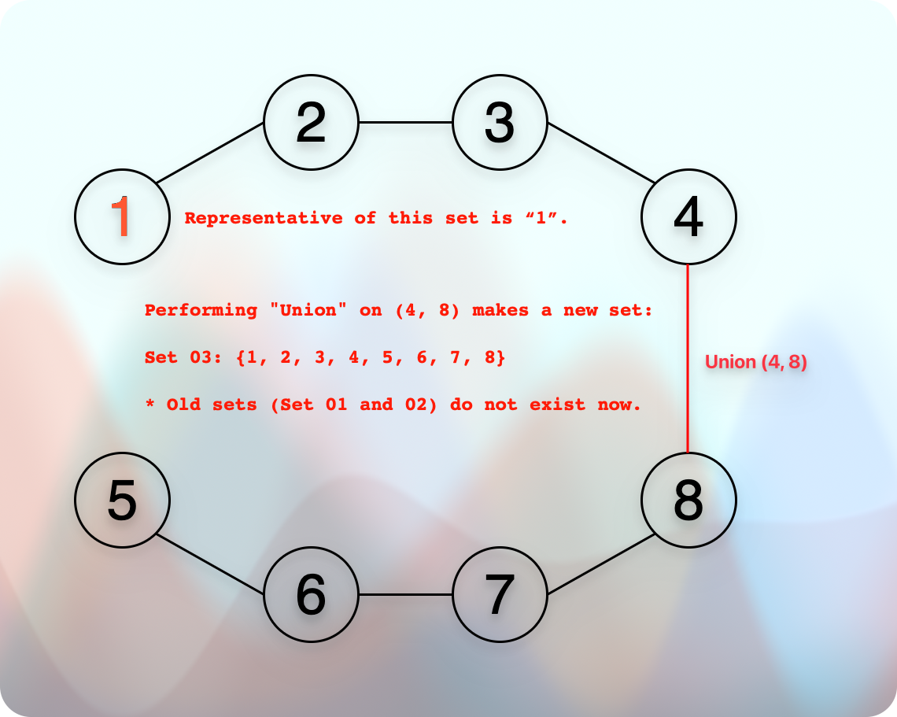

* When we get two elements to perform the union operation on them.
  * First, we find their sets. Only if they belong to two different sets can we perform the union operation on them.
  * Second, when we perform a union operation on two elements, we get a different set.
  * Due to that, a particular set might get a different leader (representative, parent).
  * For example, performing the union operation on `(4, 8)` forced all the elements of the old set-02, which are the elements 5, 6, 7, and 8, to replace their old representative `5` with the new representative `1`.
  * Hence, when we perform the `union` operation between two sets, one of the sets needs to update the representative for all the elements.

## Array & Graph Representation

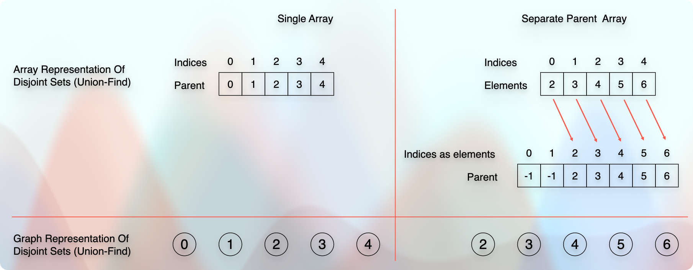

* We have two types of data:
  * The element value.
  * The parent value (or the set value it belongs to).
* Using these two types of data, we do a couple of things:
  * We can find if we have a particular element (the `find` operation).
  * We can find the set of a particular element.
  * We can find whether two elements belong to the same set (parent).
  * We can perform the `union` operation between elements that have different parents (sets).
* Let us assume that the indices represent nodes.
  * For example, `index 0` represents `node 0`.
  * Similarly, `index 1` = `node 1`, and so on...
  * In that case, the actual values represent the parent values.
  * For example, in the given image, the parent of each index is itself.
  * For example, `parent[0] = 0`, `parent[1] = 1`, and so on...
  * It means that each index (= node) is a root node, because it is the parent of itself.
  * In other words, initially, each element has a different set.
* Then, we create a union.
  * For example, the element `0` belongs to the set `0` and the element `1` belongs to the set `1`.
  * They are both in different sets.
  * So, we can perform the union operation on them.
* Once we perform the union operation, we need to decide who becomes the parent (leader) of both elements.
  * For example, if we perform the union between the elements (0, 1), we have two options.
  * Either the parent of `0` or `1` can become the parent of the new set `(0, 1)`.
* So, **is there any rule for making or selecting the parent?**
  * Yes. If the height (rank) of each set (parents, subtrees) is equal, we can select anyone.
  * Otherwise, we always select and make the parent who has the higher height (rank).
  * So, the set (parent, subtree) with the higher height (rank) becomes the parent.
  * And the set (subtree) with the lower height (rank) becomes the child.
* **Why do we have this rule?**
  * If we make a larger subtree the parent of a smaller subtree, it keeps the tree height shallow (short).
  * If we make a shorter subtree the parent of a larger subtree, it increases the tree height.
  * If the tree height is short (shallow), we can finish the traversal and relevant operations quickly.
  * If the tree height is taller (larger, deeper), we need more time to finish the traversal and relevant operations.
* **How do we define the rank (height) of a set (subtree)?**
  * It is just the height of the subtree (set).
  * So, the taller set (subtree) becomes the parent, and the shorter set (subtree) becomes the child.
* So, it goes like this:

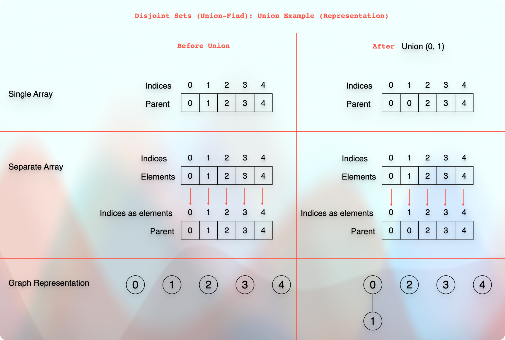

* So, now it says that the parent of element `1` is `0`.
  * So, `parent[1] = 0`.
  * We could have selected `1` as a parent of `0` as well.
* We can continue this union process and make `2` a parent of `3`.
  * So, `parent[3] = 2`.

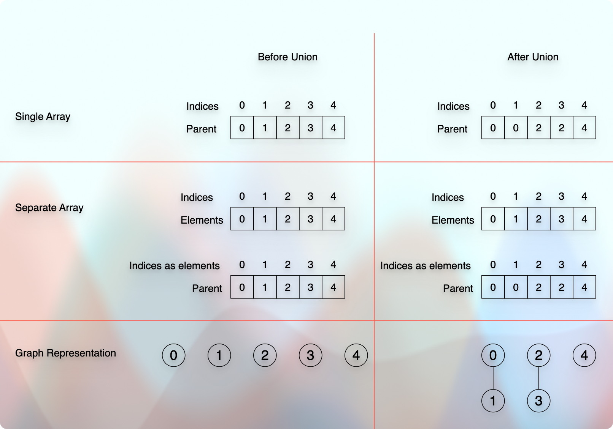

* Now, if we want to perform the union operation for `(0, 2)`, we have two options:
  * We can either make `0` or `2` the parent.
* Let us make `0` the parent of `2`.
  * So, `parent[2] = 0`.
* So, we get:

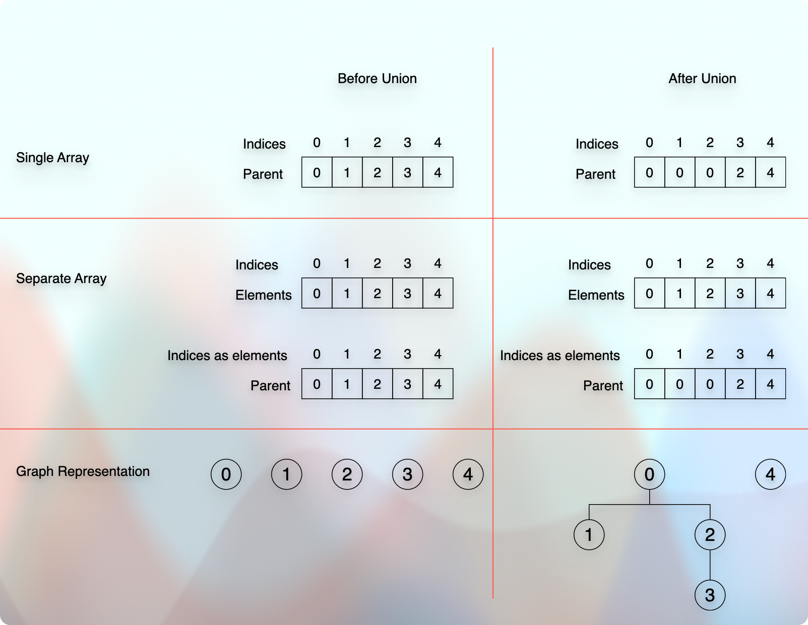

### Union By Rank

* Now, if we want to perform the union operation between `(0, 4)`, the rule says that `4` must be a child of `0` because `0` is a taller tree than `4`.
  * If the level starts from `0`, then the height of the root node `0` is `2`, and for the node `4`, the height is `0`.
  * If the level starts from `1`, then the height of the root node `0` is `3`, and for the node `4`, the height is `1`. 
* However, let us see what difference it makes.
* Let us make `4` a parent instead of `0` for a while.

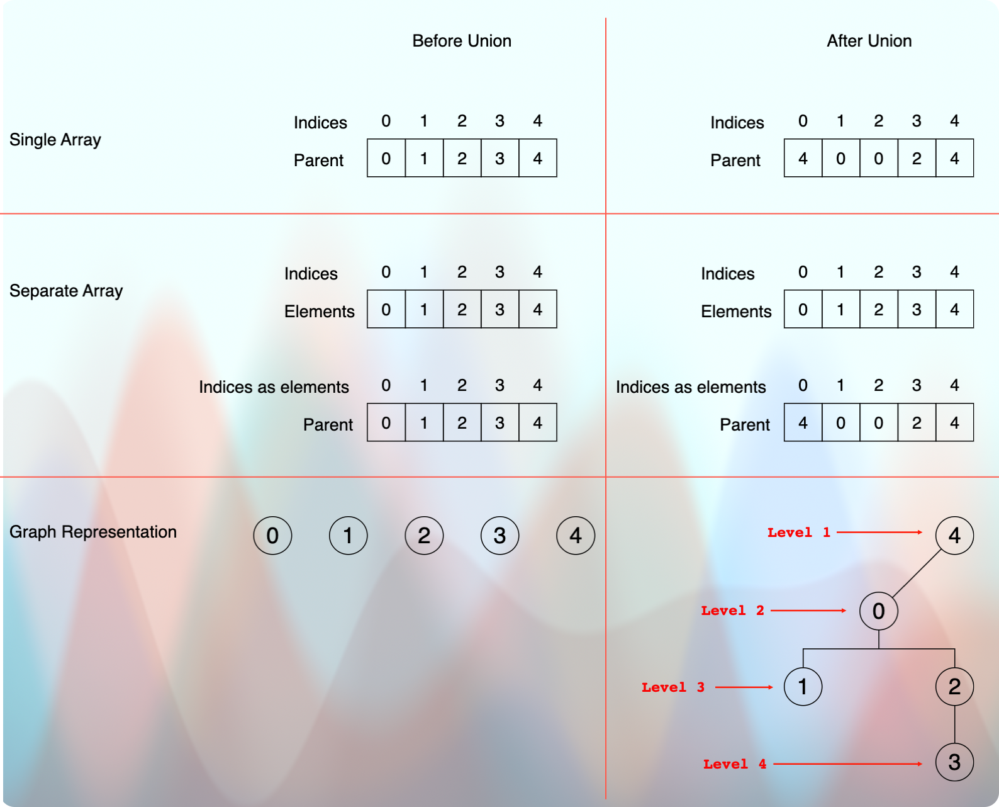

* So, it makes the tree height `4` (where a level starts from `1`. The root is at level `1`.)
* And if we make `0` a parent of `4`, then we get:


* So, it makes the tree height `3` (where a level starts from `1`. The root is at level `1`.)
* Hence, we always make a taller tree a parent because it keeps the tree height shallow (short).
* We keep the tree height shallow (short) because the `find` operation depends on the tree height.
* However, it might be inefficient to calculate the height of both subtrees at runtime to decide which one should be the parent.
* But, we can use a clever technique to decide the taller parent in almost constant time.
* Every time a parent gets a child via `union`, we increase the rank (seniority, value, height) of the parent.
  * We can take a separate `rank` array to maintain the `rank` of each node.
  * Later, we will also see a particular rule about when to increase the `rank`.

* So, it goes as shown in the image below:


* It means that we can decide which tree is the largest one in `O(1)` time.
* Increasing the parent's rank with each `union` when it gets a child allows calculating the tree height in `O(1)`.
  * Later, we will see that we don't need to increase the `rank` with each `union` operation.
  * We only increase the `rank` when we perform the `union` operation between two root nodes of the same height.

### Path Compression

* Now, if we continue the same example, and ask `3` about its parent, it will first point us towards `2`.
  * So, `parent[3]` gives `2`. 
* We will ask `2` about its parent. It will then point us towards `0`.
  * So, `parent[2]` gives `0`.
* We will then ask `0` about its parent.
  * So, `parent[0]` gives `0`.
  * So, both the index (= node) value and the element value are the same.
  * It means that node `0` is the parent of itself.
  * It means that node `0` is the root node.
  * So, we stop here because we found the root node that cannot have a parent.
* In the end, we find that `0` is the parent.
  * So, ultimately, the root parent node of `node 2` and `node 3` is `0`.
  * So, we can say that: 
  * `parent[2] = parent[0] = 0` 
  * `parent[3] = parent[2] = 0` 
* **Can we store this information in `3`?**
* So, the next time we ask `3` about its parent, we can get a quick answer.
* **How do we store information in an array?**

```kotlin
fun find(x: Int): Int {
    // Basic checks.
    if (x !in 0..<size) return -1
    // Base condition.
    if (parent[x] == x) {
        return x
    }
    // Otherwise: Store the parent information.
    parent[x] = find(parent[x])
    return parent[x]
}
```

## Conceptual Examples

### Maze


* We have these two maze examples.
* We want to find whether there is a path between points A and B.
* Let us have some fun with a manual approach.

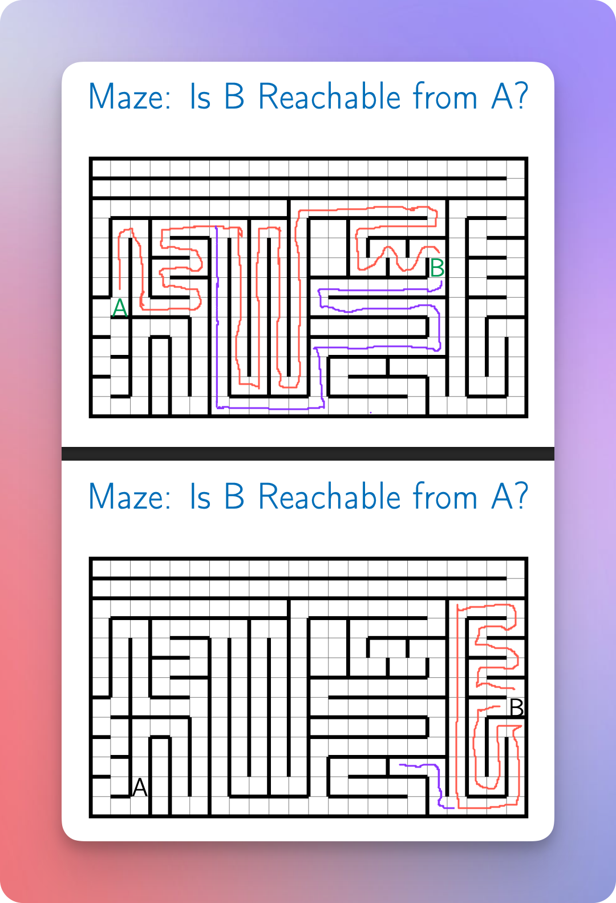

* So, we can see that for the second maze puzzle, there is no direct path that connects the points A and B.
* How do we relate (connect, transform) these maze puzzles with the **Disjoint Set (Union-Find)** concept?

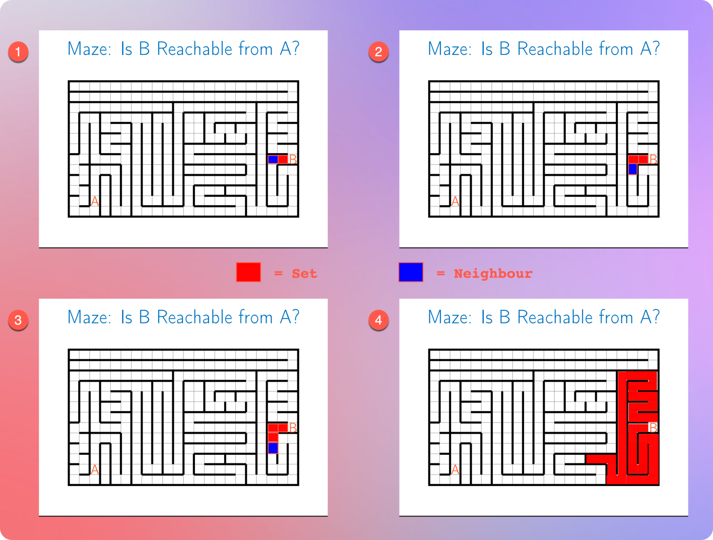

* Initially, each cell is an independent set (or region).
* Then, we start from point B.
* If there is no wall between the two regions, we merge the two regions.
* We continue doing that process until we hit a wall or return to the origin point, B.
* It means that our original set B keeps growing.
* Once we hit a wall, we check: Does the set contain the point, A?
  * If it contains, there is a direct path between points A and B.
  * Otherwise, there is no direct path between points A and B.

#### Translating the process into pseudocode

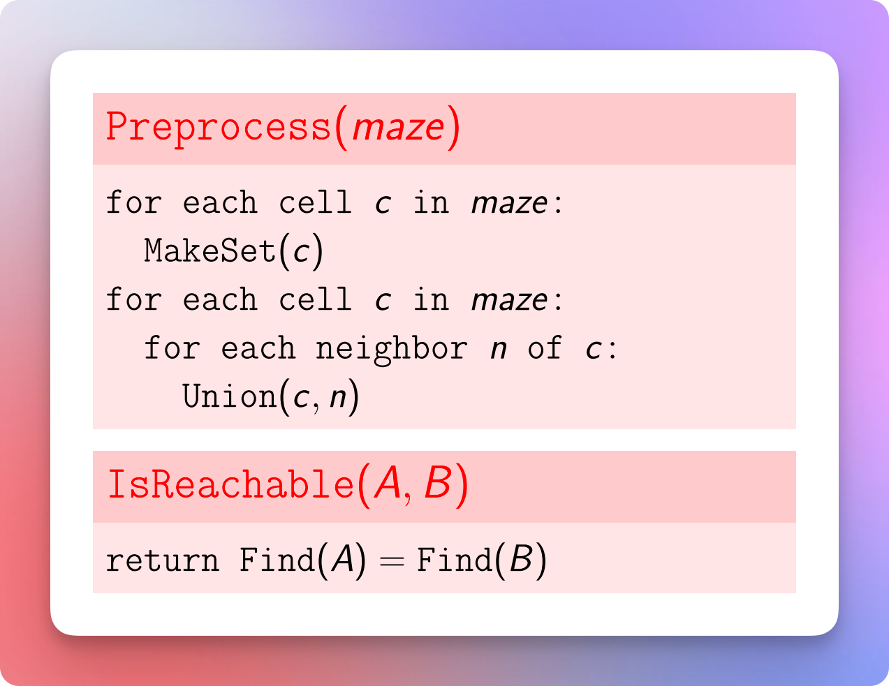

### Networking (Network Cabling) Example

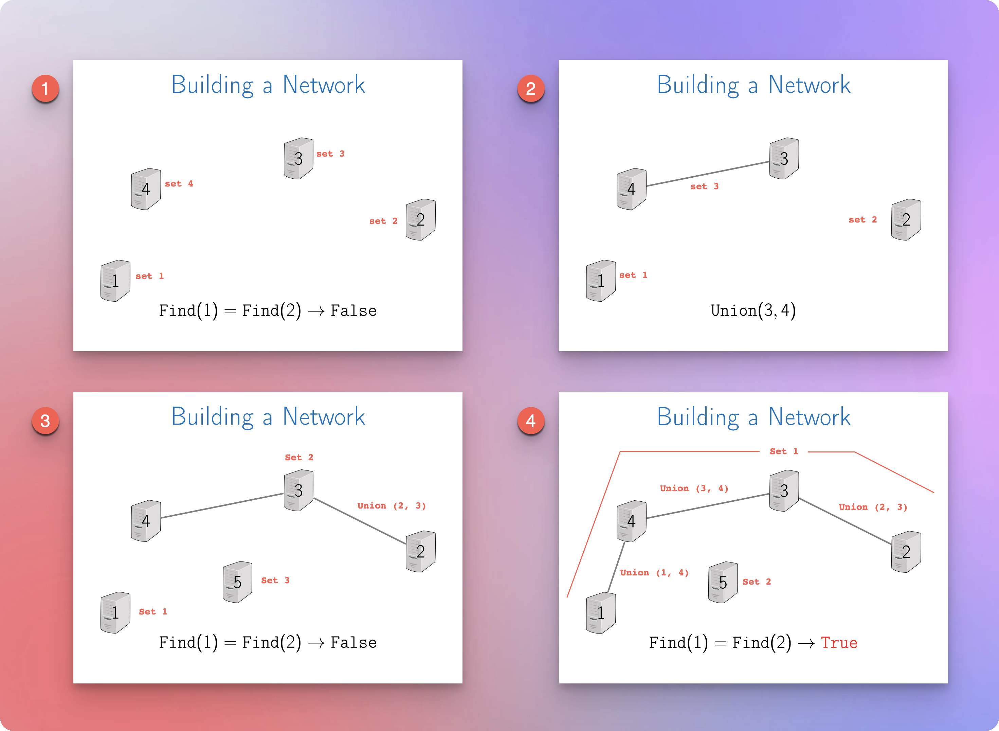

* Initially, each system (computer) is an independent set.
* Then, as we connect two systems via a cable, it indicates the **union** process.
  * The union operation can be performed on the elements that are not parts of the same set.
  * Once we perform the union operation on two elements, they become part of the same set.
* So, for example, initially, if we call the `find` operation on systems `1` and `2`, their results (parents, sets) are different.
* But later, as we keep performing the `union` operations on `(3, 4)`, `(2, 3)`, and `(1, 4)`, eventually, it makes the system `1` and `2` parts of the same set. 
* Now, if we call the `find` operation on the systems `1` and `2`, their results (parents, sets) will be the same.

## Next

* [Disjoint Sets (Union-Find) Implementation](disjointSets02implementation.md)