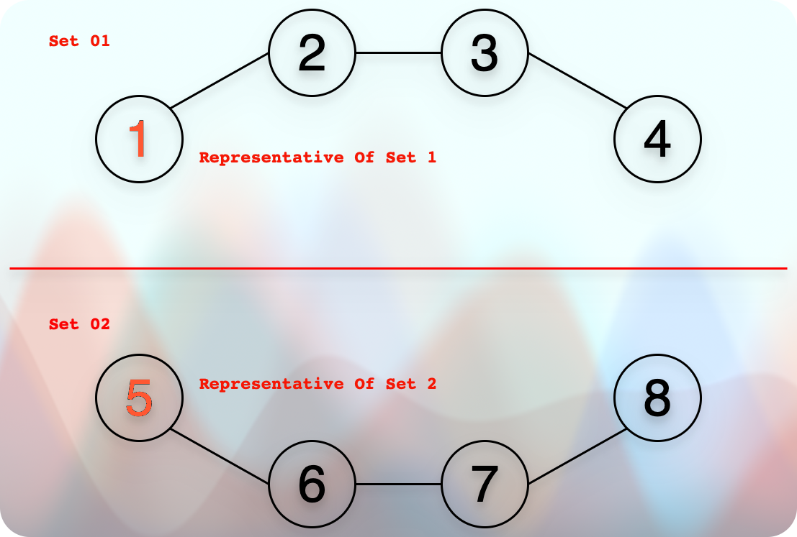

# Disjoint Set Union (Also known as, Union Find)

## Resources / References

* [Abdul Bari Sir](https://youtu.be/wU6udHRIkcc?si=huj_Km4_SKLZshdP)
* [codestorywithMIK: DSU: Part-01: Concept](https://youtu.be/AsAdKHkITBQ?si=jKFfP4miBOLYIgTZ)
* [codestorywithMIK: DSU: Part-02: Rank & Path Compression](https://youtu.be/iH3XVIVzl7M?si=azdvs1H431SH8LNk)
* [Coursera UC San Diego Data Structures](https://www.coursera.org/learn/data-structures)

## Disjoint Sets

* We have two sets in the image, and they are disconnected.
* So, we call them **Disjoint Sets**.
* In the technical term, we would say:
  * When the intersection of sets is `NULL,` we call such sets **Disjoint Sets**.

## Find

* This is the operation that tells about the parent set of the target element.
  * In other words, it tells us about the set the element belongs to.
* For example, `1` belongs to `set 1`. `7` belongs to `set 2`.

## Union

* When we get two elements to perform the union operation on them.
  * First, we find their sets. Only if they belong to two different sets, we can perform the union operation on it.
  * Second, when we perform a union operation on two elements, we get a different set.

