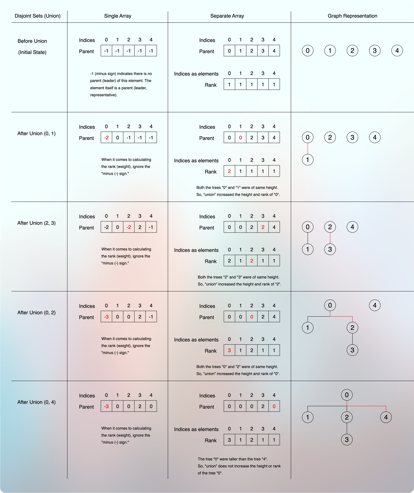

# Disjoint Sets (Union-Find) Implementation

<!-- TOC -->
* [Disjoint Sets (Union-Find) Implementation](#disjoint-sets-union-find-implementation)
  * [Naive Implementation: Using Arrays](#naive-implementation-using-arrays)
  * [Naive Implementation: Using LinkedList](#naive-implementation-using-linkedlist)
  * [Improvement](#improvement)
    * [Tree As An Internal Data Structure For DSU](#tree-as-an-internal-data-structure-for-dsu)
    * [Union (merge) of Two Trees (Disjoint Sets) By Rank](#union-merge-of-two-trees-disjoint-sets-by-rank)
    * [How does the "Union By Rank" technique ensure the optimal height of the resultant tree?](#how-does-the-union-by-rank-technique-ensure-the-optimal-height-of-the-resultant-tree)
      * [Minimum nodes in the resultant tree](#minimum-nodes-in-the-resultant-tree)
      * [Optimal Height = Binary logarithm of the total nodes](#optimal-height--binary-logarithm-of-the-total-nodes)
    * [So, what will the time complexity of the `Find` and `Union` operations be?](#so-what-will-the-time-complexity-of-the-find-and-union-operations-be)
<!-- TOC -->

## Naive Implementation: Using Arrays

* Suppose we have 3 sets:
  * Set-1 is `{9, 3, 2, 4, 7}`
  * Set-2 is `{5}`
  * Set-3 is `{6, 1, 8}`
* Each set has a leader (a representative, a parent).
* And to be consistent in selecting a representative, we select the smallest element of a set as a representative of that set.
  * For Set-1, it is `2`.
  * For Set-2, it is `5`.
  * For Set-3, it is `1`.
* The `find` operation on a particular set to know their representative takes `O(1)` time.
  * For example, `find(7)` gives `2`, which means that the representative of `7` is `2`.
  * Similarly, `find(5)` gives `5` and `find(8)` gives `1`.
* Now, if we perform the `union` operation between set-1 and set-3, we need to update the representative of one of them.
* It means that we have to find the representative of both the sets, set-1 and set-3.
* We compare the representatives of set-1 and set-3.
* Then, we select the smallest one to be consistent in our representative selection process.
* In our example, the representative of set-3 is the smallest one.
* So, we need to scan through the entire array, find the elements of set-1, and replace their old representative `2` with `1`.
* Clearly, this is a linear process and take `O(n)` time for the `union` operation.
* So, the naive implementation using an array gives:
  * `O(1)` to get the representative (parent) using the `find` operation.
  * `O(n)` to perform the `union` operation.

## Naive Implementation: Using LinkedList

* Suppose we have 2 sets:
  * Set-1 is `{9, 3, 2, 4, 7}`
  * Set-2 is `{6, 1, 8}`
* Each set must have a representative (a leader, a parent).
* To be consistent in selecting a representative, we select `tail` as the parent (representative) of the set.
* Whenever we perform the `union` operation between two sets, the `tail` of one set would point to the `head` of another set.
* It means that we can perform the `union` operation in `O(1)` time.
* However, if we want to find the parent of a particular element, it takes `O(n)` time.
* For example, if we perform `find(4)`, then we need to confirm two things. 
  * We need to confirm that `4` is a part of the set we are checking.
    * So, we start our traversal from the `head` of the set (a linked list) and cover each element to encounter the element `4` during the journey.
    * If we face the element `4` during the journey, the next thing is to find the `tail` of that linked list (set).
    * If we don't see the element `4` and we finish travelling the linked list, the element `4` is not a part of this linked list.
  * If we get the element `4` during the traversal, we need to continue the traversal till we reach the `tail`. The `tail` is the representative of the element `4` that we need to return.
* So, the `find` operation is a linear operation that takes `O(n)` time.
* Another problem is that the `union` operation uses the `find` operation to confirm that the elements we want to perform the `union` operation on are in the different sets.
* Also, every time we merge two sets (linked lists), we need to update the `head` and `tail` pointers accordingly.
* And every time we merge two sets (linked list), the resultant list keeps getting longer (larger, taller).
* It means that with every `union` operation (merge operation), the `find` operation keeps getting slower.
* It means that the `union` operation we once thought as an inexpensive and easy one, is not actually that easy or inexpensive.  

## Improvement

* In the previous example, we made a tail of the old list to point to the head of another list.

* We realized that this process makes the list longer with each `union` operation.
* And we learned that a longer list makes the `find` operation slower.
* So, the question is: Can we attach (merge, union) these two lists in a different way?
* Well, maybe we can connect the two lists in a different way.

* So, we pointed the head of another list to the tail of the old list.
* But then the resultant structure is no longer a linked list structure. Right?
* It seems more like a tree structure, where `7` is the root node, and it has two branches.
* And what is the benefit?
* Well, now we don't have to travel until the end of the structure to `find` the root node (representative, leader, parent).
* So, the time complexity of the `find` operation is improved here.
* So, the idea is to represent each set in the form of a `tree` instead of in the form of a linked list.

### Tree As An Internal Data Structure For DSU
 

* A tree uses an array as an internal data structure.
* Here, the indices will represent the node values, and the value of each index will represent the parent value.

* It means that `find(a)` will tell us about the parent of `a`.
* If `find(a)` returns `a`, then `a` is the root node.
* It means that when the index value (argument of the `find` function) and the element value are the same value, then it is the root of that tree (set).

* Note that when it comes to merging two trees, we always hang (append) the shorter (shallow) tree to the larger (taller) tree to keep the tree height minimum.

### Union (merge) of Two Trees (Disjoint Sets) By Rank

* We learned that we always hang the shorter tree on the taller tree to keep the height of the resultant tree minimum.
* **But how do we calculate the height of trees?** 
  * It is inefficient to calculate the height of each tree during the `union` operation.
  * We need a quick way of getting the height of each tree in `O(1)` time.
  * So, we use the `memoization` kind of technique here.
  * We use a separate `rank` array.
  * Each `index` of the `rank` array represents a `node`, and each `value` represents the `height`.
* For example:

* **What does the `rank` represent?**
  * Each `rank` value represents the `height` of the corresponding (associated, relevant) `index`, where an `index` represents a `node` of a tree.
* **How do we maintain the `rank` array?**
  * If the `rank` (height, weight) of the two trees we merge is not the same, we don't update the rank.
  * If the `rank` (height, weight) of the two trees we merge is the same, then we increase the rank of the resultant parent by 1.
* **Why do we update the `rank` only when we merge two trees of the same `rank` (height, weight)?** 
  * Because when we hang a shorter tree on the taller tree, the height of the taller tree remains the same.
  * Only when we merge two trees of the same height, the height of the resultant tree is increased.
* For example:

### How does the "Union By Rank" technique ensure the optimal height of the resultant tree?

#### Minimum nodes in the resultant tree

* To prove the resulting tree's height is optimal with `union by rank`, we first need to understand how we perform the `union` operation.
* We know that we hang the shorter tree on the taller tree. 
* But at which node do we hang the tree?
* At the root node.
* So, it is more than the nodes. 
* We consider the root of each node. 
* The root of one node becomes the direct child of the root of another node.
* For example:

* It means that the `union` operation cannot form a pathological (degenerate) tree.
* Based on this observation, we give a statement that:
* **The tree of `k` height (or rank) will have at least $2^k$ nodes.** 
* We will use the induction theory (Proof by Induction) to prove the statement.
  * [Proof By Induction - Khan Academy](https://youtu.be/wblW_M_HVQ8?si=eRHuXRkurDqparJT)
  * [Learn Math Tutorials](https://youtu.be/dMn5w4_ztSw?si=CB0rBxEh91CR8rug)
  * [The Organic Chemistry Tutor](https://youtu.be/tHNVX3e9zd0?si=Ui1JqaYbnFrvVt8o)
* So, in the "Proof by Induction," for any positive integer `n`,
  * We prove a base case.
  * We assume that the expression is true for `k` (which is known as "Induction Hypothesis").
  * We calculate the next term, `k + 1`, using the previous assumption of `k`.
  * And if our expression (claim) works for the base case, and `k + 1`, it means that it works for any positive integer `n`.
* So, let us examine our statement when `n = 0`.

* When height is `0`, do we have at least $2^n$ nodes?
  * Yes, we have. When height is `0`, we have $2^n = 2^0 = 1$ node.
  * So, that was the base case.
  * We just proved the base case.
* The next step is: Induction Hypothesis.
* Now, let us assume that our expression is true for a tree whose height is `k - 1`.
  * So, we have a tree (or two trees) whose height is `k - 1` and it has at least $2^{k - 1}$ nodes.
* Now, the next term of `k - 1` is `k - 1 + 1 = k`. We need to prove that our statement is true for a tree whose height is `k`.
* We have already observed and learned that the height of the resultant tree is increased by 1 only when we merge two trees of the same height.
* So, we have two trees of the same height: $k - 1$.
* If we merge these two trees, the height of the resultant tree is increased by 1.
  * $k - 1 + 1 = k$
* And if we merge these two trees, we get a total number of nodes:
  * $2^{k - 1} + 2^{k - 1}$
  * It is just two times the same thing.
  * So, we can rewrite it as:
  * $2(2^{k - 1}) = 2^1(2^{k - 1}) = 2^{1 + k - 1} = 2^k$
* So, we have just proved that a tree of height `k` must have at least $2^k$ nodes.
* It means that the height of a tree is `h`, then it must have at least $2^h$ nodes.
* If the height of a tree is `n`, then it must have at least $2^n$ nodes.

#### Optimal Height = Binary logarithm of the total nodes

* Now, using this fact, we want to prove our claim that using **"Union By Rank"**, we get an optimal height.
* Specifically, in terms of measurement, we say that the height of the resultant tree does not exceed the binary logarithm of the total nodes.
* So, we claim that the height of a resultant tree is $h <= log_2(n)$ where `n` is the total number of nodes.
* According to the [minimum nodes](#minimum-nodes-in-the-resultant-tree) proof, if the height of a tree is `h`, then the total number of nodes is at least $2^h$.
* So, if we denote `total number of nodes` as `n`, then it becomes:
* $n >= 2^h$
* Taking $log_2$ on both sides, we get:
* $log_2(n) >= log_2(2^h)$
* $log_2(n) >= h$
* $h <= log_2(n)$
* Which proves that the height of the resultant tree is always less than or equal to (at most) the binary logarithm of the total nodes.
* We can also prove the optimal height in another way.
* Now, let us assume that our claim is false.
* It means that:
* $h > log_2(n)$
* $=> 2^h > 2^{log_2(n)}$ // if $a > b$, then $2^a > 2^b$.
* $=> 2^h > n$
* Now, according to the previous fact of [minimum nodes](#minimum-nodes-in-the-resultant-tree), $2^h$ is the total number of nodes for a tree whose height is $h$.
* $\text{Total nodes} > n$, which contradicts the fact that we started with `n` total number of nodes. 
* It means that our assumption that $h > log_2(n)$ is wrong.
* It means that $h <= log_2(n)$ is true.
* It means that our claim that the resultant height of the tree is always less than or equal to (at most) the binary logarithm of the total nodes is true.

### So, what will the time complexity of the `Find` and `Union` operations be?

* We learned that using [Union By Rank](#union-merge-of-two-trees-disjoint-sets-by-rank), we keep the tree height at most $log_2(n)$.
* It means that the maximum traversal we may need to perform during the `find` operation is $log_2(n)$.
* It means that the time-complexity of the `find` operation is at most $log_2(n)$.
* And in the `union` operation, we do the following:
  * We `find` the root of the two nodes.
  * And we know that the `find` operation takes $log_2(n)$ time.
  * Then, if the roots are the same, we don't need to perform the `union` operation as the nodes are already in the same `set` (tree).
  * Otherwise, we check the `rank` of each root in the `rank` array.
  * The `rank` array provides random access in `O(1)` time.
  * If the `rank` of each `root` is the same, we make one of the roots a child of another root.
    * It is just updating the `parent` value in the `array` for the `node` which is represented by an `index.`
    * So, updating the `parent` value in the `array` is just `O(1)` time, again due to random access.
    * Then, we increase the `rank` of the `parent` in the `rank` array.
    * Again, it is just `O(1)` time.
  * And if the `rank` of each `root` is different, we make the shorter root a child of the taller root.
    * We do that by updating the `parent` value in the `parent` array for the `node`, which is represented by an index.
    * It is done in `O(1)` time due to random access.
    * And we don't need to increase the `rank` of the `parent root` in this case.
* So, we just finished the `union` operation at this point.
* Hence, the time complexity of the `union` operation is also $log_2(n)$.

