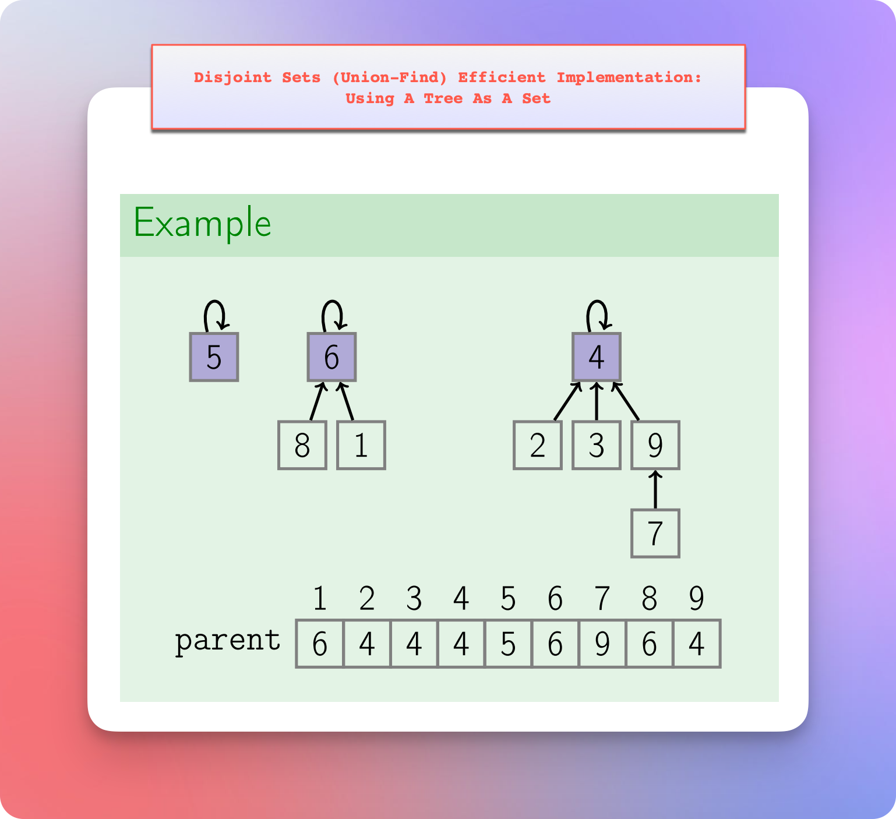

# Disjoint Sets (Union-Find) Implementation

## Naive Implementation: Using Arrays

* Suppose we have 3 sets:
  * Set-1 is `{9, 3, 2, 4, 7}`
  * Set-2 is `{5}`
  * Set-3 is `{6, 1, 8}`
* Each set has a leader (a representative, a parent).
* And to be consistent in selecting a representative, we select the smallest element of a set as a representative of that set.
  * For Set-1, it is `2`.
  * For Set-2, it is `5`.
  * For Set-3, it is `1`.
* The `find` operation on a particular set to know their representative takes `O(1)` time.
  * For example, `find(7)` gives `2`, which means that the representative of `7` is `2`.
  * Similarly, `find(5)` gives `5` and `find(8)` gives `1`.
* Now, if we perform the `union` operation between set-1 and set-3, we need to update the representative of one of them.
* It means that we have to find the representative of both the sets, set-1 and set-3.
* We compare the representatives of set-1 and set-3.
* Then, we select the smallest one to be consistent in our representative selection process.
* In our example, the representative of set-3 is the smallest one.
* So, we need to scan through the entire array, find the elements of set-1, and replace their old representative `2` with `1`.
* Clearly, this is a linear process and take `O(n)` time for the `union` operation.
* So, the naive implementation using an array gives:
  * `O(1)` to get the representative (parent) using the `find` operation.
  * `O(n)` to perform the `union` operation.

## Naive Implementation: Using LinkedList

* Suppose we have 2 sets:
  * Set-1 is `{9, 3, 2, 4, 7}`
  * Set-2 is `{6, 1, 8}`
* Each set must have a representative (a leader, a parent).
* To be consistent in selecting a representative, we select `tail` as the parent (representative) of the set.
* Whenever we perform the `union` operation between two sets, the `tail` of one set would point to the `head` of another set.
* It means that we can perform the `union` operation in `O(1)` time.
* However, if we want to find the parent of a particular element, it takes `O(n)` time.
* For example, if we perform `find(4)`, then we need to confirm two things. 
  * We need to confirm that `4` is a part of the set we are checking.
    * So, we start our traversal from the `head` of the set (a linked list) and cover each element to encounter the element `4` during the journey.
    * If we face the element `4` during the journey, the next thing is to find the `tail` of that linked list (set).
    * If we don't see the element `4` and we finish travelling the linked list, the element `4` is not a part of this linked list.
  * If we get the element `4` during the traversal, we need to continue the traversal till we reach the `tail`. The `tail` is the representative of the element `4` that we need to return.
* So, the `find` operation is a linear operation that takes `O(n)` time.
* Another problem is that the `union` operation uses the `find` operation to confirm that the elements we want to perform the `union` operation on are in the different sets.
* Also, every time we merge two sets (linked lists), we need to update the `head` and `tail` pointers accordingly.
* And every time we merge two sets (linked list), the resultant list keeps getting longer (larger, taller).
* It means that with every `union` operation (merge operation), the `find` operation keeps getting slower.
* It means that the `union` operation we once thought as an inexpensive and easy one, is not actually that easy or inexpensive.  

## Improvement

* In the previous example, we made a tail of the old list to point to the head of another list.

* We realized that this process makes the list longer with each `union` operation.
* And we learned that a longer list makes the `find` operation slower.
* So, the question is: Can we attach (merge, union) these two lists in a different way?
* Well, maybe we can connect the two lists in a different way.

* So, we pointed the head of another list to the tail of the old list.
* But then the resultant structure is no longer a linked list structure. Right?
* It seems more like a tree structure, where `7` is the root node, and it has two branches.
* And what is the benefit?
* Well, now we don't have to travel until the end of the structure to `find` the root node (representative, leader, parent).
* So, the time complexity of the `find` operation is improved here.
* So, the idea is to represent each set in the form of a `tree` instead of in the form of a linked list.

### Tree As An Internal Data Structure For DSU
 

* A tree uses an array as an internal data structure.
* Here, the indices will represent the node values, and the value of each index will represent the parent value.

* It means that `find(a)` will tell us about the parent of `a`.
* If `find(a)` returns `a`, then `a` is the root node.
* It means that when the index value (argument of the `find` function) and the element value are the same value, then it is the root of that tree (set).

* Note that when it comes to merging two trees, we always hang (append) the shorter (shallow) tree to the larger (taller) tree to keep the tree height minimum.

### Union (merge) of Two Trees (Disjoint Sets) By Rank

* We learned that we always hang the shorter tree on the taller tree to keep the height of the resultant tree minimum.
* **But how do we calculate the height of trees?** 
  * It is inefficient to calculate the height of each tree during the `union` operation.
  * We need a quick way of getting the height of each tree in `O(1)` time.
  * So, we use the `memoization` kind of technique here.
  * We use a separate `rank` array.
  * Each `index` of the `rank` array represents a `node`, and each `value` represents the `height`.
* For example:

* **How do we maintain the `rank` array?**
  * If the `rank` (height, weight) of the two trees we merge is not the same, we don't update the rank.
  * If the `rank` (height, weight) of the two trees we merge is the same, then we increase the rank of the resultant parent by 1.
* **Why do we update the `rank` only when we merge two trees of the same `rank` (height, weight)?** 
  * Because when we hang a shorter tree on the taller tree, the height of the taller tree remains the same.
  * Only when we merge two trees of the same height, the height of the resultant tree is increased.
* For example:

### How does the "Union By Rank" technique ensure the optimal height of the resultant tree?

