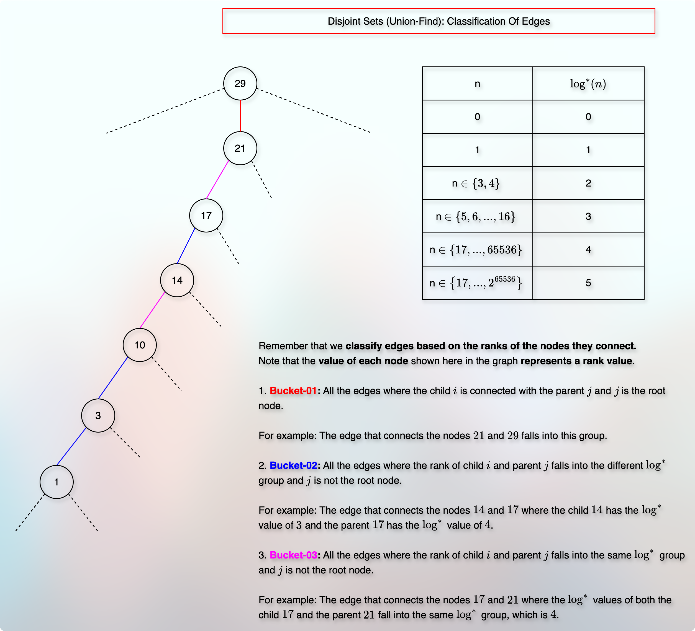

# Disjoint Sets (Union-Find) Implementation

<!-- TOC -->
* [Disjoint Sets (Union-Find) Implementation](#disjoint-sets-union-find-implementation)
  * [References / Resources](#references--resources)
  * [Naive Implementation: Using Arrays](#naive-implementation-using-arrays)
  * [Naive Implementation: Using LinkedList](#naive-implementation-using-linkedlist)
  * [Improvement](#improvement)
    * [Tree As An Internal Data Structure For DSU](#tree-as-an-internal-data-structure-for-dsu)
    * [Union (merge) of Two Trees (Disjoint Sets) By Rank](#union-merge-of-two-trees-disjoint-sets-by-rank)
    * [Tree Height With "Union By Rank"](#tree-height-with-union-by-rank)
      * [Minimum nodes in the resultant tree](#minimum-nodes-in-the-resultant-tree)
      * [Optimal Height = Binary logarithm of the total nodes](#optimal-height--binary-logarithm-of-the-total-nodes)
    * [Path Compression](#path-compression)
  * [Worst-case time complexity of the `Find` and `Union` operations](#worst-case-time-complexity-of-the-find-and-union-operations)
  * [Realistic (Amortized) analysis of the `Find` and `Union` operations](#realistic-amortized-analysis-of-the-find-and-union-operations)
    * [References / Resources](#references--resources-1)
    * [Observation](#observation)
    * [$log^{*}(n)$ = Iterated Logarithm](#logn--iterated-logarithm)
      * [Interpretation, Observation, And Significance](#interpretation-observation-and-significance)
    * [Observation Of The `rank` Array](#observation-of-the-rank-array)
      * [Maximum nodes with rank `k` <= $\frac{n}{2^{k}}$](#maximum-nodes-with-rank-k--fracn2k)
      * [The `rank` of a parent is always greater than the `rank` of a child: `rank[i] < rank[parent[i]]`](#the-rank-of-a-parent-is-always-greater-than-the-rank-of-a-child-ranki--rankparenti)
      * [Once a child, always a child: Once an internal node, always an internal node](#once-a-child-always-a-child-once-an-internal-node-always-an-internal-node-)
    * [Running Time = Total Traversal: M operations and Classification Of Edges Into 3 Buckets](#running-time--total-traversal-m-operations-and-classification-of-edges-into-3-buckets)
      * [Bucket#1: One step away from the root node](#bucket1-one-step-away-from-the-root-node)
      * [Bucket#2: A different $log^{*}$ group](#bucket2-a-different-log-group)
      * [Bucket#3: The same $log^{*}$ group](#bucket3-the-same-log-group)
      * [Total Running Time](#total-running-time)
      * [Summary](#summary)
      * [Quick Revision](#quick-revision)
<!-- TOC -->

## References / Resources

* [Previous: Introduction to DisjointSets](disjointSets.md)
* [Abdul Bari Sir](https://youtu.be/wU6udHRIkcc?si=huj_Km4_SKLZshdP)
* [codestorywithMIK: DSU: Part-01: Concept](https://youtu.be/AsAdKHkITBQ?si=jKFfP4miBOLYIgTZ)
* [codestorywithMIK: DSU: Part-02: Rank & Path Compression](https://youtu.be/iH3XVIVzl7M?si=azdvs1H431SH8LNk)
* [Coursera UC San Diego Data Structures](https://www.coursera.org/learn/data-structures) 

## Naive Implementation: Using Arrays

* Suppose we have 3 sets:
  * Set-1 is `{9, 3, 2, 4, 7}`
  * Set-2 is `{5}`
  * Set-3 is `{6, 1, 8}`
* Each set has a leader (a representative, a parent).
* And to be consistent in selecting a representative, we select the smallest element of a set as a representative of that set.
  * For Set-1, it is `2`.
  * For Set-2, it is `5`.
  * For Set-3, it is `1`.
* The `find` operation on a particular set to know their representative takes `O(1)` time.
  * For example, `find(7)` gives `2`, which means that the representative of `7` is `2`.
  * Similarly, `find(5)` gives `5` and `find(8)` gives `1`.
* Now, if we perform the `union` operation between set-1 and set-3, we need to update the representative of one of them.
* It means that we have to find the representative of both the sets, set-1 and set-3.
* We compare the representatives of set-1 and set-3.
* Then, we select the smallest one to be consistent in our representative selection process.
* In our example, the representative of set-3 is the smallest one.
* So, we need to scan through the entire array, find the elements of set-1, and replace their old representative `2` with `1`.
* Clearly, this is a linear process and take `O(n)` time for the `union` operation.
* So, the naive implementation using an array gives:
  * `O(1)` to get the representative (parent) using the `find` operation.
  * `O(n)` to perform the `union` operation.

## Naive Implementation: Using LinkedList

* Suppose we have 2 sets:
  * Set-1 is `{9, 3, 2, 4, 7}`
  * Set-2 is `{6, 1, 8}`
* Each set must have a representative (a leader, a parent).
* To be consistent in selecting a representative, we select `tail` as the parent (representative) of the set.
* Whenever we perform the `union` operation between two sets, the `tail` of one set would point to the `head` of another set.
* It means that we can perform the `union` operation in `O(1)` time.
* However, if we want to find the parent of a particular element, it takes `O(n)` time.
* For example, if we perform `find(4)`, then we need to confirm two things. 
  * We need to confirm that `4` is a part of the set we are checking.
    * So, we start our traversal from the `head` of the set (a linked list) and cover each element to encounter the element `4` during the journey.
    * If we face the element `4` during the journey, the next thing is to find the `tail` of that linked list (set).
    * If we don't see the element `4` and we finish travelling the linked list, the element `4` is not a part of this linked list.
  * If we get the element `4` during the traversal, we need to continue the traversal till we reach the `tail`. The `tail` is the representative of the element `4` that we need to return.
* So, the `find` operation is a linear operation that takes `O(n)` time.
* Another problem is that the `union` operation uses the `find` operation to confirm that the elements we want to perform the `union` operation on are in the different sets.
* Also, every time we merge two sets (linked lists), we need to update the `head` and `tail` pointers accordingly.
* And every time we merge two sets (linked list), the resultant list keeps getting longer (larger, taller).
* It means that with every `union` operation (merge operation), the `find` operation keeps getting slower.
* It means that the `union` operation we once thought as an inexpensive and easy one, is not actually that easy or inexpensive.  

## Improvement

* In the previous example, we made a tail of the old list to point to the head of another list.

* We realized that this process makes the list longer with each `union` operation.
* And we learned that a longer list makes the `find` operation slower.
* So, the question is: Can we attach (merge, union) these two lists in a different way?
* Well, maybe we can connect the two lists in a different way.

* So, we connected the tail of one list to the tail of another list.
* But then the resultant structure is no longer a linked list structure. Right?
* It seems more like a tree structure, where `7` is the root node, and it has two branches.
* And what is the benefit?
* Well, now we don't have to travel until the end of the structure to `find` the root node (representative, leader, parent).
* So, the time complexity of the `find` operation is improved here.
* So, the idea is to represent each set in the form of a `tree` instead of in the form of a linked list.

### Tree As An Internal Data Structure For DSU
 

* A tree uses an array as an internal data structure.
* Here, the indices will represent the nodes, and the value of each index will represent the parent value.

* It means that `find(a)` will tell us about the parent of `a`.
* If `find(a)` returns `a`, then `a` is the root node.
* It means that when the index and the index value are the same, then it is the root node of that tree (set).

* Note that when it comes to merging two trees, we always hang (append) the shorter (shallow) tree to the larger (taller) tree to keep the tree height minimum.

### Union (merge) of Two Trees (Disjoint Sets) By Rank

* We learned that we always hang the shorter tree on the taller tree to keep the height of the resultant tree minimum.
* **But how do we calculate the height of trees?** 
  * It is inefficient to calculate the height of each tree during the `union` operation.
  * We need a quick way of getting the height of each tree in `O(1)` time.
  * So, we use the `memoization` kind of technique here.
  * We use a separate `rank` array.
  * Each `index` of the `rank` array represents a `node`, and each `value` represents the `height`.
* For example:

* **What does the `rank` represent?**
  * Each `rank` value represents the `height` of the corresponding `index`.
    * Where an `index` represents a `node` of a tree or a subtree.
* **How do we maintain the `rank` array?**
  * If the `rank` (height) of the two trees we merge is not the same, we don't update the rank.
  * If the `rank` (height) of the two trees we merge is the same, then we increase the rank of the resultant parent by 1.
* **Why do we increase the `rank` only when we merge two trees of the same `rank` (height)?**
  * Because when we hang a shorter tree on the taller tree, the height of the taller tree remains the same.
  * Only when we merge two trees of the same height, the height of the resultant tree is increased.
* For example:

### Tree Height With "Union By Rank"

#### Minimum nodes in the resultant tree

* To prove the resulting tree's height is optimal with `union by rank`, we first understand how we perform the `union` operation.
* We know that we hang the shorter tree on the taller tree.
* But at which node do we hang the tree?
* At the root node.
* So, it is more than the nodes.
* We consider the root of each node.
* The root of one node becomes the direct child of the root of another node.
* For example:

* It means that the `union` operation cannot form a pathological (degenerate) tree.
* Based on this observation, we give a statement that:
* **The tree of `k` height (or rank) will have at least $2^k$ nodes.**
* We will use the induction theory (Proof by Induction) to prove the statement.
  * [Proof By Induction - Khan Academy](https://youtu.be/wblW_M_HVQ8?si=eRHuXRkurDqparJT)
  * [Learn Math Tutorials](https://youtu.be/dMn5w4_ztSw?si=CB0rBxEh91CR8rug)
  * [The Organic Chemistry Tutor](https://youtu.be/tHNVX3e9zd0?si=Ui1JqaYbnFrvVt8o)
* So, in the "Proof by Induction," for any positive integer `n`,
  * We prove a base case.
  * We assume that the expression is true for `k` (which is known as "Induction Hypothesis").
  * We calculate the next term, `k + 1`, using the previous assumption of `k`.
  * And if our expression (claim) works for the base case, and `k + 1`, it means that it works for any positive integer `n`.
* So, let us examine our statement when `n = 0`.

* When height is `0`, do we have at least $2^n$ nodes?
  * Yes, we have. When height is `0`, we have $2^n = 2^0 = 1$ node.
  * So, that was the base case.
  * We just proved the base case.
* The next step is: Induction Hypothesis.
* Now, let us assume that our expression is true for a tree whose height is `k - 1`.
  * So, we have a tree (or two trees) whose height is `k - 1` and it has at least $2^{k - 1}$ nodes.
* Now, the next term of `k - 1` is `k - 1 + 1 = k`. 
* We need to prove that our statement is true for a tree whose height is `k`.
* We have already observed that the height of the tree is increased by 1 only when we merge two trees of the same height.
* So, we have two trees of the same height: $k - 1$.
* If we merge these two trees, the height of the resultant tree is increased by 1.
  * $k - 1 + 1 = k$
* And if we merge these two trees, we get a total number of nodes:
  * $2^{k - 1} + 2^{k - 1}$
  * It is just two times the same thing.
  * So, we can rewrite it as:
  * $2(2^{k - 1}) = 2^1(2^{k - 1}) = 2^{1 + k - 1} = 2^k$
* So, we have just proved that a tree of height `k` must have at least $2^k$ nodes.
* It means that the height of a tree is `h`, then it must have at least $2^h$ nodes.
* If the height of a tree is `n`, then it must have at least $2^n$ nodes.

#### Optimal Height = Binary logarithm of the total nodes

* Now, using this fact, we want to prove our claim that using **"Union By Rank"**, we get an optimal height.
* Specifically, we say that the height of the tree does not exceed the binary logarithm of the total nodes.
* So, we claim that the height of a resultant tree is $h <= log_2(n)$ where `n` is the total number of nodes.
* According to the [minimum nodes](#minimum-nodes-in-the-resultant-tree) proof, if the height of a tree is `h`, then the total number of nodes is at least $2^h$.
* So, if we denote `total number of nodes` as `n`, then it becomes:
* $n >= 2^h$
* Taking $log_2$ on both sides, we get:
* $log_2(n) >= log_2(2^h)$
* $log_2(n) >= h$
* $h <= log_2(n)$
* Which proves that the height of the tree is always less than or equal to (at most) the binary logarithm of the total nodes.
* We can also prove the optimal height in another way.
* Now, let us assume that our claim is false.
* It means that:
* $h > log_2(n)$
* $=> 2^h > 2^{log_2(n)}$ // if $a > b$, then $2^a > 2^b$.
* $=> 2^h > n$
* Now, according to the previous fact of [minimum nodes](#minimum-nodes-in-the-resultant-tree), $2^h$ is the total number of nodes for a tree whose height is $h$.
* $\text{Total nodes} > n$, which contradicts the fact that we started with `n` total number of nodes.
* It means that our assumption that $h > log_2(n)$ is wrong.
* It means that $h <= log_2(n)$ is true.
* It means that our claim that the height of the tree is at most the binary logarithm of the total nodes is true.

### Path Compression

* We have seen that when we perform the `union` operation between two nodes, we first find the root of each node.
* Now, during this traversal, we might face many nodes for which the root is the same.
* For example:

* Why not store this information?
* So that next time, when we get any of those nodes, we can get the parent in almost constant time.
* This approach (technique, process) is called "Path Compression Heuristic".
* The benefit is that the time cost of finding a root spreads across all nodes covered during traversal.
* As a result, the amortized cost of the `find` and `union` operations becomes almost constant.

## Worst-case time complexity of the `Find` and `Union` operations

* We learned that using [Union By Rank](#union-merge-of-two-trees-disjoint-sets-by-rank), we keep the tree height at most $log_2(n)$.
* It means that the maximum traversal we may need to perform during the `find` operation is $log_2(n)$.
* It means that the time-complexity of the `find` operation is at most $log_2(n)$.
* And in the `union` operation, we do the following:
  * We `find` the root of the two nodes.
  * And we know that the `find` operation takes $log_2(n)$ time.
  * Then, if the roots are the same, we don't need to perform the `union` operation as the nodes are already in the same `set` (tree).
  * Otherwise, we check the `rank` of each root in the `rank` array.
  * The `rank` array provides random access in `O(1)` time.
  * If the `rank` of each `root` is the same, we make one of the roots a child of another root.
    * It is just updating the `parent` value in the `array` for the `node` which is represented by an `index.`
    * So, updating the `parent` value in the `array` is just `O(1)` time, again due to random access.
    * Then, we increase the `rank` of the `parent` in the `rank` array.
    * Again, it is just `O(1)` time.
  * And if the `rank` of each `root` is different, we make the shorter root a child of the taller root.
    * We do that by updating the `parent` value in the `parent` array for the `node`, which is represented by an index.
    * It is done in `O(1)` time due to random access.
    * And we don't need to increase the `rank` of the `parent root` in this case.
* So, we just finished the `union` operation at this point.
* Hence, the time complexity of the `union` operation is also $log_2(n)$.

## Realistic (Amortized) analysis of the `Find` and `Union` operations

### References / Resources

[Interview with Robert Tarjan](https://amturing.acm.org/award_winners/tarjan_1092048.cfm)

### Observation

* We have already seen it in the [Tree Height With Union By Rank](#tree-height-with-union-by-rank) that the maximum tree height is $log_2(n)$.
* We have also seen that the [Path Compression](#path-compression) makes the traversal from a particular node to the root node inexpensive over time.
* Let us see a couple of more observations.

* We know that a `rank` represents or corresponds to the `height` of a node.
* As shown in the image, we can see that whenever a node is re-parented, it always (strictly) gets the parent who has a higher rank than the previous parent.
* And considering the fact that the tree can have a maximum height of $log_2(n)$, this update (upgrade, level-up) exhausts very fast. 
  * Because that is the highest rank any node can get.
  * And a node reaches it very fast.
* How fast? Can we measure it? Do we have any expression for that?
* That's exactly what we are going to cover in the next point.
* It is called, $log^{*}(n)$ (`log star n`).

### $log^{*}(n)$ = Iterated Logarithm

* We have already seen that the [path compression](#path-compression) heuristic makes the amortized cost almost constant.
* But how much? Can we measure it? Can we prove it?
* Before we can prove it, we need to understand a particular term, called `Log star of n` = $log^* (n)$.
* The `log star n` is the number of `binary logarithmic operations` we need to perform to reach `1` or less.
  * In DSU (Disjoint Sets Union-Find), it represents the maximum number of times any node can be re-parented strictly to a higher-rank parent.   
* So, for example, if `n = 1`, we don't need to perform the $log_2(1)$, because `n` is already at `1`.
* If `n = 2`, we need to perform $log_2(2)$ once to reach `1`.
* If $n \in \{3, 4\}$ (if `n` is any element between 3 and 4), we need to perform $log_2(n)$ at most `2` times to reach `1`.
* Below is a reference table:

| n                                 | $log^* n$ |
|-----------------------------------|-----------|
| n = 1                             | 0         |
| n = 2                             | 1         |
| n $\in$ {3, 4}                    | 2         |
| n $\in$ {5, 6, ..., 16}           | 3         |
| n $\in$ {17, ..., 65536}          | 4         |
| n $\in$ {65537, ..., $2^{65536}$} | 5         |

* For example, when `n = 16`:
  * Step-01: $log_2(16) = 4$ 
  * We need to raise the base `2` to the power of `4` to get `16`. The answer is `4`. 
  * Is it `1`? No. So, apply `binary logarithm` to the answer.
  * Step-02: $log_2(4) = 2$
  * We need to raise the base `2` to the power of `2` to get `4`. The answer is `2`.
  * Is it `1`? No. So, apply `binary logarithm` to the answer.
  * Step-03: $log_2(2) = 1$
  * We need to raise the base `2` to the power of `1` to get `2`. The answer is `1`.
  * Is it `1`. Yes.
  * We need to perform `binary logarithm` at least `3` times starting from `n = 16` and to each result, to reach `1`.
  * Hence, `log star n` of `16` is `3`.
* Even for extremely large term such as $2^{65536}$, the value of $log^{*}(n)$ is only `5` which is significantly low. 
* Although theoretically, `n` can approach infinity and so can $log^{*}(n)$, practically, `n` maxes out around $2^{65536}$, with $log^{*}(n)$ reaching just 5.
* Hence, we can say that for all the practical values of `n`, the value of $log^{*}(n)$ is less than or equal to `5` only.

#### Interpretation, Observation, And Significance

* The $log^{*}$ value represents the maximum number of times any node can be re-parented strictly to a higher-rank parent until it hits the highest possible rank in the tree.
* The value of $log^{*}$ depends on the rank of a particular node and the set size `n`.
* In this way, $log^{*}$ table is a classification of different ranks.
* For example:
  * Rank `1` is in log-star-tier-0.
  * Rank `2` is in log-star-tier-1.
  * Ranks `3` and `4` are in log-star-tier-2.
  * Ranks from `5` to `16` are in log-star-tier-3.
  * Ranks from `17` to `65536` are in log-star-tier-4.
  * Ranks from `65537` to $2^{65536}$ are in log-star-tier-5.
* Each range (interval) starts from `k + 1` and goes up to $2^{k}$.
  * For example, we start from `k = 0`.
  * So, in the first log-star tier, we get `k + 1 = 0 + 1` to $2^{k} = 2^{0} = 1$. Now, the range ended at `k = 1`.
  * In the next log-star-tier, we get `k + 1 = 1 + 1 = 2` to $2^{k} = 2^{1} = 2$. Now, the range ended at `k = 2`.
  * In the next log-star-tier, we get `k + 1 = 2 + 1 = 3` to $2^{k} = 2^{2} = 4$. Now, the range ended at `k = 4`.
  * In the next log-star-tier, we get `k + 1 = 4 + 1 = 5` to $2^{k} = 2^{4} = 16$. Now, the range ended at `k = 16`.
  * In the next log-star-tier, we get `k + 1 = 16 + 1 = 17` to $2^{k} = 2^{16} = 65536$. Now, the range ended at `k = 65536`.
  * In the next log-star-tier, we get `k + 1 = 65536 + 1 = 65537` to $2^{65536}$.

### Observation Of The `rank` Array

#### Maximum nodes with rank `k` <= $\frac{n}{2^{k}}$

* We have seen in the [union by rank](#union-merge-of-two-trees-disjoint-sets-by-rank) that the `rank` array represents the height of a particular node.
  * Each index of the `rank` array represented the `node` value,
  * And each value represented the `height` of the corresponding `node`.
* We have seen that the [path compression heuristic](#path-compression) changes the height of the tree. 
  * Each `find` operation makes the tree shallow.
* But we don't change the `rank` with each `find` operation.
  * The `find` operation does not change the `rank` values.

* It means that with the path compression heuristic implemented, `rank` does not represent the exact height of a node.
* Path compression changes the interpretation of the `rank` array.
  * The `rank` now represents a node's maximum height instead of the node's exact height.
  * Hence, the `rank` represents the `upper bound` of a node's height.
* And we have proved in the [height from union by rank](#tree-height-with-union-by-rank) section that if the tree height is `k`, then it must have at least $2^k$ nodes.
  * So, if the `rank` value at index `i` is `k`, then the maximum nodes of a subtree whose root node is `i`, can be $2^k$.
  * So basically, the `rank` value of any index `i`, represents the `maximum height = k` of the subtree whose root is node `i`, and it can have at most $2^{k}$ nodes.
  * So, we get two types of information from the `rank` value of index `i`: The maximum height and the maximum nodes of a subtree whose root node is `i`.
* Now, suppose we have a total of `n` nodes in a tree.
* Out of these `n` nodes, suppose we have `x` number of nodes with rank `k`.
* Now, each node with `rank k` can have at most $2^{k}$ nodes. 
* So, we get a total of: $x * 2^{k}$ nodes in the tree.
* However, note that it cannot exceed the total number of nodes, `n`.
* So, it becomes:
* $x * 2^{k} <= n$
* $x <= \frac{n}{2^{k}}$. 
* It means that in a DSU forest, we can have at most $\frac{n}{2^{k}}$ nodes whose rank is `k`.
* If we have more such nodes with rank `k`, then it exceeds the total number of nodes `n`, which is not possible.

#### The `rank` of a parent is always greater than the `rank` of a child: `rank[i] < rank[parent[i]]`

* Also, it is true for any tree that the height of a parent will always be greater than the height of a child.
  * And we know that a `rank` value shows the height (or maximum height) of a node. 
  * So, the `rank` of a parent node will always be greater than the `rank` of the child node.
  * So, `rank[i] < rank[parent[i]]`.
  * We can see it again in the following images.

And

#### Once a child, always a child: Once an internal node, always an internal node 

* A parent can be a child of another parent due to the `union` operation.
  * Once a node becomes a non-root internal node, it will remain a non-root internal node forever.
  * Because the `find` operation may change the `parent`, but not the `root`.
  * And the `union` operation makes one root a child of another root. So, once the `parent` might become `child` now.
  * And once a `parent` becomes a `child`, it will be a `child` forever.
  * So, once a vertex (node) becomes an internal vertex (node), it remains an internal vertex (node) forever.
* We can confirm the same by observing the same images again.

And

### Running Time = Total Traversal: M operations and Classification Of Edges Into 3 Buckets

* Now, a `union` operation consists of two `find` operations.
  * And it also contains some **constant** operations, such as comparing the roots and changing the parent.
  * But since they are constant operations, the `find` operation cost dominates the overall time complexity.
* And in each `find` operation, we travel toward the root of the tree.
* So, the running time of all the `find` operations is the total number of **edges we travel**.
* It means that we need to focus on the `traversal` part to find the overall time complexity.
  * So, the focus is on the `edges` that we use for the `traversal`.
  * There are many `traversals` and there are many `edges`.
  * We use `edges` to travel.
  * It is difficult to count, analyze, and generalize the traveling edge-by-edge for each node.
  * So, we classify the edges based on the ranks of the nodes they connect.
  * Because we already know the [properties and limitations of these ranks](#observation-of-the-rank-array).
  * For example, the maximum rank a node can get is $log_2(n)$.
  * Also, the rank of a child is always less than the rank of the parent.
  * So, we use these ranks to classify edges.  
  * An `edge` connects two nodes. The child `i` and the parent `j`.
  * So, we classify (assort, split, group) `edges` into 3 categories based on the ranks of the nodes they connect.
  * Then, we find the `upper bound` of each group.
  * And finally, we give the realistic (amortized) running time of DSU.
* Now, we have already learned about the [$log^{*}(n)$](#logn).
* We will divide our travelling into 3 categories using this [$log^{*}(n)$](#logn).

#### Bucket#1: One step away from the root node

* In this bucket, we collect all the "traversal" that reaches the root node within `1` edge.
* So, it is like, one jump and we are already at the `root` node.
* For each `find` function, we get at most `1` such case.
* For `m` find operations, we get `m` such cases.
* So, it becomes $O(m)$.

#### Bucket#2: A different $log^{*}$ group

* As per the [$log^{*}$](#logn) table, we can have multiple numbers for which the $log^{*}$ value is the same.
* For example, when $n \in \{3, 4\}$, the answer of $log^{*}(n)$ is `2`.
* Similarly, we have different ranges for which the answer of $log^{*}(n)$ is different.
* More precisely, this is the bucket that contains all the edges for which the child `i` is in the lower `tier` of $log^{*}$ and the parent `j` is in the higher `tier` of $log^{*}$.
* For example, the answer of $n \in \{3, 4\}$ (which is `2`) and $n \in \{17, 65536\}$ (which is `4`) are different.
* So, in this bucket, we collect all the edges for which the answer of $log^{*}(n)$ for each node is different.
* For example, suppose we travel from a node `i` to a node `j`. 
  * Where `j` is the parent of `i`, and `j` is not the root node.
  * Now it is obvious that the child `i` has a lower rank than the parent `j`.
  * The point of classification here is that their ranks fall into different tiers (groups).
  * For example, the child node `14` is in the `tier-3`, whereas the parent node `17` is in the `tier-4`.   
* Now, as per [Tree Height With Union By Rank](#tree-height-with-union-by-rank), a tree can have a maximum $log_2(n)$ height.
  * Note that the rank shows maximum height.
* So, the maximum value of $log^{*}$ is $log^{*}(log_2(n))$.
* For any practical value `n`, we have a very limited "tiers" of $log^{*}$.
* Because with `n`, the value of $log^{*}$ increases very slowly. 
  * We can see that in the [$log^{*}$](#logn) section.
* It means that for any practical value up to $2^{65536}$, a single `find` operation can make a maximum of `5` jumps.
  * Again, the reason behind this is [union by rank](#tree-height-with-union-by-rank) and [path compression](#path-compression). 
* But we don't take the `hard-coded literal` values.
* So, for any practical value `n`, a single `find` operation can make $log^{*}(n)$ jumps.
* Hence, for `m` operations, it becomes $m * (log^{*}(n))$.
* Now, let us see an example.
  * Suppose, $n = 10^{12}$.
  * So, $log_2(10^{12})$ is about `40`.
  * And then $log^{*}(40)$ is just `4`.
* It means that even with the huge input size (the total number of nodes), the $log^{*}$ value (the maximum number of times any node can be re-parented strictly to a higher-ranked parent until it reaches `1`) grows significantly slowly.

#### Bucket#3: The same $log^{*}$ group

* This is a group that collects all the edges where the child `i` and the parent `j` lives (or lies) in the same $log^{*}$ group.
* For example, in the given image, the edge that connects the child `17` with the parent `21`. 
  * Because both the nodes are in the same $log^{*}$ group, which is `4`.
* Similarly, the edge that connects the child `10` with the parent `14`.
  * Because both the nodes are in the same $log^{*}$ group, which is `3`.
* Now, we know that with each `find` operation, a node is re-parented strictly to a higher-ranked parent.
* How long can this drama last where the child `i` gets a higher-ranked parent `j` but within the same `log star tier`?
* How many such nodes can we have?
* The answer lies in the pattern of [$log^{*}$](#logn). 
* The range of such a group starts from the rank `k + 1` and goes up to the rank $2^k$.
* It means, after re-parenting to a node whose rank is $2^k$, the node must be re-parented strictly to a higher-ranked parent of the next log-star-tier.
* And according to the [observation of the rank array](#observation-of-the-rank-array), if a node has a rank `k`, then the subtree whose root rank is `k` can have at most $\frac{n}{2^{k}}$ nodes.
* When we use that proof on this range of ranks, which is [k + 1, $2^{k}$], we get a geometric series as below:

$$
\frac{n}{2^{k + 1}} + \frac{n}{2^{k + 2}} + \frac{n}{2^{k + 3}} + \dots + \frac{n}{2^{2^k}}  
$$

* And it simplifies to:

$$
\frac{n}{2^{k}}
$$

* So, we have a total of $\frac{n}{2^{k}}$ nodes in this range.
* How many times can we re-parent one of the nodes of this range strictly to a higher-ranked parent without leaving the same log-star-tier?
* We have the range start `k + 1` and range end $2^k$.
* So, we can calculate the number of steps: $2^{k} - (k + 1)$ <= $2^k$.
* We take the upper bound: $2^{k}$.
* So, we can have $\frac{n}{2^{k}}$ nodes where each node can be re-parented strictly to a higher-ranked parent without changing the log-star-tier up to $2^k$ times.
* So, the total becomes:

$$
\frac{n}{2^{k}} * 2^{k} = n
$$

* It means that the running time of all such traversals is $O(n)$.
* If we count it for all the tiers, it becomes $O(n * log^{*}(n))$.

#### Total Running Time

* Total running time of `m` operations = Sum of each bucket's running time.
* $= O(m) + O(m * log^{*}(n)) + O(n * log^{*}(n))$
* The DSU requires at least `n` calls (operations) to `makeSet` where `n` is the total number of nodes/elements.
  * Then, we might get multiple `union` and `find` operations. 
  * So, it is obvious that the total number of operations, `m`, is at least as large as `n`.
  * So, `m` >= `n`.
* So, the dominant term between `m` and `n` is `m`.
* Since $m >= n$, considering the dominant term:
* $= O(m * log^{*}(n))$.

#### Summary

* We classify different ranks into the log-star-tier system.
* Each node has a rank.
* A rank value represents the maximum height.
* The maximum height of a tree is $log_2(n)$.
* The performance of DSU mostly depends on the `find` operation.
* In the `find` operation, we travel towards the root node.
* We travel `edges-by-edges`.
* The root node has the highest rank.
* The child will always have a lower rank than the parent.
* The parent of a child node is changed due to `path compression`.
* Each re-parenting ensures that the child gets a higher-ranked parent than the previous parent. 
* We classify the edges to count the total traversal.
* Bucket#01: The edges that connect a child node to the root node.
  * Each `find` operation will have at most `1` such `edge`.
  * So, for `m` operations, it is $O(m)$.
* Bucket#02: The edges that connect the child strictly to a higher-ranked parent of a different log-star-tier.
  * Total tiers: $log^{*}(n)$
  * Each `find` operation can cover all these tiers during the traversal toward the root: $log^{*}(n)$
  * For `m` operations, it becomes $O(m * log^{*}(n))$.
* Bucket#03: The edges that connect the child strictly to a higher-ranked parent within the same log-star-tier.
  * Total possible nodes in each range: $\frac{n}{2^{k}}$.
  * Total possible re-parenting before the next parent happens in a different log-star-tier: $2^k$.
  * Total such edges in each range: $\frac{n}{2^{k}} * 2^{k} = n$.
  * Total such edges for all the log-star-tiers: $n * log^{*}(n)$
  * So, it becomes: $O(n * log^{*}(n))$.
* Total running time = Sum of total running time of all three buckets.
  * $= O(m) + O(m * log^{*}(n)) + O(n * log^{*}(n))$ where m >= n.
  * $= O(m * log^{*}(n))$

#### Quick Revision

* We classify ranks using the log star function, and the reason is hidden behind the way we use it.
  * [log star function](#logn)
* Using the classification of ranks, we classify edges.
* The edges that connect the child nodes directly with the root nodes. 
  * Our argument is that a single find operation will have at most one such case.
  * For each such edge, the travelling cost is `1`. 
  * It means that `m` operations can have at most `m` such cases.
  * For `m` such edges, the total traversal becomes $O(m)$.
* The edges that connect the child nodes strictly to a higher-ranked parent of a different log-star-tier. 
  * [log star tier](#logn)
  * Our argument is that we have a total of $log^{*}(n)$ tiers. 
  * It means a single find operation can have a total of $log^{*}(n)$ such cases. 
  * It means that `m` operations can have $m * log^{*}(n)$ such cases.
  * So, the total traversal cost for `m` operations becomes $O(m * log^{*}(n))$. 
* The edges that connect the child nodes strictly to a higher-ranked parent within the same log-star tier. 
  * So, the child and the parent are both within the same log-star tier. 
  * This argument is interesting because we know that, due to path compression, a child may change the direct parent. 
  * And we also know that whenever a child changes a parent, the new parent must have a higher rank than the old parent. 
  * So, how many times can a child change a higher-ranked parent in such a way that both the child and the parent remain in the same log-star tier? 
  * Or in other words, when a child keeps changing the parent in a way that the new parent has a higher rank than the previous parent, there will be a time when the parent will cross the log-star tier, and the connection between the child and such a parent will fall into the second category. 
  * So, when will that happen?
  * How many times can such a reparenting happen? 
  * The range of a single log-star tier is from `(k + 1)` to $2^{k}$. 
  * It means we have a total of $2^{k} - (k + 1)$ steps, which is <= $2^k$. 
  * Let us take the upper bound $2^{k}$. 
  * So, after $2^{k}$ times of re-parenting, where each new parent has a higher rank than the previous rank, the child node will get the next parent, which will be in a different log-star tier. 
  * So, a single node can be re-parented a total of $2^{k}$ times strictly to a higher-ranked parent in such a way that the child node and the new parent remain in the same log-star tier. 
  * So, that is for the traversal of a single node of a particular log-star tier. 
  * How many nodes can we have in each log-star tier? 
  * Again, the log-star tier is a classification of ranks. 
  * Each tier represents a certain range of ranks. 
  * Each range starts from `k + 1` and ends at $2^{k}$. 
  * A tree whose rank is `k + 1` can have a maximum of $\frac{n}{2^{k + 1}}$ nodes. 
  * Similarly, the next rank will be `k + 2,` which can have a maximum of $\frac{n}{2^{k + 2}}$ nodes. 
  * It goes up to the last rank of the tier, which is $2^k$, which can have a maximum of $\frac{n}{2^{2^{k}}}$ nodes. 
  * Then, we need to sum up all these nodes to count the total number of nodes each log-star tier can have. 
  * So, it becomes a geometric series that simplifies to $\frac{n}{2^{k}}$.
  * It means, each log-star-tier can have a maximum of $\frac{n}{2^{k}}$ nodes.
  * And each node can be re-parented strictly to a higher-ranked parent up to $2^{k}$ times before the parent goes into a different log-star-tier.
  * So, $\frac{n}{2^{k}}$ nodes re-parenting up to $2^{k}$ times becomes a total of $n$ traversal.
  * So, for all the log-star tiers it becomes: $n * log^{*}(n)$.
  * So, the total cost becomes: $O(n * log^{*}(n))$.
* This is not just a static snapshot of the structure. This is the analysis of our traversal, calculating the total traversal by classifying edges while considering the fact that the path compression reduces the traveling.
  * Especially, Bucket#2 and Bucket#3 represent (show, demonstrate, calculate) this path-compression fact. 
* Now, to calculate the total running time of `m` operations in `DSU`, we simply sum up the upper bound of all these three buckets of edges. 
* So, it becomes:
* $O(m) + O(m * log^{*}(n)) + O(n * log^{*}(n))$ 
  * A `DSU` starts with `n` calls (operations) to `makeSet` where `n` is the total nodes/elements.
  * And then, we get `union` and `find` operations.
  * So, it is obvious that the total number of operations `m` is at least as large as `n`.
  * So, $m >= n$.
  * Hence, `m` is the dominant term here compared to `n`.
* So, it becomes:
* $O(m * log^{*}(n))$.