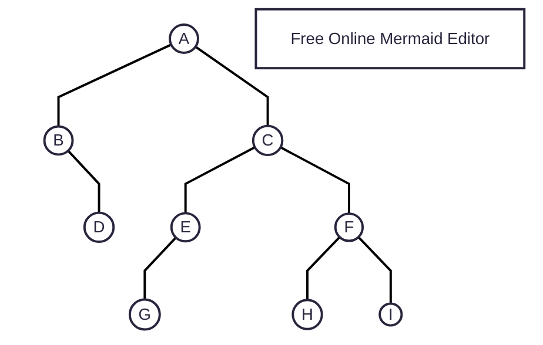
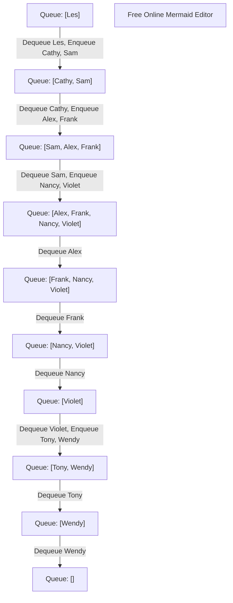

# Tree Traversals

## Prerequisites/References

- [Trees](010trees.md)

## Table Of Contents

- [Depth First](#depth-first)
- [Breadth First Search](#breadth-first-search)
- [3 Main Types Of Depth First Search](#3-main-types-of-depth-first-search)
- [In-Order (Left-Root-Right)](#in-order-left-root-right)
- [Pre-Order (Root-Left-Right)](#pre-order-root-left-right)
- [Post-Order (Left-Right-Root)](#post-order-left-right-root)



### Depth-First

1. **We completely travel and finish one subtree before starting a sibling traversal.**
2. For example, we may travel A-B-D (finishing one subtree) followed by C-E-G, F-H, and I.
3. However, there are 3 different ways (rules, orders) to finish one subtree.
4. `In-Order`, `Pre-Order`, and `Post-Order`.
5. As we know, the main parts of a node are the `Root`, `Left`, and `Right` sides.
6. These order names indicate the order of the `Root` part.
7. For example, the `In-Order` sequence for the travelling is: `Left-Root-Right`. So, the `Root` comes inside `Left` and `Right`.
8. Then, we have the `Pre-Order` sequence where the `Root` comes before the `Left` and the `Right` sides. So, it becomes: `Root-Left-Right`.
9. Finally, we have the `Post-Order` sequence where the `Root` comes after the `Left` and the `Right` sides. So, it becomes `Left-Right-Root`.
10. We will study each order in detail.
11. The time and space complexity for each of these 3 main DFS types is `O(n)` as we visit each node once, and we use a stack as an underlying data structure or the recursion that uses a stack.

### Breadth-First-Search

1. Here, **we travel level-by-level**.
2. So, **first we finish travelling with all the siblings.**
3. And then, we gradually move towards the last level.
4. For example, we may travel in this order: A-B-C-D-E-F-G-H-I.
5. The time and space complexity of BFS is `O(n)` as we visit each node once, and we use a queue of tree size as an underlying data structure.

### 3 Main Types Of Depth-First Search

#### In-Order (Left-Root-Right)

##### Resources / References:

[Jenny's Lecture](https://youtu.be/-b2lciNd2L4?si=tB3crtV88O9ncEuu)


* `Root` comes inside the `Left` and the `Right` sides.
* So, the order becomes: `Left-Root-Right`.
* Hence, the `in-order` traversal for the given example will be as follows:
* We start with the root node, `A`. <------------------------------
* Cover the left side of `A`. <------------------------------
* The `in-order` sequence prioritises the `Left` side first, before the `Root` part.
* So, we continue the depth traversal towards the left side of `A`.
* The root node `A` has two children. `B` and `C`.
* The `in-order` sequence prioritises the `left` part first.
* So, we traverse through the left side, `B`.
* We get `B`.
* Cover the left side of `B`. <------------------------------
* But, `B` does not have the left side.
* Cover the root, `B`. (It is a root of a subtree that starts with itself.) <------------------------------
* So, now we can consider `B`. ------------------------------------------------------------------------------(1).
* Node `B` does not have the `Left` side. So, we considered `B`.
* Now, cover the right side of `B`. <------------------------------
* So, now we consider the right side of `B`, which is `D`.
* We get `D` - Cover the left side of it. <------------------------------
* But it does not have a left side.
* Cover the root, `D`. (It is a root of a subtree that starts with itself.) <------------------------------
* So, it becomes: `B -- D`. ------------------------------------------------------------------------------(2).
* Cover the right side of `D`. <------------------------------
* But, it does not have a right side.
* Then, as the `Right` side of `B` is finished, we can move backwards.
* The subtree `B` is covered. So, we move backwards (upward).
* The subtree `B` was the `Left` side of the `Root` node, `A`. <------------------------------
* It means we have finished the `Left` part of the `Left-Root-Right` for the `Root` node, `A`.
* So, now comes the turn of the `Root` node, `A`. <------------------------------
* Hence, it becomes: `B -- D -- A`. -------------------------------------------------------------------------(3).
* For the root node `A`, we have covered the `Left-Root` parts of the `Left-Root-Right` sequence.
* Now, we need to cover the `Right` side of the root node, `A`.
* We get `C` on the right side of `A`.
* So, we start with `C`. Cover the left side of `C`. <------------------------------
* We know that we need to take the left side before taking the root. Right?
* So, we travel towards the left side of the `C`.
* We get `E`. Cover the left side of `E`. <------------------------------
* So, we travel to the left side of `E`.
* We get `G`. Cover the left side of `G`. <------------------------------
* But it does not have a left side.
* So, cover the root, `G`. (It is a root of a subtree that starts with itself.) <------------------------------
* Hence, it becomes: `B -- D -- A -- G`. --------------------------------------------------------------------(4).
* Cover the right side of `G`. <------------------------------
* `G` does not have any children. So, we move backwards (upward).
* We get `E`. Can we take it? Yes. Why? Because we have already covered its left side.
* Cover the root, `E`. (It is a root of a subtree that starts with itself.) <------------------------------
* So, now it becomes: `B -- D -- A -- G -- E`. --------------------------------------------------------------(5).
* Cover the right side of `E`. <------------------------------
* Does `E` have the right side? No.
* So, we move backwards (upward).
* We get `C`. Should we take it? Yes. Why? Because we have already covered the left side of `C`.
* Now, cover the root, `C`. (It is a root of a subtree that starts with itself.) <------------------------------
* So, it becomes: `B -- D -- A -- G -- E -- C`. -------------------------------------------------------------(6).
* What is next? We have covered the left side of `C`, the root `C`, and now, we need to cover the right side of `C`.
* Cover the right side of `C`. <------------------------------
* So, we travel to the right side of `C`.
* We get `F`. Should we take it? Well, does it have a left side? If yes, the left side will get the priority.
* Cover the left side of `F`. <------------------------------
* We get `H`. Should we take it? Well, does it have a left side? If not, then only we can take it.
* Cover the left side of `H`. <------------------------------
* `H` does not have a left side. So, we can take it.
* So, it becomes: `B -- D -- A -- G -- E -- C -- H`. --------------------------------------------------------(7).
* What is next? Does `H` have a right side? No. So, we can move backwards (upward).
* Cover the root of `H`. <------------------------------
* We get `F`. Should we take it? Well, did we cover the left side of it? Yes. Then, we can take it.
* Cover the root, `F`. (It is a root of a subtree that starts with itself.) <------------------------------
* So, it becomes: `B -- D -- A -- G -- E -- C -- H -- F`. ----------------------------------------------(8).
* What is next? Did we cover the right side of `F`? No. So, let us cover it.
* Cover the right side of `F`. <------------------------------
* We get `I`. Should we take it? Well, did we cover the left side of it?
* Cover the left side of `I`.
* `I` - It does not have a left side. Then, we can take it.
* Cover the root, `I`. (It is a root of a subtree that starts with itself.) <------------------------------
* So, it becomes: `B -- D -- A -- G -- E -- C -- H -- F -- I`. -----------------------------------------(9).
* What is next? Did we cover the right of `I`?
* Cover the right side of `I`. <------------------------------
* Well, it does not have any. So, we can move backwards (upward).
* We have already taken F, C, and A.
* All the subtrees have been covered. The entire tree has been covered.
* We travelled and covered one subtree after another.
* And the path we travelled is:
* `B -- D -- A -- G -- E -- C -- H -- F -- I`. ----------------------------------------------(10).

##### The `In-Order` Traversal Of A Binary Tree Gives A Sorted Order Output:

Resources / References:

[Coursera's UC San Diego Course: Data Structures: Module 01: Section 03: Trees: Video 02: Timestamp: 02:44](https://coursera.org/share/e9f19723cdd15d5e4f0abe3c8c87fe34)

```
                        Les
                       /   \
                      /     \
                     /       \
                Cathy         Sam
                /   \         /   \
               /     \       /     \
           Alex    Frank  Nancy   Violet
                                   /    \
                                  /      \
                               Tony     Wendy


Output: Alex, Cathy, Frank, Les, Nancy, Sam, Tony, Violet, Wendy
```

* By definition, the `In-Order` tree traversal for a binary tree gives a sorted order output.
* Why? How? Because, the [definition](#binary-search-tree) of a binary tree says that:
* **A node is greater than the left side children, and less than the right side children.**
* So, if we travel a binary tree as `Left-Root-Right`, it matches with the `sorted order` arrangement of the binary tree.
* Hence, if we ever want to perform `sorted order` on a binary tree, we go with the `In-order` traversal.

##### Pseudocode Of `In-Order` Traversal:

```kotlin

fun <T> inOrderTraversal(key: T) {
    coverEdgeCases(key)
    inOrderTraversal(key.left)
    print(key)
    inOrderTraversal(key.right)
}
```

##### Complexity Analysis Of `In-Order`

* The time complexity of `In-Order` traversal is `O(n)` as we visit each node once.
* The space complexity of `In-Order` traversal is `O(n)` as we keep track of each visit using a stack through the recursion.

#### Pre-Order (Root-Left-Right)

##### Resources / References:

[Jenny's Lecture](https://youtu.be/-b2lciNd2L4?si=tB3crtV88O9ncEuu)


* For `Pre-Order` traversal, the `Root` gets the first priority, followed by the `Left` and `Right` sides.
* So, for the given example, we start with the root, `A`.
* `A` - Is it a root? Yes. So, we take it.
* Cover the root, `A`. <------------------------------
* So, it becomes `A`. --------------------------------------------------------------(1).
* Then, we ask: What is the left side of `A`?
* Cover the left side of `A`. <------------------------------
* We get `B`. Is it a root? Yes. So, we take it.
* Cover the root, `B`. (It is a root of a subtree that starts with itself.) <------------------------------
* So, it becomes `A -- B`. --------------------------------------------------------------(2).
* Then what? We ask: Did we cover the left side of `B`?
* Cover the left side of `B`. <------------------------------
* Well, there is no left side of `B`.
* Next: Cover the right side of `B`. <------------------------------
* We get `D`.
* Cover the root, `D`. (It is a root of a subtree that starts with itself.) <------------------------------
* So, it becomes:
* `A -- B -- D` --------------------------------------------------------------(3).
* We finished the subtree, `D`. So, we move backward (upward).
* We get `B`.
* We have also covered the subtree `B`.
* So, we continue moving backward (upward).
* We get `A`.
* We have covered the left side and the root (`A` itself).
* Now, cover the right side of `A`. <------------------------------
* We get `C`.
* Cover the root, `C`. (It is a root of a subtree that starts with itself.) <------------------------------
* So, it becomes:
* `A -- B -- D -- C` --------------------------------------------------------------(4).
* Cover the left side of the root, `C`.
* We get `E`. It is the root of a subtree that starts with itself.
* So, cover the root, `E`. (It is a root of a subtree that starts with itself.) <------------------------------
* Hence, it becomes:
* `A -- B -- D -- C -- E` --------------------------------------------------------------(5).
* Cover the left side of `E`. <------------------------------
* We get `G`.
* Cover the root, `G`. (It is a root of a subtree that starts with itself.) <------------------------------
* So, it becomes:
* `A -- B -- D -- C -- E -- G` --------------------------------------------------------------(6).
* Cover the left side of `G`. <------------------------------
* But, there is no left side of `G`.
* Cover the right side of `G`. <------------------------------
* But, there is no right side of `G`.
* We have covered the subtree, `G`.
* Move backward (upward).
* We get `E`. The subtree `G` was the left side of `E`.
* Cover the right side of `E`. <------------------------------
* There is no right side of `E`.
* We have covered the subtree, `E`.
* Move backward (upward).
* We get `C`. The subtree `E` was the left side of `C`.
* Cover the right side of `C`. <------------------------------
* We get `F`.
* It is the root for a subtree that starts with itself.
* So, cover `F`.
* Hence, it becomes:
* `A -- B -- D -- C -- E -- G -- F` --------------------------------------------------------------(7).
* Cover the left side of `F`. <------------------------------
* We get `H`. (It is a root of a subtree that starts with itself.) <------------------------------
* Include `H`.
* So, it becomes:
* `A -- B -- D -- C -- E -- G -- F -- H` --------------------------------------------------------------(8).
* Cover the left side of `H`. <------------------------------
* There is no left side of `H`.
* Cover the right side of `H`. <------------------------------
* There is no right side of `H`.
* We have covered the subtree, `H`.
* So, we move backward (upward).
* We get `F`.
* We have covered the left side of `F`.
* Now, cover the right side of `F`.
* We get `I`. (It is a root of a subtree that starts with itself.) <------------------------------
* So, we add it to our path.
* Hence, it becomes:
* `A -- B -- D -- C -- E -- G -- F -- H -- I` --------------------------------------------------------------(9).
* Cover the left side of `I`. <------------------------------
* But there is no left side of `I`.
* Cover the right side of `I`. <------------------------------
* But there is no right side of `I`.
* We have covered the subtree, `I`.
* So, we move backward (upward).
* We get `F`. We have already covered the subtree, `F`.
* So, we move backward (upward).
* We get `C`. We have already covered the subtree, `C`.
* So, we move backward (upward).
* We get `A`. We have already covered the tree, `A`.
* So, the tree traversal path is:
* `A -- B -- D -- C -- E -- G -- F -- H -- I` --------------------------------------------------------------(10).

##### Pseudocode Of `Pre-Order` Traversal:

```kotlin

fun <T> preOrderTreeTraversal(key: T) {
    coverEdgeCases(key)
    print(key)
    preOrderTreeTraversal(key.left)
    preOrderTreeTraversal(key.right)
}
```

##### Complexity Analysis Of `Pre-Order`

* The time complexity of `Pre-Order` traversal is `O(n)` as we visit each node once.
* The space complexity of `Pre-Order` traversal is `O(n)` as we keep track of each visit using a stack through the recursion.


#### Post-Order (Left-Right-Root)

##### Resources / References:

[Jenny's Lecture](https://youtu.be/-b2lciNd2L4?si=tB3crtV88O9ncEuu)


* In `Post-Order`, the priority order is: `Left-Right-Root`.
* Let us start with the root node, `A`. <------------------------------
* Cover the left side of `A`. <------------------------------
* We get `B`.
* Cover the left side of `B`. <------------------------------
* There is no left side of `B`.
* Cover the right side of `B`. <------------------------------
* We get `D`.
* Cover the left side of `D`. <------------------------------
* There is no left side of `D`.
* Cover the right side of `D`. <------------------------------
* There is no right side of `D`.
* Cover `D`. (It is a root of a subtree that starts with itself.) <------------------------------
* So, it becomes:
* `D` ------------------------------------------------------(1)
* We have covered the subtree, `D`.
* So, we move backward (upward).
* We get `B`.
* We have already covered the left and right sides of `B`.
* That's why and how we are back to `B`.
* So now, let us cover `B`. (It is a root of a subtree that starts with itself.) <------------------------------
* So, it becomes:
* `D -- B` ------------------------------------------------------(2)
* We have covered the subtree, `B`.
* So, we move backward (upward).
* We get `A`.
* We have covered the left side of `A`.
* Now, let us cover the right side of `A`. <------------------------------
* We get `C`.
* Let us cover the left side of `C`. <------------------------------
* We get `E`.
* Let us cover the left side of `E`. <------------------------------
* We get `G`.
* Let us cover the left side of `G`. <------------------------------
* There is no left side of `G`.
* Let us cover the right side of `G`. <------------------------------
* There is no right side of `G`.
* Let us cover the root, `G`. (It is a root of a subtree that starts with itself.) <------------------------------
* So, the path becomes:
* `D -- B -- G` ------------------------------------------------------(3)
* We have covered the subtree, `G`.
* So, we move backward (upward).
* We get `E`.
* We have covered the left side of `E`.
* Let us cover the right side of `E`. <------------------------------
* There is no right side of `E`.
* Then, let us cover the root, `E`. (It is a root of a subtree that starts with itself.) <------------------------------
* So, the path becomes:
* `D -- B -- G -- E` ------------------------------------------------------(4)
* We have covered the subtree, `E`.
* Now, we move backward (upward).
* We get `C`.
* We have covered the left side of `C`.
* Now, we cover the right side of `C`. <------------------------------
* We get `F`.
* Let us cover the left side of `F`. <------------------------------
* We get `H`.
* Let us cover the left side of `H`. <------------------------------
* There is no left side of `H`.
* Let us cover the right side of `H`. <------------------------------
* There is no right side of `H`.
* Let us cover the root, `H`. (It is a root of a subtree that starts with itself.) <------------------------------
* So, the path becomes:
* `D -- B -- G -- E -- H` ------------------------------------------------------(5)
* We have just covered the subtree, `H`.
* Now, we move backward (upward).
* We get `F`.
* We have just covered the left side of `F`.
* Now, we cover the right side of `F`. <------------------------------
* We get `I`.
* Let us cover the left side of `I`. <------------------------------
* There is no left side of `I`.
* Let us cover the right side of `I`. <------------------------------
* There is no right side of `I`.
* Let us cover the root, `I`. (It is a root of a subtree that starts with itself.) <------------------------------
* So, the path becomes:
* `D -- B -- G -- E -- H -- I` ------------------------------------------------------(6)
* We have covered the subtree, `I`.
* So, we move backward (upward).
* We get `F`.
* We have covered the left and right sides of `F`.
* So, we cover the root, `F`. (It is a root of a subtree that starts with itself.) <------------------------------
* So, the path becomes:
* `D -- B -- G -- E -- H -- I -- F` ------------------------------------------------------(7)
* We have covered the subtree, `F`.
* So, we move backward (upward).
* We get `C`.
* We have covered the left and right sides of `C`.
* Now, we cover the root, `C`. (It is a root of a subtree that starts with itself.) <------------------------------
* So, the path becomes:
* `D -- B -- G -- E -- H -- I -- F -- C` ------------------------------------------------------(8)
* We have covered the subtree, `C`.
* Now, we move backward (upward).
* We get `A`.
* We have covered the left and right sides of `A`.
* Now, we cover the root, `A`.
* So, the path becomes:
* `D -- B -- G -- E -- H -- I -- F -- C -- A` ------------------------------------------------------(9)
* There is no root (parent) of `A`.
* Hence, the traversal path for the `Post-Order` is:
* `D -- B -- G -- E -- H -- I -- F -- C -- A` ------------------------------------------------------(10)

##### Pseudocode for `Post-Order` Tree Traversal:

```kotlin

fun <T> postOrderTraversal(key: T) {
    coverEdgeCases(key)
    postOrderTraversal(key.left)
    postOrderTraversal(key.right)
    print(key)
}

```

##### Complexity Analysis Of `Post-Order`

* The time complexity of `Post-Order` traversal is `O(n)` as we visit each node once.
* The space complexity of `Post-Order` traversal is `O(n)` as we keep track of each visit using a stack through the recursion.


#### Questions

##### Different depth-first traversal types.

* There are 3 main `depth-first` traversal techniques: `In-Order,` `Pre-Order,` and `Post-Order.`
* `In-Order` follows `Left-Root-Right` order.
* `Pre-Order` follows `Root-Left-Right` order.
* `Post-Order` follows `Left-Right-Root` order.
* The time and space complexity of each of these types is `O(n)` as we visit each node once, and we keep track of our visit using a stack through recursion.

##### Which tree traversal technique is useful to get a binary tree in a sorted order?

* `In-Order` Traversal for a binary tree gives a sorted order output. [(Reference.)](#the-in-order-traversal-of-a-binary-tree-gives-a-sorted-order-output)

##### Can we use the `In-Order` traversal for a generic tree?

Reference / Resources:

[Coursera's UC San Diego Course: Data Structures: Module 01: Section 03: Trees: Video 02: Timestamp: 03:53](https://coursera.org/share/e9f19723cdd15d5e4f0abe3c8c87fe34)

* The `In-Order` traversal is well-defined (suitable) only for a binary tree.
* Because if a tree node has more than 2 children, what will be the order of processing the node?
* After the first child, or after the second child?
* This confusion makes the `In-Order` traversal suitable only for a binary tree.
* Because in a binary tree, a node can have a maximum of two children.
* And, it is very clear by the definition of the `In-Order` traversal, that we first process the `Left` children.
* So, the children who are smaller (less) than the node.
* Then, we process the node itself.
* Then, we process the right-side children of the node.
* So, the children who are greater (larger) than the node.
* These structures and rules make the `In-Order` traversal suitable only for a binary tree, not for a generic tree.

##### How `Pre-Order` and `Post-Order` tree traversal techniques can be applied to a generic tree, and not only to a binary tree?

Reference / Resources:

[Coursera's UC San Diego Course: Data Structures: Module 01: Section 03: Trees: Video 02: Timestamp: 04:28](https://coursera.org/share/e9f19723cdd15d5e4f0abe3c8c87fe34)

* The `Pre-Order` (`Root-Let-Right`) conveys that: Process the node itself first, before the children.
* This definite place of the node process makes it suitable for any tree.
* Similarly, the `Post-Order` (`Left-Right-Root`) conveys that: Process the node itself after the children.
* Again, this definite place of the node process makes it suitable for any tree.

### Breadth-First-Search (Lever-Order Traversal):

References / Resources:

An animation to understand how BFS uses a queue concept:

[Breadth-First-Search Queue Animation](https://youtube.com/shorts/umHJzlKFGlU?si=aEBY41jPpuoiGYEh)

Also, as always, Shraddha explains the queue concept for BFS (Breadth First Search) very well.

[Tree Concept, Tree Traversals, Queue in BFS](https://youtu.be/eKJrXBCRuNQ?si=ORJK-Y4y9DTP7S59&t=3477)

```
Level-1
-------------->                  Les
                                /   \
                               /     \
Level-2                       /       \
-------------->          Cathy         Sam
                         /   \         /   \
Level-3                 /     \       /     \
-------------->     Alex    Frank  Nancy   Violet
                                            /    \
Level-4                                    /      \
-------------->                         Tony     Wendy


Output: Les, Cathy, Sam, Alex, Frank, Nancy, Violet, Tony, Wendy
```

```{image} res/courses/ucSanDiego/course02dataStructures/module01/section03trees/080breadthFirstSearchPseudocode.png
 :align: center
```

* In a `Breadth-First-Search`, we travel level-by-level, from left to right.
* Hence, we also call it `Level-Order Traversal.`
* The `BFS` uses a `queue` concept to travel level-by-level.
* For example, we want to travel through the given tree that starts from the node `Les`.
* Now, we first create a queue. <----------------- (1)
* Then, we enqueue the node, `Les`.



```
                 ┌───────────┐───────────┐───────────┐───────────┌───────────┐───────────┌───────────┐───────────┌───────────┐                   
     Dequeue     │           │           │           │           │           │           │           │           │           │        Enqueue    
◀──────────────  │    Les    │           │           │           │           │           │           │           │           │  ◀────────────────
                 │           │           │           │           │           │           │           │           │           │                   
                 └───────────┘───────────┘───────────┘───────────└───────────┘───────────└───────────┘───────────└───────────┘                   
                                                                                                                                                 
                                                                                                                                                 
                 ┌───────────┐───────────┌───────────┐───────────┌───────────┐───────────┐───────────┐───────────┌───────────┐                   
     Dequeue     │           │           │           │           │           │           │           │           │           │        Enqueue    
◀──────────────  │           │   Cathy   │    Sam    │           │           │           │           │           │           │  ◀────────────────
       Les       │           │           │           │           │           │           │           │           │           │                   
                 └───────────┘───────────└───────────┘───────────└───────────┘───────────┘───────────┘───────────└───────────┘                   


```

* Then, we run a while loop.
* What is the condition for the while loop?
* As long as the queue is not empty, we will continue the while loop.
* And what will happen in the while loop?
* We will perform dequeue.
* So, we will dequeue `Les`.
* But then, we will check.
* If the dequeued item, `Les` has a left node, we will enqueue it.
* So, we enqueue `Cathy`.
* And we will also enqueue the right side of the popped item.
* So, if the dequeued item, `Les` has a right node, we will enqueue it.
* So, we enqueue `Sam`.

```
                 ┌───────────┐───────────┐───────────┐───────────┌───────────┐───────────┌───────────┐───────────┌───────────┐                   
     Dequeue     │           │           │           │           │           │           │           │           │           │        Enqueue    
◀──────────────  │    Les    │           │           │           │           │           │           │           │           │  ◀────────────────
                 │           │           │           │           │           │           │           │           │           │                   
                 └───────────┘───────────┘───────────┘───────────└───────────┘───────────└───────────┘───────────└───────────┘                   
                                                                                                                                                 
                                                                                                                                                 
                 ┌───────────┐───────────┌───────────┐───────────┌───────────┐───────────┐───────────┐───────────┌───────────┐                   
     Dequeue     │           │           │           │           │           │           │           │           │           │        Enqueue    
◀──────────────  │           │   Cathy   │    Sam    │           │           │           │           │           │           │  ◀────────────────
       Les       │           │           │           │           │           │           │           │           │           │                   
                 └───────────┘───────────└───────────┘───────────└───────────┘───────────┘───────────┘───────────└───────────┘                   
                                                                                                                                                 
                                                                                                                                                 
                 ┌───────────┐───────────┐───────────┐───────────┌───────────┐───────────┌───────────┐───────────┌───────────┐                   
     Dequeue     │           │           │           │           │           │           │           │           │           │        Enqueue    
◀──────────────  │           │           │    Sam    │   Alex    │   Frank   │           │           │           │           │  ◀────────────────
      Cathy      │           │           │           │           │           │           │           │           │           │                   
                 └───────────┘───────────┘───────────┘───────────└───────────┘───────────└───────────┘───────────└───────────┘                   


```

* Now, this same loop of: "1. Dequeue 2. Enqueue the left node. 3. Enqueue the right node." will continue as long as the queue is not empty.
* So, we dequeue, `Cathy`.
* But then, we will check.
* If the dequeued item, `Cathy` has a left node, we will enqueue it.
* So, we enqueue `Alex`.
* If the dequeued item, `Cathy` has a right node, we will enqueue it.
* So, we enqueue `Frank`.
* Notice how `Alex` and `Frank` go behind `Sam`.

```                                                                                                                                                 
                                                                                                                                                 
                 ┌───────────┐───────────┌───────────┐───────────┌───────────┐───────────┐───────────┐───────────┌───────────┐                   
     Dequeue     │           │           │           │           │           │           │           │           │           │        Enqueue    
◀──────────────  │           │           │           │   Alex    │   Frank   │   Nancy   │   Violet  │           │           │  ◀────────────────
       Sam       │           │           │           │           │           │           │           │           │           │                   
                 └───────────┘───────────└───────────┘───────────└───────────┘───────────┘───────────┘───────────└───────────┘                   

```

* The queue is still not empty. So, the same process is repeated. The while loop continues.
* We dequeue `Sam`.
* If the dequeued item, `Sam` has a left node, we enqueue it.
* So, we enqueue `Nancy`.
* If the dequeued item, `Sam` has a right node, we enqueue it.
* So, we enqueue `Violet`.


```
                                                                                                                                                 
                 ┌───────────┐───────────┌───────────┐───────────┌───────────┐───────────┐───────────┐───────────┌───────────┐                   
     Dequeue     │           │           │           │           │           │           │           │           │           │        Enqueue    
◀──────────────  │           │           │           │   Alex    │   Frank   │   Nancy   │   Violet  │           │           │  ◀────────────────
       Sam       │           │           │           │           │           │           │           │           │           │                   
                 └───────────┘───────────└───────────┘───────────└───────────┘───────────┘───────────┘───────────└───────────┘                   
                                                                                                                                                 
                                                                                                                                                 
                 ┌───────────┐───────────┐───────────┐───────────┌───────────┐───────────┌───────────┐───────────┌───────────┐                   
     Dequeue     │           │           │           │           │           │           │           │           │           │        Enqueue    
◀──────────────  │           │           │           │           │   Frank   │   Nancy   │   Violet  │           │           │  ◀────────────────
      Alex       │           │           │           │           │           │           │           │           │           │                   
                 └───────────┘───────────┘───────────┘───────────└───────────┘───────────└───────────┘───────────└───────────┘                   
                                                                                                                                                 

```

* The queue is still not empty.
* The while loop continues.
* We dequeue the top (front) item, `Alex`.
* If the dequeued item, `Alex` has a left node, we enqueue it.
* But there is no left node of `Alex`.
* If the dequeued item, `Alex` has a right node, we enqueue it.
* But there is no right node of `Alex`.

```
                                                                                                                                                 
                                                                                                                                                 
                 ┌───────────┐───────────┐───────────┐───────────┌───────────┐───────────┌───────────┐───────────┌───────────┐                   
     Dequeue     │           │           │           │           │           │           │           │           │           │        Enqueue    
◀──────────────  │           │           │           │           │   Frank   │   Nancy   │   Violet  │           │           │  ◀────────────────
      Alex       │           │           │           │           │           │           │           │           │           │                   
                 └───────────┘───────────┘───────────┘───────────└───────────┘───────────└───────────┘───────────└───────────┘                   
                                                                                                                                                 
                                                                                                                                                 
                 ┌───────────┐───────────┌───────────┐───────────┌───────────┐───────────┐───────────┐───────────┌───────────┐                   
     Dequeue     │           │           │           │           │           │           │           │           │           │        Enqueue    
◀──────────────  │           │           │           │           │           │   Nancy   │   Violet  │           │           │  ◀────────────────
      Frank      │           │           │           │           │           │           │           │           │           │                   
                 └───────────┘───────────└───────────┘───────────└───────────┘───────────┘───────────┘───────────└───────────┘                   
                                                                                                                                                 
                                                                                                                                                 
```

* The queue is not empty.
* The while loop continues.
* We dequeue the top (front) item, `Frank`.
* If the dequeued item, `Frank` has a left node, we enqueue it.
* `Frank` does not have a left node.
* If the dequeued item, `Frank` has a right node, we enqueue it.
* `Frank` does not have a right node.

```

                                                                                                                                                
                 ┌───────────┐───────────┌───────────┐───────────┌───────────┐───────────┐───────────┐───────────┌───────────┐                   
     Dequeue     │           │           │           │           │           │           │           │           │           │        Enqueue    
◀──────────────  │           │           │           │           │           │   Nancy   │   Violet  │           │           │  ◀────────────────
      Frank      │           │           │           │           │           │           │           │           │           │                   
                 └───────────┘───────────└───────────┘───────────└───────────┘───────────┘───────────┘───────────└───────────┘                   
                                                                                                                                                 
                                                                                                                                                 
                 ┌───────────┐───────────┐───────────┐───────────┌───────────┐───────────┌───────────┐───────────┌───────────┐                   
     Dequeue     │           │           │           │           │           │           │           │           │           │        Enqueue    
◀──────────────  │           │           │           │           │           │           │   Violet  │           │           │  ◀────────────────
      Nancy      │           │           │           │           │           │           │           │           │           │                   
                 └───────────┘───────────┘───────────┘───────────└───────────┘───────────└───────────┘───────────└───────────┘                   
                                                                                                                                                 
 
```

* The queue is not empty.
* The while loop continues.
* We dequeue the top (front) item, `Nancy`.
* If the dequeued item, `Nancy` has a left node, we enqueue it.
* `Nancy` does not have a left node.
* If the dequeued item, `Nancy` has a right node, we enqueue it.
* `Nancy` does not have a right node.

```

                                                                                                                                                 
                 ┌───────────┐───────────┌───────────┐───────────┌───────────┐───────────┐───────────┐───────────┌───────────┐                   
     Dequeue     │           │           │           │           │           │           │           │           │           │        Enqueue    
◀──────────────  │           │           │           │           │           │           │           │   Tony    │   Wendy   │  ◀────────────────
      Violet     │           │           │           │           │           │           │           │           │           │                   
                 └───────────┘───────────└───────────┘───────────└───────────┘───────────┘───────────┘───────────└───────────┘                   
                                                                                                                                                 
                                                                                                                                                                                                                                                                                                
```

* The queue is not empty.
* The while loop continues.
* We dequeue the top (front) item, `Violet`.
* If the dequeued item, `Violet` has a left node, we enqueue it.
* `Violet` has a left node, `Tony`.
* So, we enqueue `Tony`.
* If the dequeued item, `Violet` has a right node, we enqueue it.
* `Violet` has a right node, `Wendy`.
* So, we enqueue `Wendy`.

```
                                                                                                                                                 
                 ┌───────────┐───────────┌───────────┐───────────┌───────────┐───────────┐───────────┐───────────┌───────────┐                   
     Dequeue     │           │           │           │           │           │           │           │           │           │        Enqueue    
◀──────────────  │           │           │           │           │           │           │           │           │   Wendy   │  ◀────────────────
      Tony       │           │           │           │           │           │           │           │           │           │                   
                 └───────────┘───────────└───────────┘───────────└───────────┘───────────┘───────────┘───────────└───────────┘                   
                                                                                                                                                 
```

* The queue is not empty.
* The while loop continues.
* We dequeue the top (front) item, `Tony`.
* If the dequeued item, `Tony` has a left node, we enqueue it.
* `Tony` does not have a left node.
* If the dequeued item, `Tony` has a right node, we enqueue it.
* `Tony` does not have a right node.

```
                                                                                                                                                 
                 ┌───────────┐───────────┐───────────┐───────────┌───────────┐───────────┌───────────┐───────────┌───────────┐                   
     Dequeue     │           │           │           │           │           │           │           │           │           │        Enqueue    
◀──────────────  │           │           │           │           │           │           │           │           │           │  ◀────────────────
      Wendy      │           │           │           │           │           │           │           │           │           │                   
                 └───────────┘───────────┘───────────┘───────────└───────────┘───────────└───────────┘───────────└───────────┘                   

```

* The queue is not empty.
* The while loop continues.
* We dequeue the top (front) item, `Wendy`.
* If the dequeued item, `Wendy` has a left node, we enqueue it.
* `Wendy` does not have a left node.
* If the dequeued item, `Wendy` has a right node, we enqueue it.
* `Wendy` does not have a right node.
* The queue is empty now.
* The while loop exits.

#### Pseudocode

* So, what will be the pseudocode for BFS (Breadth-First Search) or Level-Order Traversal of a tree?
* We create a queue.
* We enqueue the node.
* We create a while loop.
* The condition is: As long as the queue is not empty, continue the loop.
* And what happens in the loop?
* We dequeue the node.
* If the dequeued node has a left node, we enqueue it.
* If the dequeued node has a right node, we enqueue it.

```kotlin

fun <T> levelOrderTraversal(key: T) {
    // We can create a queue using a linked list or a circular array.
    // We have already covered that topic.
    // src/courses/uc/course02dataStructures/module01/section02stacksAndQueues/video02queues/02queueUsingLinkedList.kt
    // src/courses/uc/course02dataStructures/module01/section02stacksAndQueues/video02queues/01QueueUsingCircularArray.kt
    // The circular array will require a capacity.
    // The linked list can grow dynamically.
    val queue = Queue()
    queue.enqueue(key)
    while (!queue.isEmpty) {
        val dequeued = queue.dequeue()
        print(dequeued)
        if (dequeued.left != null) {
            queue.enqueue(dequeued.left)
        }
        if (dequeued.right != null) {
            queue.enqueue(dequeued.right)
        }
    }
}
```

#### Complexity Analysis

* The time complexity of `BFS` is `O(n)` as we visit each node once.
* The space complexity of `BFS` is `O(n)` as we use a queue of size tree as an internal data structure to travel and cover each node.
    * Here `n` is the size of the tree =  size of the queue.
    * Size of the tree = number of nodes.

### Complexity Analysis Of A Tree Traversal

* All the `DFS` and `BFS` operations on a `tree` take `O(n)` time and space complexity.
* We visit each node once, and we use a stack through recursion for `DFS` to track our visit, and a queue of tree size for `BFS`. 