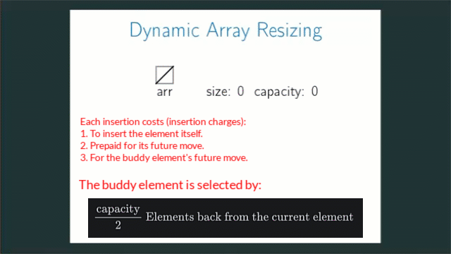

# Amortized Analysis Of Dynamic Arrays

<!-- TOC -->
* [Amortized Analysis Of Dynamic Arrays](#amortized-analysis-of-dynamic-arrays)
  * [Previously](#previously)
  * [The banker method of Amortized Analysis](#the-banker-method-of-amortized-analysis)
    * [How do we select the buddy element?](#how-do-we-select-the-buddy-element)
    * [Process](#process)
      * [Inserting a](#inserting-a)
      * [Inserting b](#inserting-b)
      * [Inserting c](#inserting-c)
      * [Inserting d](#inserting-d)
      * [Inserting e](#inserting-e)
    * [Observation](#observation)
<!-- TOC -->

## Previously

* [Dynamic Arrays.md](010dynamicArrays.md)

## The banker method of Amortized Analysis

* The banker's method of Amortized Analysis contains the following major points:

* Each insert operation consumes 3 tokens.
    * 1 token to insert the element itself.
    * 1 token as a prepaid, reserved, saved money to be used in case we have to create a new array and move the element
      from the old array to the new array. So, it represents the moving charge or shifting charge that we get and save when we
      insert the element initially.
    * 1 token, again as a prepaid, reserved, saved money for a buddy element in case we have to move the buddy element in
      the future from an old array to a new array. So, it covers the moving or shifting charge of a buddy element.

### How do we select the buddy element?

$$
\frac{\text{capacity}}{2} \text{ Elements back from the current element}
$$

### Process

#### Inserting a

* Let us imagine that we have an element "a" to push into an array (Dynamic Array).
* So, we create an array of size 1.
* And we push the element "a" to the array.
* Remember that each push operation costs 3 tokens.
* So, the first token we have used to insert the element "a" into the array.
* The second token is saved for the future move of the element.
* And there is no buddy element at the moment. The element "a" is the only element in the array.
* So, in this particular case, we lose the third token.
* The array is full now.
* Notice that by the time the array becomes full, each element in the array has enough funds to pay the moving charge.

#### Inserting b

* The array is full.
* We create a new array of size 2, which is twice the size of the old array.
* And we have to move the old elements from the old array to the new array.
* Now, remember that we have already prepaid the moving charge of the element "a" when we initially inserted it.
* So, we use it and move the old element "a" to the new array.
* Now, we insert the new element "b" to the new array.
* Remember that each insertion costs 3 tokens.
* We use the 1st token to insert the "b" into the array.
* We save 1 token for the future move of the "b".
* We give 1 token to the buddy element, "a", for its future move.
* The array is full.
* Notice that by the time the array becomes full, each element in the array has enough funds to pay the moving charge.

#### Inserting c

* The array is full.
* We create a new array of size 4, which is twice the size of the old array.
* We need to move each old element from the old array to the new array.
* Remember that when we inserted the element "b", it covered the moving charges of itself and its buddy element, "a".
* So, we use it and move "a, b" to the new array.
* We insert the new element "c" and it consumes 1 token.
* We save 1 token for its future move.
* We save 1 token for the future move of the buddy element, "a".
* At this point, "b" does not have any reserved money to cover its moving charge in the future.
* It is looking for a buddy element that covers its moving charge.
* Anyway. The array is of size 4, and we have 3 elements.
* The array can include 1 more element.
* Hopefully, this future element will cover the moving charge of "b".

#### Inserting d

* The array has room to include "d".
* We pay 1 token to insert "d".
* We save 1 token for the future move of "d".
* We save 1 token for the future move of the buddy element, "b".
* Now, all the elements have the required tokens to cover their moving charges.
* The array is full.
* Notice that by the time the array becomes full, each element in the array has enough funds to pay the moving charge.

#### Inserting e

* The array is full.
* We create a new array of size 8, which is twice the size of the old array.
* We need to move old elements to the new array.
* Do they have the required money to bear and pay the moving charge?
* Yes, they have.
* When we initially inserted the element "c", it covered the moving charges of itself and "a".
* When we initially inserted the element "d", it covered the moving charges of itself and "b".
* So, we use this saved money and move old elements to the new array.
* We insert the new element "e". It consumes 1 token.
* We save 1 token for the future move of "e".
* We save 1 token for the future move of the buddy element, "a".
* The array size is 8 and the inserted elements are: "a, b, c, d, e".
* Each new element that we may insert in the future will cover the moving cost of itself and the buddy element.
* By the time the array becomes full, each element gets enough funds to pay the moving cost.

### Observation

* Each insertion operation costs 3 tokens, and it is a constant charge.
* This charge can be different for a different data structure.
* We may need to calculate that for a particular data structure.
* But, the point is, it is a constant charge.
* And a constant cost means `O(1)`.