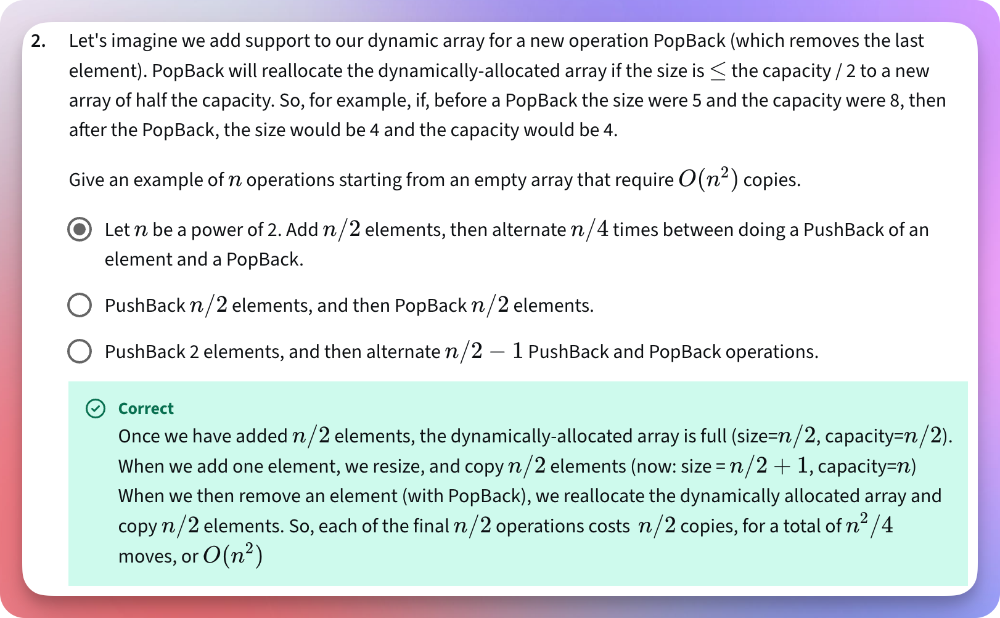
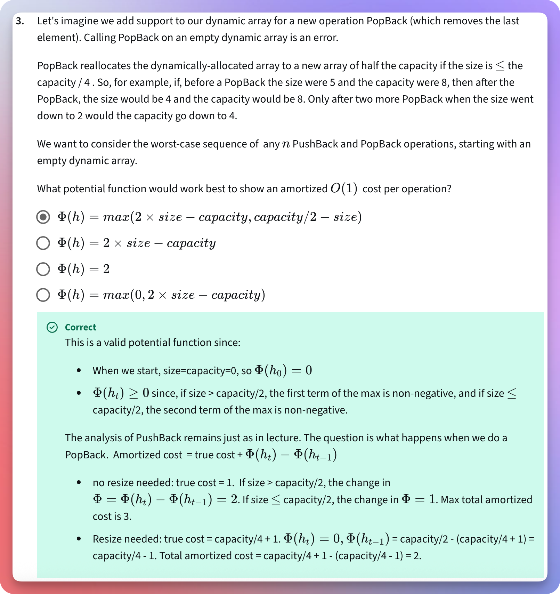

# Questions on dynamic arrays

<!-- TOC -->
* [Questions on dynamic arrays](#questions-on-dynamic-arrays)
  * [Previously](#previously)
  * [MCQ-01](#mcq-01)
    * [Understanding the problem (the question, the requirements)](#understanding-the-problem-the-question-the-requirements)
    * [The area of focus: What is asked?](#the-area-of-focus-what-is-asked)
    * [The area of focus: What do we need to do? How?](#the-area-of-focus-what-do-we-need-to-do-how)
    * [Understanding the options](#understanding-the-options)
      * [Option#01: PushBack 2 Elements. Then, alternate $\frac{n}{2} - 1$ PushBack and PopBack operations](#option01-pushback-2-elements-then-alternate-fracn2---1-pushback-and-popback-operations)
        * [Initially](#initially)
        * [`PushBack 1`](#pushback-1)
        * [`PushBack 2`](#pushback-2)
        * [`Alternate` $\frac{n}{2} - 1$ `times PushBack and PopBack`](#alternate-fracn2---1-times-pushback-and-popback)
          * [1st Time: `PushBack`](#1st-time-pushback)
          * [1st Time: `PopBack`](#1st-time-popback)
          * [2nd Time: `PushBack`](#2nd-time-pushback)
          * [2nd Time: `PopBack`](#2nd-time-popback)
          * [3rd Time: `PushBack`](#3rd-time-pushback)
          * [3rd Time: `PopBack`](#3rd-time-popback)
        * [Evaluation](#evaluation)
      * [Option#02: Let `n` be a power of 2. Add $\frac{n}{2}$ elements, then alternate $\frac{n}{4}$ times between doing a PushBack of an element and a PopBack](#option02-let-n-be-a-power-of-2-add-fracn2-elements-then-alternate-fracn4-times-between-doing-a-pushback-of-an-element-and-a-popback)
        * [Initially](#initially-1)
        * [Add $\frac{n}{2}$ elements = Add $\frac{8}{2} = 4$ elements](#add-fracn2-elements--add-frac82--4-elements)
          * [Add 1st element](#add-1st-element)
          * [Add 2nd element](#add-2nd-element)
          * [Add 3rd element](#add-3rd-element)
          * [Add 4th element](#add-4th-element)
        * [Alternate $\frac{n}{4}$ times = $\frac{8}{4}$ = 2 times: What to alternate? `PushBack`, followed by `PopBack`](#alternate-fracn4-times--frac84--2-times-what-to-alternate-pushback-followed-by-popback)
          * [1st `PushBack`](#1st-pushback)
          * [1st `PopBack`](#1st-popback)
          * [2nd `PushBack`](#2nd-pushback)
          * [2nd `PopBack`](#2nd-popback)
        * [Evaluation](#evaluation-1)
      * [Option#03: PushBack $\frac{n}{2}$ elements, and then PopBack $\frac{n}{2}$ elements](#option03-pushback-fracn2-elements-and-then-popback-fracn2-elements)
        * [Initially](#initially-2)
        * [PushBack $\frac{n}{2} = \frac{8}{2} = 4$ elements](#pushback-fracn2--frac82--4-elements)
          * [1st `PushBack`](#1st-pushback-1)
          * [2nd `PushBack`: Resize](#2nd-pushback-resize)
          * [3rd `PushBack`: Resize](#3rd-pushback-resize)
          * [4th `PushBack`](#4th-pushback)
        * [PopBack $\frac{n}{2} = \frac{8}{2} = 4$ elements](#popback-fracn2--frac82--4-elements)
          * [1st `PopBack`](#1st-popback-1)
          * [2nd `PopBack`: Resize](#2nd-popback-resize)
          * [3rd `PopBack`: Resize](#3rd-popback-resize)
          * [4th `PopBack`](#4th-popback)
        * [Evaluation](#evaluation-2)
      * [Conclusion](#conclusion)
    * [Solution image](#solution-image)
  * [MCQ: 02](#mcq-02)
    * [The area of focus](#the-area-of-focus)
    * [Understanding the problem (requirements)](#understanding-the-problem-requirements)
      * [The Potential Function: What are the conditions for any potential function?](#the-potential-function-what-are-the-conditions-for-any-potential-function)
    * [What are the worst-case sequences of `PushBack` and `PopBack`?](#what-are-the-worst-case-sequences-of-pushback-and-popback)
    * [Value Set Up](#value-set-up)
      * [Initial Values](#initial-values)
      * [Negativity Check](#negativity-check)
        * [Normal Operations: No Resize](#normal-operations-no-resize)
          * [PushBack](#pushback)
          * [PopBack](#popback)
        * [Resize Operations](#resize-operations)
          * [PushBack: The array grows and gets twice the capacity of the old array.**](#pushback-the-array-grows-and-gets-twice-the-capacity-of-the-old-array)
          * [PopBack: The array shrinks and gets half the capacity of the old array.**](#popback-the-array-shrinks-and-gets-half-the-capacity-of-the-old-array)
        * [Finalization](#finalization)
          * [PushBack](#pushback-1)
          * [PopBack](#popback-1)
          * [Amortized Cost](#amortized-cost)
    * [Option-01: $\phi(h) = max(2 * size - capacity, \frac{capacity}{2} - size)$](#option-01-phih--max2--size---capacity-fraccapacity2---size)
      * [Initial Condition](#initial-condition)
      * [Resize Operation: Through `PushBack`](#resize-operation-through-pushback)
        * [Previous State (i - 1): Using Maths](#previous-state-i---1-using-maths)
        * [Previous State (i - 1): Using Values](#previous-state-i---1-using-values)
        * [After State (i): Using Maths](#after-state-i-using-maths)
        * [After State (i): Using Values](#after-state-i-using-values)
      * [PushBack: Amortized Cost = Actual Cost + Potential Difference](#pushback-amortized-cost--actual-cost--potential-difference)
        * [Using Maths](#using-maths)
        * [Using Values](#using-values)
      * [Resize Operation: Through `PopBack`](#resize-operation-through-popback)
        * [Previous State (i - 1): Using Maths](#previous-state-i---1-using-maths-1)
        * [Previous State (i - 1): Using Values](#previous-state-i---1-using-values-1)
        * [After State (i): Using Maths](#after-state-i-using-maths-1)
        * [After State (i): Using Values](#after-state-i-using-values-1)
      * [PopBack: Amortized Cost = Actual Cost + Potential Difference](#popback-amortized-cost--actual-cost--potential-difference)
        * [Using Maths](#using-maths-1)
        * [Using Values](#using-values-1)
      * [Conclusion](#conclusion-1)
    * [Option:02: $\phi(h) = 2 * size - capacity$](#option02-phih--2--size---capacity)
      * [Initial Condition](#initial-condition-1)
      * [Negativity Check: For `PushBack`](#negativity-check-for-pushback)
        * [Previous state (i - 1): Using Maths](#previous-state-i---1-using-maths-2)
        * [Previous state (i - 1): Using Values](#previous-state-i---1-using-values-2)
        * [After state (i): Using Maths](#after-state-i-using-maths-2)
        * [After state (i): Using Values](#after-state-i-using-values-2)
      * [Negativity Check: For `PopBack`](#negativity-check-for-popback)
        * [Previous state (i - 1): Using Maths](#previous-state-i---1-using-maths-3)
        * [Previous state (i - 1): Using Values](#previous-state-i---1-using-values-3)
      * [Conclusion](#conclusion-2)
    * [Option: 03: $\phi(h) = 2$](#option-03-phih--2)
      * [Initial Condition](#initial-condition-2)
      * [Conclusion](#conclusion-3)
    * [Option: 04: $\phi(h) = max(0, 2 * size - capacity)$](#option-04-phih--max0-2--size---capacity)
      * [Initial Condition](#initial-condition-3)
      * [Negative check: For `PushBack`](#negative-check-for-pushback)
        * [Previous state (i - 1): Using Maths](#previous-state-i---1-using-maths-4)
        * [Previous state (i - 1): Using Values](#previous-state-i---1-using-values-4)
        * [After state (i): Using Maths](#after-state-i-using-maths-3)
        * [After state (i): Using Values](#after-state-i-using-values-3)
      * [PushBack: Amortized Cost = Actual Cost + Potential Difference](#pushback-amortized-cost--actual-cost--potential-difference-1)
        * [Using Maths](#using-maths-2)
        * [Using Values](#using-values-2)
      * [Negativity Check: For `PopBack`](#negativity-check-for-popback-1)
        * [Previous state (i - 1): Using Maths](#previous-state-i---1-using-maths-5)
        * [Previous state (i - 1): Using Values](#previous-state-i---1-using-values-5)
        * [After state (i): Using Maths](#after-state-i-using-maths-4)
        * [After state (i): Using Values](#after-state-i-using-values-4)
      * [PopBack: Amortized Cost = Actual Cost + Potential Difference](#popback-amortized-cost--actual-cost--potential-difference-1)
        * [Using Maths](#using-maths-3)
      * [Conclusion](#conclusion-4)
    * [Final Result/Solution](#final-resultsolution)
    * [Solution image](#solution-image-1)
<!-- TOC -->

## Previously

* [Dynamic Arrays](010dynamicArrays.md)
* [Banking Amortized Analysis.md](020bankingAmortizedAnalysis.md)
* [Physicist Potential Amortized Analysis.md](030physicistPotentialAmortizedAnalysis.md)
* [Other Factors For Resize.md](040otherFactorsForResize.md)

## MCQ-01

Let's imagine we add support to our dynamic array for a new operation, `PopBack` (which removes the last element).
`PopBack` will reallocate the dynamically-allocated array if the `size is ≤` the $\frac{Capacity}{2}$ to a new array of
half the capacity.

So, for example, if, before a `PopBack`, the size were 5 and the capacity were 8, then after the `PopBack`, the size
would be 4 and the capacity would be 4.

Give an example of `n` operations starting from an empty array that require $O(n^2)$ copies:

1. PushBack 2 elements, and then alternate $\frac{n}{2} - 1$ PushBack and PopBack operations.
2. Let `n` be a power of 2. Add $\frac{n}{2}$ elements, then alternate $\frac{n}{4}$ times between doing a PushBack of an
   element and a PopBack.
3. PushBack $\frac{n}{2}$ elements, and then PopBack $\frac{n}{2}$ elements.

### Understanding the problem (the question, the requirements)

* If the size of the array is <= $\frac{Capacity}{2}$, we create a new array of half the capacity of the old array.
* We need to find `n operations` (Note: Not a single operation, but `n operations`) that require $O(n^2)$ copies.
* What is the term `copies` here?
* When we resize an array, we copy items from the old array to the new array.
* It means find `n operations` such that each `resize operation` where we have to perform `copy` might cost us $O(n)$.

### The area of focus: What is asked?

* **So, we need to find such `n operations` (from the given options) that cause a total of $n^2$ copies.**
* Copying a single item costs us $O(1)$. So, $n^2$ copies would cost us $O(n^2)$.
* **This means we will focus on the total number of copies we must perform for each option.**
* It means we will have to count and keep track of the total number of copies we perform for each option.

----

* The letter `n` represents `number of operations`.
* The phrase `starting from an empty array` clearly indicates that we start with an empty array.
* We are given 3 options. These options do not represent a single operation. Each option represents a sequence
  (pattern) of operations.

### The area of focus: What do we need to do? How?

* We need to count and keep track of the number of copies we must perform for each option.
* We copy items when we perform the resize operation and create a new array.
* We perform the resize operation and create a new array either when we don't have the room to insert the new element
  or when removing an element makes the array size <= $\frac{Capacity}{2}$.
* To insert an item, we perform `PushBack`. And to remove an item, we perform `PopBack`.
* It means every time we use `PushBack` or `PopBack`, we need to count and keep track of the number of copies we
  perform.

### Understanding the options

#### Option#01: PushBack 2 Elements. Then, alternate $\frac{n}{2} - 1$ PushBack and PopBack operations

##### Initially

* Initially, the array is empty. (As given in the problem statement.)
* The array size is 0, capacity is 1.
* Let us choose `n = 8`. We check (test) the given sequence for 8 operations.

##### `PushBack 1`

* Check the capacity.
* We have the capacity.
* Insert the item.
* Cost of this insertion is 1.

----

* Total cost of all the normal insertions: 1

----

* Total cost (total normal insertions + total copies after resize operations): 1 + 0 = 1.

----

* Size = 1. Capacity = 1.
* The array is full.

##### `PushBack 2`

* Check the capacity.
* We don't have the capacity.
* Resize the array. Double the capacity.
* Copy 1 item.

----

* **Total number of copies so far: 1**

----

* Cost of each copy: 1
* Cost of total copies so far: 1
* Insert the new item.
* Cost of this insertion: 1

----

* Total cost of all the normal insertions: 1 + 1 = 2

----

* Total cost (total normal insertions + total copies after resize operations): 2 + 1 = 3

----

* Size = 2. Capacity = 2.
* The array is full.

##### `Alternate` $\frac{n}{2} - 1$ `times PushBack and PopBack`

* $\frac{n}{2} - 1 = \frac{8}{2} - 1 = 3$
* We will repeat the sequence, `PushBack` and then `PopBack` a total of `3` times.
* If we notice, it will be a total of `6` operations, and we have already performed `2 PushBack` operations earlier.
* So yes, it will be a total of `8` operations.

###### 1st Time: `PushBack`

* Do we have the capacity? No.
* What do we do when we don't have the capacity?
* We resize the array. We create a new array twice the capacity of the old array.
* What was the capacity of the old array? It was 2.
* What will be the capacity of the new array? It will be 4.
* What do we do after creating a new array? Copy old items from the old array to the new array.
* How many items do we need to copy? We have `2` items. (from `2` `PushBack` operations.)

----

* **Total number of copies in this particular operation: 2**

----

* **Total number of copies so far: 1 + 2 = 3**

----

* What do we do after copying the old items? We insert the new item.
* Cost of inserting this item: 1.

----

* Total cost of all normal insertions: 2 + 1 = 3

----

* Total cost (total normal insertions + total copies after resize operations): 3 + 3 = 6

----

* What is the size of the array now? 3.
* What is the capacity of the array? 4.

###### 1st Time: `PopBack`

* Do we have items in the array? Yes.
* What was the last item? 3.
* Remove it.
* What is the size now? 2.
* Did it force the resize?
* For `PopBack`, the resize happens only if it makes the $size <= \frac{Capacity}{2}$.
* After removing the last item, the size is 2. The capacity is 4. So, resize will happen.
* What happens during the resize?
* We create a new array, copy old items from the old array, and insert them into the new array.
* What will be the capacity of the new array? 2.
* How many items do we have to copy? 2.

----

* **Total number of copies in this particular operation: 2**

----

* **Total number of copies so far: 1 + 2 + 2 = 5**

----

* Total number of insertions in this particular operation: 0.
* Total cost (total normal insertions + total copies after resize operations): 3 + 5 = 8

----

* After the resize, the new capacity is 2.

###### 2nd Time: `PushBack`

* Do we have the capacity? No.
* What do we do when we don't have the capacity?
* We create a new array with a new capacity.
* What will be the new capacity? Twice the old capacity. So, 4.
* What do we do after creating a new array?
* Copy old items from the old array into the new array.
* How many items do we have to copy? `2`.

----

* **Total number of copies in this particular operation: 2**

----

* **Total number of copies so far: 1 + 2 + 2 + 2 = 7**

----

* What do we do after copying the items?
* We insert the new item for which we had to create a new array.
* Insert cost in this operation: 1.

----

* Total cost of all the normal insertions: 3 + 1 = 4

----

* Total cost (total normal insertions + total copies after resize operations): 4 + 7 = 11

----

* What is the size of the array now? 3.
* What is the capacity of the array now? 4.

###### 2nd Time: `PopBack`

* Do we have the items in the array? Yes.
* What is the last item? 3.
* Remove it.
* What is the size now? 2.
* Does it force the resize?
* For the `PopBack`, the resize happens if it makes the $size <= \frac{Capacity}{2}$.
* After removing the last item, the size is 2. The capacity is 4. So, resize will happen.
* We create a new array of half the capacity of the old array.
* After the resize, the new capacity is 2.
* We copy the old items into the new array.
* How many items do we have to copy? 2.

----

* **Total number of copies in this particular operation: 2**

----

* **Total number of copies so far: 1 + 2 + 2 + 2 + 2 = 9**

----

* Insertion cost in this operation: 0

----

* Total cost (total normal insertions + total copies after resize operations): 4 + 9 = 13

----

* New capacity is 2.

###### 3rd Time: `PushBack`

* We don't have the capacity.
* We create a new array twice the capacity of the old array.
* The new capacity is 4.
* We copy old items into the new array. We have two items to copy.

----

* **Total number of copies in this particular operation: 2**

----

* **Total number of copies so far: 1 + 2 + 2 + 2 + 2 + 2 = 11**

----

* We insert the new item into the new array.
* Insertion cost of this operation: 1

----

* Total cost of all the normal insertions: 4 + 1 = 5

----

* Total cost (total normal insertions + total copies after resize operations): 5 + 11 = 16

----

* Size is 3. Capacity is 4.

###### 3rd Time: `PopBack`

* The last item is 3.
* We remove it.
* New size is 2. Capacity is 4.
* $size <= \frac{Capacity}{2}$
* So, the array shrinks.
* We create a new array.
* New capacity is 2.
* We copy the old items from the old array to the new array.
* We have two items to copy.

----

* **Total number of copies in this particular operation: 2**

----

* **Total number of copies so far: 1 + 2 + 2 + 2 + 2 + 2 + 2 = 13**

----

* Insertion cost of this operation: 0.

----

* Total cost (total normal insertions + total copies after resize operations): 5 + 13 = 18

----

* Size is 2.

##### Evaluation

* Total number of operations, `n` = 8.
* Total copies for `n` operations: 13.
* Total resize operations: 6.
* Total number of copies each resize operation performs: 2.
* Total copies during (and combining, for) all the resize operations: 6 * 2 = 12.

----

* **What is the relationship between the number of resize operations and the total number of copies?**
* If the total number of resize operations is `n`, then the total number of copies is $2n$.

----

#### Option#02: Let `n` be a power of 2. Add $\frac{n}{2}$ elements, then alternate $\frac{n}{4}$ times between doing a PushBack of an element and a PopBack

* `n` must be a power of 2. Let us take `n = 8`, which is $2^3$.
* Add $\frac{n}{2}$ elements = Add $\frac{8}{2} = 4$ elements.
* Then, alternate $\frac{n}{4}$ times = $\frac{8}{4}$ = 2 times.
* What do we need to alternate? `PushBack` and `PopBack`.
* So, the sequence of operations becomes:
    * Add 4 elements.
    * Then, 1st PushBack: Add 1 more element.
    * Then, 1st PopBack: Remove 1 element.
    * Then, 2nd PushBack: Add 1 element.
    * Then, 2nd PopBack: Remove 1 element.
* We need to find out the total number of copies these `n` operations make.

##### Initially

* The array is empty.
* The array size is zero.
* The array capacity is 1.

##### Add $\frac{n}{2}$ elements = Add $\frac{8}{2} = 4$ elements

###### Add 1st element

* The insert cost is 1.
* The array is full.
* The array size is 1.
* The array capacity is 1.
* Total items in the array: 1.
* There is no resize operation here.
* There is no copy operation here.

###### Add 2nd element

* The array is full.
* We have to resize.
* We create a new array, twice the capacity of the old array.
* The new array capacity is 2 now.
* We copy the old items into the new array.
* We have 1 item to copy.

----

* Total copies in this operation: 1.
* **Total copies overall: 1.**

----

* We insert the `2nd` element.
* The insertion cost of this operation: 1.
* Total insertions cost: 1 + 1 = 2.
* The array size is 2.
* The array capacity is 2.
* Total items in the array: 2.

###### Add 3rd element

* The array is full.
* We have to resize.
* We create a new array, twice the capacity of the old array.
* The new array capacity is 4 now.
* We copy the old items into the new array.
* We have 2 items to copy.

----

* Total copies in this operation: 2.
* **Total copies overall: 1 + 2 = 3.**

----

* We insert the `3rd` element.
* The insertion cost of this operation: 1.
* Total insertions cost: 1 + 1 + 1 = 3.
* The array size is: 3.
* The array capacity is: 4.
* Total items in the array: 3.

###### Add 4th element

* The array capacity is 4.
* There are 3 items in the array.
* We have room to insert this new item as well.
* We insert the `4th` element.
* The insertion cost is: 1.
* Total insertion cost: 1 + 1 + 1 + 1 = 4.
* The array size is: 4.
* The array capacity is: 4.
* Total items in the array: 4.

##### Alternate $\frac{n}{4}$ times = $\frac{8}{4}$ = 2 times: What to alternate? `PushBack`, followed by `PopBack`

###### 1st `PushBack`

* The array is full.
* We have to resize.
* We create a new array, twice the capacity of the old array.
* The new array capacity is 8 now.
* We copy old items from the old array into the new array.

----

* Total copies in this operation: 4.
* **Total copies overall: 3 + 4 = 7.**

----

* Now, we can insert this new, `5th` element.
* The insertion cost of this operation is: 1.
* Total insertion cost: 1 + 1 + 1 + 1 + 1 = 5.
* The array size is: 5.
* The array capacity is: 8.
* Total items in the array: 5.

###### 1st `PopBack`

* The last item is: The `5th` element.
* We remove it.
* The array size is: 4.
* The array capacity is: 8.
* Now, $size <= \frac{Capacity}{2}$.
* So, we get the resize operation.
* We create a new array, half the capacity of the old array.
* The new array capacity is: 4.
* The number of items we have to copy from the old array to the new array: 4.

----

* Total copies in this operation: 4.
* **Total copies overall: 3 + 4 + 4 = 11.**

----

* The array size is: 4.
* The array capacity is: 4.
* Total items in the array: 4.

###### 2nd `PushBack`

* The array is full.
* We have to create a new array, twice the size of the old array.
* The new array capacity is: 8.
* The total number of items we have to copy from the old array into the new array: 4.

----

* Total copies in this operation: 4.
* **Total copies overall: 3 + 4 + 4 + 4 = 15.**

----

* Now, we can insert the new `5th` element.
* The insertion cost of this operation: 1.
* Total insertion cost: 1 + 1 + 1 + 1 + 1 = 5. (Ignoring the cost of each element that we have removed.)
* The array size is: 5.
* The array capacity is: 8.
* Total items in the array: 5.

###### 2nd `PopBack`

* The last item is: The `5th` element.
* We remove it.
* The array size is: 4.
* The array capacity is: 8.
* Now, $size <= \frac{Capacity}{2}$.
* So, we get the resize operation.
* We create a new array, half the capacity of the old array.
* The new array capacity is: 4.
* The number of items we have to copy from the old array to the new array: 4.

----

* Total copies in this operation: 4.
* **Total copies overall: 3 + 4 + 4 + 4 + 4 = 19.**

----

* The array size is: 4.
* The array capacity is: 4.
* Total items in the array: 4.

##### Evaluation

* Total copies during the `n` operations: 19.
* Total resize operations: 4.
* Total number of copies during each resize operation: 4.
* Total copies during (and combining, for) all the resize operations: 4 * 4 = 16.

----

* **What is the relationship between the number of resize operations and the total number of copies?**
* If the total number of resize operations is `n`, then the total number of copies is $ n * n = n^2$.
* Notice how each resize operation causes quadratic (polynomial) copies!
* This is exactly the answer we are looking for.
* `n` operations that make $n^2$ copies.
* This option does the same!
* However, let us understand the 3rd option as well.

----

#### Option#03: PushBack $\frac{n}{2}$ elements, and then PopBack $\frac{n}{2}$ elements

##### Initially

* The array is empty.
* The array size is zero.
* The array capacity is 1.
* Let us take `n = 8` to be consistent across our test and evaluation process.

##### PushBack $\frac{n}{2} = \frac{8}{2} = 4$ elements

###### 1st `PushBack`

* We insert the element.
* The insert cost is: 1.
* Total insertion cost: 1.
* There is no resize operation here.
* There is no copy operation here.
* The array size is: 1.
* The array capacity is: 1.
* Total items in the array: 1.

###### 2nd `PushBack`: Resize

* The array is full.
* We have to resize the array.
* We create a new array of twice the capacity of the old array.
* The new array capacity is: 2.
* We copy the old items from the old array into the new array.
* Total items we have to copy: 1.

----

* **Total copies in this operation: 1.**
* **Total number of copies overall: 1.**

----

* Now, we can insert the new element.
* The insertion cost is: 1.
* Total insertion cost is: 1 + 1 = 2.
* The array size is: 2.
* The array capacity is: 2.
* Total items in the array: 2.

###### 3rd `PushBack`: Resize

* The array is full.
* We have to resize the array.
* We create a new array, twice the capacity of the old array.
* The new array capacity is 4.
* We have to copy old items from the old array into the new array.
* Total items we have to copy: 2.

----

* Total copies in this operation: 2.
* **Total number of copies overall: 1 + 2 = 3.**

----

* Now, we can insert the new element.
* The insertion cost is: 1.
* Total insertion cost becomes: 1 + 1 + 1 = 3.
* The array size is: 3.
* The array capacity is: 4.
* Total items in the array: 3.

###### 4th `PushBack`

* The array capacity is: 4.
* The array size is: 3.
* We have the room to insert this new element.
* We insert this new element.
* The insertion cost is: 1.
* Total insertion cost becomes: 1 + 1 + 1 + 1 = 4.
* There is no resize operation here.
* There is no copy operation here.
* The array size is: 4.
* The array capacity is: 4.
* Total items in the array: 4.

##### PopBack $\frac{n}{2} = \frac{8}{2} = 4$ elements

###### 1st `PopBack`

* The array size is: 4.
* The array capacity is: 4.
* The last item is: The `4th` element.
* We remove it.
* The array size is: 3.
* The array capacity is: 4.
* There is no resize operation here.
* There is no copy operation here.

###### 2nd `PopBack`: Resize

* The array size is: 3.
* The array capacity is: 4.
* The last item is: The `3rd` element.
* We remove it.
* The array size is: 2.
* The array capacity is: 4.
* Now, $size <= \frac{Capacity}{2}$.
* So, we get the resize operation.
* We create a new array, half the capacity of the old array.
* The new array capacity is: 2.
* We copy the old items from the old array into the new array.
* Total items we have to copy: 2.

----

* Total copies in this operation: 2.
* **Total number of copies overall: 1 + 2 + 2 = 5.**

----

* The array size is: 2.
* The array capacity is: 2.
* Total items in the array: 2.

###### 3rd `PopBack`: Resize

* The array size is: 2.
* The array capacity is: 2.
* Total items in the array: 2.
* The last item is: The `2nd` element.
* We remove it.
* The array size is: 1.
* The array capacity is: 2.
* Now, $size <= \frac{Capacity}{2}$.
* So, we get the resize operation.
* We create a new array, half the capacity of the old array.
* The new array capacity is: 1.
* Total items we have to copy: 1.

----

* Total copies in this operation: 1.
* **Total number of copies overall: 1 + 2 + 2 + 2 = 7.**

----

* The array size is: 1.
* The array capacity is: 1.
* Total items in the array: 1.

###### 4th `PopBack`

* The array size is: 1.
* The array capacity is: 1.
* The last element is: The `1st` element.
* We remove it.
* The array size is: 0.
* The array capacity is 1.
* There is no element in the old array.
* It means there is nothing to copy from the old array into the new array.
* The array is empty.
* We may nullify the array reference.
* There is no copy operation here.

##### Evaluation

* Total operations: `n = 8`.
* Total resize operations: 4.
* Total copies we have performed: 7.
* On average, each resize operation caused:

$\frac{\text{ Total Copies }}{\text{ Total Resize Operations}} = \frac{7}{4} = 1.75 \text{ Copies per resize operation}$

* It means if we have `n` resize operations, we might get `n * 1.75` copies.
* It is clearly not $n^2$ copies.

#### Conclusion

* The answer is: To get $O(n^2)$ copies for `n` operations:

> Let `n` be a power of 2. Add $\frac{n}{2}$ elements, then alternate $\frac{n}{4}$ times between doing a PushBack of an element and a PopBack.

### Solution image

## MCQ: 02

Let's imagine we add support to our dynamic array for a new operation, `PopBack` (which removes the last element).
Calling `PopBack` on an empty dynamic array is an error.  
`PopBack` reallocates the dynamically-allocated array to a new array of half the capacity if
$size <= \frac{capacity}{4}$.

So, for example, if, before a `PopBack` the size were `5`, and the capacity were `8`, then after the `PopBack`,
the size would be `4`, and the capacity would (remain to) be `8`.

Only after two more `PopBack` when the size went down to `2` would the capacity go down to `4`.

We want to consider the worst-case sequence of any `n` `PushBack` and `PopBack` operations,
`starting with an empty dynamic array`.

What potential function would work best to show an amortized O(1) cost per operation?

1. $\phi(h) = max ( 2 * size - capacity, \frac{capacity}{2} - size)$
2. $\phi(h) = 2 * size - capacity$
3. $\phi(h) = 2$
4. $\phi(h) = max(0, 2 * size - capacity)$

### The area of focus

* Start with an empty array.
* Create a new array of half the capacity of the old array only if $size <= \frac{capacity}{4}$.
* Consider the `worst-case sequence` of `PushBack` and `PopBack` operations.
* Find (select) the `potential function` that shows the amortized cost `O(1)`.

### Understanding the problem (requirements)

#### The Potential Function: What are the conditions for any potential function?

**Prerequisites and References:**

[Physicist's Method](#the-physicists-method-potential-method-of-amortized-analysis)
[Potential Function Rules](#the-rules-assumption-of-the-potential-function)

* The state of the potential function at time 0, should be 0.
* At any point in time, the potential function can never be negative.

### What are the worst-case sequences of `PushBack` and `PopBack`?

* When there is no room in the array, and we have to create a new array twice the capacity of the old array, to insert
  a new element.
    * At this point, the difference between $size_i$ and $size_{i - 1}$ is 1.
    * Also notice that at this point, $size_{i - 1} = capacity_{i - 1} = k$.
    * And for the capacity, if the $capacity_{i - 1}$ was `k`, then $capacity_{i}$ is `2k`.
* After removing an element, if the array $size <= \frac{capacity}{4}$.
    * At this point, the difference between $size_i$ and $size_{i - 1}$ is 1.
    * And for the capacity, if the $capacity_{i - 1}$ was `k`, then the new capacity, $capacity_i$ becomes $\frac{k}{4}$.

### Value Set Up

* **Let us consider the $capacity_{i - 1} = 8$.**
* Now, we may not need to perform each operation here.
* We know when (at which point) the expensive operation happens (in which conditions).
* We will directly test (evaluate) each option based on the [potential function theory](#the-physicists-method-potential-method-of-amortized-analysis).

----

#### Initial Values

* Size = 0, and capacity = 0.
* If we put these values into any given potential function, it must result in `0`.

----

#### Negativity Check

* We have mainly two scenarios.
* The normal (inexpensive) operations that do not cause a resize.
* The expensive operations that cause a resize (either the array grows or shrinks).

##### Normal Operations: No Resize

* When we want to insert an element, and we have room in the array.
* Clearly, the size is less than the capacity here.
* Maybe, after the operation, the size can be equal to the capacity.
* Note that the capacity remains the same before and after the insertion/removal in this case.
* And for both `PushBack` and `PopBack`, the difference between the size before the insertion/removal and after the insertion/removal is 1.

###### PushBack

* For `PushBack`, where we don't have to resize, we know that $size_{i - 1} < capacity_{i - 1}$ and
  $size_{i - 1} > \frac{capacity_{i - 1}}{4}$.
    * Because the size cannot exceed the capacity.
    * And it cannot be equal to the capacity in this case, where we don't have to resize to insert the new element.
* So, for `PushBack`, the $size_{i - 1}$ needs to be greater than $\frac{capacity_{i - 1}}{4} = \frac{8}{4} = 2$,
  and less than $capacity_{i - 1} = 8$.
* It means that, for `PushBack`, the $size_{i - 1}$ can be anything between (inclusive) `3` and `7`.
    * So, let us take two extreme values of $size_{i - 1}$ for `PushBack`: `3` and `7`.

###### PopBack

* For `PopBack`, where we don't have to resize, we know that $size_{i - 1} > \frac{capacity_{i - 1}}{4} + 1$,
  and $size_{i -1} <= capacity_{i - 1}$.
    * Because in this case, we don't resize (shrink).
    * So, even after removing an element, the new $size_i$ must be greater than $\frac{capacity_{i - 1}}{4}$.
* So, for `PopBack`, the $size_{i - 1}$ needs to be greater than $\frac{capacity_{i - 1}}{4} + 1 = \frac{8}{4} + 1 = 3$,
  and less than or equal to the $capacity_{i - 1} = 8$.
    * So, let us take two extreme values of $size_{i - 1}$ for `PopBack`: `4` and `8`.

##### Resize Operations

###### PushBack: The array grows and gets twice the capacity of the old array.**

* To force resize for a `PushBack` operation, $size_{i - 1}$ has to be equal to the $capacity_{i - 1}$.
* So, $size_{i - 1} = capacity_{i - 1} = k = 8$.
* Now, to insert a new element, we have to create a new array twice the capacity of the old array.
* So, the new capacity becomes:
* $capacity_i = 2 * capacity_{i - 1} = 2 * k = 2 * 8 = 16$.
* And then, we can insert the new element.
* So, the new size becomes:
* $size_i = size_{i - 1} + 1 = k + 1 = 8 + 1 = 9$.

###### PopBack: The array shrinks and gets half the capacity of the old array.**

* To force resize (shrink) for a `PopBack` operation:
* $size_{i - 1} = \frac{capacity_{i - 1}}{4} + 1$.
* So, the $size_{i - 1} = \frac{k}{4} + 1 = \frac{8}{4} + 1 = 3$.
* So, after we perform `PopBack`, the new size becomes:
* $size_i = size_{i - 1} - 1 = (\frac{k}{4} + 1) - 1 = \frac{k}{4} = \frac{8}{4} = 2$.
* Now, $size_i = \frac{capacity_{i - 1}}{4} = \frac{8}{4} = 2$.
* So, it forces the resize (shrink) operation.
* So, the new capacity becomes:
* $capacity_i = \frac{capacity_{i - 1}}{2} = \frac{k}{2} = \frac{8}{2} = 4$.

##### Finalization

* We need to check only the `worst-case scenarios`.
* Hence, it is enough to test each potential function, using only the `resize` values.

###### PushBack

* For the resize operation by `PushBack`:
* $size_{i - 1} = capacity_{i - 1} = k = 8.$
* It forces the resize operation.
* Hence, the new capacity becomes:
* $capacity_i = 2 * capacity_{i - 1} = 2 * k = 2 * 8 = 16$.
* And then we insert the new element.
* So, the new size becomes:
* $size_i = size_{i - 1} + 1 = k + 1 = 8 + 1 = 9$.

###### PopBack

* For the resize operation by `PopBack`:
* $size_{i - 1} = \frac{capacity_{i - 1}}{4} + 1 = \frac{k}{4} + 1 = \frac{8}{4} + 1  = 3$.
* When we remove an element, the new size becomes:
* $size_i = size_{i - 1} - 1 = (\frac{capacity_{i - 1}}{4} + 1) - 1 = (\frac{k}{4} + 1) - 1 = (\frac{8}{4} + 1) - 1 = 2$.
* It will force the resize operation.
* Hence, the new capacity becomes:
* $capacity_i = \frac{capacity_{i - 1}}{2} = \frac{k}{2} = \frac{8}{2} = 4$.

###### Amortized Cost

* Finally, calculate the amortized cost of a valid potential function.
* And select the potential function that gives `O(1)` amortized cost.

----

### Option-01: $\phi(h) = max(2 * size - capacity, \frac{capacity}{2} - size)$

* The potential function must satisfy [the basic rules](#the-rules-assumption-of-the-potential-function).

#### Initial Condition

* Size = 0, Capacity = 0.
* If we put these values into the function:

$\phi(h_0) = max(2 * size - capacity, \frac{capacity}{2} - size)$

$\phi(h_0) = max(2 * 0 - 0, \frac{0}{2} - 0)$

$\phi(h_0) = max(0, 0)$

* Passed. It satisfies the initial condition.
* Now, let us check the next condition: Non-negativity.
* A potential cannot be negative.

----

#### Resize Operation: Through `PushBack`

##### Previous State (i - 1): Using Maths

$\phi(h_{i - 1}) = max(2 * size_{i - 1} - capacity_{i - 1}, \frac{capacity_{i - 1}}{2} - size_{i - 1}$

$= max(2 * k - k, \frac{k}{2} - k)$

$= max(k, -\frac{k}{2})$

$= k$

* It is a positive value.

----

##### Previous State (i - 1): Using Values

$\phi(h_{i - 1}) = max(2 * size_{i - 1} - capacity_{i - 1}, \frac{capacity_{i - 1}}{2} - size_{i - 1}$

$= max(2 * 8 - 8, \frac{8}{2} - 8)$

$= max(8, 4 - 8)$

$= 8$

* It is a positive value.

----

##### After State (i): Using Maths

$\phi(h_i) = max(2 * size_i - capacity_i, \frac{capacity_i}{2} - size_i)$

$= max(2 * (k + 1) - 2k, \frac{2k}{2} - (k + 1))$

$= max(2k + 2 -2k, k - k + 1)$

$= max(2, 1)$

$= 2$

* It is a positive value.

----

##### After State (i): Using Values

$\phi(h_i) = max(2 * size_i - capacity_i, \frac{capacity_i}{2} - size_i)$

$= max(2 * 9 - 16, \frac{16}{2} - 9)$

$= max(2, -1)$

$= 2$

* It is a positive value.

----

#### PushBack: Amortized Cost = Actual Cost + Potential Difference

##### Using Maths

$c_a = size_i + (2 - k)$

$= (k + 1 + 2 - k)$

$= 3$

* It is a constant `O(1)` amortized cost.

----

##### Using Values

$c_a = size_i + (2 - 8)$

$= 9 + 2 - 8$

$= 3$

* It is a constant `O(1)` amortized cost.

----

#### Resize Operation: Through `PopBack`

##### Previous State (i - 1): Using Maths

$\phi(h_{i - 1}) = max(2 * size_{i - 1} - capacity_{i - 1}, \frac{capacity_{i - 1}}{2} - size_{i - 1})$

$= max(2 * (\frac{capacity_{i - 1}}{4} + 1) - capacity_{i - 1}, \frac{capacity_{i - 1}}{2} - (\frac{capacity_{i - 1}}{4} + 1))$

$= max((\frac{2 * capacity_{i - 1}}{4} + 2) - capacity_{i - 1}, (\frac{capacity_{i - 1}}{2} - \frac{capacity_{i - 1}}{4} - 1))$

$= max( (\frac{capacity_{i - 1}}{2} + 2) - capacity_{i - 1}, (\frac{capacity_{i - 1}}{4} - 1) )$

$= max( (2 - \frac{capacity_{i - 1}}{2}), (\frac{capacity_{i - 1}}{4} - 1) )$

* Now, we know example values for which the `PopBack` operation causes a resize (shrinking).
* For example, if the $capacity_{i - 1}$ is `8`, and the $size_{i - 1}$ is `3`.
* If we put (use) these values in the above expression (formula, equation), we get:

$= max((2 - \frac{8}{2}), (\frac{8}{4} - 1))$

$= max((-2), (1))$

$= 1$.

* There are two meanings of this final value here.
    * It is certain that the result is positive.
    * As we increase the capacity, after a certain point in time, it is certain that the second term will be the maximum one.

* Hence:

$= max( (2 - \frac{capacity_{i - 1}}{2}), (\frac{capacity_{i - 1}}{4} - 1) )$

$= (\frac{capacity_{i - 1}}{4}) - 1$ will be the maximum value as we keep increasing the capacity.

* It is a positive value.

----

##### Previous State (i - 1): Using Values

$\phi(h_{i - 1}) = max(2 * size_{i - 1} - capacity_{i - 1}, \frac{capacity_{i - 1}}{2} - size_{i - 1})$

$= max(2 * 3 - 8, \frac{8}{2} - 3)$

$= max(-2, 1)$

$= 1$

* It is a positive value.

----

##### After State (i): Using Maths

$\phi(h_i) = max(2 * size_i - capacity_i, \frac{capacity_i}{2} - size_i)$

* Now, we know that $size_i$ must become $<= \frac{capacity_{i - 1}}{4}$ to trigger the resize (shrink) operation.
* So, we can take $size_i = \frac{capacity_{i - 1}}{4}$.
* And we know that the new capacity becomes:
* $capacity_i = \frac{capacity_{i - 1}}{2}$.

$= max((2 * \frac{capacity_{i - 1}}{4} - \frac{capacity_{i - 1}}{2}), (\frac{\frac{capacity_{i - 1}}{2}}{2} - \frac{capacity_{i - 1}}{4}))$

$= max((\frac{capacity_{i - 1}}{2} - \frac{capacity_{i - 1}}{2}), (\frac{capacity_{i - 1}}{4} - \frac{capacity_{i - 1}}{4}))$

$= max(0, 0)$

$= 0$

* It is a positive value.

----

##### After State (i): Using Values

$\phi(h_i) = max(2 * size_i - capacity_i, \frac{capacity_i}{2} - size_i)$

$= max(2 * 2 - 4, \frac{4}{2} - 2)$

$= max(0, 0)$

$= 0$

* It is a positive value.

----

#### PopBack: Amortized Cost = Actual Cost + Potential Difference

##### Using Maths

$c_a = size_i + (\phi(h_i) - \phi(h_{i - 1}))$

$c_a = size_i + (0 - (\frac{capacity_{i - 1}}{4} - 1))$

$= \frac{capacity_{i - 1}}{4} - \frac{capacity_{i - 1}}{4} + 1$

$= 1$

* The amortized cost is constant `O(1)`.

----

##### Using Values

$c_a = size_i + (\phi(h_i) - \phi(h_{i - 1}))$

$= 2 + (0 - 1)$

$= 1$

* The amortized cost is constant `O(1)`.

#### Conclusion

* Passed all the checks.
* Passed the initial condition.
* Passed the non-negativity condition.
* Gives a constant amortized cost.

----

### Option:02: $\phi(h) = 2 * size - capacity$

#### Initial Condition

$= 2 * size - capacity$

$= 2 * 0 - 0$

$= 0$

* Passed.

----

#### Negativity Check: For `PushBack`

##### Previous state (i - 1): Using Maths

$\phi(h_{i - 1}) = 2 * size_{i - 1} - capacity_{i - 1}$

$= 2 * k - k$

$= k$

* It is a positive value.

----

##### Previous state (i - 1): Using Values

$\phi(h_{i - 1}) = 2 * size_{i - 1} - capacity_{i - 1}$

$= 2 * 8 - 8$

$= 8$

* It is a positive value.

----

##### After state (i): Using Maths

$\phi(h_{i}) = 2 * size_i - capacity_i$

$= 2 * (k + 1) - 2k$

$= 2k + 2 - 2k$

$= 2$

* It is a positive value.

----

##### After state (i): Using Values

$\phi(h_i) = 2 * size_i - capacity_i$

$= 2 * (8 + 1) - 16$

$= 16 + 2 - 16$

$= 2$

* It is a positive value.

----

#### Negativity Check: For `PopBack`

##### Previous state (i - 1): Using Maths

$\phi(h_{i - 1}) = 2 * size_{i - 1} - capacity_{i - 1}$

$= 2 * \frac{capacity_{i - 1}}{4} - capacity_{i - 1}$

$= \frac{capacity_{i - 1}}{2} - capacity_{i - 1}$

$= - \frac{capacity_{i - 1}}{2}$

* It is a negative value.
* At any point in time, a potential function cannot be negative.
* Hence, this potential function is not valid.
* However, we will verify and confirm the same using actual values as well.

----

##### Previous state (i - 1): Using Values

$\phi(h_{i - 1}) = 2 * size_{i - 1} - capacity_{i - 1}$

$= 2 * \frac{capacity_{i - 1}}{4} - capacity_{i - 1}$

$= 2 * \frac{8}{4} - 8 $

$= 4 - 8$

$= -4$

* It is a negative value.
* Hence, this is not a valid potential function.

#### Conclusion

* It did not pass all the checks.
* It passed the initial condition.
* But it failed the non-negativity check for the `PopBack` condition.

----

### Option: 03: $\phi(h) = 2$

#### Initial Condition

* There are no `size` and `capacity` variables (components) in the given potential function.
* The given potential function suggests a constant (steady) potential throughout all the cases.
* It means that the given potential function suggests that even at time `0`, the potential is, `2`.
* It immediately breaks the rule (condition) that **the potential must be `0` at time `0`.**

#### Conclusion

* Negative. It did not pass the initial condition.
* This is not a valid potential function.

----

### Option: 04: $\phi(h) = max(0, 2 * size - capacity)$

#### Initial Condition

$\phi(h_0) = max(0, 2 * 0 - 0)$

$= max(0, 0)$

$= 0$

* Passed.

----

#### Negative check: For `PushBack`

##### Previous state (i - 1): Using Maths

$\phi_{i - 1} = max(0, 2 * size_{i - 1} - capacity_{i - 1})$

$= max(0, 2 * capacity_{i - 1} - capacity_{i - 1})$

$= max(0, capacity_{i - 1})$

$= capacity_{i - 1}$

* It is a positive value, because the capacity cannot be a negative value.

----

##### Previous state (i - 1): Using Values

$\phi(h_{i - 1}) = max(0, 2 * size_{i - 1} - capacity_{i - 1})$

$= max(0, 2 * 8 - 8)$

$= 8$

* It is a positive value.

----

##### After state (i): Using Maths

$\phi(h_i) = max(0, 2 * size_i - capacity_i)$

$= max(0, 2 * (size_{i - 1} + 1) - 2 * capacity_{i - 1})$

$= max(0, 2 * (capacity_{i - 1}) + 1 - 2 * capacity_{i - 1})$

$= max(0, 2 * capacity_{i - 1} + 2 - 2 * capacity_{i - 1})$

$= max(0, 2)$

$= 2$

* It is a positive value.

----

##### After state (i): Using Values

$\phi(h_i) = max(0, 2 * size_i - capacity_i)$

$= max(0, 2 * 9 - 16)$

$= max(0, 18 - 16)$

$= 2$

----

#### PushBack: Amortized Cost = Actual Cost + Potential Difference

##### Using Maths

$c_a = size_i + (\phi(h_i) - \phi(h_{i - 1}))$

$= size_i + (2 - capacity_{i - 1})$

$= (size_{i - 1} + 1) + (2 - capacity_{i - 1})$

$= (capacity_{i - 1} + 1) + (2 - capacity_{i - 1})$

$= 3$

* It is a constant amortized cost `O(1)`.

----

##### Using Values

$c_a = size_i + (\phi(h_i) - \phi(h_{i - 1}))$

$= 9 + 2 - 8$

$= 3$

* It is a constant amortized cost, `O(1)`.

----

#### Negativity Check: For `PopBack`

##### Previous state (i - 1): Using Maths

$\phi(h_{i - 1}) = max(0, 2 * size_{i - 1} - capacity_{i - 1})$

$= max(0, 2 * (\frac{capacity_{i - 1}}{4} + 1) - capacity_{i - 1})$

$= max(0, \frac{capacity_{i - 1}}{2} + 2 - capacity_{i - 1})$

$= max(0, 2 - \frac{capacity_{i - 1}}{2})$

$= 0$

* It is a positive value (or at least, non-negative!).

----

##### Previous state (i - 1): Using Values

$\phi(h_{i - 1}) = max(0, 2 * size_{i - 1} - capacity_{i - 1})$

$= max(0, 2 * 3 - 8)$

$= max(0, -2)$

$= 0$

* It is a positive value (or at least, non-negative!).

----

##### After state (i): Using Maths

$\phi(h_{i}) = max(0, 2 * size_{i} - capacity_{i})$

$= max(0, 2 * (\frac{capacity_{i - 1}}{4}) - \frac{capacity_{i - 1}}{2})$

$= max(0, 0)$

$= 0$

* It is a positive value (or at least, non-negative!).

----

##### After state (i): Using Values

$\phi(h_i) = max(0, 2 * size_i - capacity_i)$

$= max(0, 2 * 2 - 4)$

$= max(0, 0)$

$= 0$

* It is a positive value (or at least, non-negative!).

----

#### PopBack: Amortized Cost = Actual Cost + Potential Difference

##### Using Maths

$c_a = size_i + (\phi(h_i) - \phi(h_{i - 1}))$

$= (\frac{capacity_{i - 1}}{4}) + (0 - 0)$

$= \frac{capacity_{i - 1}}{4}$

* If we drop the constant, $\frac{1}{4}$, the amortized cost is directly proportional to $capacity_{i - 1}$.
* It means that if $capacity_{i - 1}$ is `n`, then the amortized cost is `O(n)`.

----

#### Conclusion

* This potential function passed all the checks.
* It passed the initial condition.
* It passed the non-negativity checks.
* However, the amortized cost of this function is `O(n)`.
* On the other hand, [option#1](#option-01-phih--max2--size---capacity-fraccapacity2---size) gives `O(1)` amortized cost.

### Final Result/Solution

* Only two potential functions are valid.
* [Option#1](#option-01-phih--max2--size---capacity-fraccapacity2---size) and [Option#4](#option-04-phih--max0-2--size---capacity).
* Out of which, only one potential function gives `O(1)` amortized cost.
* And it is: [Option#01](#option-01-phih--max2--size---capacity-fraccapacity2---size).
* So, the right answer is: [Option#01](#option-01-phih--max2--size---capacity-fraccapacity2---size).

### Solution image

