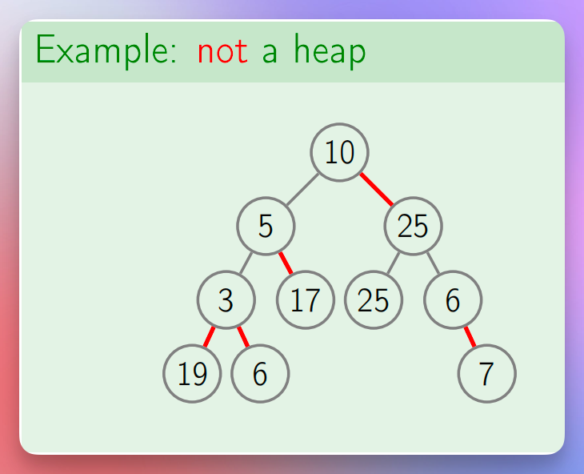
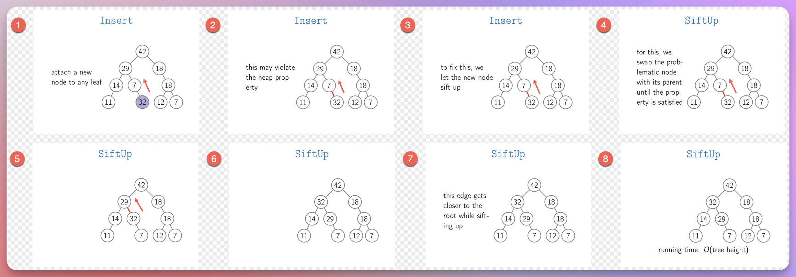
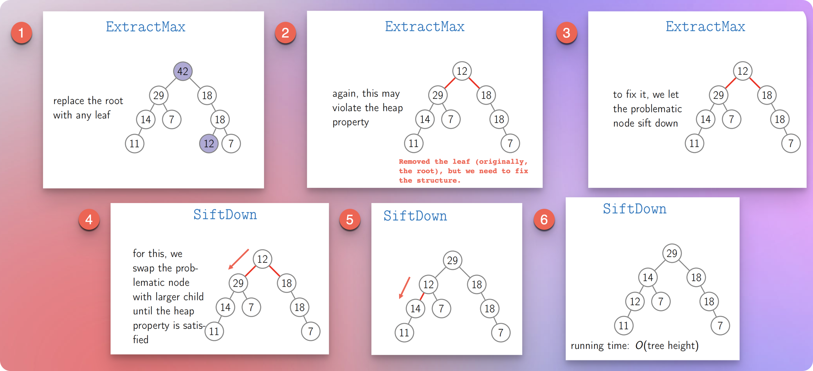
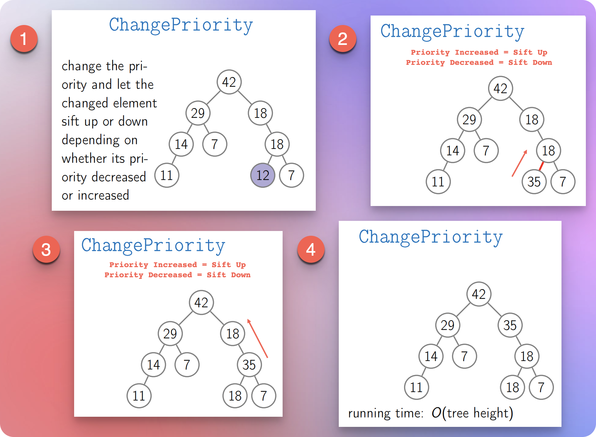
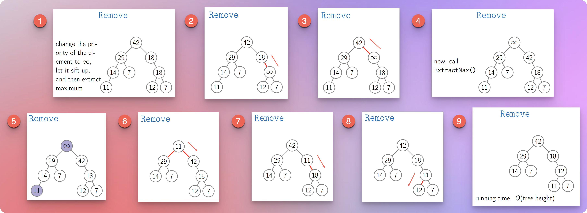
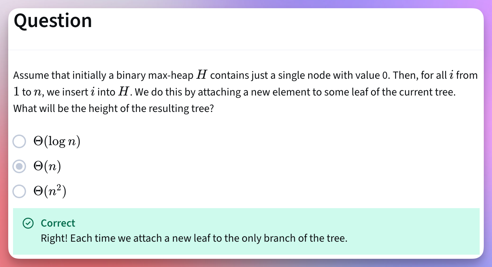

# Binary Heap Trees

<!-- TOC -->
* [Binary Heap Trees](#binary-heap-trees)
  * [Resources / References](#resources--references-)
  * [Binary Max Heap Tree](#binary-max-heap-tree)
    * [Definition](#definition)
    * [Common Operations](#common-operations)
    * [Time Complexity Of Each Operation](#time-complexity-of-each-operation)
      * [GetMax (or peek, max)](#getmax-or-peek-max)
      * [Insert (or add) = `SiftUp`](#insert-or-add--siftup-)
        * [How to remember?](#how-to-remember-)
      * [ExtractMax (or poll) = `SiftDown`](#extractmax-or-poll--siftdown-)
        * [How to remember? The story: Story Time](#how-to-remember-the-story-story-time)
        * [How does `ExtractMax` work?](#how-does-extractmax-work)
        * [How to remember? 02](#how-to-remember-02)
      * [changePriority: Increase = `SiftUp`, Decrease = `SiftDown`.](#changepriority-increase--siftup-decrease--siftdown)
      * [Remove](#remove)
        * [The Story Time](#the-story-time)
        * [Process](#process)
    * [Question: Binary Max Heap Tree Height](#question-binary-max-heap-tree-height)
  * [Next](#next)
  * [Application Summary: Purpose And Reason](#application-summary-purpose-and-reason)
  * [Questions:](#questions)
    * [What problem does a binary heap tree solve?](#what-problem-does-a-binary-heap-tree-solve)
    * [What are the pros and cons of a binary heap tree?](#what-are-the-pros-and-cons-of-a-binary-heap-tree)
    * [How does a binary heap tree work?](#how-does-a-binary-heap-tree-work)
<!-- TOC -->

## Resources / References 

* [Tree Basics](../../../module01BasicDataStructures/section03trees/010trees.md)
* Why `Binary Heap Trees`? What is the purpose? Why do we need it? When do we need it? 
  * [Previous: Priority Queue And Naive Implementations](../../section01priorityQueuesIntroduction/priorityQueues.md)
* [Next: Complete Binary Tree](../topic03CompleteBinaryTrees/completeBinaryTrees.md)
* [Next: Binary Max Heap Code](../../../../../../../src/courses/uc/course02dataStructures/module03PriorityQueuesHeapsDisjointSets/programmingAssignment01/01binaryMaxHeap.kt)
* [Next: Heap Sort Theory](../../section03HeapSort/heapSort.md)
* [Next: Heap Sort Code](../../../../../../../src/courses/uc/course02dataStructures/module03PriorityQueuesHeapsDisjointSets/programmingAssignment01/02heapSort.kt)
* [Coursera: UC San Diego: Data Structures](https://www.coursera.org/learn/data-structures) 

## Binary Max Heap Tree

### Definition

* A binary max heap tree must satisfy the following two properties.
  * Heap Property
  * Structure Property
* **Heap Property:** It is a binary tree where the parent node (the top node of an edge) is always greater than or equal to the child node (the bottom node of the edge).
  * Technically speaking, for every node `n`, it must be greater than or equal to its children.
  * It ensures that the largest value is always at the root node.
* **Structure Property:** It must be a [complete binary tree](../topic03CompleteBinaryTrees/completeBinaryTrees.md). 
  * It means that all the levels except perhaps the last level are completely filled.
  * If all the levels are completely filled, including the last level, and all the leaves are at the same level, then it is a perfect binary tree.
  * But if the last level is not completely filled, it must follow the left-to-right node alignment.
* A node cannot have more than 2 children.

### Common Operations

* getMax(or max, peek), insert(or add), extractMax(or poll), changePriority, remove, etc.

### Time Complexity Of Each Operation

#### GetMax (or peek, max)

* For a binary max heap tree, as per the definition, the root node has the highest value.
* So, we simply return the root node.
* It is `O(1)` time.

#### Insert (or add) = `SiftUp` 

* We insert a new element as a leaf.
* It may violate the binary max heap [structure (rules)](#definition).
* So, to ensure that the structure remains valid, we perform the **SiftUp** procedure.
* In the **SiftUp** procedure, we compare the new element with the parent.
* If the parent is smaller than the new element, we swap the elements (or, in other words, their positions or 
  relationships in the tree).
* We repeat this process until we get a [valid structure](#definition).
* We can see that we insert the element as a leaf and travel upwards towards the root.
* So, the time complexity of this operation depends on the tree height.
* Hence, it is `O(tree height)`.

##### How to remember? 

* `add` is `append` = `up` from the `end`!
* Imagine a nurse who has **a syringe or a needle (an injection)**.
  * She **inserts** it into a vein and **pushes the plunger upward**.
* Imagine a **carjacking**.
  * We **insert** the jack under the vehicle's jack point.
  * We use the lever to push the jack arms (lifting arms) **upward** to lift the car. 

#### ExtractMax (or poll) = `SiftDown` 

##### How to remember? The story: Story Time

* Imagine that there was a tyrant king with maximum power, position, and ego.
* Pulling down the king became the topmost priority of the people in the kingdom.
* However, people could not pull down the king as long as he was in the highest position.
* Also, people cannot detach the king without a good replacement. Otherwise, the kingdom would've become vulnerable.
* So, people needed a good replacement for the king. 
* People started looking for someone down-to-earth and meeting the bottom-to-top system requirements.
* People found a diamond-like person from the bottom of the system (a leaf).
* To ensure kingdom stability, people pulled the king down to the bottom position (leaf) and exiled (removed) him. 
* Then, people pushed someone (originally, a leaf) from the bottom to the top of the system.
* However, to ensure long-term kingdom stability, people arranged a continuous and competitive process:
  * As long as there is a better option, people would swap the positions.
  * If there are multiple better options, people would select the best one with the highest value.
  * This process ensures that only the most eligible person becomes the new king. 
* Similarly, we replace the top element (root) with the bottom element (leaf).
* Once the element with the highest priority (or value) is at the bottom, we exile (remove) it.
* We push the original and old bottom element (the old, original leaf) to the top.
* Then, if we find that a child is more valuable than the parent node, we swap the positions. 
* If we find that both the children are higher than the parent node, we select the one with the highest value.
* We continue this process.
* This is how we maintain the stability in the kingdom (binary max heap tree).

##### How does `ExtractMax` work?

* We cannot simply detach the root. We need a replacement.
* So, we select a leaf node and swap the positions of the root node and the leaf node.
* Then, we ensure that the current root node has the highest value (priority).
* If it is smaller than any of the two children, we swap the positions.
* If both children are higher than the parent node, we select the one who has the highest value (priority).
* We continue this process until we ensure [a stable structure of the binary max heap tree](#definition).
* As a result of this process, the leaf node might travel all the way from top to bottom.
* The traversal is clearly proportional to the tree height.
* Hence, the time complexity of this process is `O(tree height)`.

##### How to remember? 02

* Remember the nurse from the [insert operation](#insert-or-add--siftup-)?
  * She pulls the plunger **downward to extract** the blood from the vein. Right?

#### changePriority: Increase = `SiftUp`, Decrease = `SiftDown`.

* Increasing the priority is like inserting an element. So, we follow the `SiftUp` process.
  * In the `SiftUp` process, we compare the element with the parent node.
  * If the element has a higher value than the parent node, we swap the positions.
  * We continue this process until we get [a stable binary max heap structure](#definition).
* Decreasing the priority is like extracting an element. So, we follow the `SiftDown` process.
  * In the `SiftDown` process, we compare the element with the child node.
  * If the element has a lower value than the child node, we swap the positions.
  * If the element has a lower value than both the children, we swap with the child with the highest value.
  * We continue this process until we get a [stable binary max heap structure](#definition).
* Both the `SiftUp` and `SiftDown` process has `O(tree height)` time complexity.
* Hence, the `changePriority` operation also gets the `O(tree height)` time complexity. 

#### Remove

##### The Story Time

* Remember the [leaf element](#extractmax-or-poll--siftdown-) that made it to the top of the kingdom?
* What happens if this new king is also (or becomes, or is made) a tyrant? 
* So, this is the second part of the story, ok?
* People identified the root cause of the tyrannical king.
* They found that the king was made tyrannical by a friend of the king.
* People found that person and decided to exile that person from the kingdom.
* But it wasn't easy. The king would never have allowed it. After all, they were friends!
* In this case, people have two problems. The king and the friend.
* So, people executed a clever plan.
* People increased the power and position of the friend so much that the friend became a new king.
* Now, people have only one problem. The new king.
* The king has the highest power.
* So, people called the same [extractMax](#extractmax-or-poll--siftdown-) process.
* And this is how people ensured the stability in the kingdom.

##### Process

* So, similar to the story, we increase the priority of the element we want to remove.
* The priority of the element becomes infinite.
* We increased the priority. So, it follows the **SiftUp** process.
* Then, we follow the **extractMax** process.
* Both the **increasePriority(changePriority)** and the **extractMax** processes have `O(tree height)` time complexity.
* So, the **remove** process also gets the `O(tree height)` time complexity.

### Question: Binary Max Heap Tree Height

## Next

* [Next: Complete Binary Tree](../topic03CompleteBinaryTrees/completeBinaryTrees.md)
* [Next: Binary Max Heap Code](../../../../../../../src/courses/uc/course02dataStructures/module03PriorityQueuesHeapsDisjointSets/programmingAssignment01/01binaryMaxHeap.kt)
* [Next: Heap Sort Theory](../../section03HeapSort/heapSort.md)
* [Next: Heap Sort Code](../../../../../../../src/courses/uc/course02dataStructures/module03PriorityQueuesHeapsDisjointSets/programmingAssignment01/02heapSort.kt)

## Application Summary: Purpose And Reason

* Once we understand the [entire priority queue material](#next), the purpose and reasoning of the priority queue becomes clearer.
* We use the priority queue to perform:
    * If we get unorganized data, we can `build a heap` in `O(n)` time. And then:
        * `insert` in `O(log n)` time.
        * `peekMax,` or `peekMin` in `O(1)` time.
        * `extractMax,` or `extractMin` in `O(log n)` time.
        * `changePriority` in `O(log n)` time.
        * `sort` the data in `O(n log n)` time.

## Questions:

### What problem does a binary heap tree solve?
* When do we use a binary heap tree?

### What are the pros and cons of a binary heap tree?

### How does a binary heap tree work?

* How do we implement a binary heap tree?
* What underlying data structure do we use to implement a binary heap tree?
* How do we perform various operations on a binary heap tree?
* What is the time complexity of various operations on a binary heap tree? How?
* What is the space complexity of various operations on a binary heap tree? How?