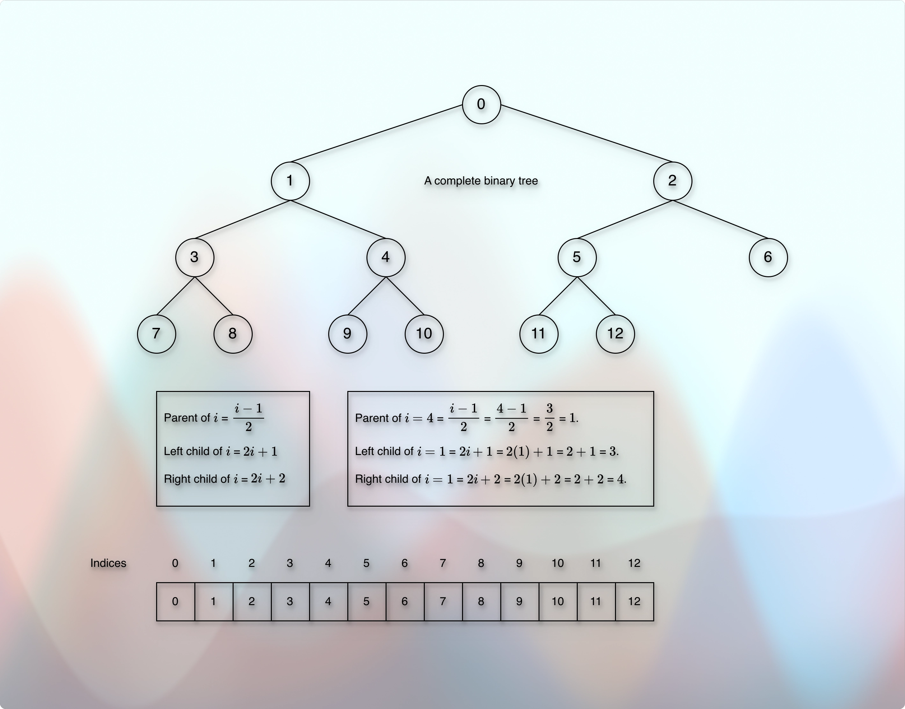
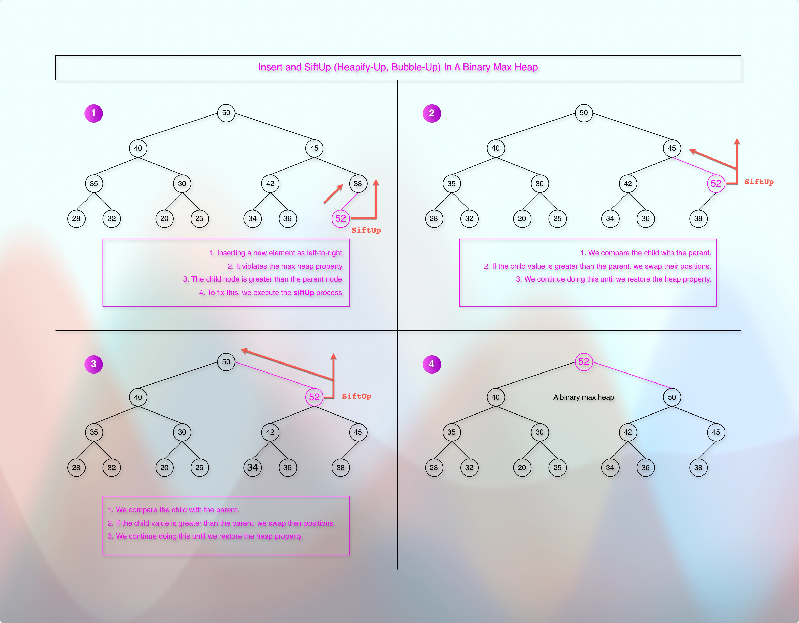
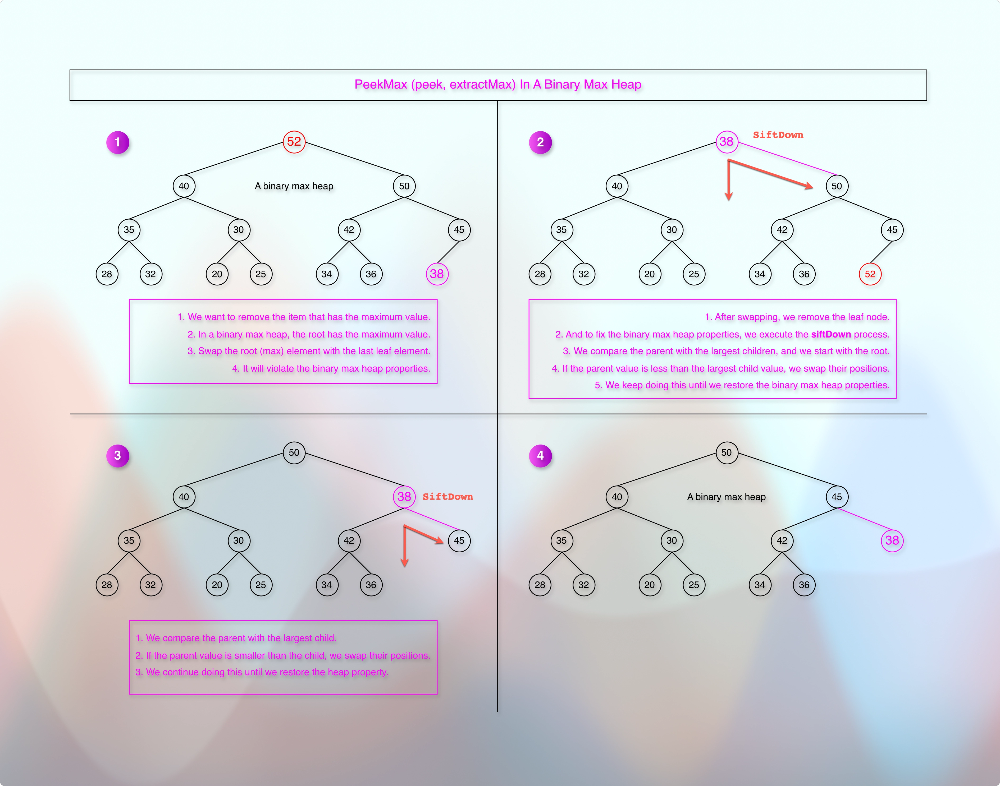

<!-- TOC -->
* [Implement a binary max heap tree data structure](#implement-a-binary-max-heap-tree-data-structure)
  * [References / Resources:](#references--resources)
  * [Thought Process](#thought-process)
    * [What is a binary max heap tree?](#what-is-a-binary-max-heap-tree)
    * [What is the contract (core operations) of a binary max heap tree?](#what-is-the-contract-core-operations-of-a-binary-max-heap-tree)
    * [Which data structure can support these operations efficiently?](#which-data-structure-can-support-these-operations-efficiently)
    * [What condition should be fulfilled by the data structure of a complete binary tree?](#what-condition-should-be-fulfilled-by-the-data-structure-of-a-complete-binary-tree)
    * [In which data structure can we represent a complete binary tree?](#in-which-data-structure-can-we-represent-a-complete-binary-tree)
    * [How do we get random access in `O(1)` for the parents and the children nodes? What are the formulas?](#how-do-we-get-random-access-in-o1-for-the-parents-and-the-children-nodes-what-are-the-formulas)
      * [But arrays usually follow the 0-based index, right? How do we manage it?](#but-arrays-usually-follow-the-0-based-index-right-how-do-we-manage-it)
    * [What are the common operations of a binary max heap tree?](#what-are-the-common-operations-of-a-binary-max-heap-tree)
    * [How do we maintain (keep, sustain, preserve) the complete binary tree for all the operations?](#how-do-we-maintain-keep-sustain-preserve-the-complete-binary-tree-for-all-the-operations)
      * [Offer (add or insert)](#offer-add-or-insert)
      * [How do we do that?](#how-do-we-do-that)
        * [And what about the `siftUp` or the `heapifyUp` process? How do we do that?](#and-what-about-the-siftup-or-the-heapifyup-process-how-do-we-do-that)
      * [extractMax](#extractmax)
      * [siftDown or `heapifyDown`](#siftdown-or-heapifydown)
      * [changePriority](#changepriority)
      * [poll](#poll)
  * [TL;DR](#tldr)
  * [Critical Points](#critical-points)
  * [ToDO](#todo)
<!-- TOC -->

# Implement a binary max heap tree data structure

## References / Resources:

**Trees**

* [Local 010trees.md](../../../../../docs/dataStructures/courses/uc/module01BasicDataStructures/section03trees/010trees.md).

* [GitHub 010trees.md](https://github.com/sagarpatel288/kotlinDSAWithIntellijIdea/blob/19e0b04eac7682842989adac42d1813c543e3be1/docs/dataStructures/coursera/ucSanDiego/module01BasicDataStructures/section03trees/trees.md)

**Priority Queues**

* [Local PriorityQueues.md](../../../../../docs/dataStructures/courses/uc/module03priorityQueuesHeapsDisjointSets/section01priorityQueuesIntroduction/priorityQueues.md)

* [GitHub priorityQueues.md](https://github.com/sagarpatel288/kotlinDSAWithIntellijIdea/blob/ab5477df1cd69c051ac84650605d3077dea796ab/docs/dataStructures/coursera/ucSanDiego/module03priorityQueuesHeapsDisjointSets/section01priorityQueuesIntroduction/priorityQueues.md)

**Binary Heap Trees**

* [Local binaryHeapTrees.md](../../../../../docs/dataStructures/courses/uc/module03priorityQueuesHeapsDisjointSets/section02priorityQueuesUsingHeaps/topic02BinaryHeapTrees/binaryHeapTrees.md)

* [GitHub binaryHeapTrees.md](https://github.com/sagarpatel288/kotlinDSAWithIntellijIdea/blob/407184585eb6b5b03b0ea9d1066cfc0f8249204d/docs/dataStructures/coursera/ucSanDiego/module03priorityQueuesHeapsDisjointSets/section02priorityQueuesUsingHeaps/topic02BinaryHeapTrees/binaryHeapTrees.md)

**Complete Binary Trees**

* [Local completeBinaryTrees.md](../../../../../docs/dataStructures/courses/uc/module03priorityQueuesHeapsDisjointSets/section02priorityQueuesUsingHeaps/topic03CompleteBinaryTrees/completeBinaryTrees.md)

* [GitHub completeBinaryTrees.md](https://github.com/sagarpatel288/kotlinDSAWithIntellijIdea/blob/04e362b8cb0101459304ce5ba6ad17fe20edcc52/docs/dataStructures/coursera/ucSanDiego/module03priorityQueuesHeapsDisjointSets/section02priorityQueuesUsingHeaps/topic03CompleteBinaryTrees/completeBinaryTrees.md)

**Heap Sort**

* [Local heapSort.md](../../../../../docs/dataStructures/courses/uc/module03priorityQueuesHeapsDisjointSets/section03HeapSort/heapSort.md)
* [Local heapSort.md](docs/dataStructures/courses/uc/module03priorityQueuesHeapsDisjointSets/section03HeapSort/heapSort.md)
* [GitHub heapSort.md](https://github.com/sagarpatel288/kotlinDSAWithIntellijIdea/blob/b4deae7cce5798fd22bdc82b3b81222cc4c18527/docs/dataStructures/coursera/ucSanDiego/module03priorityQueuesHeapsDisjointSets/section03HeapSort/heapSort.md)

**Implementation**

* [01binaryMaxHeap.kt](../../../../../../../src/courses/uc/course02dataStructures/module03PriorityQueuesHeapsDisjointSets/programmingAssignment01/01binaryMaxHeap.kt)

## Thought Process

* We have learned that a priority queue physically uses an array, and logically uses a binary heap tree.
* And a binary heap tree uses a complete binary tree (the heap structure) and the heap properties.
  * A complete binary tree ensures that the tree height remains compact: `O(log n)`.
  * The max heap property ensures that we get the element with the highest priority in: `O(1)`.
  * We have parent-children formulas to check and confirm the heap properties.
* Now, we expect the following operations from a priority queue:
  * offer (or add, or insert)
  * peek (getMax, or max without removing it)
  * extractMax (removes the max)
  * poll (removes any element)
  * changePriority (changes the priority of the given element)
* But an operation can change the properties of the heap tree.
  * For example, the `offer`, `extractMax`, `changePriority`, and the `poll` operations.
* So, to sustain the heap properties against these operations, we have certain additional operations.
* For example, the `offer` operation is followed by the `siftUp` operation.
* The `extractMax` operation is followed by the `siftDown` operation.
* If the `changePriority` operation increases the priority, then it is followed by the `siftUp` operation.
* If the `changePriority` operation decreases the priority, then it is followed by the `siftDown` operation.

### What is a binary max heap tree?

* It is a complete binary tree where all the levels are filled completely except perhaps the last level.
* The last level must be filled from left to right.
* And every parent node `n` is greater than or equal to the child nodes.
* Hence, the maximum value is always available at the root node.

### What is the contract (core operations) of a binary max heap tree?

* It supports offer (or add, or insert), changePriorityOf, poll (or remove), and peekMax.

### Which data structure can support these operations efficiently?

* The core requirement is to maintain the binary max heap properties.
* For example, a parent must be greater than or equal to the children nodes.
* It requires comparison between the parents and the children.
* **To compare the parents and the children, we need to access and read them as fast as possible.**
* So, we choose an `Array` (a mutable or dynamic array) because it supports random access in constant time.
* It means we can find an element in `O(1)` time.

### What condition should be fulfilled by the data structure of a complete binary tree?

* The comparison of parents and children is the core part of this data structure.
* Either the data structure must implement the comparable interface, or we must provide an external comparator.
* It means that our class might look:

```kotlin
class BinaryMaxHeap<T: Comparable<T>>() {

}
```

### In which data structure can we represent a complete binary tree?

* Array.
* It means that we will be using an `ArrayList` (a mutable or dynamic array) as an underlying data structure.
* So, we can have something like:

```kotlin
val heap = mutableListOf<T>()
```

### How do we get random access in `O(1)` for the parents and the children nodes? What are the formulas?

* Considering 1-based index:
* Parent of index `i` is `⌊i/2⌋`
* Left child of index `i` is `2 * i`
* Right child of inex `i` is `(2 * i) + 1`

#### But arrays usually follow the 0-based index, right? How do we manage it?



* For 0-based index, the formulas are:
* Parent of index `i` is `⌊(i - 1)/2⌋` 
* Left child of index `i` is `(2 * i) + 1`.
* Right child of index `i` is `(2 * i) + 2`.
* It means that we might have the following helper functions:

```kotlin
fun getParentIndexOf(index: Int): Int {
    // Only if `index > 0` because `0` is the root node. It cannot have a parent.
    return if (index > 0) (index - 1)/2 else -1
}

fun getLeftChildIndexOf(index: Int): Int {
    // Check for a positive, valid index
    return if (index >= 0) (2 * index) + 1 else -1
}

fun getRightChildIndexOf(index: Int): Int {
    // Check for a positive, valid index
    return if (index >= 0) (2 * index) + 2 else -1
}

fun hasParentIndexOf(index: Int) = getParentIndexOf(index) >= 0

// If the resultant index goes beyond the `heap size`, it clearly means that the result (left child) does not exist.
// And `heap.size - 1` because `size` starts with counting `1`, whereas `index` starts with `0`.
// For example, if the `heap size` is 2, the last node, the child index of the root index `0` is `1`,
// which is `size - 1`.
fun hasLeftChildIndexOf(index: Int) = getLeftChildIndexOf(index) <= heap.size - 1

// Same as above. `size - 1` is a standard way of finding/getting the last element in an array.
// If the resultant index goes beyond `size - 1`, it means that the element does not exist in the array.
fun hasRightChildIndexOf(index: Int) = getRightChildIndexOf(index) <= heap.size - 1
```

### What are the common operations of a binary max heap tree?

* offer (or add, or insert),
* changePriorityOf (or update),
* poll (or delete, or remove),
* peekMax (or max, getMax, or peek),
* extractMax (or removeMax), 
* etc.

### How do we maintain (keep, sustain, preserve) the complete binary tree for all the operations?

#### Offer (add or insert)

* When we insert a new element, we ensure that we insert it as the immediate next neighbor of the current last node.
* This way, the new element will be left-aligned, and we follow the left-to-right order.
* Then, we can follow the `SiftUp` procedure.

#### How do we do that?

* It is natural for an `ArrayList` (dynamic or mutable) to `insert` a new element at the end.
* So, adding an element at the end of a dynamic or mutable array is:

```kotlin
fun insert(newElement: Int) {
    heap.add(newElement)
    siftUp(heap.lastIndex) //or siftUp(heap.size - 1) Both indicates the last index.
}
```

##### And what about the `siftUp` or the `heapifyUp` process? How do we do that?



* In `SiftUp`, we compare (that's why the `data type` must be `comparable`) the newly inserted element with the parent.
* We get the parent index, and use it to get the element at that parent index.
* Once we get the parent value from the parent index, we compare it with the newly inserted element value.
* If the newly inserted element is greater than the parent, we swap the positions (indices).
* Clearly, it requires a helper method to swap the positions, like `swap`.
* Now, we need to repeat this process as long as the `parent index` is greater than `0`.
* To repeat the process, we use a `while` loop.
* So, the method looks like:

```kotlin
private fun siftUp(childIndex: Int) {
    var childIndex_ = childIndex
    while (hasParentIndexOf(childIndex_) && (heap[childIndex_] > heap[getParentIndexOf(childIndex_)])) {
        val parentIndex = getParentIndexOf(childIndex_)
        swap(childIndex_, parentIndex)
        childIndex_ = parentIndex
    }
}
```

#### extractMax



* We replace the root node with the last node.
* And then, we follow the `SiftDown` procedure.
* So, it looks like:

```kotlin
fun extractMax(): T? {
    if (heap.isNotEmpty()) {
        // Take the root element
        val max = heap[0]
        // Set the last element at the root and the root element to the last
        swap(0, heap.lastIndex)
        // Remove the last element
        heap.removeAt(heap.lastIndex) //or heap.remove(heap.last)
        // Maintain the max heap properties
        siftDown(0)
        // Return the extracted max value
        return max
    } else {
        return null // We can have another function that would throw an exception in this case.
    }
}
```


#### siftDown or `heapifyDown`

* Here, we compare the element with the child node (That's why, we need a `comparable` data).
* If the element is smaller than the child node, we swap the elements/positions.
* If both the children are greater than the element, we select the highest child.
* We continue this process until we reach the last index of the underlying `mutableList`.
* So, `heapifyDown` looks like: `siftDown`

```kotlin

/**
 * In a binary max heap tree, the parent must be greater than or equal to the children.
 * This function checks if the parent is smaller than the child.
 * If the parent is smaller than the child, it swaps the positions.
 * So, the parent becomes the child. (Demotion)
 * It keeps doing that as long as the parent is smaller than the child.
 * This is how it maintains the binary max heap tree.
 */
private fun siftDown(fromIndex: Int) {
    if (heap.isEmpty() || fromIndex !in 0..<heap.size) return
    var parentIndex = fromIndex
    // We want to compare the parent with the children.
    // It means that the very first condition is: Does the parent have any children?
    // A binary max heap tree follows left-to-right children.
    // It means that if the parent does not have a left child, the parent cannot have a right child!
    // Only if the parent has a left child, there is a possibility of a second child, the right child.
    while (hasLeftChild(parentIndex)) {
        // Until and unless we figure out the existence of the right child,
        // the index of the left child is the maximum child index.
        var maxChildIndex = getLeftChildIndexOf(parentIndex)
        // If the parent has a right child also, it can change the value of the maximum child index.
        // If the right child has a higher value than the left child, we update the maximum child index.
        if (hasRightChild(parentIndex) && heap[getRightChildIndexOf(parentIndex)] > heap[maxChildIndex]) {
            maxChildIndex = getRightChildIndexOf(parentIndex)
        }
        // If parent is greater than the max child, we are good. We can break (leave, end) the loop.
        if (heap[parentIndex] >= heap[maxChildIndex]) {
            break
        } else {
            // If the child has a higher value than the parent, we swap their positions.
            // The parentIndex points to the childIndex.
            // The parentIndex takes the position of the childIndex.
            // The parentIndex goes down. That's why we call it "siftDown."
            // The parent becomes the child.
            swap(parentIndex, maxChildIndex)
            parentIndex = maxChildIndex
        }
    }
}

```

#### changePriority

* If the priority has been increased, we follow the `siftUp` process.
* If the priority has been decreased, we follow the `siftDown` process.
* It looks like:

```kotlin
fun changePriority(atIndex: Int, newValue: T) {
    if (atIndex < 0) return
    val oldValue = heap[atIndex]
    heap[atIndex] = newValue
    if (oldValue < newValue) {
        siftUp(atIndex)
    } else if (oldValue > newValue) {
        siftDown(atIndex)
    }
}
```

#### poll

```kotlin

fun poll(index: Int): T? {
    if (index !in heap.indices) return null
    if (index == heap.lastIndex) {
        return heap.removeLast()
    }
    swap(index, heap.lastIndex)
    val removedItem = heap.removeLast()
    if (hasParentIndex(index) && heap[(getParentIndexOf(index))] < heap[index]) {
        siftUp(index)
    } else {
        siftDown(index)
    }
    return removedItem
}

```

## TL;DR

* To maintain the heap properties, we will be comparing parents and children.
* So, the data must be comparable.
* To compare data, we need fast random access.
* So, we will be using an array (dynamic or mutable) to store the data.
* We store the data in the array in a particular way using the below formulas:
* Parent of index `i` is: `(i - 1)/2`
* Left child of index `i` is: `2i + 1`
* Right child of index `i` is: `2i + 2`
* The `offer` operation is followed by the `siftUp` operation to maintain the heap properties.
* The `extractMax` operation is followed by the `siftDown` operation.
* To remove an item, we swap it with the last element. 
* Then, we remove the last element, and restore the heap property using the `siftDown` or `siftUp` operation.
* If the `changePriority` increases the priority, then it is followed by the `siftUp` operation.
* If the `changePriority` decreases the priority, then it is followed by the `siftDown` operation.

## Critical Points

* **Correct `index` usages in**
* [hasParent], [getParentIndexOf], [hasLeftChild], [getLeftChildIndexOf], [hasRightChild], [getRightChildIndexOf],
* [siftUp], [siftDown], etc.

## ToDO

* 