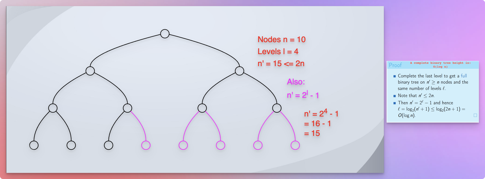
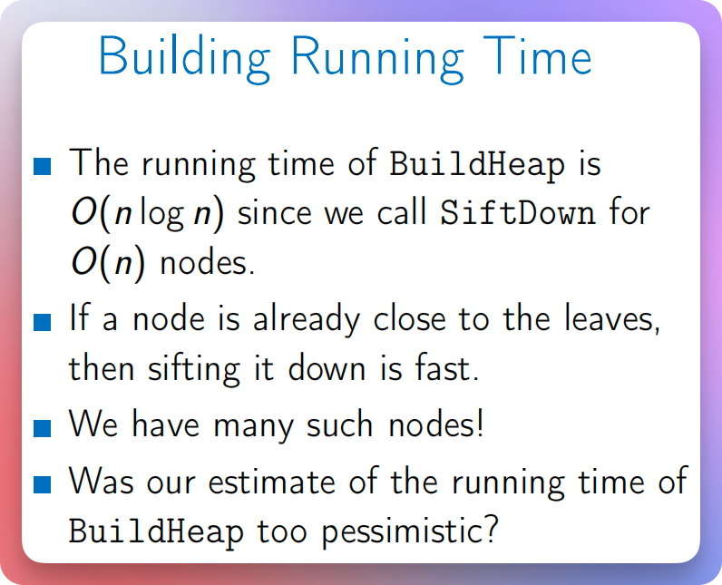
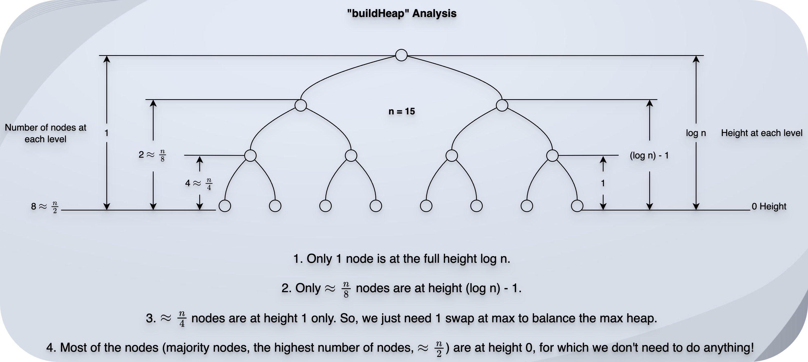
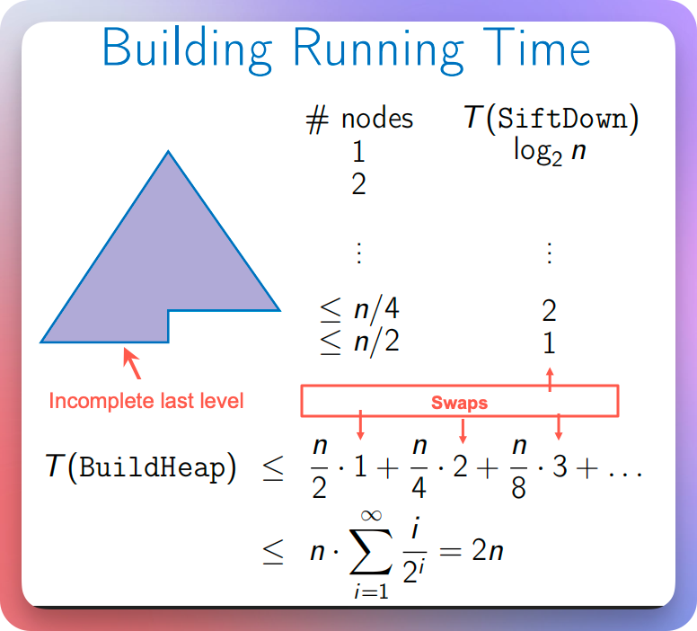
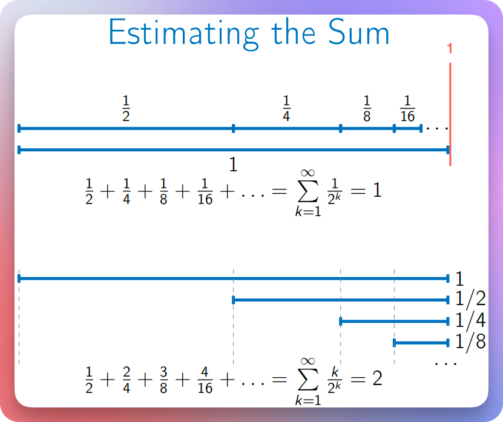
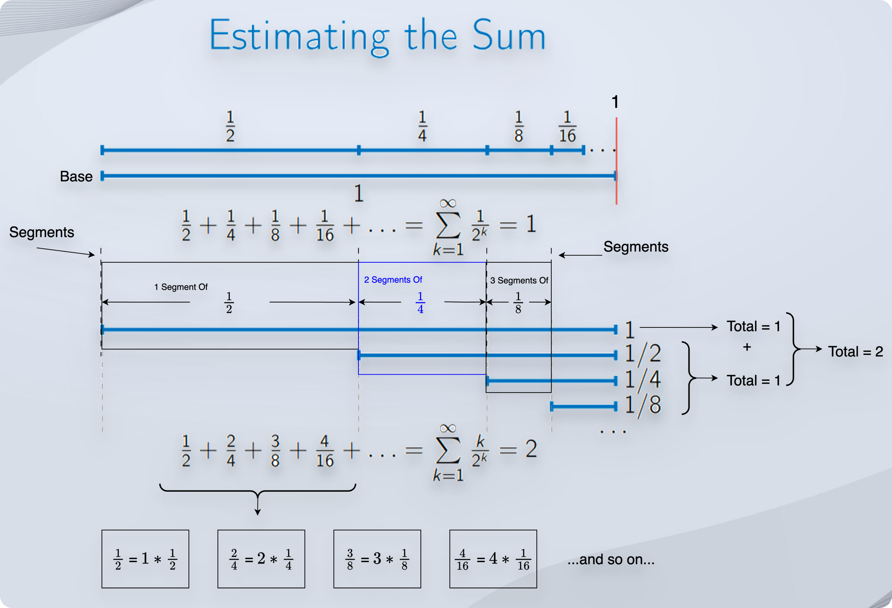
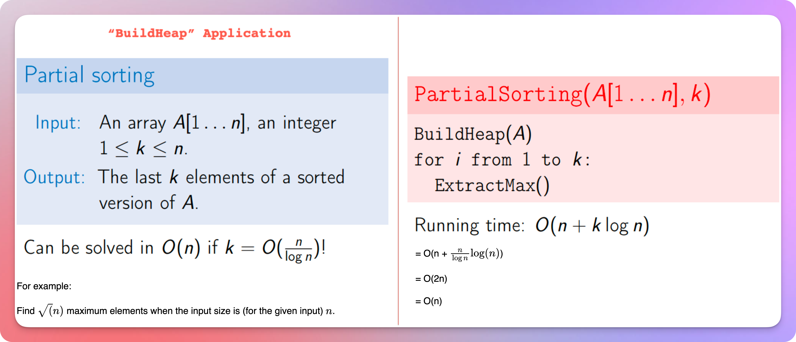

# Heap Sort

<!-- TOC -->
* [Heap Sort](#heap-sort)
  * [References / Resources](#references--resources)
  * [Prerequisites](#prerequisites)
  * [Reflection](#reflection)
  * [`In-Place` Sorting](#in-place-sorting)
  * [Worst-Case Analysis Of Building A Heap](#worst-case-analysis-of-building-a-heap)
  * [Realistic Analysis Of Building A Heap](#realistic-analysis-of-building-a-heap)
    * [Mathematical Calculation](#mathematical-calculation)
    * [Benefits of realistic `buildHeap` analysis](#benefits-of-realistic-buildheap-analysis)
  * [Recap: Heap Sort Algorithm](#recap-heap-sort-algorithm)
  * [Practical Implementation](#practical-implementation)
  * [Application Summary: Purpose And Reason](#application-summary-purpose-and-reason)
  * [Questions:](#questions)
    * [What problem does a heap sort solve?](#what-problem-does-a-heap-sort-solve)
    * [What are the pros and cons of a heap sort?](#what-are-the-pros-and-cons-of-a-heap-sort)
    * [How does a heap sort work?](#how-does-a-heap-sort-work)
    * [What is the difference between a heap sort and a merge sort?](#what-is-the-difference-between-a-heap-sort-and-a-merge-sort)
<!-- TOC -->

## References / Resources

* [Michael Sambol](https://youtu.be/2DmK_H7IdTo?si=K6g9BPvsCyOY9_eC)
* [Coursera: UC San Diego: Data Structures](https://www.coursera.org/learn/data-structures) 

## Prerequisites

* We have learned about:
  * [Priority Queues](../section01priorityQueuesIntroduction/priorityQueues.md)
  * [A Complete Binary Trees](../section02priorityQueuesUsingHeaps/topic03CompleteBinaryTrees/completeBinaryTrees.md)
  * [Binary Heaps](../section02priorityQueuesUsingHeaps/topic02BinaryHeapTrees/binaryHeapTrees.md)
* And now, we are going to see one of the applications of a binary heap.
  * Heap Sort

## Reflection

* We know that in a max heap tree, the maximum value is always at the root.
* It means that if we follow the process below: 
  * We maintain the heap structure, 
  * Call `extractMax`, and 
  * Add the result of `extractMax` to the end of the new array (we fill the array from end to start), 
  * Repeat this process until there are no more elements left to perform the `extractMax` function, 
  * The resultant array, where we store the result of each `extractMax` call, becomes a sorted array (ascending).
* However, in that case, we take the additional array, which increases the space complexity.
* What if we can do this process as an `in-place` sorting?
* To make it an `in-place` sorting process, we don't take the new array to store the results.
* Instead, we follow the process below:

## `In-Place` Sorting

* First of all, we call the `buildHeap` function to ensure that we have a valid max heap structure.
* The `buildHeap` function would use the `siftDown` function.
* The `siftDown` function ensures that the parent node is always greater than or equal to the child nodes.
* How does it ensure that? It compares the parent node with child nodes.
* If any child node is greater than the parent node, it swaps the position with the max child index.
* The `siftDown` function needs an index to compare parents and children.
* So, from where do we start?
* Well, we start from $\frac{n}{2}$ instead of from the last node.
* Why?
* Because $\frac{n}{2}$ is the last parent node.

* All the other nodes will be at the last level without any children!
* So, this is the advantage of this algorithm. We reduce (cut, ignore) many nodes at once in this process.
* We call `siftDown` for all the subtrees to cover all the nodes from $\frac{n}{2}$ to 1.
* Once we establish a proper `max heap` tree, we call the `extractMax` function.
* We store the `extractMax` result at the last unsorted index of the existing array.
* The existing last element will become the first element. So, we swap the positions.
* And once we place the `extractMax` result at the last unsorted index, we get one less element to sort.
* The result of the `extractMax` call gets its true, final, sorted position in the array.
* Once we place the result of the `extractMax` at the end, we narrow down the ending boundary.
* Now, we have `n - 1` elements to sort instead of the `n` elements.
* But, note that we have performed the `swap` operation to fit the `extractMax` result to the last unsorted index.
* That might have violated the max heap structure.
* So, we call the `siftDown` function again to establish a valid binary max heap tree.
* Then, we again call the `extracMax` function.
* So, we repeat the process of `extractMax` till we cover all the elements from the largest one to the smallest one.
* Or in other words, we repeat this `extractMax` process till the index-end-boundary goes down from `size - 1` to `0`, which would then indicate that we have covered all the elements.

## Worst-Case Analysis Of Building A Heap

* We perform the `siftDown` operation for at least $\frac{n}{2}$ elements.
* We know that the height of a complete binary tree that we use for the heap tree is `log n`.

* So, we know that each `siftDown` call gets `log n` time complexity.
* And for $\frac{n}{2}$ elements, it becomes $\frac{n}{2} * \log n$.
* Which is, $n\:\log n$ time, because we drop the constant $\frac{1}{2}$.

## Realistic Analysis Of Building A Heap

* If we notice, only when a node travels top-to-bottom or bottom-to-top do we travel `log n` distance.

* In all the other cases, it is always less than `log n`.
* So, what is the realistic time complexity of the **buildHeap** process?

### Mathematical Calculation

* We can see in the image that:
* A total of around $\frac{n}{2}$ nodes require 0 swaps. Let us be a bit more generous and consider that they require at least 1 swap. (Well, the reason behind being generous here is actually to get a proper geometric series!)
  * So, the total number of swaps for $\frac{n}{2}$ nodes is $1 * \frac{n}{2}$. 
* A total of around $\frac{n}{4}$ nodes require at most 2 swaps. (Yes, 2 instead of 1, as we continue adding "1" additional swap to get a proper geometric series! We are going to calculate an upper bound only. So, the additional "1" will not make much difference!)
  * So, the total swaps for $\frac{n}{4}$ are $2 * \frac{n}{4}$.
* A total of around $\frac{n}{8}$ nodes require at most 3 swaps.
  * So, the total swaps for $\frac{n}{8}$ are $3 * \frac{n}{8}$.
* A total of around $\frac{n}{16}$ nodes require at most 4 swaps.
  * So, the total swaps for $\frac{n}{16}$ are $4 * \frac{n}{16}$.
* And so on...

* If we want to find the total number of swaps, it is clearly:

$$
(1 * \frac{n}{2}) + (2 * \frac{n}{4}) + (3 * \frac{n}{8}) + (4 * \frac{n}{16}) + \dots + \text{...and so on...}
$$

* If we separate the terms 1 to n, we get the following expression:

$$
\text{Total swaps = } n \sum_{i = 1}^{\infty}{\frac{i}{2^i}}
$$

* Now, we know the answer of the sum of $\frac{1}{2^i}$.

* So, the answer of the sum of $\frac{1}{2^i}$ is 1 as we can see in the image.
* However, we have a bit of a different series, which looks like below:

$$
(1 * \frac{1}{2}) + (2 * \frac{1}{4}) + (3 * \frac{1}{8}) + (4 * \frac{1}{16}) + \dots + \text{...and so on...} 
$$

* We can read our series as follows:
* We have 1 segment of $\frac{1}{2}$.
* We have 2 segments of $\frac{1}{4}$.
* We have 3 segments of $\frac{1}{8}$.
* We have 4 segments of $\frac{1}{16}$.
* ...and so on...

* If we try to represent this concept in an image (heads up! It will be a complicated one!), it looks like follows:

* So, it turns out that the answer to the sum of our series is **2**.
* It means that the expression becomes:

$$
\text{Total swaps = } n * 2 = 2n
$$

* It proves that the running time of the **buildHeap** process is actually a linear time `O(n)` even though the height of the tree is `log n`.

### Benefits of realistic `buildHeap` analysis

* We have seen `buildHeap` as a part of our **Heap Sort** algorithm.
* We know that the **heap sort** algorithm also includes the `extractMax` process. 
* And we perform the `extractMax` operation `n` times to completely sort the array.
* Hence, the overall running time of the `heapSort` algorithm is still `n log n`.
* However, we can still benefit from the realistic `buildHeap` analysis.
* How?
* Consider a situation where we need to find `k` maximum elements from the given array of size `n`.
* And we find that the given number `k` is $<= \frac{n}{\log(n)}$.
* In such cases, we can find these `k` maximum elements in linear time, `O(n)`, which is highly impressive.
* How? And why do we have this condition for the value of `k`?
* To find the `k` maximum elements from the given array of size `n`, we will still follow the same `heapSort` process.
* But, we achieve our goal in linear time, `O(n)` instead of taking `O(n log n)` time.
* How?
* Well, because the `extractMax` process will go up to the `k` elements only, right?
* So, the running time of the `heapSort` algorithm is `O(n + k log n)`.
* And we know the value of `k` is $<= \frac{n}{\log(n)}$, right?
* So, $n \log(n)$ is $\frac{n}{\log(n)} \log(n)$, which is $n$ only.
* So, we solve the problem in `O(n)` time, which is linear.

## Recap: Heap Sort Algorithm

* We get an unsorted array.
* We build a heap out of it.
  * The `buildHeap` uses the `siftDown` function to ensure that when we `extractMax`, we get the element with the maximum value.
  * The `siftDown` asks for the `fromIndex` argument.
  * The `buildHeap` passes the `fromIndex` starting from $\frac{n}{2}$ down to 1 (or 0).
  * It means that the `buildHeap` function calls the `siftDown` function in a loop.
  * This process ensures that we cover every subtree starting from the last parent at $\frac{n}{2}$ to all the way up to the first parent (root).
  * Once this process is finished, we can call `extractMax` to get our first element with the maximum (highest) value.
  * The height of a binary max heap tree is `log n`.
  * Hence, a single (one-time) execution of the `siftDown` call takes `log n` time.
  * And when we call it for $\frac{n}{2}$ nodes, it takes $\frac{n}{2} * \log(n)$ = $n\: \log(n)$ time.
  * However, the realistic analysis proves that it only takes $O(n)$ time because only the root element has the full height of `log n`.
  * All the other nodes have less height than `log n`.
  * The closer we are to the leaves, the lower the height the node gets. 
  * In fact, the last level leaves, where we have the majority of nodes, get zero height.
  * Hence, the complete `buildHeap` operation takes `O(n)` time only.
* Once we finish the `buildHeap` process and get a valid, proper binary max heap tree, we call the `extractMax` function.
* The `extractMax` function:
  * The `extractMax` function uses the `swap` function.
  * The `swap` function replaces the last leaf node with the root node.
  * Now, the old and original root node, which has the maximum value, is at the last leaf position.
    * In other words, the old and original root node gets the last available position in the array.
    * So, we are filling (or rearranging) the array in ascending order, and we fill it from end-to-start.
  * Once we fix the current root (the element with the maximum value) at the last available position, we reduce the end-index boundary. 
  * This indicates that we now have one less element to manage.
  * However, the `swap` function has placed the old and original last leaf node at the root position.
  * It might violate the binary max heap tree.
    * As per the definition of the binary max heap tree, it will always violate the max heap unless all the elements are the same!
  * So, to ensure the binary max heap properties, we call `siftDown`. 
  * We pass the index `0` to indicate that we need to inspect the tree from top to bottom.
  * Once we have a valid, proper binary max heap tree, we again call the `extractMax` function.
  * We repeat the entire process.
  * So, we call this `extractMax` function as long as the `index-end boundary` is greater than or equal to `0`.
  * When the `index-end boundary` is `0`, it indicates the only available node.
  * So, we have seen that we call this `extractMax` function `n` times.
  * And the `extractMax` function uses two functions: `swap` and `siftDown`.
  * The time complexity of the `swap` function is `O(1)`.
  * And the time complexity of the `siftDown` function is `log n` for a single (one-time) execution.
  * So, for `n` times, it becomes `n log n`.
* We can see that the `buildHeap` function takes `O(n)` time, and the `extractMax` function takes `n log n` time.
* So, the dominant term, `n log n` is the overall time complexity of this `heapSort` algorithm.

## Practical Implementation

* Binary Max Heap
  * [Local: Binary Max Heap](src/coursera/ucSanDiego/course02dataStructures/module03PriorityQueuesHeapsDisjointSets/01binaryMaxHeap.kt)
  * [Local: 01binaryMaxHeap.kt](../../../../../../src/courses/uc/course02dataStructures/module03PriorityQueuesHeapsDisjointSets/programmingAssignment01/01binaryMaxHeap.kt)
  * [GitHub: Binary Max Heap](https://github.com/sagarpatel288/kotlinDSAWithIntellijIdea/blob/85b6e52be7b332fd72ad93770a0d3ae030d50002/src/coursera/ucSanDiego/course02dataStructures/module03PriorityQueuesHeapsDisjointSets/01binaryMaxHeap.kt)
* Heap Sort
  * [Local: Heap Sort](src/coursera/ucSanDiego/course02dataStructures/module03PriorityQueuesHeapsDisjointSets/02heapSort.kt)
  * [Local: 02heapSort.kt](../../../../../../src/courses/uc/course02dataStructures/module03PriorityQueuesHeapsDisjointSets/programmingAssignment01/02heapSort.kt)
  * [GitHub: Heap Sort](https://github.com/sagarpatel288/kotlinDSAWithIntellijIdea/blob/b2092da9d8da57067f5e5fdf5b0772f6c1db1201/src/coursera/ucSanDiego/course02dataStructures/module03PriorityQueuesHeapsDisjointSets/02heapSort.kt)

## Application Summary: Purpose And Reason

* Now, we understand why a priority queue uses a binary heap.
* And with that, we can understand the purpose and reasoning of the priority queue (or a binary heap).
* We use the priority queue (or a binary heap) to perform:
    * `buildHeap` in `O(n)` time. And then:
        * `insert` in `O(log n)` time.
        * `peekMax,` or `peekMin` in `O(1)` time.
        * `extractMax,` or `extractMin` in `O(log n)` time.
        * `changePriority` in `O(log n)` time.
        * `sort` the data in `O(n log n)` time.

## Questions:

### What problem does a heap sort solve?
* When do we use a heap sort?

### What are the pros and cons of a heap sort?

### How does a heap sort work?

* How do we implement a heap sort?
* What underlying data structure do we use to implement a heap sort?
* How do we perform various operations on a heap sort?
* What is the time complexity of various operations on a heap sort? How?
* What is the space complexity of various operations on a heap sort? How?

### What is the difference between a heap sort and a merge sort?