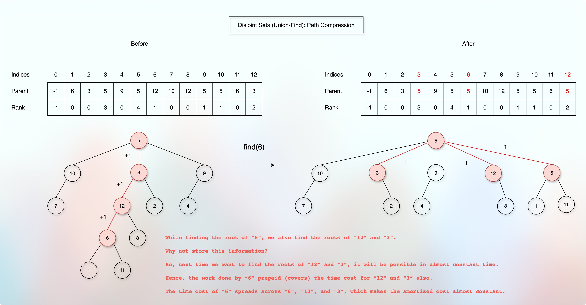
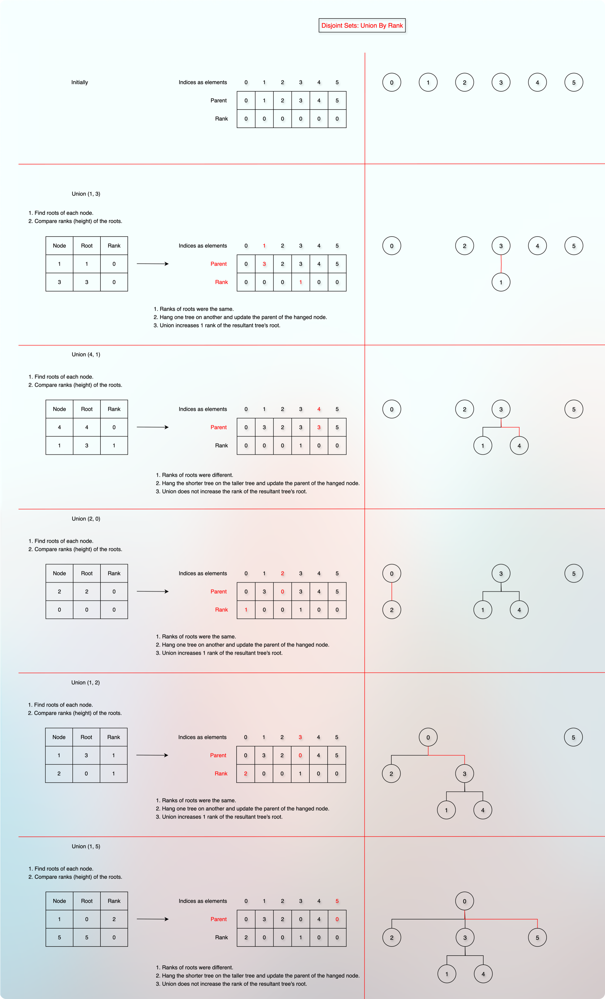

# Disjoint Set Implementation

<!-- TOC -->
* [Disjoint Set Implementation](#disjoint-set-implementation)
* [Prerequisites / References / Resources](#prerequisites--references--resources)
* [Given](#given)
* [Thought Process](#thought-process)
  * [Find](#find)
  * [Union By Rank (Height)](#union-by-rank-height)
  * [Union By Size (Children)](#union-by-size-children)
  * [Dynamic DSU](#dynamic-dsu)
* [Time Complexity](#time-complexity)
* [Space Complexity](#space-complexity)
* [Note](#note)
* [Implementation](#implementation)
* [Relevant problems](#relevant-problems)
<!-- TOC -->
 
# Prerequisites / References / Resources

* [Local: DSU Intro](disjointSets.md)  

* [GitHub: DSU Intro](https://github.com/sagarpatel288/kotlinDSAWithIntellijIdea/blob/30b2b5290ee2209988564fa5a1a073319f7b437d/docs/dataStructures/courses/uc/module03priorityQueuesHeapsDisjointSets/section04DisjointSetsImplementation/disjointSets.md)  

* [Local: DSU Dissection](docs/dataStructures/courses/uc/module03priorityQueuesHeapsDisjointSets/section04DisjointSetsNaiveImplementation/disjointSets02dissection.md)  

* [GitHub: DSU Dissection](https://github.com/sagarpatel288/kotlinDSAWithIntellijIdea/blob/e6201bad2968159c293b35f003f3a18228cd8248/docs/dataStructures/coursera/ucSanDiego/module03priorityQueuesHeapsDisjointSets/section04DisjointSetsNaiveImplementation/disjointSets02implementation.md)  

# Given

* Known size `n`. (The size of the nodes, total nodes are `n`).
* Use direct addressing (static array).
* Note: Use `Union By Rank(Height)` instead of `Union By Size`.

# Thought Process

* We have given the node size, `n`.

```kotlin

class DisjointSet(private val size: Int)

```

* A DSU treats the node as an index in the direct addressing. 
* A DSU uses two arrays: 
  * An array to know the parent of a particular node(index).
  * An array to know the rank of a particular node(index).

```kotlin

// Initially, each node is a separate set, and its own parent.
private val parent = IntArray(size) { it }

// Initially, the rank (height) of each individual and separate node is `0`.
private val rank = IntArray(size) { 0 }

```

* A DSU implements `find` and `union`.

## Find

* The `find` operation gives the root of the target node.

```kotlin

fun find(x: Int): Int {
    if (x !in parent.indices) return -1
    
    // The base case.
    // When both the index and the value are the same, we have found the root of the target node.
    if (parent[x] == x) {
        return x
    }
    
    // Otherwise, we keep going through the parents until we reach the root
    parent[x] = find(parent[x])
    return parent[x]
}

```  

* We get the target node, `x`.
* We treat `x` as an index in the `parent` array.
* We check if `x` is a valid index in the `parent` array.
* If `x` is not a valid index, we return `-1`.
* If `x` is a valid index, we check the value.
* If the index and the value are the same, we have found the root of the target node.
* Otherwise, we treat the value as an index.
* And we keep doing the same until the index and the value are the same.

---

* Now, we want to store the root value to every node we visit.



* So that the next time we try to find the root of these nodes, we can get it in less time.
* This is called `path compression`.

## Union By Rank (Height)



* The [rank] array shows the upper bound of the height for a particular `index` of the [rank] array.
* We use that information to perform [unionByRank] operation.
* We hang a shorter tree on the larger tree to keep the tree height shallow.
* If both the trees are of the same height, we hang any one tree on another tree and increase the rank of the root.

```kotlin

fun unionByRank(x: Int, y: Int) {
    if (x !in parent.indices || y !in parent.indices) return
    val rootX = find(x)
    val rootY = find(y)
    if (rootX == rootY) return
    
    // Union By Rank: Hang a shorter tree on the larger tree.
    if (rank[rootX] < rank[rootY]) {
        parent[rootX] = rootY
    } else if (rank[rootY] < rank[rootX]) {
        parent[rootY] = rootX
    } else {
        parent[rootY] = rootX
        rank[rootX]++
    }
}

```

## Union By Size (Children)

* The only difference is that when we use `size` instead of `rank (height)`, we always increase the `size` of the parent node.

```kotlin

// By default, the size of each node is 1.
private val size = IntArray(size) { 1 }

fun unionBySize(x: Int, y: Int) {
    if (x !in parent.indices || y !in parent.indices) return
    val rootX = find(x)
    val rootY = find(y)
    if (rootX == rootY) return
    
    // Union By Size: Hang a smaller tree on the larger tree.
    if (size[rootX] < size[rootY]) {
        parent[rootX] = rootY
        size[rootY] += size[rootX]
    } else if (size[rootY] < size[rootX]) {
        parent[rootY] = rootX
        size[rootX] += size[rootY]
    }
}

```

## Dynamic DSU

* [Dynamic Dsu.kt](../../../../../../src/courses/uc/course02dataStructures/module03PriorityQueuesHeapsDisjointSets/programmingAssignment01/04dynamicDsuWithRank.kt)

* If we don't know how many nodes are there or when we have a stream of dynamic nodes, we can use maps instead of a fixed sized array.
* Everything remains same except the `makeSet` case.
* We make set dynamically.

# Time Complexity

* According to Robert Tarjan's Analysis, the amortized running time of `m` operations in `DSU` is:
* $m * log^{*}(n)$ where `n` is the total number of nodes.
* Whereas the realistic running time is $O(\alpha (n))$, which is known as the "Inverse Ackermann Function" and is almost constant.

# Space Complexity

* We use two arrays of the given [size] to maintain `parent` and `upper bound of the height`.
* So, if [size] = `n`, then the space complexity is `O(n)`.

# Note

* Please note that in practical use, we use `size` instead of `height` to perform the `union` operation.
* The `size` represents the number of nodes.
* The reason is that we can get the `size` of any subtree in `O(1)`.
* So, please check the alternative implementation also:
* [DisjointSetBySize]

# Implementation

* [DisjointSet UnionByRank Implementation.kt](../../../../../../src/courses/uc/course02dataStructures/module03PriorityQueuesHeapsDisjointSets/programmingAssignment01/03disjointSetsUnionFindUsingRank.kt)

* [DisjointSet UnionBySize Implementation.kt](../../../../../../src/courses/uc/course02dataStructures/module03PriorityQueuesHeapsDisjointSets/programmingAssignment01/03disjointSetsUnionFindUsingSize.kt)

* [Dynamic Dsu With Rank.kt](../../../../../../src/courses/uc/course02dataStructures/module03PriorityQueuesHeapsDisjointSets/programmingAssignment01/04dynamicDsuWithRank.kt)

* [Dynamic Dsu With Size.kt](../../../../../../src/courses/uc/course02dataStructures/module03PriorityQueuesHeapsDisjointSets/programmingAssignment01/050dynamicDsuWithSize.kt)

# Relevant problems

* Merge tables problem
* Number of Provinces (LeetCode 547?)
* Number of islands
* Redundant Connection (LeetCode 684?)
* Accounts Merge (LeetCode 721?)
* Social network groups
* Largest component
* Kruskal's Algorithm for Minimum Spanning Trees