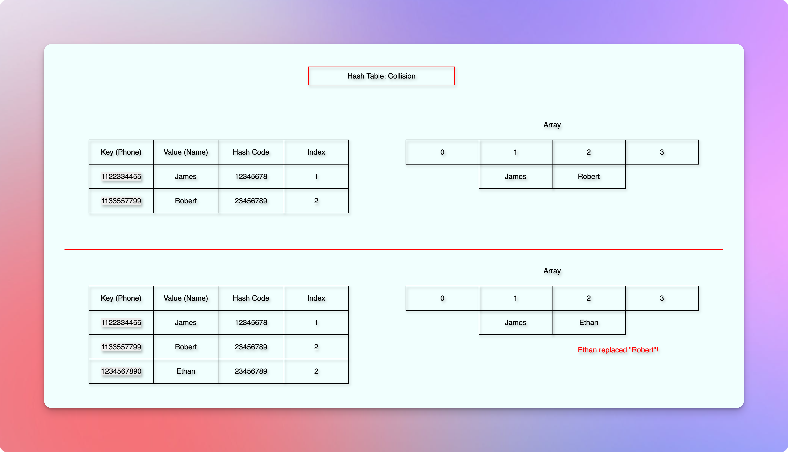

# Hash Tables

<!-- TOC -->
* [Hash Tables](#hash-tables)
  * [Resources / References](#resources--references)
  * [Time complexity in various data structures](#time-complexity-in-various-data-structures)
  * [Problem/Requirement](#problemrequirement)
  * [ToDo](#todo)
  * [Direct Addressing](#direct-addressing)
  * [Hash Function](#hash-function)
    * [Introduction](#introduction)
    * [Technical Definition](#technical-definition)
      * [Formula](#formula)
      * [Definition](#definition)
    * [Load Factor](#load-factor)
    * [Properties](#properties)
  * [Map](#map)
    * [Methods](#methods)
    * [Technical Definition](#technical-definition-1)
    * [Examples](#examples)
  * [Collision](#collision)
  * [Chaining](#chaining)
  * [Methods And Asymptotic Analysis with Pseudocode](#methods-and-asymptotic-analysis-with-pseudocode)
    * [containsKey(key)](#containskeykey)
    * [get(key)](#getkey)
    * [put(key, value)](#putkey-value)
    * [Analysis](#analysis)
    * [ToDo](#todo-1)
  * [Set](#set)
    * [ToDo](#todo-2)
    * [Problem examples](#problem-examples)
    * [Idea](#idea)
    * [Technical Definition](#technical-definition-2)
    * [Methods](#methods-1)
      * [contains(key)](#containskey)
      * [add(key)](#addkey)
      * [remove(key)](#removekey)
  * [Applications: Where do we use hashing in real life? Explain in short (one to five sentences) how we use hashing for each application.](#applications-where-do-we-use-hashing-in-real-life-explain-in-short-one-to-five-sentences-how-we-use-hashing-for-each-application)
  * [Interview Questions](#interview-questions)
    * [If we have integer keys up to 8 digits, what will be the size of an array in the direct addressing method?](#if-we-have-integer-keys-up-to-8-digits-what-will-be-the-size-of-an-array-in-the-direct-addressing-method)
    * [What problem does a hash table (map) solve?](#what-problem-does-a-hash-table-map-solve)
    * [What are the pros and cons of a hash table?](#what-are-the-pros-and-cons-of-a-hash-table)
    * [How does a hash table work?](#how-does-a-hash-table-work)
    * [What is the difference between a hash table (map) and a disjoint set data structure? Explain the overall difference and the difference for each operation.](#what-is-the-difference-between-a-hash-table-map-and-a-disjoint-set-data-structure-explain-the-overall-difference-and-the-difference-for-each-operation)
    * [What are the few cases where we would use a set instead of a map? Why?](#what-are-the-few-cases-where-we-would-use-a-set-instead-of-a-map-why)
  * [Next](#next)
  * [Relevant DSA Questions](#relevant-dsa-questions)
<!-- TOC -->

## Resources / References

**Overview**
* Very good overview - short and sweet - clear and concise: Gate Smashers
* [Gate Smashers](https://youtu.be/W5q0xgxmRd8?si=3rhBhehtPSW5O-7w)

**Application**
* [Monis Yousuf](https://youtu.be/pMM9cIAFAug?si=4dtGaEEywYDxLPiP)
* [Simplilearn](https://youtu.be/jmtzX-NPFDc?si=dCNRHOF93cFlI4w7)

**Internals**
* [Inside Code: Hashing, Hash Tables](https://youtu.be/xdr2Y1P2H1U?si=QXukzX_BzRJofQ6N)
* [Arpit Bhayani: Hashing, Collision, etc.](https://youtube.com/playlist?list=PLsdq-3Z1EPT2UnueESBLReaVSLIo_BuAc&si=mbgu-ku-Zw5_9nil)
* [Inside Code: Set](https://youtu.be/XGaN3jRTlGA?si=9b5lMAF-seUrOY5u)

## Time complexity in various data structures

* ToDo: A table to show various time complexities for various data structures for various operations like insert, search(access, get), update, delete, etc.  
* Maybe in the form of tables? with notes?
* [WIP - Comparison](../revision/comparison.md)

## Problem/Requirement

* Faster search. 
* Faster insertion and deletion.
* Storing key-value pairs.

## ToDo

* Problem example: linear search, insertion, and deletion in a phone book, library, bank account details, etc.
* Distinct definition of: Hashing (the process), hash (the output code), HashMap, HashSet, and Hashtable.
* We need to ensure that this document does not introduce `disconnection`.
* What problem does it solve? (Why do we need it? Benefits?)
* How? (How does it work? Implementation. Analysis.)
* When to use it?
* Doesn't it sound like a simple array? What is the difference?
* Why do we call it a "Hash Table" when it is actually an array?
* Comparison.
* Completeness of this document as per our defined standard.
* The order of sections.
* Should we split the document into smaller, distinct, dedicated topic?
* Common interview questions relevant to this document.
* Correctness of this document.

## Direct Addressing

* ToDo: Explain the problem with an example.
* Add approximate size to store $2^{32}$ values!
* Explain the memory waste problem. 
---
* Suppose we have $2^{32}$ possible values.
* It can be unique ID or something like that.
* Now, we want to find value of a particular ID in $O(1)$ time.
* We can use an array, and treat each ID as an index.
* So, to find the value of a particular ID, we would pass the ID as an index to the array.
* It works, but it requires an array of size $2^{32}$.
* And suppose we only have $100$ values.
* Then, we waste a lot of memory.
* On the other hand, if we use a dynamic array, we cannot find the value in $O(1)$ time.
* Because in a dynamic array, unique ID is not the index.
* A hash table solves this problem.
* We don't waste huge memory, and we can still find the value in $O(1)$ on average.
* Under the hood, it uses a dynamic array.
* Mostly, unique ID gets unique index via a hash function.
* However, while trying to balance time and space, some IDs might get the same index.
* We call it a collision, and there are various ways to handle it.
* When we resize the array to store more values, we relocate all the values, and this process is known as rehashing.
* Old values might get different indices, but the implementation ensures that we do not lose any values, and we can still find the value in $O(1)$ time on average.
---

## Hash Function

### Introduction

* A `hash function` takes a `key` as an argument, and generates a unique `hash code` for the given key.
* The `hash function` is a deterministic function. 
* It means that it always generates the same `hash code` for the same key.
* Also, the type and size of the input key can be anything.
* So, the domain and size of the input key can be anything.
* This is the reason we often call the domain of the key a `universe`.
* But the domain and size of the `hash code` remain the same.
* A `hash code` is always a `whole number`.
* And the size of the `hash code` remains the same for all the different keys.
* We then compress this `hash code` to produce an index from `[0,..,m-1]`, where `m` is the size of the `hash table`.  
* To compress the `hash code`, we use `hashCode % size of the hash table`.
* So, `index = hashCode % m,` where `m` is the size of the hash table.
* So, this is how the given `key` becomes an `index`.
* The range size of this index is called **cardinality**.
* It means that the total number of possible unique outputs.
* We know that this range is limited. `R = [0,..,m-1]`, where `m` is the size of the hash table. 
* But the domain and size of the input `key` are almost infinite.
* It means that we might end up getting the same `index` for different `keys`.
* This incident is called `collision`.
* Technically, if more than one `keys` get the same `index` value, we call it `collision`.
* For example, we have only two seats, but we have sold them to 10 different people.
* Clearly, more than one person will try to claim the seat.
* So, we have limited seats for an unlimited number of people. 
* We will be learning more about the `collision` a bit later.
* We will also see that it should be impossible to produce the input `key` from the output.
* It means that the `hash function` should be `irreversible`.
* It is a must for `cryptography`, and a good property to have for general-purpose hash tables.  
* But for now, let us see the technical definition of the `hash function`.

### Technical Definition

#### Formula

$$
h: U \to [0, \dots, m - 1]
$$

* `h` The hash function.
* `:` Read as: "is a function that maps".
* `U` The domain, the universe of all possible keys.
* `->` Read as `to`
* `[0,..,m - 1]` The range, the set of all possible array indices.

#### Definition

* A hash function `h` is a deterministic function that maps an input key `k` of arbitrary size from a large domain `U` (the universe of keys) to a fixed-size output `h(k)` (also known as a `hash code`), which is then compressed to a smaller index within the range `R = [0,..,m - 1]`, where `m` is the size of the `hash table`. 

### Load Factor

* We might think that if we have a large hash table (so, a higher cardinality), we might get fewer collisions.
* But then we spend more memory. Right?
* And if we have a smaller cardinality, we increase the possibility of collision, right?
* So, how do we manage this? Is there a standard ratio or measurement?
* Yes. We call it a **load factor**.

$$
\text{Load factor } \alpha = \frac{n}{m}, \text{ where n is the number of items, and m is the hash table size}
$$

* We try to maintain this ratio at around `0.75`.
* We will also learn more about it.

### Properties

* A hash function should be deterministic.
* It means that the same input should produce the same output.
* The output must be of fixed size.
* The hash function must be irreversible for cryptography.
* For general-purpose hash tables, it is good to have an irreversible hash function.
* It means that it should be impossible to get the input key from the output.
* The hash function should be fast enough. 
* So that we can perform various operations, such as find, insert, update, delete, etc., fast enough.
* The possibility of collision should be minimized.

## Map

* A [hash function](#hash-function) ultimately leads us to an `index` where we can save the data.
* But, how do we save the data?
* We save the data as a pair of key and value.
* To store data in a key-value pair, we use a `Map`.
* A `Map` is an abstract data structure that maps (connects) two sets: A set of `keys` to a set of `values`.
* Let us say the set of `keys` is `S`, and the set of `values` is `V`.
* Then, a `Map` is an abstract data structure that maps (connects) from set `S` of objects (keys) to set `V` of values.
* If there is a `map` from set `S` to `V`, the objects of the set `S` are called `keys` and the objects of the set `V` are called `values`.
* Duplicate `keys` are not allowed. 
* Hence, each possible `key` appears at most once.
* There can be multiple `key-value` pairs.
* Hence, the `map` stores a collection of such `key-value` pairs.
* The intent (purpose) of a `map` is to look up a `value` associated with a `key`. 

### Methods

**containsKey(object)**

* Checks whether there is any value corresponding to the given object (key).

**get(object)**

* Returns the value corresponding to the given object (key) if any.

**put(object, value)**

* It takes two arguments: `object` (key) and `value`.
* And sets the `value` corresponding to the given `object` (key) in the `map`.

### Technical Definition

* A `Map` is an Abstract Data Type (ADT) that stores a collection of key-value pairs, where a duplicate key is not allowed, and it offers various operations such as `hasKey (or containsKey)`, `get`, `set (or put)`, etc.

### Examples

* A name is a key, and a phone number is a value.
* A roll number is a key, and a student name is a value.
* An account number is a key, and the account balance is a value.
* A word in a dictionary is a key, and the definition is a value.
* An item ID is a key, and the item price is a value.
* Etc.

## Collision

* Collision is an incident when we get the same `index` for different unique `keys`.



* It happens because we map a larger set of keys to a smaller set of indices.
* The domain and size of the key are almost infinite.
* But the size of our `hash table` is limited to achieve better performance than the [direct addressing](#direct-addressing).
* If we have more pigeons than the pigeonholes, then at least one pigeonhole will share more than one pigeon.
* This is known as the pigeonhole principle.
* If we have more `keys` than `indices`, then at least one `index` will share more than one `key`.
* When multiple `keys` share the same `index`, we want to ensure we don't unintentionally overwrite the old value. 
* We don't want to lose any value during such an incident.
* We want to adjust and fit multiple values during such an incident.
* So, how do we do that?
* [Chaining](#chaining) is one of the many ways to do that.
* So, let us start with [chaining](#chaining).

## Chaining

* We have already learned in the [hash function](#hash-function) how a `key` becomes an `index`.
* In this section, we will be storing the `value`, and handling the `collision`.


* Let us assume that we have a phone number, `1122334455` as a key.
* We use the [hash function](#hash-function) to get the corresponding `index` to save the `value`.
* Suppose we got the index `1`.
* Without considering the [collision](#collision), we might directly insert the `value` at the generated `index`.
* But when [collision](#collision) happens, it might overwrite the old value.
* So, we need a better structure.
* As a chaining solution, we expand the capacity of each index in such a way that it can contain more than one value.
* So, instead of storing a single value, each index stores a list.


* But if we use a simple list of values for each index, we still have a problem.
* Suppose, at index `2`, we have multiple values.
* Now, for a `key` that maps to index `2`, which value will we return?
* So, we use a list of pairs.


* Each index stores a list of pairs.
* To avoid the `shifting` problem, we use a `linked list` instead of a simple `list`.
* And to avoid the worst-case search time of the `linked list`, that is `O(n)`, we switch to a `balanced binary tree` (For example, a Red-Black Tree) when we hit a threshold.

## Methods And Asymptotic Analysis with Pseudocode

* If the array is `chains`, then at any particular `index`, it gives us a `chain` of a linked list.

### containsKey(key)

```kotlin
fun <T> containsKey(key: T): Boolean {
    //The index of the `chains` array gives us a linked list at that position
    val chain = chains[hash(key)]
    // We iterate through the entire linked list `chain` to find the `key-value`
    for ((_key, value) in chain) {
        if (key == _key) {
            return true
        }
    }
    return false
}
```

### get(key)

```kotlin

fun <T, V> get(key: T): V? {
    val chain = chains[hash(key)]
    for ((_key, value) in chain) {
        if (key == _key) {
            return value
        }
    }
    return null
}
```

### put(key, value)

```kotlin

fun <T, V> put(key: T, value: V) {
    val chain = chains[hash(key)]
    // If we already have this `key`, we replace the value.
    for (pair in chain) {
        if (pair.first == key) {
            pair.second = value
            return
        }
    }
    // Otherwise, we add this new key-value pair.
    chain.add(key to value)
}
```

### Analysis

**Time Complexity**

* If we have `n` keys, the size of a particular `chain` can be `n` in the worst-case, where all the `keys` go at the same `index`.
* So, the worst-case time complexity is `O(n)`.

**Space Complexity**

* We take `key-value` pairs.
* Hence, if we have `n` keys, then we would have `n` key-value pairs.
* Also, we use an array of size, `m`, where each index contains a linked list.
* The maximum size of any linked list can be at most `n` in a array of size `m`.
* Hence, the space complexity is `O(n + m)`.

### ToDo

* `pair` is an immutable object.
* It does not support `pair.second` in [put](#putkey-value) method of the [map](#map).

## Set

### ToDo

* Problem examples.
* Introduction: The "Hero" that solves the above problems. 
* Answers: Why do we need a "Set"? What problems does it solve?
* Technical Definition.
* How does it solve those problems? How does it work?
* What are the differences between a map, a set, an array, and a hash table?
* Why don't we use a simple list for a set?
* Hash Table = Either HashSet or HashMap
* Hash table uses hashing.

### Problem examples

* We want to pursue uniqueness.
* For example, unique characters in a string.
* Unique elements in a collection.
* Unique phone numbers.
* Unique IDs.
* To mark already visited places.

### Idea

* We use [map](#map).
* Instead of storing a key-value pair in a linked list, we simply store only a key.
* If we get the same index for different keys, we simply use one of the many [collision](#collision) resolution techniques.
* For example, one of the [collision](#collision) resolution techniques is [chaining](#chaining).
* When we get the same `key` again, we don't perform the `put` operation.
* And we can't have the `get` operation here. 
* We may not need the `get(key)` function to get the associated `value`.
* Because we don't store any associated `value` here.
* It is just to store `keys`.
* The intent (purpose) of a `Set` is to look up the existence of a `key`.

### Technical Definition

* A `Set` is an "Abstract Data Structure (ADT)" that stores a collection of unique elements.
* It does not store duplicate keys.
* It mainly offers `add(key)`, `contains(key)`, and `remove(key)` operations.

### Methods

#### contains(key)

```kotlin

fun <T> contains(key: T): Boolean {
    // The chain at the hash (index) of this key
    val chain = chains[hash(key)]
    for (_key in chain) {
        if (key == _key) {
            return true
        }
    }
    return false
}

```

#### add(key)

```kotlin

fun <T> add(key: T): Boolean {
    // The chain at the hash (index) of the key
    val chain = chains[hash(key)]
    // If the chain already has the key, we don't add duplicate keys.
    if (chain.contains(key)) return false
    // Otherwise, we add the key to the chain.
    chain.add(key)
    return true
}

```

#### remove(key)

```kotlin

fun <T> remove(key: T): Boolean {
    // The chain at the hash (index) of this key 
    val chain = chains[hash(key)]
    for (_key in chain) {
        if (key == _key) {
            chain.remove(_key)
            return true
        }
    }
    return false
}

```

## Applications: Where do we use hashing in real life? Explain in short (one to five sentences) how we use hashing for each application.

* Blockchain.
* In programming languages. For example, `dict` in Python, `Map` (Interface) or `HashMap` (Implementation) in Java, `Set` (Interface) or `HashSet` (Implementation) in Java.
* Sparser, compiler, or interpreter of programming languages. For example, a programming language's symbol table. A programming language needs to quickly retrieve reserved keywords like `if`, `else`, `for`, `while`, etc.
* A programming language needs to quickly determine whether a variable name is a reserved keyword.
* File systems. For example, mapping of a human-readable path to a file or directory.
* Digital signatures. For example, in cheque verification.
* 
* 

## Interview Questions

### If we have integer keys up to 8 digits, what will be the size of an array in the direct addressing method?

* $10^8$, because in the direct addressing, we treat the integer key as the index of the array.

### What problem does a hash table (map) solve?
* When do we use a hash table (map) compared to other data structures? Why?


### What are the pros and cons of a hash table?


### How does a hash table work?

* How do we implement a hash table?
* What underlying data structure do we use to implement a hash table?
* How do we perform various operations on a hash table?
* What is the time complexity of various operations on a hash table? How?
* What is the space complexity of various operations on a hash table? How?

### What is the difference between a hash table (map) and a disjoint set data structure? Explain the overall difference and the difference for each operation.


### What are the few cases where we would use a set instead of a map? Why?


## Next

* [Universal Family Of Hash Functions](10universalFamilyOfHashFunctions.md)
* [Load Factor And Rehashing](15loadFactorAndRehashing.md)
* [Formula Of Universal Family Of Hash Functions](20formulaOfUniversalFamilyOfHashFunctions.md)
* [String Hashing](25stringHashing.md)
* [Find A Substring](30findSubstring.md)
* [Hash Questions](35hashQuestions.md)
* [Hashing In Blockchain](40hashingInBlockchain.md)
 
## Relevant DSA Questions
