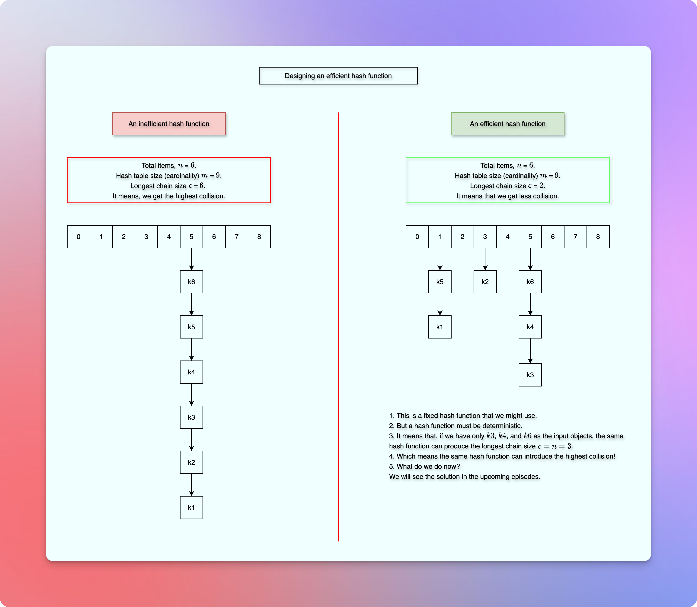

# Designing a good hash function (Parameters to consider, the though process, implications, etc.)

<!-- TOC -->
* [Designing a good hash function (Parameters to consider, the though process, implications, etc.)](#designing-a-good-hash-function-parameters-to-consider-the-though-process-implications-etc)
  * [Prerequisites, resources, and references](#prerequisites-resources-and-references)
  * [ToDo](#todo)
  * [Terminologies](#terminologies)
  * [Problem Statement](#problem-statement)
  * [Expectations](#expectations)
  * [Observation](#observation)
<!-- TOC -->

## Prerequisites, resources, and references

* [Hash Table](05hashTables.md)

## ToDo

* Explain the impact of a hash function.
  * Should the example image(s) go here?
* Explain: How do we intentionally choose time efficiency over space (the trade off, priority) and why.
* Images? Showing a good and a bad hash function (impact) examples?
  * Too much wasted space (Almost double or maybe triple?).
  * Too much collisions. (All the elements go to the same index).

## Terminologies

* `n` is a total number of objects or keys that we want to map to indices of range `0...m-1`.
* The domain and size of `n` is almost infinite.
* `m` is the hash table size or the size of the index-range or all the possible index values for the `n` objects.
* The size of `m` is limited.
* Pigeonhole Principle: If there are more pigeons than the pigeonholes, there exists at least one pigeonhole that will get more than one pigeons. 
* Collision - when different `keys` get (map to) the same hash-table index.
* `c` is the longest chain in the hash-table where we find multiple objects (`keys`) at the same hash-table index.

## Problem Statement

* Design an efficient hash function.

## Expectations

* The hash function must be a deterministic.
* Even distribution of the keys (input).
* Less collision.
* Time efficient.
* Space efficient.

## Background

* We have learned that a hash table uses a hash function to map an input object (key) to the corresponding index in the hash table.
* If the hash function always generates the same index regardless of the input, all the input objects (keys) go to the same index in the hash table.
* We call it, collision.
* To store multiple objects (keys) to the same index, we might use **separate chaining**, where each slot (index) implements (uses) a linked list.
* And then we can prepend or append the new items (that keep coming at the same index) to the list.
* However, the longer the list, more the time we take to perform various operations such as find(contains), insert(put), delete, etc.
* Also, we consume more memory than we need.
* We get many unused allocated memory.

* On the other hand, if the hash function uniformly distributes the input objects (keys), we get less collisions.
* It means that we don't have to travel through a long chain to perform various operations such as find(contains), insert(put), delete, etc.
* It means that we can perform various operations faster.
* And due to uniform distribution, we waste less memory.
* Hence, the efficiency of a hash table depends on the underlying hash function.

## Observation

* The efficiency of a hash table depends on the efficiency of the underlying hash function.
* For a total of `n` objects (keys) when distributed across `m` slots (indices), where `n >> m`:

$$
\text{ Longest chain, c} \geq \frac{n}{m}
$$

* The longest chain can be greater than the size of an average chain.
* For any hash function, there can be an input that can produce the worst-case collision. 
* That is to say, worst-case input is inevitable.